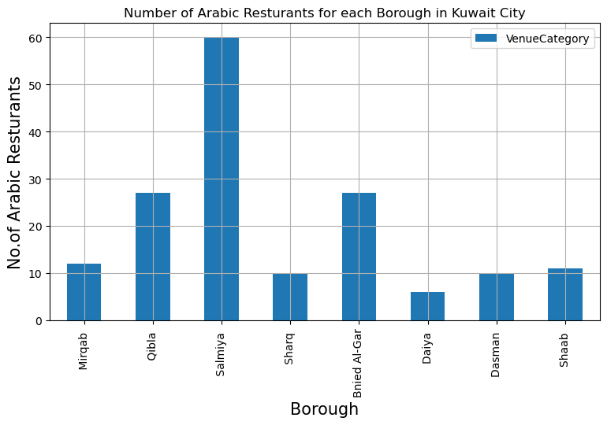
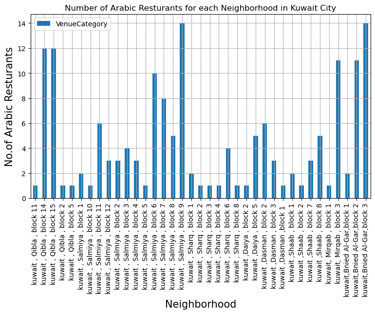

# Capstone Project - The Battle of the Neighborhoods


## Table of contents
* [Introduction: Business Problem](#introduction)
* [Data](#data)
* [Methodology](#methodology)
* [Analysis](#analysis)
* [Results and Discussion](#results)
* [Conclusion](#conclusion)

## Introduction: Business Problem <a name="introduction"></a>

In this project we will try to find an optimal location for a restaurant. Specifically, this report will be targeted to stakeholders interested in opening an arabic restaurant in **Kuwait** .

Since there are lots of arabic  restaurants in Kuwait we will try to detect locations that are not already crowded with restaurants. We are also particularly interested in areas with no arabicrestaurants in vicinity. We would also prefer locations as close to sea front as possible, assuming that first two conditions are met.

We will use our data science powers to generate a few most promissing neighborhoods based on this criteria. Advantages of each area will then be clearly expressed so that best possible final location can be chosen by stakeholders.

## Data <a name="data"></a>

Based on definition of our problem, factors that will influence our decission are:

number of existing restaurants in the neighborhood (any type of restaurant)
number of and distance to arabic restaurants in the neighborhood, if any .
Following data sources will be needed to extract/generate the required information:
the information is not easy aviliable on internet .

centers of candidate areas will be generated algorithmically and approximate addresses of centers of those areas will be obtained using **Nominatim geocoding**
number of restaurants and their type and location in every neighborhood will be obtained using **Foursquare API**


```python
#!conda install -c conda-forge geopy --yes
```


```python

```


```python
import requests # library to handle requests
import pandas as pd # library for data analsysis
import numpy as np # library to handle data in a vectorized manner
import random # library for random number generation

#!conda install -c conda-forge geopy --yes 
from geopy.geocoders import Nominatim # module to convert an address into latitude and longitude values

# libraries for displaying images
from IPython.display import Image 
from IPython.core.display import HTML 


from IPython.display import display_html
import pandas as pd
import numpy as np
    
# tranforming json file into a pandas dataframe library
from pandas.io.json import json_normalize

#!conda install -c conda-forge folium=0.5.0 --yes
import matplotlib
import folium # plotting library
from sklearn.cluster import KMeans

import matplotlib.colors as colors
import matplotlib.cm as cm

```

### Befor importing data , and from http://gis.paci.gov.kw/Client//EN/Default.aspx 
#### this is a list of neighborhoods in Kuwait 


```python
seaArealist=['kuwait , Qibla , block 1','kuwait , Qibla , block 2','kuwait , Qibla , block 3','kuwait , Qibla , block 4','kuwait , Qibla , block 5','kuwait , Qibla , block 6','kuwait , Qibla , block 7','kuwait , Qibla , block 8','kuwait , Qibla , block 9','kuwait , Qibla , block 10','kuwait , Qibla , block 11','kuwait , Qibla , block 12','kuwait , Qibla , block 13','kuwait , Qibla , block 14','kuwait , Qibla , block 15',
             'kuwait , Sharq , block 1','kuwait , Sharq , block 2','kuwait , Sharq , block 3','kuwait , Sharq , block 4','kuwait , Sharq , block 5','kuwait , Sharq , block 6','kuwait , Sharq , block 7','kuwait , Sharq , block 8',
             'kuwait, Mirqab , block 1','kuwait, Mirqab , block 2','kuwait, Mirqab , block 3',
             'kuwait ,Dasman ,block 1 ','kuwait ,Dasman , block 2','kuwait ,Dasman , block 3',
             'kuwait ,بنيد القار ,block 1 ','kuwait ,بنيد القار ,block 2 ','kuwait ,بنيد القار ,block 3 ',
             'kuwait ,Daiya , block 1','kuwait ,Daiya , block 2','kuwait ,Daiya , block 3','kuwait ,Daiya , block 4','kuwait ,Daiya , block 5',
             'kuwait ,Shaab , block 1','kuwait ,Shaab , block 2','kuwait ,Shaab , block 3','kuwait ,Shaab , block 4','kuwait ,Shaab , block 5','kuwait ,Shaab , block 6','kuwait ,Shaab , block 7','kuwait ,Shaab , block 8',
             'kuwait , Salmiya , block 1','kuwait , Salmiya , block 2','kuwait , Salmiya , block 3','kuwait , Salmiya , block 4','kuwait , Salmiya , block 5','kuwait , Salmiya , block 6','kuwait , Salmiya , block 7','kuwait , Salmiya , block 8','kuwait , Salmiya , block 9','kuwait , Salmiya , block 10','kuwait , Salmiya , block 11','kuwait , Salmiya , block 12'
            ]

```


```python

```

### Get the KUWAIT's latitude and longitude values.


```python
address = 'kuwait'
geolocator =  Nominatim(user_agent="myGeocoder")
location = geolocator.geocode('kuwait')
latitude = location.latitude
longitude = location.longitude
print('The geograpical coordinate of Kuwait are {}, {}.'.format(latitude, longitude))
```

    The geograpical coordinate of Kuwait are 29.2733964, 47.4979476.
    

#### let us make a dataframe for our Neighborhoods


```python
column_names = ['Borough','Neighborhood', 'Latitude', 'Longitude'] 

neighborhoods = pd.DataFrame(columns=column_names)
 
for i in seaArealist :
    geolocator =  Nominatim(user_agent="myGeocoder")
    location = geolocator.geocode(i)
    neighborhood_lat = location.latitude
    neighborhood_lon = location.longitude
    #print('The geograpical coordinate of'+ i + '  are {}, {}.'.format(neighborhood_lat, neighborhood_lon))
    
    neighborhoods = neighborhoods.append({'Borough': i.split(',')[1],
                                          'Neighborhood': i,
                                          'Latitude': neighborhood_lat,
                                          'Longitude': neighborhood_lon}, ignore_index=True)
   # geokw.append(latitude)
   # geokw.append(longitude)

    #dfname["latitude","longitude"]=latitude,longitude
```

change the arabic borough's name "بنيد القار " to "Bnied Al-Gar" 


```python
neighborhoods['Borough'].iloc[29:32]='Bnied Al-Gar'
neighborhoods.head()
```

    C:\Users\RAMITTO\Anaconda3\lib\site-packages\pandas\core\indexing.py:190: SettingWithCopyWarning: 
    A value is trying to be set on a copy of a slice from a DataFrame
    
    See the caveats in the documentation: http://pandas.pydata.org/pandas-docs/stable/indexing.html#indexing-view-versus-copy
      self._setitem_with_indexer(indexer, value)
    


<div>
<style scoped>
    .dataframe tbody tr th:only-of-type {
        vertical-align: middle;
    }

    .dataframe tbody tr th {
        vertical-align: top;
    }

    .dataframe thead th {
        text-align: right;
    }
</style>
<table border="1" class="dataframe">
  <thead>
    <tr style="text-align: right;">
      <th></th>
      <th>Borough</th>
      <th>Neighborhood</th>
      <th>Latitude</th>
      <th>Longitude</th>
    </tr>
  </thead>
  <tbody>
    <tr>
      <th>0</th>
      <td>Qibla</td>
      <td>kuwait , Qibla , block 1</td>
      <td>29.376559</td>
      <td>47.970216</td>
    </tr>
    <tr>
      <th>1</th>
      <td>Qibla</td>
      <td>kuwait , Qibla , block 2</td>
      <td>29.377828</td>
      <td>47.972750</td>
    </tr>
    <tr>
      <th>2</th>
      <td>Qibla</td>
      <td>kuwait , Qibla , block 3</td>
      <td>29.373951</td>
      <td>47.970914</td>
    </tr>
    <tr>
      <th>3</th>
      <td>Qibla</td>
      <td>kuwait , Qibla , block 4</td>
      <td>29.375175</td>
      <td>47.972843</td>
    </tr>
    <tr>
      <th>4</th>
      <td>Qibla</td>
      <td>kuwait , Qibla , block 5</td>
      <td>29.376554</td>
      <td>47.974659</td>
    </tr>
  </tbody>
</table>
</div>


###### save data as  'neighborhoods_kw.csv


```python

neighborhoods.to_csv('neighborhoods_kw.csv', index=False)

```


```python
neighborhoods=pd.read_csv('neighborhoods_kw.csv')
neighborhoods.head()
```


<div>
<style scoped>
    .dataframe tbody tr th:only-of-type {
        vertical-align: middle;
    }

    .dataframe tbody tr th {
        vertical-align: top;
    }

    .dataframe thead th {
        text-align: right;
    }
</style>
<table border="1" class="dataframe">
  <thead>
    <tr style="text-align: right;">
      <th></th>
      <th>Borough</th>
      <th>Neighborhood</th>
      <th>Latitude</th>
      <th>Longitude</th>
    </tr>
  </thead>
  <tbody>
    <tr>
      <th>0</th>
      <td>Qibla</td>
      <td>kuwait , Qibla , block 1</td>
      <td>29.376559</td>
      <td>47.970216</td>
    </tr>
    <tr>
      <th>1</th>
      <td>Qibla</td>
      <td>kuwait , Qibla , block 2</td>
      <td>29.377827</td>
      <td>47.972750</td>
    </tr>
    <tr>
      <th>2</th>
      <td>Qibla</td>
      <td>kuwait , Qibla , block 3</td>
      <td>29.373951</td>
      <td>47.970914</td>
    </tr>
    <tr>
      <th>3</th>
      <td>Qibla</td>
      <td>kuwait , Qibla , block 4</td>
      <td>29.375175</td>
      <td>47.972843</td>
    </tr>
    <tr>
      <th>4</th>
      <td>Qibla</td>
      <td>kuwait , Qibla , block 5</td>
      <td>29.376554</td>
      <td>47.974659</td>
    </tr>
  </tbody>
</table>
</div>


#### How many neighborhoods in each borough ? 
#### So we plot it 


```python
import matplotlib.pyplot as plt
import matplotlib.cm as cm
import matplotlib.colors as colors

plt.figure(figsize=(9,5), dpi = 100)
# title
plt.title('Number of Neighborhoods in each borough ')
#On x-axis
plt.xlabel('Borough', fontsize = 15)
#On y-axis
plt.ylabel('No.of  Neighborhoods ', fontsize=15)
#giving a bar plot
neighborhoods.groupby('Borough')['Neighborhood'].count().plot(kind='bar')
#legend
plt.legend()
#displays the plot
plt.show()

```


    <Figure size 900x500 with 1 Axes>


##### The two largest boroughs in terms of number of neighborhoods are Qibla and Salmiya 

#### we can use folium to show where are on  a map


```python
location_kw=[29.3522,48.019]
map_kuwait = folium.Map(location_kw, zoom_start=13)
for lat, lng, Neighbor in zip(neighborhoods['Latitude'], neighborhoods['Longitude'], neighborhoods['Neighborhood']):
    label = '{}'.format(Neighbor)
    label = folium.Popup(label, parse_html=True)
    folium.Marker(
        [lat, lng],
        popup=label).add_to(map_kuwait) 
map_kuwait
```


<div style="width:100%;"><div style="position:relative;width:100%;height:0;padding-bottom:60%;"><iframe src="about:blank" style="position:absolute;width:100%;height:100%;left:0;top:0;border:none !important;" data-html=PCFET0NUWVBFIGh0bWw+CjxoZWFkPiAgICAKICAgIDxtZXRhIGh0dHAtZXF1aXY9ImNvbnRlbnQtdHlwZSIgY29udGVudD0idGV4dC9odG1sOyBjaGFyc2V0PVVURi04IiAvPgogICAgPHNjcmlwdD5MX1BSRUZFUl9DQU5WQVMgPSBmYWxzZTsgTF9OT19UT1VDSCA9IGZhbHNlOyBMX0RJU0FCTEVfM0QgPSBmYWxzZTs8L3NjcmlwdD4KICAgIDxzY3JpcHQgc3JjPSJodHRwczovL2Nkbi5qc2RlbGl2ci5uZXQvbnBtL2xlYWZsZXRAMS4yLjAvZGlzdC9sZWFmbGV0LmpzIj48L3NjcmlwdD4KICAgIDxzY3JpcHQgc3JjPSJodHRwczovL2FqYXguZ29vZ2xlYXBpcy5jb20vYWpheC9saWJzL2pxdWVyeS8xLjExLjEvanF1ZXJ5Lm1pbi5qcyI+PC9zY3JpcHQ+CiAgICA8c2NyaXB0IHNyYz0iaHR0cHM6Ly9tYXhjZG4uYm9vdHN0cmFwY2RuLmNvbS9ib290c3RyYXAvMy4yLjAvanMvYm9vdHN0cmFwLm1pbi5qcyI+PC9zY3JpcHQ+CiAgICA8c2NyaXB0IHNyYz0iaHR0cHM6Ly9jZG5qcy5jbG91ZGZsYXJlLmNvbS9hamF4L2xpYnMvTGVhZmxldC5hd2Vzb21lLW1hcmtlcnMvMi4wLjIvbGVhZmxldC5hd2Vzb21lLW1hcmtlcnMuanMiPjwvc2NyaXB0PgogICAgPGxpbmsgcmVsPSJzdHlsZXNoZWV0IiBocmVmPSJodHRwczovL2Nkbi5qc2RlbGl2ci5uZXQvbnBtL2xlYWZsZXRAMS4yLjAvZGlzdC9sZWFmbGV0LmNzcyIvPgogICAgPGxpbmsgcmVsPSJzdHlsZXNoZWV0IiBocmVmPSJodHRwczovL21heGNkbi5ib290c3RyYXBjZG4uY29tL2Jvb3RzdHJhcC8zLjIuMC9jc3MvYm9vdHN0cmFwLm1pbi5jc3MiLz4KICAgIDxsaW5rIHJlbD0ic3R5bGVzaGVldCIgaHJlZj0iaHR0cHM6Ly9tYXhjZG4uYm9vdHN0cmFwY2RuLmNvbS9ib290c3RyYXAvMy4yLjAvY3NzL2Jvb3RzdHJhcC10aGVtZS5taW4uY3NzIi8+CiAgICA8bGluayByZWw9InN0eWxlc2hlZXQiIGhyZWY9Imh0dHBzOi8vbWF4Y2RuLmJvb3RzdHJhcGNkbi5jb20vZm9udC1hd2Vzb21lLzQuNi4zL2Nzcy9mb250LWF3ZXNvbWUubWluLmNzcyIvPgogICAgPGxpbmsgcmVsPSJzdHlsZXNoZWV0IiBocmVmPSJodHRwczovL2NkbmpzLmNsb3VkZmxhcmUuY29tL2FqYXgvbGlicy9MZWFmbGV0LmF3ZXNvbWUtbWFya2Vycy8yLjAuMi9sZWFmbGV0LmF3ZXNvbWUtbWFya2Vycy5jc3MiLz4KICAgIDxsaW5rIHJlbD0ic3R5bGVzaGVldCIgaHJlZj0iaHR0cHM6Ly9yYXdnaXQuY29tL3B5dGhvbi12aXN1YWxpemF0aW9uL2ZvbGl1bS9tYXN0ZXIvZm9saXVtL3RlbXBsYXRlcy9sZWFmbGV0LmF3ZXNvbWUucm90YXRlLmNzcyIvPgogICAgPHN0eWxlPmh0bWwsIGJvZHkge3dpZHRoOiAxMDAlO2hlaWdodDogMTAwJTttYXJnaW46IDA7cGFkZGluZzogMDt9PC9zdHlsZT4KICAgIDxzdHlsZT4jbWFwIHtwb3NpdGlvbjphYnNvbHV0ZTt0b3A6MDtib3R0b206MDtyaWdodDowO2xlZnQ6MDt9PC9zdHlsZT4KICAgIAogICAgICAgICAgICA8c3R5bGU+ICNtYXBfNDQzYjMxMDViNGNjNDU2NGE3NDFiY2E2OGUwN2U1ZjQgewogICAgICAgICAgICAgICAgcG9zaXRpb24gOiByZWxhdGl2ZTsKICAgICAgICAgICAgICAgIHdpZHRoIDogMTAwLjAlOwogICAgICAgICAgICAgICAgaGVpZ2h0OiAxMDAuMCU7CiAgICAgICAgICAgICAgICBsZWZ0OiAwLjAlOwogICAgICAgICAgICAgICAgdG9wOiAwLjAlOwogICAgICAgICAgICAgICAgfQogICAgICAgICAgICA8L3N0eWxlPgogICAgICAgIAo8L2hlYWQ+Cjxib2R5PiAgICAKICAgIAogICAgICAgICAgICA8ZGl2IGNsYXNzPSJmb2xpdW0tbWFwIiBpZD0ibWFwXzQ0M2IzMTA1YjRjYzQ1NjRhNzQxYmNhNjhlMDdlNWY0IiA+PC9kaXY+CiAgICAgICAgCjwvYm9keT4KPHNjcmlwdD4gICAgCiAgICAKCiAgICAgICAgICAgIAogICAgICAgICAgICAgICAgdmFyIGJvdW5kcyA9IG51bGw7CiAgICAgICAgICAgIAoKICAgICAgICAgICAgdmFyIG1hcF80NDNiMzEwNWI0Y2M0NTY0YTc0MWJjYTY4ZTA3ZTVmNCA9IEwubWFwKAogICAgICAgICAgICAgICAgICAgICAgICAgICAgICAgICAgJ21hcF80NDNiMzEwNWI0Y2M0NTY0YTc0MWJjYTY4ZTA3ZTVmNCcsCiAgICAgICAgICAgICAgICAgICAgICAgICAgICAgICAgICB7Y2VudGVyOiBbMjkuMzUyMiw0OC4wMTldLAogICAgICAgICAgICAgICAgICAgICAgICAgICAgICAgICAgem9vbTogMTMsCiAgICAgICAgICAgICAgICAgICAgICAgICAgICAgICAgICBtYXhCb3VuZHM6IGJvdW5kcywKICAgICAgICAgICAgICAgICAgICAgICAgICAgICAgICAgIGxheWVyczogW10sCiAgICAgICAgICAgICAgICAgICAgICAgICAgICAgICAgICB3b3JsZENvcHlKdW1wOiBmYWxzZSwKICAgICAgICAgICAgICAgICAgICAgICAgICAgICAgICAgIGNyczogTC5DUlMuRVBTRzM4NTcKICAgICAgICAgICAgICAgICAgICAgICAgICAgICAgICAgfSk7CiAgICAgICAgICAgIAogICAgICAgIAogICAgCiAgICAgICAgICAgIHZhciB0aWxlX2xheWVyX2E2ZDM5MmMwYjRkODQyZDlhZDhkZmYyYjA2MzJjN2NjID0gTC50aWxlTGF5ZXIoCiAgICAgICAgICAgICAgICAnaHR0cHM6Ly97c30udGlsZS5vcGVuc3RyZWV0bWFwLm9yZy97en0ve3h9L3t5fS5wbmcnLAogICAgICAgICAgICAgICAgewogICJhdHRyaWJ1dGlvbiI6IG51bGwsCiAgImRldGVjdFJldGluYSI6IGZhbHNlLAogICJtYXhab29tIjogMTgsCiAgIm1pblpvb20iOiAxLAogICJub1dyYXAiOiBmYWxzZSwKICAic3ViZG9tYWlucyI6ICJhYmMiCn0KICAgICAgICAgICAgICAgICkuYWRkVG8obWFwXzQ0M2IzMTA1YjRjYzQ1NjRhNzQxYmNhNjhlMDdlNWY0KTsKICAgICAgICAKICAgIAoKICAgICAgICAgICAgdmFyIG1hcmtlcl8wYTAwNDRlYzdiMDg0ODNmYmFlNGQ4NWM1NWY4NjE3NyA9IEwubWFya2VyKAogICAgICAgICAgICAgICAgWzI5LjM3NjU1ODcsNDcuOTcwMjE2NDg0Njc0MjhdLAogICAgICAgICAgICAgICAgewogICAgICAgICAgICAgICAgICAgIGljb246IG5ldyBMLkljb24uRGVmYXVsdCgpCiAgICAgICAgICAgICAgICAgICAgfQogICAgICAgICAgICAgICAgKQogICAgICAgICAgICAgICAgLmFkZFRvKG1hcF80NDNiMzEwNWI0Y2M0NTY0YTc0MWJjYTY4ZTA3ZTVmNCk7CiAgICAgICAgICAgIAogICAgCiAgICAgICAgICAgIHZhciBwb3B1cF81NjBhMzBkYmQwODU0MGZmYmZmZTdmN2IxY2Y5MTk4YyA9IEwucG9wdXAoe21heFdpZHRoOiAnMzAwJ30pOwoKICAgICAgICAgICAgCiAgICAgICAgICAgICAgICB2YXIgaHRtbF9kMzNjZGQ2OTM0Mjg0M2RmODE4MzYyYjIwMjAxMzAyMyA9ICQoJzxkaXYgaWQ9Imh0bWxfZDMzY2RkNjkzNDI4NDNkZjgxODM2MmIyMDIwMTMwMjMiIHN0eWxlPSJ3aWR0aDogMTAwLjAlOyBoZWlnaHQ6IDEwMC4wJTsiPmt1d2FpdCAsIFFpYmxhICwgYmxvY2sgMTwvZGl2PicpWzBdOwogICAgICAgICAgICAgICAgcG9wdXBfNTYwYTMwZGJkMDg1NDBmZmJmZmU3ZjdiMWNmOTE5OGMuc2V0Q29udGVudChodG1sX2QzM2NkZDY5MzQyODQzZGY4MTgzNjJiMjAyMDEzMDIzKTsKICAgICAgICAgICAgCgogICAgICAgICAgICBtYXJrZXJfMGEwMDQ0ZWM3YjA4NDgzZmJhZTRkODVjNTVmODYxNzcuYmluZFBvcHVwKHBvcHVwXzU2MGEzMGRiZDA4NTQwZmZiZmZlN2Y3YjFjZjkxOThjKTsKCiAgICAgICAgICAgIAogICAgICAgIAogICAgCgogICAgICAgICAgICB2YXIgbWFya2VyXzgyNjhmMWNmZDUzZDQ1NDM5MDA2NzExNTVhNDZkNzQyID0gTC5tYXJrZXIoCiAgICAgICAgICAgICAgICBbMjkuMzc3ODI3NSw0Ny45NzI3NDk4MDY4NTY3XSwKICAgICAgICAgICAgICAgIHsKICAgICAgICAgICAgICAgICAgICBpY29uOiBuZXcgTC5JY29uLkRlZmF1bHQoKQogICAgICAgICAgICAgICAgICAgIH0KICAgICAgICAgICAgICAgICkKICAgICAgICAgICAgICAgIC5hZGRUbyhtYXBfNDQzYjMxMDViNGNjNDU2NGE3NDFiY2E2OGUwN2U1ZjQpOwogICAgICAgICAgICAKICAgIAogICAgICAgICAgICB2YXIgcG9wdXBfYjhlMzIzYzE1MGE2NGQxMjlkNWFmY2E2ZDQ5NGM3YjQgPSBMLnBvcHVwKHttYXhXaWR0aDogJzMwMCd9KTsKCiAgICAgICAgICAgIAogICAgICAgICAgICAgICAgdmFyIGh0bWxfNTVhYjk1N2U3NjY4NGQ5YWJiZTBjOGRiNDhmYjEyZTYgPSAkKCc8ZGl2IGlkPSJodG1sXzU1YWI5NTdlNzY2ODRkOWFiYmUwYzhkYjQ4ZmIxMmU2IiBzdHlsZT0id2lkdGg6IDEwMC4wJTsgaGVpZ2h0OiAxMDAuMCU7Ij5rdXdhaXQgLCBRaWJsYSAsIGJsb2NrIDI8L2Rpdj4nKVswXTsKICAgICAgICAgICAgICAgIHBvcHVwX2I4ZTMyM2MxNTBhNjRkMTI5ZDVhZmNhNmQ0OTRjN2I0LnNldENvbnRlbnQoaHRtbF81NWFiOTU3ZTc2Njg0ZDlhYmJlMGM4ZGI0OGZiMTJlNik7CiAgICAgICAgICAgIAoKICAgICAgICAgICAgbWFya2VyXzgyNjhmMWNmZDUzZDQ1NDM5MDA2NzExNTVhNDZkNzQyLmJpbmRQb3B1cChwb3B1cF9iOGUzMjNjMTUwYTY0ZDEyOWQ1YWZjYTZkNDk0YzdiNCk7CgogICAgICAgICAgICAKICAgICAgICAKICAgIAoKICAgICAgICAgICAgdmFyIG1hcmtlcl9kNmYyMzdmOGM1NzM0MTViODE1N2IxZmE5Nzc1YzNhOCA9IEwubWFya2VyKAogICAgICAgICAgICAgICAgWzI5LjM3Mzk1MTQwMDAwMDAwNiw0Ny45NzA5MTM4MDI3NDMxMV0sCiAgICAgICAgICAgICAgICB7CiAgICAgICAgICAgICAgICAgICAgaWNvbjogbmV3IEwuSWNvbi5EZWZhdWx0KCkKICAgICAgICAgICAgICAgICAgICB9CiAgICAgICAgICAgICAgICApCiAgICAgICAgICAgICAgICAuYWRkVG8obWFwXzQ0M2IzMTA1YjRjYzQ1NjRhNzQxYmNhNjhlMDdlNWY0KTsKICAgICAgICAgICAgCiAgICAKICAgICAgICAgICAgdmFyIHBvcHVwX2MyNDliZWVmNDdiMTQ5YjBiYzcwMzI1MmVjMzg3MWU5ID0gTC5wb3B1cCh7bWF4V2lkdGg6ICczMDAnfSk7CgogICAgICAgICAgICAKICAgICAgICAgICAgICAgIHZhciBodG1sX2I0ZDZlN2FjMmU5YzQ5NzZiOGM4MWU0YWJiYzI3MWVlID0gJCgnPGRpdiBpZD0iaHRtbF9iNGQ2ZTdhYzJlOWM0OTc2YjhjODFlNGFiYmMyNzFlZSIgc3R5bGU9IndpZHRoOiAxMDAuMCU7IGhlaWdodDogMTAwLjAlOyI+a3V3YWl0ICwgUWlibGEgLCBibG9jayAzPC9kaXY+JylbMF07CiAgICAgICAgICAgICAgICBwb3B1cF9jMjQ5YmVlZjQ3YjE0OWIwYmM3MDMyNTJlYzM4NzFlOS5zZXRDb250ZW50KGh0bWxfYjRkNmU3YWMyZTljNDk3NmI4YzgxZTRhYmJjMjcxZWUpOwogICAgICAgICAgICAKCiAgICAgICAgICAgIG1hcmtlcl9kNmYyMzdmOGM1NzM0MTViODE1N2IxZmE5Nzc1YzNhOC5iaW5kUG9wdXAocG9wdXBfYzI0OWJlZWY0N2IxNDliMGJjNzAzMjUyZWMzODcxZTkpOwoKICAgICAgICAgICAgCiAgICAgICAgCiAgICAKCiAgICAgICAgICAgIHZhciBtYXJrZXJfNjA5ZDVmMzE3YWMwNGFkOGE5NGY0MTgwZDgyY2QxOGYgPSBMLm1hcmtlcigKICAgICAgICAgICAgICAgIFsyOS4zNzUxNzQ1NSw0Ny45NzI4NDMwNzk0Mzk5NzZdLAogICAgICAgICAgICAgICAgewogICAgICAgICAgICAgICAgICAgIGljb246IG5ldyBMLkljb24uRGVmYXVsdCgpCiAgICAgICAgICAgICAgICAgICAgfQogICAgICAgICAgICAgICAgKQogICAgICAgICAgICAgICAgLmFkZFRvKG1hcF80NDNiMzEwNWI0Y2M0NTY0YTc0MWJjYTY4ZTA3ZTVmNCk7CiAgICAgICAgICAgIAogICAgCiAgICAgICAgICAgIHZhciBwb3B1cF85YTk0ZGE1NGRjYTc0MDIzOTkzODUyOTY3NzZiNTk0ZSA9IEwucG9wdXAoe21heFdpZHRoOiAnMzAwJ30pOwoKICAgICAgICAgICAgCiAgICAgICAgICAgICAgICB2YXIgaHRtbF8zYTJjMWQ3YTk4M2M0YjllYmRmYWM2ODAwNGM3MmNiNCA9ICQoJzxkaXYgaWQ9Imh0bWxfM2EyYzFkN2E5ODNjNGI5ZWJkZmFjNjgwMDRjNzJjYjQiIHN0eWxlPSJ3aWR0aDogMTAwLjAlOyBoZWlnaHQ6IDEwMC4wJTsiPmt1d2FpdCAsIFFpYmxhICwgYmxvY2sgNDwvZGl2PicpWzBdOwogICAgICAgICAgICAgICAgcG9wdXBfOWE5NGRhNTRkY2E3NDAyMzk5Mzg1Mjk2Nzc2YjU5NGUuc2V0Q29udGVudChodG1sXzNhMmMxZDdhOTgzYzRiOWViZGZhYzY4MDA0YzcyY2I0KTsKICAgICAgICAgICAgCgogICAgICAgICAgICBtYXJrZXJfNjA5ZDVmMzE3YWMwNGFkOGE5NGY0MTgwZDgyY2QxOGYuYmluZFBvcHVwKHBvcHVwXzlhOTRkYTU0ZGNhNzQwMjM5OTM4NTI5Njc3NmI1OTRlKTsKCiAgICAgICAgICAgIAogICAgICAgIAogICAgCgogICAgICAgICAgICB2YXIgbWFya2VyXzgwN2Y4OTI1YjEzZjRiMWFhNmQ0YzNjYjAyOTgyNDYzID0gTC5tYXJrZXIoCiAgICAgICAgICAgICAgICBbMjkuMzc2NTUzOSw0Ny45NzQ2NTkxNDQ3MzYxN10sCiAgICAgICAgICAgICAgICB7CiAgICAgICAgICAgICAgICAgICAgaWNvbjogbmV3IEwuSWNvbi5EZWZhdWx0KCkKICAgICAgICAgICAgICAgICAgICB9CiAgICAgICAgICAgICAgICApCiAgICAgICAgICAgICAgICAuYWRkVG8obWFwXzQ0M2IzMTA1YjRjYzQ1NjRhNzQxYmNhNjhlMDdlNWY0KTsKICAgICAgICAgICAgCiAgICAKICAgICAgICAgICAgdmFyIHBvcHVwX2U1OTMyZWRjYjg5YzQ0YmJhYzM1YWI2MjZiMjMwY2RhID0gTC5wb3B1cCh7bWF4V2lkdGg6ICczMDAnfSk7CgogICAgICAgICAgICAKICAgICAgICAgICAgICAgIHZhciBodG1sX2ZmN2RlNTlmM2I0YzQwZWVhZmQzYjUzYWVlZmViY2ZjID0gJCgnPGRpdiBpZD0iaHRtbF9mZjdkZTU5ZjNiNGM0MGVlYWZkM2I1M2FlZWZlYmNmYyIgc3R5bGU9IndpZHRoOiAxMDAuMCU7IGhlaWdodDogMTAwLjAlOyI+a3V3YWl0ICwgUWlibGEgLCBibG9jayA1PC9kaXY+JylbMF07CiAgICAgICAgICAgICAgICBwb3B1cF9lNTkzMmVkY2I4OWM0NGJiYWMzNWFiNjI2YjIzMGNkYS5zZXRDb250ZW50KGh0bWxfZmY3ZGU1OWYzYjRjNDBlZWFmZDNiNTNhZWVmZWJjZmMpOwogICAgICAgICAgICAKCiAgICAgICAgICAgIG1hcmtlcl84MDdmODkyNWIxM2Y0YjFhYTZkNGMzY2IwMjk4MjQ2My5iaW5kUG9wdXAocG9wdXBfZTU5MzJlZGNiODljNDRiYmFjMzVhYjYyNmIyMzBjZGEpOwoKICAgICAgICAgICAgCiAgICAgICAgCiAgICAKCiAgICAgICAgICAgIHZhciBtYXJrZXJfODYwNzBlYWI4MzBmNGIzZGEwMDM0ZjU1YjRiZGVhMDggPSBMLm1hcmtlcigKICAgICAgICAgICAgICAgIFsyOS4zNzEyOTExNSw0Ny45NzE1ODUwMDUyMDddLAogICAgICAgICAgICAgICAgewogICAgICAgICAgICAgICAgICAgIGljb246IG5ldyBMLkljb24uRGVmYXVsdCgpCiAgICAgICAgICAgICAgICAgICAgfQogICAgICAgICAgICAgICAgKQogICAgICAgICAgICAgICAgLmFkZFRvKG1hcF80NDNiMzEwNWI0Y2M0NTY0YTc0MWJjYTY4ZTA3ZTVmNCk7CiAgICAgICAgICAgIAogICAgCiAgICAgICAgICAgIHZhciBwb3B1cF9lNGRmOTk5NGRiY2Q0Y2FmOGJlOTM2NzliNWU0MDY2NyA9IEwucG9wdXAoe21heFdpZHRoOiAnMzAwJ30pOwoKICAgICAgICAgICAgCiAgICAgICAgICAgICAgICB2YXIgaHRtbF9iYjNkOTdmNzY2ZGE0NjBjYTI3ZTcwMjU1NjdkZGU5MCA9ICQoJzxkaXYgaWQ9Imh0bWxfYmIzZDk3Zjc2NmRhNDYwY2EyN2U3MDI1NTY3ZGRlOTAiIHN0eWxlPSJ3aWR0aDogMTAwLjAlOyBoZWlnaHQ6IDEwMC4wJTsiPmt1d2FpdCAsIFFpYmxhICwgYmxvY2sgNjwvZGl2PicpWzBdOwogICAgICAgICAgICAgICAgcG9wdXBfZTRkZjk5OTRkYmNkNGNhZjhiZTkzNjc5YjVlNDA2Njcuc2V0Q29udGVudChodG1sX2JiM2Q5N2Y3NjZkYTQ2MGNhMjdlNzAyNTU2N2RkZTkwKTsKICAgICAgICAgICAgCgogICAgICAgICAgICBtYXJrZXJfODYwNzBlYWI4MzBmNGIzZGEwMDM0ZjU1YjRiZGVhMDguYmluZFBvcHVwKHBvcHVwX2U0ZGY5OTk0ZGJjZDRjYWY4YmU5MzY3OWI1ZTQwNjY3KTsKCiAgICAgICAgICAgIAogICAgICAgIAogICAgCgogICAgICAgICAgICB2YXIgbWFya2VyXzUwNThkYTE2OTM0ZjRhNjI5MzkxYjRkOWI3YzViNWY5ID0gTC5tYXJrZXIoCiAgICAgICAgICAgICAgICBbMjkuMzcyODI2MTUsNDcuOTczOTA5MTY4Mjk0OTVdLAogICAgICAgICAgICAgICAgewogICAgICAgICAgICAgICAgICAgIGljb246IG5ldyBMLkljb24uRGVmYXVsdCgpCiAgICAgICAgICAgICAgICAgICAgfQogICAgICAgICAgICAgICAgKQogICAgICAgICAgICAgICAgLmFkZFRvKG1hcF80NDNiMzEwNWI0Y2M0NTY0YTc0MWJjYTY4ZTA3ZTVmNCk7CiAgICAgICAgICAgIAogICAgCiAgICAgICAgICAgIHZhciBwb3B1cF9lZjFkNzVhOWM1NmI0ZTE3YWMxZDMxYmJhM2FmNDA0NSA9IEwucG9wdXAoe21heFdpZHRoOiAnMzAwJ30pOwoKICAgICAgICAgICAgCiAgICAgICAgICAgICAgICB2YXIgaHRtbF8yZWU3YzhmYzY3YjY0ZThlYTU0YTZmZDY3MWFkYjdkYiA9ICQoJzxkaXYgaWQ9Imh0bWxfMmVlN2M4ZmM2N2I2NGU4ZWE1NGE2ZmQ2NzFhZGI3ZGIiIHN0eWxlPSJ3aWR0aDogMTAwLjAlOyBoZWlnaHQ6IDEwMC4wJTsiPmt1d2FpdCAsIFFpYmxhICwgYmxvY2sgNzwvZGl2PicpWzBdOwogICAgICAgICAgICAgICAgcG9wdXBfZWYxZDc1YTljNTZiNGUxN2FjMWQzMWJiYTNhZjQwNDUuc2V0Q29udGVudChodG1sXzJlZTdjOGZjNjdiNjRlOGVhNTRhNmZkNjcxYWRiN2RiKTsKICAgICAgICAgICAgCgogICAgICAgICAgICBtYXJrZXJfNTA1OGRhMTY5MzRmNGE2MjkzOTFiNGQ5YjdjNWI1ZjkuYmluZFBvcHVwKHBvcHVwX2VmMWQ3NWE5YzU2YjRlMTdhYzFkMzFiYmEzYWY0MDQ1KTsKCiAgICAgICAgICAgIAogICAgICAgIAogICAgCgogICAgICAgICAgICB2YXIgbWFya2VyXzVjNDZlNDNjZWY4YjRmMDNiZDU0M2E5MTNlZTQzMDM0ID0gTC5tYXJrZXIoCiAgICAgICAgICAgICAgICBbMjkuMzc1NDU4MSw0Ny45NzU5NTA4NzAwMDMwM10sCiAgICAgICAgICAgICAgICB7CiAgICAgICAgICAgICAgICAgICAgaWNvbjogbmV3IEwuSWNvbi5EZWZhdWx0KCkKICAgICAgICAgICAgICAgICAgICB9CiAgICAgICAgICAgICAgICApCiAgICAgICAgICAgICAgICAuYWRkVG8obWFwXzQ0M2IzMTA1YjRjYzQ1NjRhNzQxYmNhNjhlMDdlNWY0KTsKICAgICAgICAgICAgCiAgICAKICAgICAgICAgICAgdmFyIHBvcHVwXzQwZDVlMmY1ODUyMTQyNjFhMTdlOGYyNTY4NjZmNWU3ID0gTC5wb3B1cCh7bWF4V2lkdGg6ICczMDAnfSk7CgogICAgICAgICAgICAKICAgICAgICAgICAgICAgIHZhciBodG1sXzQzMmM4ZGZmNTcyZDRlNjJiZTQxMDFkMzc0YmI2Mjk0ID0gJCgnPGRpdiBpZD0iaHRtbF80MzJjOGRmZjU3MmQ0ZTYyYmU0MTAxZDM3NGJiNjI5NCIgc3R5bGU9IndpZHRoOiAxMDAuMCU7IGhlaWdodDogMTAwLjAlOyI+a3V3YWl0ICwgUWlibGEgLCBibG9jayA4PC9kaXY+JylbMF07CiAgICAgICAgICAgICAgICBwb3B1cF80MGQ1ZTJmNTg1MjE0MjYxYTE3ZThmMjU2ODY2ZjVlNy5zZXRDb250ZW50KGh0bWxfNDMyYzhkZmY1NzJkNGU2MmJlNDEwMWQzNzRiYjYyOTQpOwogICAgICAgICAgICAKCiAgICAgICAgICAgIG1hcmtlcl81YzQ2ZTQzY2VmOGI0ZjAzYmQ1NDNhOTEzZWU0MzAzNC5iaW5kUG9wdXAocG9wdXBfNDBkNWUyZjU4NTIxNDI2MWExN2U4ZjI1Njg2NmY1ZTcpOwoKICAgICAgICAgICAgCiAgICAgICAgCiAgICAKCiAgICAgICAgICAgIHZhciBtYXJrZXJfYzI4MDgyOTczMTczNDY3Njg3MWEzODlkMTg5NjYyZGUgPSBMLm1hcmtlcigKICAgICAgICAgICAgICAgIFsyOS4zNzI2MDgwNSw0Ny45NzgzNjM5Nzk1NTMyODZdLAogICAgICAgICAgICAgICAgewogICAgICAgICAgICAgICAgICAgIGljb246IG5ldyBMLkljb24uRGVmYXVsdCgpCiAgICAgICAgICAgICAgICAgICAgfQogICAgICAgICAgICAgICAgKQogICAgICAgICAgICAgICAgLmFkZFRvKG1hcF80NDNiMzEwNWI0Y2M0NTY0YTc0MWJjYTY4ZTA3ZTVmNCk7CiAgICAgICAgICAgIAogICAgCiAgICAgICAgICAgIHZhciBwb3B1cF81OGVlZjFiNWYzNzM0ZTdlYTYyOGZjZjgzZGE4ZmUwYSA9IEwucG9wdXAoe21heFdpZHRoOiAnMzAwJ30pOwoKICAgICAgICAgICAgCiAgICAgICAgICAgICAgICB2YXIgaHRtbF9kZWVlZWI4N2Q3NmQ0NzU1OTVmYTQyODEyZmE2NWY3OCA9ICQoJzxkaXYgaWQ9Imh0bWxfZGVlZWViODdkNzZkNDc1NTk1ZmE0MjgxMmZhNjVmNzgiIHN0eWxlPSJ3aWR0aDogMTAwLjAlOyBoZWlnaHQ6IDEwMC4wJTsiPmt1d2FpdCAsIFFpYmxhICwgYmxvY2sgOTwvZGl2PicpWzBdOwogICAgICAgICAgICAgICAgcG9wdXBfNThlZWYxYjVmMzczNGU3ZWE2MjhmY2Y4M2RhOGZlMGEuc2V0Q29udGVudChodG1sX2RlZWVlYjg3ZDc2ZDQ3NTU5NWZhNDI4MTJmYTY1Zjc4KTsKICAgICAgICAgICAgCgogICAgICAgICAgICBtYXJrZXJfYzI4MDgyOTczMTczNDY3Njg3MWEzODlkMTg5NjYyZGUuYmluZFBvcHVwKHBvcHVwXzU4ZWVmMWI1ZjM3MzRlN2VhNjI4ZmNmODNkYThmZTBhKTsKCiAgICAgICAgICAgIAogICAgICAgIAogICAgCgogICAgICAgICAgICB2YXIgbWFya2VyXzI0MTk1OGM4YTk5MzRjYmZiZDNlYWJmZjQyMGI5NTY2ID0gTC5tYXJrZXIoCiAgICAgICAgICAgICAgICBbMjkuMzcwMTQyNDUsNDcuOTc2MjIzODkyMzk3ODldLAogICAgICAgICAgICAgICAgewogICAgICAgICAgICAgICAgICAgIGljb246IG5ldyBMLkljb24uRGVmYXVsdCgpCiAgICAgICAgICAgICAgICAgICAgfQogICAgICAgICAgICAgICAgKQogICAgICAgICAgICAgICAgLmFkZFRvKG1hcF80NDNiMzEwNWI0Y2M0NTY0YTc0MWJjYTY4ZTA3ZTVmNCk7CiAgICAgICAgICAgIAogICAgCiAgICAgICAgICAgIHZhciBwb3B1cF82MGYyY2VhNzc1MDA0MGNjYmZjNjhjMTNmNjFmM2U2ZCA9IEwucG9wdXAoe21heFdpZHRoOiAnMzAwJ30pOwoKICAgICAgICAgICAgCiAgICAgICAgICAgICAgICB2YXIgaHRtbF8zOGQ0NzE4NzQ5NGI0ODhmOWMxN2I3ZDkzMzFkY2MwZiA9ICQoJzxkaXYgaWQ9Imh0bWxfMzhkNDcxODc0OTRiNDg4ZjljMTdiN2Q5MzMxZGNjMGYiIHN0eWxlPSJ3aWR0aDogMTAwLjAlOyBoZWlnaHQ6IDEwMC4wJTsiPmt1d2FpdCAsIFFpYmxhICwgYmxvY2sgMTA8L2Rpdj4nKVswXTsKICAgICAgICAgICAgICAgIHBvcHVwXzYwZjJjZWE3NzUwMDQwY2NiZmM2OGMxM2Y2MWYzZTZkLnNldENvbnRlbnQoaHRtbF8zOGQ0NzE4NzQ5NGI0ODhmOWMxN2I3ZDkzMzFkY2MwZik7CiAgICAgICAgICAgIAoKICAgICAgICAgICAgbWFya2VyXzI0MTk1OGM4YTk5MzRjYmZiZDNlYWJmZjQyMGI5NTY2LmJpbmRQb3B1cChwb3B1cF82MGYyY2VhNzc1MDA0MGNjYmZjNjhjMTNmNjFmM2U2ZCk7CgogICAgICAgICAgICAKICAgICAgICAKICAgIAoKICAgICAgICAgICAgdmFyIG1hcmtlcl83OWMyMGM5MDQzNWQ0YzJjYmEwZTVmOGFlMTMwNmQyOSA9IEwubWFya2VyKAogICAgICAgICAgICAgICAgWzI5LjM2ODEwMjEsNDcuOTcxOTEwNzA1NzMzODddLAogICAgICAgICAgICAgICAgewogICAgICAgICAgICAgICAgICAgIGljb246IG5ldyBMLkljb24uRGVmYXVsdCgpCiAgICAgICAgICAgICAgICAgICAgfQogICAgICAgICAgICAgICAgKQogICAgICAgICAgICAgICAgLmFkZFRvKG1hcF80NDNiMzEwNWI0Y2M0NTY0YTc0MWJjYTY4ZTA3ZTVmNCk7CiAgICAgICAgICAgIAogICAgCiAgICAgICAgICAgIHZhciBwb3B1cF9mN2Y0ZDRiMGVmZWY0MGJkYWNjODllNTY5ZDAxNzgwOSA9IEwucG9wdXAoe21heFdpZHRoOiAnMzAwJ30pOwoKICAgICAgICAgICAgCiAgICAgICAgICAgICAgICB2YXIgaHRtbF8yOTg2OWJiN2NjNmQ0ZTA1OGRkZjY1NjY4MmUyOWZmMSA9ICQoJzxkaXYgaWQ9Imh0bWxfMjk4NjliYjdjYzZkNGUwNThkZGY2NTY2ODJlMjlmZjEiIHN0eWxlPSJ3aWR0aDogMTAwLjAlOyBoZWlnaHQ6IDEwMC4wJTsiPmt1d2FpdCAsIFFpYmxhICwgYmxvY2sgMTE8L2Rpdj4nKVswXTsKICAgICAgICAgICAgICAgIHBvcHVwX2Y3ZjRkNGIwZWZlZjQwYmRhY2M4OWU1NjlkMDE3ODA5LnNldENvbnRlbnQoaHRtbF8yOTg2OWJiN2NjNmQ0ZTA1OGRkZjY1NjY4MmUyOWZmMSk7CiAgICAgICAgICAgIAoKICAgICAgICAgICAgbWFya2VyXzc5YzIwYzkwNDM1ZDRjMmNiYTBlNWY4YWUxMzA2ZDI5LmJpbmRQb3B1cChwb3B1cF9mN2Y0ZDRiMGVmZWY0MGJkYWNjODllNTY5ZDAxNzgwOSk7CgogICAgICAgICAgICAKICAgICAgICAKICAgIAoKICAgICAgICAgICAgdmFyIG1hcmtlcl9jYjE0N2FlNTQ2OTE0YmEzOGE4NjFkZGFhMTFmZDJmOSA9IEwubWFya2VyKAogICAgICAgICAgICAgICAgWzI5LjM2NjgwOTE1LDQ3Ljk2ODgzNzQ2NTI2NzY3Nl0sCiAgICAgICAgICAgICAgICB7CiAgICAgICAgICAgICAgICAgICAgaWNvbjogbmV3IEwuSWNvbi5EZWZhdWx0KCkKICAgICAgICAgICAgICAgICAgICB9CiAgICAgICAgICAgICAgICApCiAgICAgICAgICAgICAgICAuYWRkVG8obWFwXzQ0M2IzMTA1YjRjYzQ1NjRhNzQxYmNhNjhlMDdlNWY0KTsKICAgICAgICAgICAgCiAgICAKICAgICAgICAgICAgdmFyIHBvcHVwXzllNmQ5ZWUwMTMyNDQ1NGFiNTYwMjZmZmQzY2E5NThjID0gTC5wb3B1cCh7bWF4V2lkdGg6ICczMDAnfSk7CgogICAgICAgICAgICAKICAgICAgICAgICAgICAgIHZhciBodG1sX2NiODQ1NzY4OWNkODQwZjA4YzYxMTNhZjk1ZTI4ZmRjID0gJCgnPGRpdiBpZD0iaHRtbF9jYjg0NTc2ODljZDg0MGYwOGM2MTEzYWY5NWUyOGZkYyIgc3R5bGU9IndpZHRoOiAxMDAuMCU7IGhlaWdodDogMTAwLjAlOyI+a3V3YWl0ICwgUWlibGEgLCBibG9jayAxMjwvZGl2PicpWzBdOwogICAgICAgICAgICAgICAgcG9wdXBfOWU2ZDllZTAxMzI0NDU0YWI1NjAyNmZmZDNjYTk1OGMuc2V0Q29udGVudChodG1sX2NiODQ1NzY4OWNkODQwZjA4YzYxMTNhZjk1ZTI4ZmRjKTsKICAgICAgICAgICAgCgogICAgICAgICAgICBtYXJrZXJfY2IxNDdhZTU0NjkxNGJhMzhhODYxZGRhYTExZmQyZjkuYmluZFBvcHVwKHBvcHVwXzllNmQ5ZWUwMTMyNDQ1NGFiNTYwMjZmZmQzY2E5NThjKTsKCiAgICAgICAgICAgIAogICAgICAgIAogICAgCgogICAgICAgICAgICB2YXIgbWFya2VyXzhkZjg3NTM1NTJkNzRkZmM5MzAxYmM4NTY5NTNlMmZiID0gTC5tYXJrZXIoCiAgICAgICAgICAgICAgICBbMjkuMzY0Mjc2Miw0Ny45Njk4NzQ5MDU1NDE1NDVdLAogICAgICAgICAgICAgICAgewogICAgICAgICAgICAgICAgICAgIGljb246IG5ldyBMLkljb24uRGVmYXVsdCgpCiAgICAgICAgICAgICAgICAgICAgfQogICAgICAgICAgICAgICAgKQogICAgICAgICAgICAgICAgLmFkZFRvKG1hcF80NDNiMzEwNWI0Y2M0NTY0YTc0MWJjYTY4ZTA3ZTVmNCk7CiAgICAgICAgICAgIAogICAgCiAgICAgICAgICAgIHZhciBwb3B1cF83NTVhZDNlY2Y1NDI0ODUzYTBkNzVmM2M2NTZmZTZhNCA9IEwucG9wdXAoe21heFdpZHRoOiAnMzAwJ30pOwoKICAgICAgICAgICAgCiAgICAgICAgICAgICAgICB2YXIgaHRtbF9kZDIyODVjMjM0MTg0MWNiOTdlNjZmNjQxZjVhZWJiMiA9ICQoJzxkaXYgaWQ9Imh0bWxfZGQyMjg1YzIzNDE4NDFjYjk3ZTY2ZjY0MWY1YWViYjIiIHN0eWxlPSJ3aWR0aDogMTAwLjAlOyBoZWlnaHQ6IDEwMC4wJTsiPmt1d2FpdCAsIFFpYmxhICwgYmxvY2sgMTM8L2Rpdj4nKVswXTsKICAgICAgICAgICAgICAgIHBvcHVwXzc1NWFkM2VjZjU0MjQ4NTNhMGQ3NWYzYzY1NmZlNmE0LnNldENvbnRlbnQoaHRtbF9kZDIyODVjMjM0MTg0MWNiOTdlNjZmNjQxZjVhZWJiMik7CiAgICAgICAgICAgIAoKICAgICAgICAgICAgbWFya2VyXzhkZjg3NTM1NTJkNzRkZmM5MzAxYmM4NTY5NTNlMmZiLmJpbmRQb3B1cChwb3B1cF83NTVhZDNlY2Y1NDI0ODUzYTBkNzVmM2M2NTZmZTZhNCk7CgogICAgICAgICAgICAKICAgICAgICAKICAgIAoKICAgICAgICAgICAgdmFyIG1hcmtlcl85NDNlYmZhZDE5MjE0NjdkOGZiM2NiMzE5NmEwOTI1NiA9IEwubWFya2VyKAogICAgICAgICAgICAgICAgWzI5LjM2NDU4MTA1LDQ3Ljk2MjEyMzU4NTQ0NDcxXSwKICAgICAgICAgICAgICAgIHsKICAgICAgICAgICAgICAgICAgICBpY29uOiBuZXcgTC5JY29uLkRlZmF1bHQoKQogICAgICAgICAgICAgICAgICAgIH0KICAgICAgICAgICAgICAgICkKICAgICAgICAgICAgICAgIC5hZGRUbyhtYXBfNDQzYjMxMDViNGNjNDU2NGE3NDFiY2E2OGUwN2U1ZjQpOwogICAgICAgICAgICAKICAgIAogICAgICAgICAgICB2YXIgcG9wdXBfODA1MzQ0Njk3NzZjNDIyZmEwMDdkYTE2NDc5YzkyNGYgPSBMLnBvcHVwKHttYXhXaWR0aDogJzMwMCd9KTsKCiAgICAgICAgICAgIAogICAgICAgICAgICAgICAgdmFyIGh0bWxfYTlmZjhhYWVjYjBkNDMxOWJlNmJlZTQ3NTAzZTQ2NTEgPSAkKCc8ZGl2IGlkPSJodG1sX2E5ZmY4YWFlY2IwZDQzMTliZTZiZWU0NzUwM2U0NjUxIiBzdHlsZT0id2lkdGg6IDEwMC4wJTsgaGVpZ2h0OiAxMDAuMCU7Ij5rdXdhaXQgLCBRaWJsYSAsIGJsb2NrIDE0PC9kaXY+JylbMF07CiAgICAgICAgICAgICAgICBwb3B1cF84MDUzNDQ2OTc3NmM0MjJmYTAwN2RhMTY0NzljOTI0Zi5zZXRDb250ZW50KGh0bWxfYTlmZjhhYWVjYjBkNDMxOWJlNmJlZTQ3NTAzZTQ2NTEpOwogICAgICAgICAgICAKCiAgICAgICAgICAgIG1hcmtlcl85NDNlYmZhZDE5MjE0NjdkOGZiM2NiMzE5NmEwOTI1Ni5iaW5kUG9wdXAocG9wdXBfODA1MzQ0Njk3NzZjNDIyZmEwMDdkYTE2NDc5YzkyNGYpOwoKICAgICAgICAgICAgCiAgICAgICAgCiAgICAKCiAgICAgICAgICAgIHZhciBtYXJrZXJfZWRhOWQ3N2MwZDhiNGY4Nzg1ZjdjNTI3MWFlNzViNzUgPSBMLm1hcmtlcigKICAgICAgICAgICAgICAgIFsyOS4zNzExNTYxOTk5OTk5OTgsNDcuOTY2MjQ5OTI0OTUwM10sCiAgICAgICAgICAgICAgICB7CiAgICAgICAgICAgICAgICAgICAgaWNvbjogbmV3IEwuSWNvbi5EZWZhdWx0KCkKICAgICAgICAgICAgICAgICAgICB9CiAgICAgICAgICAgICAgICApCiAgICAgICAgICAgICAgICAuYWRkVG8obWFwXzQ0M2IzMTA1YjRjYzQ1NjRhNzQxYmNhNjhlMDdlNWY0KTsKICAgICAgICAgICAgCiAgICAKICAgICAgICAgICAgdmFyIHBvcHVwX2ViZDA4ZWM5NTY0YTQzNzE4ODZjOWM2ZTBiNGUzZjViID0gTC5wb3B1cCh7bWF4V2lkdGg6ICczMDAnfSk7CgogICAgICAgICAgICAKICAgICAgICAgICAgICAgIHZhciBodG1sX2ViOTdjZDYwZjdiNDQ2OThhYjgwZWQzYjY3ZjM5Nzk5ID0gJCgnPGRpdiBpZD0iaHRtbF9lYjk3Y2Q2MGY3YjQ0Njk4YWI4MGVkM2I2N2YzOTc5OSIgc3R5bGU9IndpZHRoOiAxMDAuMCU7IGhlaWdodDogMTAwLjAlOyI+a3V3YWl0ICwgUWlibGEgLCBibG9jayAxNTwvZGl2PicpWzBdOwogICAgICAgICAgICAgICAgcG9wdXBfZWJkMDhlYzk1NjRhNDM3MTg4NmM5YzZlMGI0ZTNmNWIuc2V0Q29udGVudChodG1sX2ViOTdjZDYwZjdiNDQ2OThhYjgwZWQzYjY3ZjM5Nzk5KTsKICAgICAgICAgICAgCgogICAgICAgICAgICBtYXJrZXJfZWRhOWQ3N2MwZDhiNGY4Nzg1ZjdjNTI3MWFlNzViNzUuYmluZFBvcHVwKHBvcHVwX2ViZDA4ZWM5NTY0YTQzNzE4ODZjOWM2ZTBiNGUzZjViKTsKCiAgICAgICAgICAgIAogICAgICAgIAogICAgCgogICAgICAgICAgICB2YXIgbWFya2VyXzNmZTI4ZGFlNjJmNzRmNjlhNzk3ZTk4M2U1YzgzYjkzID0gTC5tYXJrZXIoCiAgICAgICAgICAgICAgICBbMjkuMzgwNTk3NTUsNDcuOTc4Mjg0MDczNTQyNDU0XSwKICAgICAgICAgICAgICAgIHsKICAgICAgICAgICAgICAgICAgICBpY29uOiBuZXcgTC5JY29uLkRlZmF1bHQoKQogICAgICAgICAgICAgICAgICAgIH0KICAgICAgICAgICAgICAgICkKICAgICAgICAgICAgICAgIC5hZGRUbyhtYXBfNDQzYjMxMDViNGNjNDU2NGE3NDFiY2E2OGUwN2U1ZjQpOwogICAgICAgICAgICAKICAgIAogICAgICAgICAgICB2YXIgcG9wdXBfYTUyZTc5NWVhYzc5NGNjNWJjMTM0ZmNkMzhiNjkwMTkgPSBMLnBvcHVwKHttYXhXaWR0aDogJzMwMCd9KTsKCiAgICAgICAgICAgIAogICAgICAgICAgICAgICAgdmFyIGh0bWxfOGQyZTgyOGMyOTNjNGYwM2E0OTE4MzQ2YTYwY2MwZTEgPSAkKCc8ZGl2IGlkPSJodG1sXzhkMmU4MjhjMjkzYzRmMDNhNDkxODM0NmE2MGNjMGUxIiBzdHlsZT0id2lkdGg6IDEwMC4wJTsgaGVpZ2h0OiAxMDAuMCU7Ij5rdXdhaXQgLCBTaGFycSAsIGJsb2NrIDE8L2Rpdj4nKVswXTsKICAgICAgICAgICAgICAgIHBvcHVwX2E1MmU3OTVlYWM3OTRjYzViYzEzNGZjZDM4YjY5MDE5LnNldENvbnRlbnQoaHRtbF84ZDJlODI4YzI5M2M0ZjAzYTQ5MTgzNDZhNjBjYzBlMSk7CiAgICAgICAgICAgIAoKICAgICAgICAgICAgbWFya2VyXzNmZTI4ZGFlNjJmNzRmNjlhNzk3ZTk4M2U1YzgzYjkzLmJpbmRQb3B1cChwb3B1cF9hNTJlNzk1ZWFjNzk0Y2M1YmMxMzRmY2QzOGI2OTAxOSk7CgogICAgICAgICAgICAKICAgICAgICAKICAgIAoKICAgICAgICAgICAgdmFyIG1hcmtlcl9jMjkyYWNjNmFiMWI0ZWRhYjI5ZWM2ZmRjMmIwMzg3NiA9IEwubWFya2VyKAogICAgICAgICAgICAgICAgWzI5LjM4NDQ4MTk1LDQ3Ljk4NDQ1MzU2NDU3MDg5XSwKICAgICAgICAgICAgICAgIHsKICAgICAgICAgICAgICAgICAgICBpY29uOiBuZXcgTC5JY29uLkRlZmF1bHQoKQogICAgICAgICAgICAgICAgICAgIH0KICAgICAgICAgICAgICAgICkKICAgICAgICAgICAgICAgIC5hZGRUbyhtYXBfNDQzYjMxMDViNGNjNDU2NGE3NDFiY2E2OGUwN2U1ZjQpOwogICAgICAgICAgICAKICAgIAogICAgICAgICAgICB2YXIgcG9wdXBfMDYyY2Q4MWQ5NjU4NGFhZjlkNzczMDEzMzk4ODFiNWUgPSBMLnBvcHVwKHttYXhXaWR0aDogJzMwMCd9KTsKCiAgICAgICAgICAgIAogICAgICAgICAgICAgICAgdmFyIGh0bWxfYWVjOGJkYjEzYzkwNDdhOWIxOGRjMDY0ODQ5Zjk4NTAgPSAkKCc8ZGl2IGlkPSJodG1sX2FlYzhiZGIxM2M5MDQ3YTliMThkYzA2NDg0OWY5ODUwIiBzdHlsZT0id2lkdGg6IDEwMC4wJTsgaGVpZ2h0OiAxMDAuMCU7Ij5rdXdhaXQgLCBTaGFycSAsIGJsb2NrIDI8L2Rpdj4nKVswXTsKICAgICAgICAgICAgICAgIHBvcHVwXzA2MmNkODFkOTY1ODRhYWY5ZDc3MzAxMzM5ODgxYjVlLnNldENvbnRlbnQoaHRtbF9hZWM4YmRiMTNjOTA0N2E5YjE4ZGMwNjQ4NDlmOTg1MCk7CiAgICAgICAgICAgIAoKICAgICAgICAgICAgbWFya2VyX2MyOTJhY2M2YWIxYjRlZGFiMjllYzZmZGMyYjAzODc2LmJpbmRQb3B1cChwb3B1cF8wNjJjZDgxZDk2NTg0YWFmOWQ3NzMwMTMzOTg4MWI1ZSk7CgogICAgICAgICAgICAKICAgICAgICAKICAgIAoKICAgICAgICAgICAgdmFyIG1hcmtlcl80ZjFhMTMzYTA4YzA0MDIyYTM0Mzg1NzMyMGQ1YzUzYyA9IEwubWFya2VyKAogICAgICAgICAgICAgICAgWzI5LjM4Njg5ODQ5OTk5OTk5Nyw0Ny45OTA4NzE0ODA5NTA5M10sCiAgICAgICAgICAgICAgICB7CiAgICAgICAgICAgICAgICAgICAgaWNvbjogbmV3IEwuSWNvbi5EZWZhdWx0KCkKICAgICAgICAgICAgICAgICAgICB9CiAgICAgICAgICAgICAgICApCiAgICAgICAgICAgICAgICAuYWRkVG8obWFwXzQ0M2IzMTA1YjRjYzQ1NjRhNzQxYmNhNjhlMDdlNWY0KTsKICAgICAgICAgICAgCiAgICAKICAgICAgICAgICAgdmFyIHBvcHVwXzU0YmU2Y2I5NjdkYzRhMTJiNjBjMjQzNjhjYmU1ODM0ID0gTC5wb3B1cCh7bWF4V2lkdGg6ICczMDAnfSk7CgogICAgICAgICAgICAKICAgICAgICAgICAgICAgIHZhciBodG1sX2IwNjIwNGY4ZTRmZTRmNzViZTY5Y2VlNTA2YzZjNjI4ID0gJCgnPGRpdiBpZD0iaHRtbF9iMDYyMDRmOGU0ZmU0Zjc1YmU2OWNlZTUwNmM2YzYyOCIgc3R5bGU9IndpZHRoOiAxMDAuMCU7IGhlaWdodDogMTAwLjAlOyI+a3V3YWl0ICwgU2hhcnEgLCBibG9jayAzPC9kaXY+JylbMF07CiAgICAgICAgICAgICAgICBwb3B1cF81NGJlNmNiOTY3ZGM0YTEyYjYwYzI0MzY4Y2JlNTgzNC5zZXRDb250ZW50KGh0bWxfYjA2MjA0ZjhlNGZlNGY3NWJlNjljZWU1MDZjNmM2MjgpOwogICAgICAgICAgICAKCiAgICAgICAgICAgIG1hcmtlcl80ZjFhMTMzYTA4YzA0MDIyYTM0Mzg1NzMyMGQ1YzUzYy5iaW5kUG9wdXAocG9wdXBfNTRiZTZjYjk2N2RjNGExMmI2MGMyNDM2OGNiZTU4MzQpOwoKICAgICAgICAgICAgCiAgICAgICAgCiAgICAKCiAgICAgICAgICAgIHZhciBtYXJrZXJfYzc4MGE4MTA2ZDQ5NDMzMzliM2I1YjI3MGMyZjlkNTkgPSBMLm1hcmtlcigKICAgICAgICAgICAgICAgIFsyOS4zODE4NjksNDcuOTkyMDc3NzA0NTIzNzk0XSwKICAgICAgICAgICAgICAgIHsKICAgICAgICAgICAgICAgICAgICBpY29uOiBuZXcgTC5JY29uLkRlZmF1bHQoKQogICAgICAgICAgICAgICAgICAgIH0KICAgICAgICAgICAgICAgICkKICAgICAgICAgICAgICAgIC5hZGRUbyhtYXBfNDQzYjMxMDViNGNjNDU2NGE3NDFiY2E2OGUwN2U1ZjQpOwogICAgICAgICAgICAKICAgIAogICAgICAgICAgICB2YXIgcG9wdXBfYWY4YmZmMGM2YWVkNDJiMmJjZWNhYTBiZDg2MzYyZTIgPSBMLnBvcHVwKHttYXhXaWR0aDogJzMwMCd9KTsKCiAgICAgICAgICAgIAogICAgICAgICAgICAgICAgdmFyIGh0bWxfZjI5YjIyOTEzODhjNGNjMWIyODk1ZDZiMjQ3NTk0MDkgPSAkKCc8ZGl2IGlkPSJodG1sX2YyOWIyMjkxMzg4YzRjYzFiMjg5NWQ2YjI0NzU5NDA5IiBzdHlsZT0id2lkdGg6IDEwMC4wJTsgaGVpZ2h0OiAxMDAuMCU7Ij5rdXdhaXQgLCBTaGFycSAsIGJsb2NrIDQ8L2Rpdj4nKVswXTsKICAgICAgICAgICAgICAgIHBvcHVwX2FmOGJmZjBjNmFlZDQyYjJiY2VjYWEwYmQ4NjM2MmUyLnNldENvbnRlbnQoaHRtbF9mMjliMjI5MTM4OGM0Y2MxYjI4OTVkNmIyNDc1OTQwOSk7CiAgICAgICAgICAgIAoKICAgICAgICAgICAgbWFya2VyX2M3ODBhODEwNmQ0OTQzMzM5YjNiNWIyNzBjMmY5ZDU5LmJpbmRQb3B1cChwb3B1cF9hZjhiZmYwYzZhZWQ0MmIyYmNlY2FhMGJkODYzNjJlMik7CgogICAgICAgICAgICAKICAgICAgICAKICAgIAoKICAgICAgICAgICAgdmFyIG1hcmtlcl9jMjQzYjk3OTM0NjU0YWZjOWMxMzMxYTU0ZmQ5OWFkYiA9IEwubWFya2VyKAogICAgICAgICAgICAgICAgWzI5LjM3OTI5MzQsNDcuOTg3NzI1ODY1MzMxMDY1XSwKICAgICAgICAgICAgICAgIHsKICAgICAgICAgICAgICAgICAgICBpY29uOiBuZXcgTC5JY29uLkRlZmF1bHQoKQogICAgICAgICAgICAgICAgICAgIH0KICAgICAgICAgICAgICAgICkKICAgICAgICAgICAgICAgIC5hZGRUbyhtYXBfNDQzYjMxMDViNGNjNDU2NGE3NDFiY2E2OGUwN2U1ZjQpOwogICAgICAgICAgICAKICAgIAogICAgICAgICAgICB2YXIgcG9wdXBfNjM0YTQ3ZjEwMGZmNGNjN2I1ODE2ZTY5ZmJlYzVjOTAgPSBMLnBvcHVwKHttYXhXaWR0aDogJzMwMCd9KTsKCiAgICAgICAgICAgIAogICAgICAgICAgICAgICAgdmFyIGh0bWxfOGE0NDA4NjFhNjE0NGY5Mjg3Yzc2ODc1MmU4NzBhNGQgPSAkKCc8ZGl2IGlkPSJodG1sXzhhNDQwODYxYTYxNDRmOTI4N2M3Njg3NTJlODcwYTRkIiBzdHlsZT0id2lkdGg6IDEwMC4wJTsgaGVpZ2h0OiAxMDAuMCU7Ij5rdXdhaXQgLCBTaGFycSAsIGJsb2NrIDU8L2Rpdj4nKVswXTsKICAgICAgICAgICAgICAgIHBvcHVwXzYzNGE0N2YxMDBmZjRjYzdiNTgxNmU2OWZiZWM1YzkwLnNldENvbnRlbnQoaHRtbF84YTQ0MDg2MWE2MTQ0ZjkyODdjNzY4NzUyZTg3MGE0ZCk7CiAgICAgICAgICAgIAoKICAgICAgICAgICAgbWFya2VyX2MyNDNiOTc5MzQ2NTRhZmM5YzEzMzFhNTRmZDk5YWRiLmJpbmRQb3B1cChwb3B1cF82MzRhNDdmMTAwZmY0Y2M3YjU4MTZlNjlmYmVjNWM5MCk7CgogICAgICAgICAgICAKICAgICAgICAKICAgIAoKICAgICAgICAgICAgdmFyIG1hcmtlcl8wYTc4NmVjZDk0YmU0NzVlOTJkM2YxZjA2Nzk3YThhNSA9IEwubWFya2VyKAogICAgICAgICAgICAgICAgWzI5LjM3NjIyNjQ1LDQ3Ljk4MTc2NjI1MTcwMTY2XSwKICAgICAgICAgICAgICAgIHsKICAgICAgICAgICAgICAgICAgICBpY29uOiBuZXcgTC5JY29uLkRlZmF1bHQoKQogICAgICAgICAgICAgICAgICAgIH0KICAgICAgICAgICAgICAgICkKICAgICAgICAgICAgICAgIC5hZGRUbyhtYXBfNDQzYjMxMDViNGNjNDU2NGE3NDFiY2E2OGUwN2U1ZjQpOwogICAgICAgICAgICAKICAgIAogICAgICAgICAgICB2YXIgcG9wdXBfMjE3MjU3NWY0NGI4NDYyYmJkYmJhMDFlZDA1M2M4NTYgPSBMLnBvcHVwKHttYXhXaWR0aDogJzMwMCd9KTsKCiAgICAgICAgICAgIAogICAgICAgICAgICAgICAgdmFyIGh0bWxfZTgxNWNkYWZhY2E4NDBlY2E2YWY4OGM1YTRkNGE1NjIgPSAkKCc8ZGl2IGlkPSJodG1sX2U4MTVjZGFmYWNhODQwZWNhNmFmODhjNWE0ZDRhNTYyIiBzdHlsZT0id2lkdGg6IDEwMC4wJTsgaGVpZ2h0OiAxMDAuMCU7Ij5rdXdhaXQgLCBTaGFycSAsIGJsb2NrIDY8L2Rpdj4nKVswXTsKICAgICAgICAgICAgICAgIHBvcHVwXzIxNzI1NzVmNDRiODQ2MmJiZGJiYTAxZWQwNTNjODU2LnNldENvbnRlbnQoaHRtbF9lODE1Y2RhZmFjYTg0MGVjYTZhZjg4YzVhNGQ0YTU2Mik7CiAgICAgICAgICAgIAoKICAgICAgICAgICAgbWFya2VyXzBhNzg2ZWNkOTRiZTQ3NWU5MmQzZjFmMDY3OTdhOGE1LmJpbmRQb3B1cChwb3B1cF8yMTcyNTc1ZjQ0Yjg0NjJiYmRiYmEwMWVkMDUzYzg1Nik7CgogICAgICAgICAgICAKICAgICAgICAKICAgIAoKICAgICAgICAgICAgdmFyIG1hcmtlcl81ZTkxMWRlNmE3Mjc0Yjg5YjYxZjk1ODUwZjJlYjRlMSA9IEwubWFya2VyKAogICAgICAgICAgICAgICAgWzI5LjM3NjkwODc1LDQ3Ljk5MTIyNDk0NjE1Mjg5XSwKICAgICAgICAgICAgICAgIHsKICAgICAgICAgICAgICAgICAgICBpY29uOiBuZXcgTC5JY29uLkRlZmF1bHQoKQogICAgICAgICAgICAgICAgICAgIH0KICAgICAgICAgICAgICAgICkKICAgICAgICAgICAgICAgIC5hZGRUbyhtYXBfNDQzYjMxMDViNGNjNDU2NGE3NDFiY2E2OGUwN2U1ZjQpOwogICAgICAgICAgICAKICAgIAogICAgICAgICAgICB2YXIgcG9wdXBfNWVhMmQ0MjNiYmM2NDhkZTgzNTRmNzUyZjkzZWVmYTEgPSBMLnBvcHVwKHttYXhXaWR0aDogJzMwMCd9KTsKCiAgICAgICAgICAgIAogICAgICAgICAgICAgICAgdmFyIGh0bWxfMjhjNDgzZGI4YjE4NDE5MTlhMDQ4YzgzNmNkYjU2OTUgPSAkKCc8ZGl2IGlkPSJodG1sXzI4YzQ4M2RiOGIxODQxOTE5YTA0OGM4MzZjZGI1Njk1IiBzdHlsZT0id2lkdGg6IDEwMC4wJTsgaGVpZ2h0OiAxMDAuMCU7Ij5rdXdhaXQgLCBTaGFycSAsIGJsb2NrIDc8L2Rpdj4nKVswXTsKICAgICAgICAgICAgICAgIHBvcHVwXzVlYTJkNDIzYmJjNjQ4ZGU4MzU0Zjc1MmY5M2VlZmExLnNldENvbnRlbnQoaHRtbF8yOGM0ODNkYjhiMTg0MTkxOWEwNDhjODM2Y2RiNTY5NSk7CiAgICAgICAgICAgIAoKICAgICAgICAgICAgbWFya2VyXzVlOTExZGU2YTcyNzRiODliNjFmOTU4NTBmMmViNGUxLmJpbmRQb3B1cChwb3B1cF81ZWEyZDQyM2JiYzY0OGRlODM1NGY3NTJmOTNlZWZhMSk7CgogICAgICAgICAgICAKICAgICAgICAKICAgIAoKICAgICAgICAgICAgdmFyIG1hcmtlcl83NjlhZDQwZjJmYTI0ODI5OTQxYjEzZTZkYjU3ZDk5NyA9IEwubWFya2VyKAogICAgICAgICAgICAgICAgWzI5LjM4MDY2OTE1LDQ3Ljk5NTE1OTczOTAxNDFdLAogICAgICAgICAgICAgICAgewogICAgICAgICAgICAgICAgICAgIGljb246IG5ldyBMLkljb24uRGVmYXVsdCgpCiAgICAgICAgICAgICAgICAgICAgfQogICAgICAgICAgICAgICAgKQogICAgICAgICAgICAgICAgLmFkZFRvKG1hcF80NDNiMzEwNWI0Y2M0NTY0YTc0MWJjYTY4ZTA3ZTVmNCk7CiAgICAgICAgICAgIAogICAgCiAgICAgICAgICAgIHZhciBwb3B1cF9lMzZkMzQ5MjJiNDg0YWNhODNjMDMyNzI2NDI0NmJkZSA9IEwucG9wdXAoe21heFdpZHRoOiAnMzAwJ30pOwoKICAgICAgICAgICAgCiAgICAgICAgICAgICAgICB2YXIgaHRtbF9mMGM1MTUxYzEyM2I0ZDVkOGUxYzQ5MDEwZWQyY2Q2MyA9ICQoJzxkaXYgaWQ9Imh0bWxfZjBjNTE1MWMxMjNiNGQ1ZDhlMWM0OTAxMGVkMmNkNjMiIHN0eWxlPSJ3aWR0aDogMTAwLjAlOyBoZWlnaHQ6IDEwMC4wJTsiPmt1d2FpdCAsIFNoYXJxICwgYmxvY2sgODwvZGl2PicpWzBdOwogICAgICAgICAgICAgICAgcG9wdXBfZTM2ZDM0OTIyYjQ4NGFjYTgzYzAzMjcyNjQyNDZiZGUuc2V0Q29udGVudChodG1sX2YwYzUxNTFjMTIzYjRkNWQ4ZTFjNDkwMTBlZDJjZDYzKTsKICAgICAgICAgICAgCgogICAgICAgICAgICBtYXJrZXJfNzY5YWQ0MGYyZmEyNDgyOTk0MWIxM2U2ZGI1N2Q5OTcuYmluZFBvcHVwKHBvcHVwX2UzNmQzNDkyMmI0ODRhY2E4M2MwMzI3MjY0MjQ2YmRlKTsKCiAgICAgICAgICAgIAogICAgICAgIAogICAgCgogICAgICAgICAgICB2YXIgbWFya2VyX2YzMzY4MzZkNmQ5MzQ4ZDQ5ZDdjZTk2ZWY5YTEyY2QwID0gTC5tYXJrZXIoCiAgICAgICAgICAgICAgICBbMjkuMzY1MjQyMiw0Ny45Nzg4OTgxOTE2MjAxNzVdLAogICAgICAgICAgICAgICAgewogICAgICAgICAgICAgICAgICAgIGljb246IG5ldyBMLkljb24uRGVmYXVsdCgpCiAgICAgICAgICAgICAgICAgICAgfQogICAgICAgICAgICAgICAgKQogICAgICAgICAgICAgICAgLmFkZFRvKG1hcF80NDNiMzEwNWI0Y2M0NTY0YTc0MWJjYTY4ZTA3ZTVmNCk7CiAgICAgICAgICAgIAogICAgCiAgICAgICAgICAgIHZhciBwb3B1cF82NjI5NTZlYjc5Y2M0Y2RmODE2ZjNkYzA0NzVjZTU3NCA9IEwucG9wdXAoe21heFdpZHRoOiAnMzAwJ30pOwoKICAgICAgICAgICAgCiAgICAgICAgICAgICAgICB2YXIgaHRtbF9lOTA3NjEwODI1MmI0NDViOTQyZDc3OTdjZDY0MDc0YiA9ICQoJzxkaXYgaWQ9Imh0bWxfZTkwNzYxMDgyNTJiNDQ1Yjk0MmQ3Nzk3Y2Q2NDA3NGIiIHN0eWxlPSJ3aWR0aDogMTAwLjAlOyBoZWlnaHQ6IDEwMC4wJTsiPmt1d2FpdCwgTWlycWFiICwgYmxvY2sgMTwvZGl2PicpWzBdOwogICAgICAgICAgICAgICAgcG9wdXBfNjYyOTU2ZWI3OWNjNGNkZjgxNmYzZGMwNDc1Y2U1NzQuc2V0Q29udGVudChodG1sX2U5MDc2MTA4MjUyYjQ0NWI5NDJkNzc5N2NkNjQwNzRiKTsKICAgICAgICAgICAgCgogICAgICAgICAgICBtYXJrZXJfZjMzNjgzNmQ2ZDkzNDhkNDlkN2NlOTZlZjlhMTJjZDAuYmluZFBvcHVwKHBvcHVwXzY2Mjk1NmViNzljYzRjZGY4MTZmM2RjMDQ3NWNlNTc0KTsKCiAgICAgICAgICAgIAogICAgICAgIAogICAgCgogICAgICAgICAgICB2YXIgbWFya2VyXzQyYWRiYWZlMzU0NjRhYTViNTM5MWQxMjgxYmRmN2E4ID0gTC5tYXJrZXIoCiAgICAgICAgICAgICAgICBbMjkuMzY3OTkzMzUsNDcuOTg0MjgxODAyNDQ3MjZdLAogICAgICAgICAgICAgICAgewogICAgICAgICAgICAgICAgICAgIGljb246IG5ldyBMLkljb24uRGVmYXVsdCgpCiAgICAgICAgICAgICAgICAgICAgfQogICAgICAgICAgICAgICAgKQogICAgICAgICAgICAgICAgLmFkZFRvKG1hcF80NDNiMzEwNWI0Y2M0NTY0YTc0MWJjYTY4ZTA3ZTVmNCk7CiAgICAgICAgICAgIAogICAgCiAgICAgICAgICAgIHZhciBwb3B1cF8xOTc3MDQ1ZjZhZTM0ZDRlOTQxYzcxMjZkNTQzY2ExZCA9IEwucG9wdXAoe21heFdpZHRoOiAnMzAwJ30pOwoKICAgICAgICAgICAgCiAgICAgICAgICAgICAgICB2YXIgaHRtbF82MDNhNGJhNzJiYzU0N2U3OGJkNDI4NzJmZTRiNGFhMCA9ICQoJzxkaXYgaWQ9Imh0bWxfNjAzYTRiYTcyYmM1NDdlNzhiZDQyODcyZmU0YjRhYTAiIHN0eWxlPSJ3aWR0aDogMTAwLjAlOyBoZWlnaHQ6IDEwMC4wJTsiPmt1d2FpdCwgTWlycWFiICwgYmxvY2sgMjwvZGl2PicpWzBdOwogICAgICAgICAgICAgICAgcG9wdXBfMTk3NzA0NWY2YWUzNGQ0ZTk0MWM3MTI2ZDU0M2NhMWQuc2V0Q29udGVudChodG1sXzYwM2E0YmE3MmJjNTQ3ZTc4YmQ0Mjg3MmZlNGI0YWEwKTsKICAgICAgICAgICAgCgogICAgICAgICAgICBtYXJrZXJfNDJhZGJhZmUzNTQ2NGFhNWI1MzkxZDEyODFiZGY3YTguYmluZFBvcHVwKHBvcHVwXzE5NzcwNDVmNmFlMzRkNGU5NDFjNzEyNmQ1NDNjYTFkKTsKCiAgICAgICAgICAgIAogICAgICAgIAogICAgCgogICAgICAgICAgICB2YXIgbWFya2VyXzYzMzAyNWIxNWJlYjRhOGU4ZmM2Y2E2MWIwYzllMjg3ID0gTC5tYXJrZXIoCiAgICAgICAgICAgICAgICBbMjkuMzcwOTg1Myw0Ny45ODg3MTgyNjI2MDIxODRdLAogICAgICAgICAgICAgICAgewogICAgICAgICAgICAgICAgICAgIGljb246IG5ldyBMLkljb24uRGVmYXVsdCgpCiAgICAgICAgICAgICAgICAgICAgfQogICAgICAgICAgICAgICAgKQogICAgICAgICAgICAgICAgLmFkZFRvKG1hcF80NDNiMzEwNWI0Y2M0NTY0YTc0MWJjYTY4ZTA3ZTVmNCk7CiAgICAgICAgICAgIAogICAgCiAgICAgICAgICAgIHZhciBwb3B1cF9hMWNjNTdkNGJhYTc0YWZiYjZhZjQxYzZkZmJlZWM1MSA9IEwucG9wdXAoe21heFdpZHRoOiAnMzAwJ30pOwoKICAgICAgICAgICAgCiAgICAgICAgICAgICAgICB2YXIgaHRtbF84NDFlZWFlNjgyYTc0NzVlOWZhNzgwOTM5MTZkNThlNCA9ICQoJzxkaXYgaWQ9Imh0bWxfODQxZWVhZTY4MmE3NDc1ZTlmYTc4MDkzOTE2ZDU4ZTQiIHN0eWxlPSJ3aWR0aDogMTAwLjAlOyBoZWlnaHQ6IDEwMC4wJTsiPmt1d2FpdCwgTWlycWFiICwgYmxvY2sgMzwvZGl2PicpWzBdOwogICAgICAgICAgICAgICAgcG9wdXBfYTFjYzU3ZDRiYWE3NGFmYmI2YWY0MWM2ZGZiZWVjNTEuc2V0Q29udGVudChodG1sXzg0MWVlYWU2ODJhNzQ3NWU5ZmE3ODA5MzkxNmQ1OGU0KTsKICAgICAgICAgICAgCgogICAgICAgICAgICBtYXJrZXJfNjMzMDI1YjE1YmViNGE4ZThmYzZjYTYxYjBjOWUyODcuYmluZFBvcHVwKHBvcHVwX2ExY2M1N2Q0YmFhNzRhZmJiNmFmNDFjNmRmYmVlYzUxKTsKCiAgICAgICAgICAgIAogICAgICAgIAogICAgCgogICAgICAgICAgICB2YXIgbWFya2VyXzNiMjg3YTk2MjY2YTQyODJhZTY5M2ViZGQ0NTI3YjQ5ID0gTC5tYXJrZXIoCiAgICAgICAgICAgICAgICBbMjkuMzg5NzgzMzUsNDcuOTk2Njc2NzY4NzY4OV0sCiAgICAgICAgICAgICAgICB7CiAgICAgICAgICAgICAgICAgICAgaWNvbjogbmV3IEwuSWNvbi5EZWZhdWx0KCkKICAgICAgICAgICAgICAgICAgICB9CiAgICAgICAgICAgICAgICApCiAgICAgICAgICAgICAgICAuYWRkVG8obWFwXzQ0M2IzMTA1YjRjYzQ1NjRhNzQxYmNhNjhlMDdlNWY0KTsKICAgICAgICAgICAgCiAgICAKICAgICAgICAgICAgdmFyIHBvcHVwX2RhYjkwY2YzOGIyMDRmZDNhOWE0ZmFjZjlmNDZmZjJjID0gTC5wb3B1cCh7bWF4V2lkdGg6ICczMDAnfSk7CgogICAgICAgICAgICAKICAgICAgICAgICAgICAgIHZhciBodG1sXzgyZjE5NWVhYzMwMjQxY2RiNmE2NjU2NjZiMzM5NDM4ID0gJCgnPGRpdiBpZD0iaHRtbF84MmYxOTVlYWMzMDI0MWNkYjZhNjY1NjY2YjMzOTQzOCIgc3R5bGU9IndpZHRoOiAxMDAuMCU7IGhlaWdodDogMTAwLjAlOyI+a3V3YWl0ICxEYXNtYW4gLGJsb2NrIDEgPC9kaXY+JylbMF07CiAgICAgICAgICAgICAgICBwb3B1cF9kYWI5MGNmMzhiMjA0ZmQzYTlhNGZhY2Y5ZjQ2ZmYyYy5zZXRDb250ZW50KGh0bWxfODJmMTk1ZWFjMzAyNDFjZGI2YTY2NTY2NmIzMzk0MzgpOwogICAgICAgICAgICAKCiAgICAgICAgICAgIG1hcmtlcl8zYjI4N2E5NjI2NmE0MjgyYWU2OTNlYmRkNDUyN2I0OS5iaW5kUG9wdXAocG9wdXBfZGFiOTBjZjM4YjIwNGZkM2E5YTRmYWNmOWY0NmZmMmMpOwoKICAgICAgICAgICAgCiAgICAgICAgCiAgICAKCiAgICAgICAgICAgIHZhciBtYXJrZXJfZGRlZmU4ZDIwMDU1NDQ1MGEwYTI2NjM5MTUzNTkzYzEgPSBMLm1hcmtlcigKICAgICAgICAgICAgICAgIFsyOS4zODU5MjY4NSw0Ny45OTg2MjcwMjUzMDUyOV0sCiAgICAgICAgICAgICAgICB7CiAgICAgICAgICAgICAgICAgICAgaWNvbjogbmV3IEwuSWNvbi5EZWZhdWx0KCkKICAgICAgICAgICAgICAgICAgICB9CiAgICAgICAgICAgICAgICApCiAgICAgICAgICAgICAgICAuYWRkVG8obWFwXzQ0M2IzMTA1YjRjYzQ1NjRhNzQxYmNhNjhlMDdlNWY0KTsKICAgICAgICAgICAgCiAgICAKICAgICAgICAgICAgdmFyIHBvcHVwXzk5NDBlMmRmNzQzMjQ5YTc4YmFkOGU3Y2RlNzdkMGU3ID0gTC5wb3B1cCh7bWF4V2lkdGg6ICczMDAnfSk7CgogICAgICAgICAgICAKICAgICAgICAgICAgICAgIHZhciBodG1sXzdkY2FiNWY5M2M2ODRjZDZhZjlmZTVmOWM2ZmNjMmNjID0gJCgnPGRpdiBpZD0iaHRtbF83ZGNhYjVmOTNjNjg0Y2Q2YWY5ZmU1ZjljNmZjYzJjYyIgc3R5bGU9IndpZHRoOiAxMDAuMCU7IGhlaWdodDogMTAwLjAlOyI+a3V3YWl0ICxEYXNtYW4gLCBibG9jayAyPC9kaXY+JylbMF07CiAgICAgICAgICAgICAgICBwb3B1cF85OTQwZTJkZjc0MzI0OWE3OGJhZDhlN2NkZTc3ZDBlNy5zZXRDb250ZW50KGh0bWxfN2RjYWI1ZjkzYzY4NGNkNmFmOWZlNWY5YzZmY2MyY2MpOwogICAgICAgICAgICAKCiAgICAgICAgICAgIG1hcmtlcl9kZGVmZThkMjAwNTU0NDUwYTBhMjY2MzkxNTM1OTNjMS5iaW5kUG9wdXAocG9wdXBfOTk0MGUyZGY3NDMyNDlhNzhiYWQ4ZTdjZGU3N2QwZTcpOwoKICAgICAgICAgICAgCiAgICAgICAgCiAgICAKCiAgICAgICAgICAgIHZhciBtYXJrZXJfOWM0MDk2NzM1OGZmNDEyMGIwMjFiODhhNmY1ODVlYzEgPSBMLm1hcmtlcigKICAgICAgICAgICAgICAgIFsyOS4zODQ2MjgyNSw0OC4wMDE3Mjc2MTMyMDExM10sCiAgICAgICAgICAgICAgICB7CiAgICAgICAgICAgICAgICAgICAgaWNvbjogbmV3IEwuSWNvbi5EZWZhdWx0KCkKICAgICAgICAgICAgICAgICAgICB9CiAgICAgICAgICAgICAgICApCiAgICAgICAgICAgICAgICAuYWRkVG8obWFwXzQ0M2IzMTA1YjRjYzQ1NjRhNzQxYmNhNjhlMDdlNWY0KTsKICAgICAgICAgICAgCiAgICAKICAgICAgICAgICAgdmFyIHBvcHVwX2M3M2EwM2JkM2MwNzQyZjI4M2JlZjRkYzQ3ZGRkZDBmID0gTC5wb3B1cCh7bWF4V2lkdGg6ICczMDAnfSk7CgogICAgICAgICAgICAKICAgICAgICAgICAgICAgIHZhciBodG1sXzUxNTJjN2Y5ZWZjMjQ0MWY4ZmEwN2I2ZmExNjcyYzI2ID0gJCgnPGRpdiBpZD0iaHRtbF81MTUyYzdmOWVmYzI0NDFmOGZhMDdiNmZhMTY3MmMyNiIgc3R5bGU9IndpZHRoOiAxMDAuMCU7IGhlaWdodDogMTAwLjAlOyI+a3V3YWl0ICxEYXNtYW4gLCBibG9jayAzPC9kaXY+JylbMF07CiAgICAgICAgICAgICAgICBwb3B1cF9jNzNhMDNiZDNjMDc0MmYyODNiZWY0ZGM0N2RkZGQwZi5zZXRDb250ZW50KGh0bWxfNTE1MmM3ZjllZmMyNDQxZjhmYTA3YjZmYTE2NzJjMjYpOwogICAgICAgICAgICAKCiAgICAgICAgICAgIG1hcmtlcl85YzQwOTY3MzU4ZmY0MTIwYjAyMWI4OGE2ZjU4NWVjMS5iaW5kUG9wdXAocG9wdXBfYzczYTAzYmQzYzA3NDJmMjgzYmVmNGRjNDdkZGRkMGYpOwoKICAgICAgICAgICAgCiAgICAgICAgCiAgICAKCiAgICAgICAgICAgIHZhciBtYXJrZXJfOTlhNDFiMGQ1OTVmNGE2MTlkNTQwZWU2Mjg4ZTE3ZmEgPSBMLm1hcmtlcigKICAgICAgICAgICAgICAgIFsyOS4zNzEwMzc3NSw0OC4wMDU2NTA0MTMyNDM5NF0sCiAgICAgICAgICAgICAgICB7CiAgICAgICAgICAgICAgICAgICAgaWNvbjogbmV3IEwuSWNvbi5EZWZhdWx0KCkKICAgICAgICAgICAgICAgICAgICB9CiAgICAgICAgICAgICAgICApCiAgICAgICAgICAgICAgICAuYWRkVG8obWFwXzQ0M2IzMTA1YjRjYzQ1NjRhNzQxYmNhNjhlMDdlNWY0KTsKICAgICAgICAgICAgCiAgICAKICAgICAgICAgICAgdmFyIHBvcHVwXzE5ZWRlZGUxNWQwOTRiNTliOGU1YzZjYTNlYTlmMDFjID0gTC5wb3B1cCh7bWF4V2lkdGg6ICczMDAnfSk7CgogICAgICAgICAgICAKICAgICAgICAgICAgICAgIHZhciBodG1sXzc0YmIzNDMxYjk5MzRlNTQ4ZTUzNTBjMTA4NjEwZWQzID0gJCgnPGRpdiBpZD0iaHRtbF83NGJiMzQzMWI5OTM0ZTU0OGU1MzUwYzEwODYxMGVkMyIgc3R5bGU9IndpZHRoOiAxMDAuMCU7IGhlaWdodDogMTAwLjAlOyI+a3V3YWl0ICzYqNmG2YrYryDYp9mE2YLYp9ixICxibG9jayAxIDwvZGl2PicpWzBdOwogICAgICAgICAgICAgICAgcG9wdXBfMTllZGVkZTE1ZDA5NGI1OWI4ZTVjNmNhM2VhOWYwMWMuc2V0Q29udGVudChodG1sXzc0YmIzNDMxYjk5MzRlNTQ4ZTUzNTBjMTA4NjEwZWQzKTsKICAgICAgICAgICAgCgogICAgICAgICAgICBtYXJrZXJfOTlhNDFiMGQ1OTVmNGE2MTlkNTQwZWU2Mjg4ZTE3ZmEuYmluZFBvcHVwKHBvcHVwXzE5ZWRlZGUxNWQwOTRiNTliOGU1YzZjYTNlYTlmMDFjKTsKCiAgICAgICAgICAgIAogICAgICAgIAogICAgCgogICAgICAgICAgICB2YXIgbWFya2VyX2JjOTZkYWU5YzYyMjQ4MzA5MTEwNGExOWU0ZWZhNmJjID0gTC5tYXJrZXIoCiAgICAgICAgICAgICAgICBbMjkuMzc1NTQ4Njk5OTk5OTk2LDQ4LjAwMDkxMjI4Mzk1Njk4XSwKICAgICAgICAgICAgICAgIHsKICAgICAgICAgICAgICAgICAgICBpY29uOiBuZXcgTC5JY29uLkRlZmF1bHQoKQogICAgICAgICAgICAgICAgICAgIH0KICAgICAgICAgICAgICAgICkKICAgICAgICAgICAgICAgIC5hZGRUbyhtYXBfNDQzYjMxMDViNGNjNDU2NGE3NDFiY2E2OGUwN2U1ZjQpOwogICAgICAgICAgICAKICAgIAogICAgICAgICAgICB2YXIgcG9wdXBfOGZmNTVlMTI4YWJjNDQ4NjkyNWExOGZjOTc1YzQxYzggPSBMLnBvcHVwKHttYXhXaWR0aDogJzMwMCd9KTsKCiAgICAgICAgICAgIAogICAgICAgICAgICAgICAgdmFyIGh0bWxfMTdjMTM1N2U3NjI4NGFlYjkxM2FhZTlkYWE2YWU3MGUgPSAkKCc8ZGl2IGlkPSJodG1sXzE3YzEzNTdlNzYyODRhZWI5MTNhYWU5ZGFhNmFlNzBlIiBzdHlsZT0id2lkdGg6IDEwMC4wJTsgaGVpZ2h0OiAxMDAuMCU7Ij5rdXdhaXQgLNio2YbZitivINin2YTZgtin2LEgLGJsb2NrIDIgPC9kaXY+JylbMF07CiAgICAgICAgICAgICAgICBwb3B1cF84ZmY1NWUxMjhhYmM0NDg2OTI1YTE4ZmM5NzVjNDFjOC5zZXRDb250ZW50KGh0bWxfMTdjMTM1N2U3NjI4NGFlYjkxM2FhZTlkYWE2YWU3MGUpOwogICAgICAgICAgICAKCiAgICAgICAgICAgIG1hcmtlcl9iYzk2ZGFlOWM2MjI0ODMwOTExMDRhMTllNGVmYTZiYy5iaW5kUG9wdXAocG9wdXBfOGZmNTVlMTI4YWJjNDQ4NjkyNWExOGZjOTc1YzQxYzgpOwoKICAgICAgICAgICAgCiAgICAgICAgCiAgICAKCiAgICAgICAgICAgIHZhciBtYXJrZXJfNDFkZTc3ZjUyYmQwNDA2Y2IwYTU3ZmRiZTVlZGVkZjIgPSBMLm1hcmtlcigKICAgICAgICAgICAgICAgIFsyOS4zNzk0OTU3NSw0OC4wMDAyNzI5MDczNTM2MV0sCiAgICAgICAgICAgICAgICB7CiAgICAgICAgICAgICAgICAgICAgaWNvbjogbmV3IEwuSWNvbi5EZWZhdWx0KCkKICAgICAgICAgICAgICAgICAgICB9CiAgICAgICAgICAgICAgICApCiAgICAgICAgICAgICAgICAuYWRkVG8obWFwXzQ0M2IzMTA1YjRjYzQ1NjRhNzQxYmNhNjhlMDdlNWY0KTsKICAgICAgICAgICAgCiAgICAKICAgICAgICAgICAgdmFyIHBvcHVwXzAxMDdjMTNmMjNlNzQ5N2Q5NDExZTEzN2MxMjNiNTBhID0gTC5wb3B1cCh7bWF4V2lkdGg6ICczMDAnfSk7CgogICAgICAgICAgICAKICAgICAgICAgICAgICAgIHZhciBodG1sX2M0NDkzZTBhY2YwYjQ5N2U4YzQzMjkwYTllY2JjY2YzID0gJCgnPGRpdiBpZD0iaHRtbF9jNDQ5M2UwYWNmMGI0OTdlOGM0MzI5MGE5ZWNiY2NmMyIgc3R5bGU9IndpZHRoOiAxMDAuMCU7IGhlaWdodDogMTAwLjAlOyI+a3V3YWl0ICzYqNmG2YrYryDYp9mE2YLYp9ixICxibG9jayAzIDwvZGl2PicpWzBdOwogICAgICAgICAgICAgICAgcG9wdXBfMDEwN2MxM2YyM2U3NDk3ZDk0MTFlMTM3YzEyM2I1MGEuc2V0Q29udGVudChodG1sX2M0NDkzZTBhY2YwYjQ5N2U4YzQzMjkwYTllY2JjY2YzKTsKICAgICAgICAgICAgCgogICAgICAgICAgICBtYXJrZXJfNDFkZTc3ZjUyYmQwNDA2Y2IwYTU3ZmRiZTVlZGVkZjIuYmluZFBvcHVwKHBvcHVwXzAxMDdjMTNmMjNlNzQ5N2Q5NDExZTEzN2MxMjNiNTBhKTsKCiAgICAgICAgICAgIAogICAgICAgIAogICAgCgogICAgICAgICAgICB2YXIgbWFya2VyXzhkNmU1NGQ0NmEwNzQ1NmZiMTA3MzkwZmQwOWZmZDE5ID0gTC5tYXJrZXIoCiAgICAgICAgICAgICAgICBbMjkuMzU1ODA0NjUsNDguMDA4NDEwNDIzOTQ1NTA2XSwKICAgICAgICAgICAgICAgIHsKICAgICAgICAgICAgICAgICAgICBpY29uOiBuZXcgTC5JY29uLkRlZmF1bHQoKQogICAgICAgICAgICAgICAgICAgIH0KICAgICAgICAgICAgICAgICkKICAgICAgICAgICAgICAgIC5hZGRUbyhtYXBfNDQzYjMxMDViNGNjNDU2NGE3NDFiY2E2OGUwN2U1ZjQpOwogICAgICAgICAgICAKICAgIAogICAgICAgICAgICB2YXIgcG9wdXBfOWFmZTgyYjdiNTEwNGExNGI4OWQ0NDA3Y2NhYmE5NTggPSBMLnBvcHVwKHttYXhXaWR0aDogJzMwMCd9KTsKCiAgICAgICAgICAgIAogICAgICAgICAgICAgICAgdmFyIGh0bWxfMDE1ZDAwMjA0ZDE2NDAyZWIwOWRhODAyOWU0NjU1MmYgPSAkKCc8ZGl2IGlkPSJodG1sXzAxNWQwMDIwNGQxNjQwMmViMDlkYTgwMjllNDY1NTJmIiBzdHlsZT0id2lkdGg6IDEwMC4wJTsgaGVpZ2h0OiAxMDAuMCU7Ij5rdXdhaXQgLERhaXlhICwgYmxvY2sgMTwvZGl2PicpWzBdOwogICAgICAgICAgICAgICAgcG9wdXBfOWFmZTgyYjdiNTEwNGExNGI4OWQ0NDA3Y2NhYmE5NTguc2V0Q29udGVudChodG1sXzAxNWQwMDIwNGQxNjQwMmViMDlkYTgwMjllNDY1NTJmKTsKICAgICAgICAgICAgCgogICAgICAgICAgICBtYXJrZXJfOGQ2ZTU0ZDQ2YTA3NDU2ZmIxMDczOTBmZDA5ZmZkMTkuYmluZFBvcHVwKHBvcHVwXzlhZmU4MmI3YjUxMDRhMTRiODlkNDQwN2NjYWJhOTU4KTsKCiAgICAgICAgICAgIAogICAgICAgIAogICAgCgogICAgICAgICAgICB2YXIgbWFya2VyXzlkY2UxY2RmNGVmODRlY2I5NDg3NzgyNzQwYzExYWNlID0gTC5tYXJrZXIoCiAgICAgICAgICAgICAgICBbMjkuMzYxODk4MTUsNDguMDEwOTU2Nzg5NDAxNzk2XSwKICAgICAgICAgICAgICAgIHsKICAgICAgICAgICAgICAgICAgICBpY29uOiBuZXcgTC5JY29uLkRlZmF1bHQoKQogICAgICAgICAgICAgICAgICAgIH0KICAgICAgICAgICAgICAgICkKICAgICAgICAgICAgICAgIC5hZGRUbyhtYXBfNDQzYjMxMDViNGNjNDU2NGE3NDFiY2E2OGUwN2U1ZjQpOwogICAgICAgICAgICAKICAgIAogICAgICAgICAgICB2YXIgcG9wdXBfNjE2OTA5YjhmOGNhNDUwMWEzMWE1Mzk0MTE0N2U1NDYgPSBMLnBvcHVwKHttYXhXaWR0aDogJzMwMCd9KTsKCiAgICAgICAgICAgIAogICAgICAgICAgICAgICAgdmFyIGh0bWxfNzIzOWJjY2FkMzIwNDRmZWExYWJhYjlkMTJkZWZjMTQgPSAkKCc8ZGl2IGlkPSJodG1sXzcyMzliY2NhZDMyMDQ0ZmVhMWFiYWI5ZDEyZGVmYzE0IiBzdHlsZT0id2lkdGg6IDEwMC4wJTsgaGVpZ2h0OiAxMDAuMCU7Ij5rdXdhaXQgLERhaXlhICwgYmxvY2sgMjwvZGl2PicpWzBdOwogICAgICAgICAgICAgICAgcG9wdXBfNjE2OTA5YjhmOGNhNDUwMWEzMWE1Mzk0MTE0N2U1NDYuc2V0Q29udGVudChodG1sXzcyMzliY2NhZDMyMDQ0ZmVhMWFiYWI5ZDEyZGVmYzE0KTsKICAgICAgICAgICAgCgogICAgICAgICAgICBtYXJrZXJfOWRjZTFjZGY0ZWY4NGVjYjk0ODc3ODI3NDBjMTFhY2UuYmluZFBvcHVwKHBvcHVwXzYxNjkwOWI4ZjhjYTQ1MDFhMzFhNTM5NDExNDdlNTQ2KTsKCiAgICAgICAgICAgIAogICAgICAgIAogICAgCgogICAgICAgICAgICB2YXIgbWFya2VyXzNkYjhkZDk4YTI2ZDQxNjBhOTM2MTBkZjY4Y2JhNTNjID0gTC5tYXJrZXIoCiAgICAgICAgICAgICAgICBbMjkuMzUzNzkzMTUsNDguMDEzMTI5NDU4OTc0MTddLAogICAgICAgICAgICAgICAgewogICAgICAgICAgICAgICAgICAgIGljb246IG5ldyBMLkljb24uRGVmYXVsdCgpCiAgICAgICAgICAgICAgICAgICAgfQogICAgICAgICAgICAgICAgKQogICAgICAgICAgICAgICAgLmFkZFRvKG1hcF80NDNiMzEwNWI0Y2M0NTY0YTc0MWJjYTY4ZTA3ZTVmNCk7CiAgICAgICAgICAgIAogICAgCiAgICAgICAgICAgIHZhciBwb3B1cF8wOTk0NzMxZDIyNmI0ODE0YmZlOThlYzBhMDE1NjI1MSA9IEwucG9wdXAoe21heFdpZHRoOiAnMzAwJ30pOwoKICAgICAgICAgICAgCiAgICAgICAgICAgICAgICB2YXIgaHRtbF9jNDU4YjE0MWIyZDQ0M2UwOGE1YmNiZjM4Zjk4MjhmZCA9ICQoJzxkaXYgaWQ9Imh0bWxfYzQ1OGIxNDFiMmQ0NDNlMDhhNWJjYmYzOGY5ODI4ZmQiIHN0eWxlPSJ3aWR0aDogMTAwLjAlOyBoZWlnaHQ6IDEwMC4wJTsiPmt1d2FpdCAsRGFpeWEgLCBibG9jayAzPC9kaXY+JylbMF07CiAgICAgICAgICAgICAgICBwb3B1cF8wOTk0NzMxZDIyNmI0ODE0YmZlOThlYzBhMDE1NjI1MS5zZXRDb250ZW50KGh0bWxfYzQ1OGIxNDFiMmQ0NDNlMDhhNWJjYmYzOGY5ODI4ZmQpOwogICAgICAgICAgICAKCiAgICAgICAgICAgIG1hcmtlcl8zZGI4ZGQ5OGEyNmQ0MTYwYTkzNjEwZGY2OGNiYTUzYy5iaW5kUG9wdXAocG9wdXBfMDk5NDczMWQyMjZiNDgxNGJmZTk4ZWMwYTAxNTYyNTEpOwoKICAgICAgICAgICAgCiAgICAgICAgCiAgICAKCiAgICAgICAgICAgIHZhciBtYXJrZXJfMWI4MzY3NmNkMzVhNGRlMTg1MTEzZTFiMDhmYzc4MDAgPSBMLm1hcmtlcigKICAgICAgICAgICAgICAgIFsyOS4zNTkxMjA3NSw0OC4wMTU2OTE2NTE0NDc1MDRdLAogICAgICAgICAgICAgICAgewogICAgICAgICAgICAgICAgICAgIGljb246IG5ldyBMLkljb24uRGVmYXVsdCgpCiAgICAgICAgICAgICAgICAgICAgfQogICAgICAgICAgICAgICAgKQogICAgICAgICAgICAgICAgLmFkZFRvKG1hcF80NDNiMzEwNWI0Y2M0NTY0YTc0MWJjYTY4ZTA3ZTVmNCk7CiAgICAgICAgICAgIAogICAgCiAgICAgICAgICAgIHZhciBwb3B1cF82YjQ0NDVlMTJiZjc0YjkyOGY5NTMyNzUyMzlhM2FmNiA9IEwucG9wdXAoe21heFdpZHRoOiAnMzAwJ30pOwoKICAgICAgICAgICAgCiAgICAgICAgICAgICAgICB2YXIgaHRtbF80ODY5NTI4ZjJjZWM0MjcxOTc5Yzc3MTRjZjhkMTk5OSA9ICQoJzxkaXYgaWQ9Imh0bWxfNDg2OTUyOGYyY2VjNDI3MTk3OWM3NzE0Y2Y4ZDE5OTkiIHN0eWxlPSJ3aWR0aDogMTAwLjAlOyBoZWlnaHQ6IDEwMC4wJTsiPmt1d2FpdCAsRGFpeWEgLCBibG9jayA0PC9kaXY+JylbMF07CiAgICAgICAgICAgICAgICBwb3B1cF82YjQ0NDVlMTJiZjc0YjkyOGY5NTMyNzUyMzlhM2FmNi5zZXRDb250ZW50KGh0bWxfNDg2OTUyOGYyY2VjNDI3MTk3OWM3NzE0Y2Y4ZDE5OTkpOwogICAgICAgICAgICAKCiAgICAgICAgICAgIG1hcmtlcl8xYjgzNjc2Y2QzNWE0ZGUxODUxMTNlMWIwOGZjNzgwMC5iaW5kUG9wdXAocG9wdXBfNmI0NDQ1ZTEyYmY3NGI5MjhmOTUzMjc1MjM5YTNhZjYpOwoKICAgICAgICAgICAgCiAgICAgICAgCiAgICAKCiAgICAgICAgICAgIHZhciBtYXJrZXJfMzJhYTM0N2MxZjZlNGVjYmJjMWM2Yzk3MmE3MDZkM2UgPSBMLm1hcmtlcigKICAgICAgICAgICAgICAgIFsyOS4zNjM3NTEzNSw0OC4wMTg1NDI5MDM3NjcyOF0sCiAgICAgICAgICAgICAgICB7CiAgICAgICAgICAgICAgICAgICAgaWNvbjogbmV3IEwuSWNvbi5EZWZhdWx0KCkKICAgICAgICAgICAgICAgICAgICB9CiAgICAgICAgICAgICAgICApCiAgICAgICAgICAgICAgICAuYWRkVG8obWFwXzQ0M2IzMTA1YjRjYzQ1NjRhNzQxYmNhNjhlMDdlNWY0KTsKICAgICAgICAgICAgCiAgICAKICAgICAgICAgICAgdmFyIHBvcHVwX2JmMmE4NzMwM2Y5NzRlMDk5YTQ4MGQwMDZkYmNkODNkID0gTC5wb3B1cCh7bWF4V2lkdGg6ICczMDAnfSk7CgogICAgICAgICAgICAKICAgICAgICAgICAgICAgIHZhciBodG1sXzdkZGEwNGNjY2UzZjQxNjg5YzM4ZmExZmY0NjM3MGIzID0gJCgnPGRpdiBpZD0iaHRtbF83ZGRhMDRjY2NlM2Y0MTY4OWMzOGZhMWZmNDYzNzBiMyIgc3R5bGU9IndpZHRoOiAxMDAuMCU7IGhlaWdodDogMTAwLjAlOyI+a3V3YWl0ICxEYWl5YSAsIGJsb2NrIDU8L2Rpdj4nKVswXTsKICAgICAgICAgICAgICAgIHBvcHVwX2JmMmE4NzMwM2Y5NzRlMDk5YTQ4MGQwMDZkYmNkODNkLnNldENvbnRlbnQoaHRtbF83ZGRhMDRjY2NlM2Y0MTY4OWMzOGZhMWZmNDYzNzBiMyk7CiAgICAgICAgICAgIAoKICAgICAgICAgICAgbWFya2VyXzMyYWEzNDdjMWY2ZTRlY2JiYzFjNmM5NzJhNzA2ZDNlLmJpbmRQb3B1cChwb3B1cF9iZjJhODczMDNmOTc0ZTA5OWE0ODBkMDA2ZGJjZDgzZCk7CgogICAgICAgICAgICAKICAgICAgICAKICAgIAoKICAgICAgICAgICAgdmFyIG1hcmtlcl9iNWQzNjFkMTFjNGY0MjdiODg1OWRkZmNiZjI5Yzc0MCA9IEwubWFya2VyKAogICAgICAgICAgICAgICAgWzI5LjM0NjkwOTgsNDguMDI4MzQzNjY5NzE2NTJdLAogICAgICAgICAgICAgICAgewogICAgICAgICAgICAgICAgICAgIGljb246IG5ldyBMLkljb24uRGVmYXVsdCgpCiAgICAgICAgICAgICAgICAgICAgfQogICAgICAgICAgICAgICAgKQogICAgICAgICAgICAgICAgLmFkZFRvKG1hcF80NDNiMzEwNWI0Y2M0NTY0YTc0MWJjYTY4ZTA3ZTVmNCk7CiAgICAgICAgICAgIAogICAgCiAgICAgICAgICAgIHZhciBwb3B1cF8wMTAxYTA5MGY2NWQ0NjVlYjVkZTUzNmI2YWE3OTY4ZiA9IEwucG9wdXAoe21heFdpZHRoOiAnMzAwJ30pOwoKICAgICAgICAgICAgCiAgICAgICAgICAgICAgICB2YXIgaHRtbF85Nzc5NzZlY2Y4YWE0NjQzYTllM2YxMGVkYTVlYzZmYyA9ICQoJzxkaXYgaWQ9Imh0bWxfOTc3OTc2ZWNmOGFhNDY0M2E5ZTNmMTBlZGE1ZWM2ZmMiIHN0eWxlPSJ3aWR0aDogMTAwLjAlOyBoZWlnaHQ6IDEwMC4wJTsiPmt1d2FpdCAsU2hhYWIgLCBibG9jayAxPC9kaXY+JylbMF07CiAgICAgICAgICAgICAgICBwb3B1cF8wMTAxYTA5MGY2NWQ0NjVlYjVkZTUzNmI2YWE3OTY4Zi5zZXRDb250ZW50KGh0bWxfOTc3OTc2ZWNmOGFhNDY0M2E5ZTNmMTBlZGE1ZWM2ZmMpOwogICAgICAgICAgICAKCiAgICAgICAgICAgIG1hcmtlcl9iNWQzNjFkMTFjNGY0MjdiODg1OWRkZmNiZjI5Yzc0MC5iaW5kUG9wdXAocG9wdXBfMDEwMWEwOTBmNjVkNDY1ZWI1ZGU1MzZiNmFhNzk2OGYpOwoKICAgICAgICAgICAgCiAgICAgICAgCiAgICAKCiAgICAgICAgICAgIHZhciBtYXJrZXJfNjJiNzhkOWM5Mjk5NGFlNGI4MWZiOTRjZGI3YWE5MDEgPSBMLm1hcmtlcigKICAgICAgICAgICAgICAgIFsyOS4zNTA5MTI3NSw0OC4wMjYxOTE1ODk2OTY0NV0sCiAgICAgICAgICAgICAgICB7CiAgICAgICAgICAgICAgICAgICAgaWNvbjogbmV3IEwuSWNvbi5EZWZhdWx0KCkKICAgICAgICAgICAgICAgICAgICB9CiAgICAgICAgICAgICAgICApCiAgICAgICAgICAgICAgICAuYWRkVG8obWFwXzQ0M2IzMTA1YjRjYzQ1NjRhNzQxYmNhNjhlMDdlNWY0KTsKICAgICAgICAgICAgCiAgICAKICAgICAgICAgICAgdmFyIHBvcHVwXzE1OGQ2NDA5NjhkNTQ3OTRhNWQ5ZjI4NWFjYzUxNzM4ID0gTC5wb3B1cCh7bWF4V2lkdGg6ICczMDAnfSk7CgogICAgICAgICAgICAKICAgICAgICAgICAgICAgIHZhciBodG1sX2RiZGFkNTcwZDA5NTRjMjY5OWRkYWY0MTVjYzBkZTlkID0gJCgnPGRpdiBpZD0iaHRtbF9kYmRhZDU3MGQwOTU0YzI2OTlkZGFmNDE1Y2MwZGU5ZCIgc3R5bGU9IndpZHRoOiAxMDAuMCU7IGhlaWdodDogMTAwLjAlOyI+a3V3YWl0ICxTaGFhYiAsIGJsb2NrIDI8L2Rpdj4nKVswXTsKICAgICAgICAgICAgICAgIHBvcHVwXzE1OGQ2NDA5NjhkNTQ3OTRhNWQ5ZjI4NWFjYzUxNzM4LnNldENvbnRlbnQoaHRtbF9kYmRhZDU3MGQwOTU0YzI2OTlkZGFmNDE1Y2MwZGU5ZCk7CiAgICAgICAgICAgIAoKICAgICAgICAgICAgbWFya2VyXzYyYjc4ZDljOTI5OTRhZTRiODFmYjk0Y2RiN2FhOTAxLmJpbmRQb3B1cChwb3B1cF8xNThkNjQwOTY4ZDU0Nzk0YTVkOWYyODVhY2M1MTczOCk7CgogICAgICAgICAgICAKICAgICAgICAKICAgIAoKICAgICAgICAgICAgdmFyIG1hcmtlcl82NGIwYWZmYTdiOTg0Yzg4ODcwZDJjNDE2OWJhOWQ5NCA9IEwubWFya2VyKAogICAgICAgICAgICAgICAgWzI5LjM1MDUyMzg1LDQ4LjAyMjU3ODA2Mzk3NjgzXSwKICAgICAgICAgICAgICAgIHsKICAgICAgICAgICAgICAgICAgICBpY29uOiBuZXcgTC5JY29uLkRlZmF1bHQoKQogICAgICAgICAgICAgICAgICAgIH0KICAgICAgICAgICAgICAgICkKICAgICAgICAgICAgICAgIC5hZGRUbyhtYXBfNDQzYjMxMDViNGNjNDU2NGE3NDFiY2E2OGUwN2U1ZjQpOwogICAgICAgICAgICAKICAgIAogICAgICAgICAgICB2YXIgcG9wdXBfOTJmZTVmYmE1ZDdlNGZkNGJlMzM3MTMxYjQ3ZTk1ZTEgPSBMLnBvcHVwKHttYXhXaWR0aDogJzMwMCd9KTsKCiAgICAgICAgICAgIAogICAgICAgICAgICAgICAgdmFyIGh0bWxfMDNjZDM5YTBlNTlmNGUxNGFmMjU4Nzc1NTBjZTYyNzkgPSAkKCc8ZGl2IGlkPSJodG1sXzAzY2QzOWEwZTU5ZjRlMTRhZjI1ODc3NTUwY2U2Mjc5IiBzdHlsZT0id2lkdGg6IDEwMC4wJTsgaGVpZ2h0OiAxMDAuMCU7Ij5rdXdhaXQgLFNoYWFiICwgYmxvY2sgMzwvZGl2PicpWzBdOwogICAgICAgICAgICAgICAgcG9wdXBfOTJmZTVmYmE1ZDdlNGZkNGJlMzM3MTMxYjQ3ZTk1ZTEuc2V0Q29udGVudChodG1sXzAzY2QzOWEwZTU5ZjRlMTRhZjI1ODc3NTUwY2U2Mjc5KTsKICAgICAgICAgICAgCgogICAgICAgICAgICBtYXJrZXJfNjRiMGFmZmE3Yjk4NGM4ODg3MGQyYzQxNjliYTlkOTQuYmluZFBvcHVwKHBvcHVwXzkyZmU1ZmJhNWQ3ZTRmZDRiZTMzNzEzMWI0N2U5NWUxKTsKCiAgICAgICAgICAgIAogICAgICAgIAogICAgCgogICAgICAgICAgICB2YXIgbWFya2VyX2MwYmIzYWRmYzVkMjQ4MjZhYjZjMDdjNmIxZmQ5NjYwID0gTC5tYXJrZXIoCiAgICAgICAgICAgICAgICBbMjkuMzQ3NjQ0MDAwMDAwMDA2LDQ4LjAyMjMzNzMzMTE5MjE5XSwKICAgICAgICAgICAgICAgIHsKICAgICAgICAgICAgICAgICAgICBpY29uOiBuZXcgTC5JY29uLkRlZmF1bHQoKQogICAgICAgICAgICAgICAgICAgIH0KICAgICAgICAgICAgICAgICkKICAgICAgICAgICAgICAgIC5hZGRUbyhtYXBfNDQzYjMxMDViNGNjNDU2NGE3NDFiY2E2OGUwN2U1ZjQpOwogICAgICAgICAgICAKICAgIAogICAgICAgICAgICB2YXIgcG9wdXBfYWMxZTczMmUzYzU5NGM0NTgwZDg4YzBjZTVkZTZkOTkgPSBMLnBvcHVwKHttYXhXaWR0aDogJzMwMCd9KTsKCiAgICAgICAgICAgIAogICAgICAgICAgICAgICAgdmFyIGh0bWxfYjMzYTVjMjcyZGRmNDQ4NDk3MjYwOTJhZWNhMzJiODUgPSAkKCc8ZGl2IGlkPSJodG1sX2IzM2E1YzI3MmRkZjQ0ODQ5NzI2MDkyYWVjYTMyYjg1IiBzdHlsZT0id2lkdGg6IDEwMC4wJTsgaGVpZ2h0OiAxMDAuMCU7Ij5rdXdhaXQgLFNoYWFiICwgYmxvY2sgNDwvZGl2PicpWzBdOwogICAgICAgICAgICAgICAgcG9wdXBfYWMxZTczMmUzYzU5NGM0NTgwZDg4YzBjZTVkZTZkOTkuc2V0Q29udGVudChodG1sX2IzM2E1YzI3MmRkZjQ0ODQ5NzI2MDkyYWVjYTMyYjg1KTsKICAgICAgICAgICAgCgogICAgICAgICAgICBtYXJrZXJfYzBiYjNhZGZjNWQyNDgyNmFiNmMwN2M2YjFmZDk2NjAuYmluZFBvcHVwKHBvcHVwX2FjMWU3MzJlM2M1OTRjNDU4MGQ4OGMwY2U1ZGU2ZDk5KTsKCiAgICAgICAgICAgIAogICAgICAgIAogICAgCgogICAgICAgICAgICB2YXIgbWFya2VyXzcwM2M2NDFhYTBkNTQ2MzM4NjJmMDMxNjJiMDdiODczID0gTC5tYXJrZXIoCiAgICAgICAgICAgICAgICBbMjkuMzU1MjEyMjUsNDguMDIxNTI1Nzg3OTcwODNdLAogICAgICAgICAgICAgICAgewogICAgICAgICAgICAgICAgICAgIGljb246IG5ldyBMLkljb24uRGVmYXVsdCgpCiAgICAgICAgICAgICAgICAgICAgfQogICAgICAgICAgICAgICAgKQogICAgICAgICAgICAgICAgLmFkZFRvKG1hcF80NDNiMzEwNWI0Y2M0NTY0YTc0MWJjYTY4ZTA3ZTVmNCk7CiAgICAgICAgICAgIAogICAgCiAgICAgICAgICAgIHZhciBwb3B1cF9iZDJhYzJkOTM1YmQ0ZTVjYmI3MDZiNDlkZGMwZDRhMiA9IEwucG9wdXAoe21heFdpZHRoOiAnMzAwJ30pOwoKICAgICAgICAgICAgCiAgICAgICAgICAgICAgICB2YXIgaHRtbF83ZDc5NjQ3YWE4Nzc0MThhYmEwN2QyYjhhYjIzZDI1OSA9ICQoJzxkaXYgaWQ9Imh0bWxfN2Q3OTY0N2FhODc3NDE4YWJhMDdkMmI4YWIyM2QyNTkiIHN0eWxlPSJ3aWR0aDogMTAwLjAlOyBoZWlnaHQ6IDEwMC4wJTsiPmt1d2FpdCAsU2hhYWIgLCBibG9jayA1PC9kaXY+JylbMF07CiAgICAgICAgICAgICAgICBwb3B1cF9iZDJhYzJkOTM1YmQ0ZTVjYmI3MDZiNDlkZGMwZDRhMi5zZXRDb250ZW50KGh0bWxfN2Q3OTY0N2FhODc3NDE4YWJhMDdkMmI4YWIyM2QyNTkpOwogICAgICAgICAgICAKCiAgICAgICAgICAgIG1hcmtlcl83MDNjNjQxYWEwZDU0NjMzODYyZjAzMTYyYjA3Yjg3My5iaW5kUG9wdXAocG9wdXBfYmQyYWMyZDkzNWJkNGU1Y2JiNzA2YjQ5ZGRjMGQ0YTIpOwoKICAgICAgICAgICAgCiAgICAgICAgCiAgICAKCiAgICAgICAgICAgIHZhciBtYXJrZXJfZTZjNmI1ZWRlNzM3NDdlMmI1M2M5ZmZmZGU2YzU3NzcgPSBMLm1hcmtlcigKICAgICAgICAgICAgICAgIFsyOS4zNTI4OTM1OTk5OTk5OTgsNDguMDE5MDM0MjIwNjgwMDZdLAogICAgICAgICAgICAgICAgewogICAgICAgICAgICAgICAgICAgIGljb246IG5ldyBMLkljb24uRGVmYXVsdCgpCiAgICAgICAgICAgICAgICAgICAgfQogICAgICAgICAgICAgICAgKQogICAgICAgICAgICAgICAgLmFkZFRvKG1hcF80NDNiMzEwNWI0Y2M0NTY0YTc0MWJjYTY4ZTA3ZTVmNCk7CiAgICAgICAgICAgIAogICAgCiAgICAgICAgICAgIHZhciBwb3B1cF8wNTkyMTMyNmY3NGI0N2IzYjYxMzMyMjYxOThiOTFhZCA9IEwucG9wdXAoe21heFdpZHRoOiAnMzAwJ30pOwoKICAgICAgICAgICAgCiAgICAgICAgICAgICAgICB2YXIgaHRtbF9lOThkNjA1NTQ5ZTk0ODU5YmUzYzNiNWQ1YmVhMWJhYyA9ICQoJzxkaXYgaWQ9Imh0bWxfZTk4ZDYwNTU0OWU5NDg1OWJlM2MzYjVkNWJlYTFiYWMiIHN0eWxlPSJ3aWR0aDogMTAwLjAlOyBoZWlnaHQ6IDEwMC4wJTsiPmt1d2FpdCAsU2hhYWIgLCBibG9jayA2PC9kaXY+JylbMF07CiAgICAgICAgICAgICAgICBwb3B1cF8wNTkyMTMyNmY3NGI0N2IzYjYxMzMyMjYxOThiOTFhZC5zZXRDb250ZW50KGh0bWxfZTk4ZDYwNTU0OWU5NDg1OWJlM2MzYjVkNWJlYTFiYWMpOwogICAgICAgICAgICAKCiAgICAgICAgICAgIG1hcmtlcl9lNmM2YjVlZGU3Mzc0N2UyYjUzYzlmZmZkZTZjNTc3Ny5iaW5kUG9wdXAocG9wdXBfMDU5MjEzMjZmNzRiNDdiM2I2MTMzMjI2MTk4YjkxYWQpOwoKICAgICAgICAgICAgCiAgICAgICAgCiAgICAKCiAgICAgICAgICAgIHZhciBtYXJrZXJfNGU1NGVmYWZiNDM3NDA5MzhjMzczYjMwNTQ3MGM3MWIgPSBMLm1hcmtlcigKICAgICAgICAgICAgICAgIFsyOS4zNTAwMDY2OTk5OTk5OTgsNDguMDE2MTM2MzI1OTQxMjldLAogICAgICAgICAgICAgICAgewogICAgICAgICAgICAgICAgICAgIGljb246IG5ldyBMLkljb24uRGVmYXVsdCgpCiAgICAgICAgICAgICAgICAgICAgfQogICAgICAgICAgICAgICAgKQogICAgICAgICAgICAgICAgLmFkZFRvKG1hcF80NDNiMzEwNWI0Y2M0NTY0YTc0MWJjYTY4ZTA3ZTVmNCk7CiAgICAgICAgICAgIAogICAgCiAgICAgICAgICAgIHZhciBwb3B1cF9lNjI4ZTNiZThhOTM0OThkYmJhZmFjMDZmNzZjZjQwZSA9IEwucG9wdXAoe21heFdpZHRoOiAnMzAwJ30pOwoKICAgICAgICAgICAgCiAgICAgICAgICAgICAgICB2YXIgaHRtbF9hZDk0OWNmNjlhZTU0Y2U3YTIxMGE2MjJjYzFjYzE0NCA9ICQoJzxkaXYgaWQ9Imh0bWxfYWQ5NDljZjY5YWU1NGNlN2EyMTBhNjIyY2MxY2MxNDQiIHN0eWxlPSJ3aWR0aDogMTAwLjAlOyBoZWlnaHQ6IDEwMC4wJTsiPmt1d2FpdCAsU2hhYWIgLCBibG9jayA3PC9kaXY+JylbMF07CiAgICAgICAgICAgICAgICBwb3B1cF9lNjI4ZTNiZThhOTM0OThkYmJhZmFjMDZmNzZjZjQwZS5zZXRDb250ZW50KGh0bWxfYWQ5NDljZjY5YWU1NGNlN2EyMTBhNjIyY2MxY2MxNDQpOwogICAgICAgICAgICAKCiAgICAgICAgICAgIG1hcmtlcl80ZTU0ZWZhZmI0Mzc0MDkzOGMzNzNiMzA1NDcwYzcxYi5iaW5kUG9wdXAocG9wdXBfZTYyOGUzYmU4YTkzNDk4ZGJiYWZhYzA2Zjc2Y2Y0MGUpOwoKICAgICAgICAgICAgCiAgICAgICAgCiAgICAKCiAgICAgICAgICAgIHZhciBtYXJrZXJfZmE3ZjdlNTE0OWFlNDJkZDk1NzYxZjEyNWQyNzZiYjggPSBMLm1hcmtlcigKICAgICAgICAgICAgICAgIFsyOS4zNTEyMzY4LDQ4LjAyOTU4OTAyOTMyMzgxNl0sCiAgICAgICAgICAgICAgICB7CiAgICAgICAgICAgICAgICAgICAgaWNvbjogbmV3IEwuSWNvbi5EZWZhdWx0KCkKICAgICAgICAgICAgICAgICAgICB9CiAgICAgICAgICAgICAgICApCiAgICAgICAgICAgICAgICAuYWRkVG8obWFwXzQ0M2IzMTA1YjRjYzQ1NjRhNzQxYmNhNjhlMDdlNWY0KTsKICAgICAgICAgICAgCiAgICAKICAgICAgICAgICAgdmFyIHBvcHVwX2MxYzhhYjMzNDhhNDQyZDNhYmQ1MjMxYzQxNWE0ZjFhID0gTC5wb3B1cCh7bWF4V2lkdGg6ICczMDAnfSk7CgogICAgICAgICAgICAKICAgICAgICAgICAgICAgIHZhciBodG1sXzhmYmI5ZWZkYjI2MjQ5N2M4NGNmZWFjZWQxNGI1MDMxID0gJCgnPGRpdiBpZD0iaHRtbF84ZmJiOWVmZGIyNjI0OTdjODRjZmVhY2VkMTRiNTAzMSIgc3R5bGU9IndpZHRoOiAxMDAuMCU7IGhlaWdodDogMTAwLjAlOyI+a3V3YWl0ICxTaGFhYiAsIGJsb2NrIDg8L2Rpdj4nKVswXTsKICAgICAgICAgICAgICAgIHBvcHVwX2MxYzhhYjMzNDhhNDQyZDNhYmQ1MjMxYzQxNWE0ZjFhLnNldENvbnRlbnQoaHRtbF84ZmJiOWVmZGIyNjI0OTdjODRjZmVhY2VkMTRiNTAzMSk7CiAgICAgICAgICAgIAoKICAgICAgICAgICAgbWFya2VyX2ZhN2Y3ZTUxNDlhZTQyZGQ5NTc2MWYxMjVkMjc2YmI4LmJpbmRQb3B1cChwb3B1cF9jMWM4YWIzMzQ4YTQ0MmQzYWJkNTIzMWM0MTVhNGYxYSk7CgogICAgICAgICAgICAKICAgICAgICAKICAgIAoKICAgICAgICAgICAgdmFyIG1hcmtlcl85YmY0ZDM0NjMwMjg0MDFkOTRlOWY3ZGVlM2ZmYTQ0ZiA9IEwubWFya2VyKAogICAgICAgICAgICAgICAgWzI5LjM0NzIzMzM5OTk5OTk5Nyw0OC4wOTcxNDc1OTE5MTYxM10sCiAgICAgICAgICAgICAgICB7CiAgICAgICAgICAgICAgICAgICAgaWNvbjogbmV3IEwuSWNvbi5EZWZhdWx0KCkKICAgICAgICAgICAgICAgICAgICB9CiAgICAgICAgICAgICAgICApCiAgICAgICAgICAgICAgICAuYWRkVG8obWFwXzQ0M2IzMTA1YjRjYzQ1NjRhNzQxYmNhNjhlMDdlNWY0KTsKICAgICAgICAgICAgCiAgICAKICAgICAgICAgICAgdmFyIHBvcHVwXzA4MWEzMDM4YzM4NDQ0MzRiNTZkODI5NDc4YjQwZWY2ID0gTC5wb3B1cCh7bWF4V2lkdGg6ICczMDAnfSk7CgogICAgICAgICAgICAKICAgICAgICAgICAgICAgIHZhciBodG1sXzQ0MjkwY2FhMjRiNjRhYjhhNjUwMWNjNDAwYzRkZjk5ID0gJCgnPGRpdiBpZD0iaHRtbF80NDI5MGNhYTI0YjY0YWI4YTY1MDFjYzQwMGM0ZGY5OSIgc3R5bGU9IndpZHRoOiAxMDAuMCU7IGhlaWdodDogMTAwLjAlOyI+a3V3YWl0ICwgU2FsbWl5YSAsIGJsb2NrIDE8L2Rpdj4nKVswXTsKICAgICAgICAgICAgICAgIHBvcHVwXzA4MWEzMDM4YzM4NDQ0MzRiNTZkODI5NDc4YjQwZWY2LnNldENvbnRlbnQoaHRtbF80NDI5MGNhYTI0YjY0YWI4YTY1MDFjYzQwMGM0ZGY5OSk7CiAgICAgICAgICAgIAoKICAgICAgICAgICAgbWFya2VyXzliZjRkMzQ2MzAyODQwMWQ5NGU5ZjdkZWUzZmZhNDRmLmJpbmRQb3B1cChwb3B1cF8wODFhMzAzOGMzODQ0NDM0YjU2ZDgyOTQ3OGI0MGVmNik7CgogICAgICAgICAgICAKICAgICAgICAKICAgIAoKICAgICAgICAgICAgdmFyIG1hcmtlcl9hZTk5NTNmOWVkZmM0Yjk3OWNlYzY4NzI0NmM0NzcwNCA9IEwubWFya2VyKAogICAgICAgICAgICAgICAgWzI5LjM0NTk5MzMwMDAwMDAwNCw0OC4wODc5Mzg5MDI2OTUwMzZdLAogICAgICAgICAgICAgICAgewogICAgICAgICAgICAgICAgICAgIGljb246IG5ldyBMLkljb24uRGVmYXVsdCgpCiAgICAgICAgICAgICAgICAgICAgfQogICAgICAgICAgICAgICAgKQogICAgICAgICAgICAgICAgLmFkZFRvKG1hcF80NDNiMzEwNWI0Y2M0NTY0YTc0MWJjYTY4ZTA3ZTVmNCk7CiAgICAgICAgICAgIAogICAgCiAgICAgICAgICAgIHZhciBwb3B1cF82MTVkZjNlOTY4NmM0YzQxOTZiYzNhNjQ2NDJkYjlkMSA9IEwucG9wdXAoe21heFdpZHRoOiAnMzAwJ30pOwoKICAgICAgICAgICAgCiAgICAgICAgICAgICAgICB2YXIgaHRtbF83MDUyNWFmMzI4OTA0MTM3OTA4NDYzMjU0ZDhjNzg4NyA9ICQoJzxkaXYgaWQ9Imh0bWxfNzA1MjVhZjMyODkwNDEzNzkwODQ2MzI1NGQ4Yzc4ODciIHN0eWxlPSJ3aWR0aDogMTAwLjAlOyBoZWlnaHQ6IDEwMC4wJTsiPmt1d2FpdCAsIFNhbG1peWEgLCBibG9jayAyPC9kaXY+JylbMF07CiAgICAgICAgICAgICAgICBwb3B1cF82MTVkZjNlOTY4NmM0YzQxOTZiYzNhNjQ2NDJkYjlkMS5zZXRDb250ZW50KGh0bWxfNzA1MjVhZjMyODkwNDEzNzkwODQ2MzI1NGQ4Yzc4ODcpOwogICAgICAgICAgICAKCiAgICAgICAgICAgIG1hcmtlcl9hZTk5NTNmOWVkZmM0Yjk3OWNlYzY4NzI0NmM0NzcwNC5iaW5kUG9wdXAocG9wdXBfNjE1ZGYzZTk2ODZjNGM0MTk2YmMzYTY0NjQyZGI5ZDEpOwoKICAgICAgICAgICAgCiAgICAgICAgCiAgICAKCiAgICAgICAgICAgIHZhciBtYXJrZXJfOWI2OTlkYzEzMWJmNGNkZGIzY2YzYTBkZThmZGQ0MzggPSBMLm1hcmtlcigKICAgICAgICAgICAgICAgIFsyOS4zMzk5ODM0NSw0OC4wODk5ODE5MDQ4MDUxN10sCiAgICAgICAgICAgICAgICB7CiAgICAgICAgICAgICAgICAgICAgaWNvbjogbmV3IEwuSWNvbi5EZWZhdWx0KCkKICAgICAgICAgICAgICAgICAgICB9CiAgICAgICAgICAgICAgICApCiAgICAgICAgICAgICAgICAuYWRkVG8obWFwXzQ0M2IzMTA1YjRjYzQ1NjRhNzQxYmNhNjhlMDdlNWY0KTsKICAgICAgICAgICAgCiAgICAKICAgICAgICAgICAgdmFyIHBvcHVwX2ZlNjYzZjAyZjdlNjQ2NWRhMzZmMDE5MjZjYTk2NTEyID0gTC5wb3B1cCh7bWF4V2lkdGg6ICczMDAnfSk7CgogICAgICAgICAgICAKICAgICAgICAgICAgICAgIHZhciBodG1sXzMwNGU4NjllZjYyZjQ1YmFiMzMwY2EwMGE2MzQ4YTNmID0gJCgnPGRpdiBpZD0iaHRtbF8zMDRlODY5ZWY2MmY0NWJhYjMzMGNhMDBhNjM0OGEzZiIgc3R5bGU9IndpZHRoOiAxMDAuMCU7IGhlaWdodDogMTAwLjAlOyI+a3V3YWl0ICwgU2FsbWl5YSAsIGJsb2NrIDM8L2Rpdj4nKVswXTsKICAgICAgICAgICAgICAgIHBvcHVwX2ZlNjYzZjAyZjdlNjQ2NWRhMzZmMDE5MjZjYTk2NTEyLnNldENvbnRlbnQoaHRtbF8zMDRlODY5ZWY2MmY0NWJhYjMzMGNhMDBhNjM0OGEzZik7CiAgICAgICAgICAgIAoKICAgICAgICAgICAgbWFya2VyXzliNjk5ZGMxMzFiZjRjZGRiM2NmM2EwZGU4ZmRkNDM4LmJpbmRQb3B1cChwb3B1cF9mZTY2M2YwMmY3ZTY0NjVkYTM2ZjAxOTI2Y2E5NjUxMik7CgogICAgICAgICAgICAKICAgICAgICAKICAgIAoKICAgICAgICAgICAgdmFyIG1hcmtlcl8zMWJkYWM2MTJhOWU0NmFmYmZiMTc3N2M2MzJhOTJiYyA9IEwubWFya2VyKAogICAgICAgICAgICAgICAgWzI5LjM0MDAxMDc1LDQ4LjA3NTQzODkyMDAwMTcxNl0sCiAgICAgICAgICAgICAgICB7CiAgICAgICAgICAgICAgICAgICAgaWNvbjogbmV3IEwuSWNvbi5EZWZhdWx0KCkKICAgICAgICAgICAgICAgICAgICB9CiAgICAgICAgICAgICAgICApCiAgICAgICAgICAgICAgICAuYWRkVG8obWFwXzQ0M2IzMTA1YjRjYzQ1NjRhNzQxYmNhNjhlMDdlNWY0KTsKICAgICAgICAgICAgCiAgICAKICAgICAgICAgICAgdmFyIHBvcHVwX2ZjNThhNmMwMGQ0NDQwYmZhMDhhMjI2YzA2NjM3YTk4ID0gTC5wb3B1cCh7bWF4V2lkdGg6ICczMDAnfSk7CgogICAgICAgICAgICAKICAgICAgICAgICAgICAgIHZhciBodG1sXzViZDc5NzY5MDdiNzQ3ZWM4NjgzZWZjYzBiYTYzMThiID0gJCgnPGRpdiBpZD0iaHRtbF81YmQ3OTc2OTA3Yjc0N2VjODY4M2VmY2MwYmE2MzE4YiIgc3R5bGU9IndpZHRoOiAxMDAuMCU7IGhlaWdodDogMTAwLjAlOyI+a3V3YWl0ICwgU2FsbWl5YSAsIGJsb2NrIDQ8L2Rpdj4nKVswXTsKICAgICAgICAgICAgICAgIHBvcHVwX2ZjNThhNmMwMGQ0NDQwYmZhMDhhMjI2YzA2NjM3YTk4LnNldENvbnRlbnQoaHRtbF81YmQ3OTc2OTA3Yjc0N2VjODY4M2VmY2MwYmE2MzE4Yik7CiAgICAgICAgICAgIAoKICAgICAgICAgICAgbWFya2VyXzMxYmRhYzYxMmE5ZTQ2YWZiZmIxNzc3YzYzMmE5MmJjLmJpbmRQb3B1cChwb3B1cF9mYzU4YTZjMDBkNDQ0MGJmYTA4YTIyNmMwNjYzN2E5OCk7CgogICAgICAgICAgICAKICAgICAgICAKICAgIAoKICAgICAgICAgICAgdmFyIG1hcmtlcl9mMGRmYWE4YzQ4ZWY0ZGYwOWMyNTgwZWU2ZjAzYWY1ZCA9IEwubWFya2VyKAogICAgICAgICAgICAgICAgWzI5LjMzNTY0NDE1LDQ4LjA3OTAwMzc5MjU3OTJdLAogICAgICAgICAgICAgICAgewogICAgICAgICAgICAgICAgICAgIGljb246IG5ldyBMLkljb24uRGVmYXVsdCgpCiAgICAgICAgICAgICAgICAgICAgfQogICAgICAgICAgICAgICAgKQogICAgICAgICAgICAgICAgLmFkZFRvKG1hcF80NDNiMzEwNWI0Y2M0NTY0YTc0MWJjYTY4ZTA3ZTVmNCk7CiAgICAgICAgICAgIAogICAgCiAgICAgICAgICAgIHZhciBwb3B1cF8zMzk0MGJmMGY1ZmQ0MzJmYTBkZmU3ZDExNDIzYTY4YSA9IEwucG9wdXAoe21heFdpZHRoOiAnMzAwJ30pOwoKICAgICAgICAgICAgCiAgICAgICAgICAgICAgICB2YXIgaHRtbF9jN2Q1MjA0ZWZhMGY0MmYzOWQ1OWU2MmQ0MGRhYzk5MSA9ICQoJzxkaXYgaWQ9Imh0bWxfYzdkNTIwNGVmYTBmNDJmMzlkNTllNjJkNDBkYWM5OTEiIHN0eWxlPSJ3aWR0aDogMTAwLjAlOyBoZWlnaHQ6IDEwMC4wJTsiPmt1d2FpdCAsIFNhbG1peWEgLCBibG9jayA1PC9kaXY+JylbMF07CiAgICAgICAgICAgICAgICBwb3B1cF8zMzk0MGJmMGY1ZmQ0MzJmYTBkZmU3ZDExNDIzYTY4YS5zZXRDb250ZW50KGh0bWxfYzdkNTIwNGVmYTBmNDJmMzlkNTllNjJkNDBkYWM5OTEpOwogICAgICAgICAgICAKCiAgICAgICAgICAgIG1hcmtlcl9mMGRmYWE4YzQ4ZWY0ZGYwOWMyNTgwZWU2ZjAzYWY1ZC5iaW5kUG9wdXAocG9wdXBfMzM5NDBiZjBmNWZkNDMyZmEwZGZlN2QxMTQyM2E2OGEpOwoKICAgICAgICAgICAgCiAgICAgICAgCiAgICAKCiAgICAgICAgICAgIHZhciBtYXJrZXJfZjc1YzFmZTNiNDA0NDQ1YWI4MTEyOTE0M2Y5MjcyYWMgPSBMLm1hcmtlcigKICAgICAgICAgICAgICAgIFsyOS4zMjk4MDM1NSw0OC4wODY0NTY3Mzg5MzUzNV0sCiAgICAgICAgICAgICAgICB7CiAgICAgICAgICAgICAgICAgICAgaWNvbjogbmV3IEwuSWNvbi5EZWZhdWx0KCkKICAgICAgICAgICAgICAgICAgICB9CiAgICAgICAgICAgICAgICApCiAgICAgICAgICAgICAgICAuYWRkVG8obWFwXzQ0M2IzMTA1YjRjYzQ1NjRhNzQxYmNhNjhlMDdlNWY0KTsKICAgICAgICAgICAgCiAgICAKICAgICAgICAgICAgdmFyIHBvcHVwXzg4MzU1NmM2NmNjOTRkOTc4YjJkOGI3MjE5MmM1Y2VkID0gTC5wb3B1cCh7bWF4V2lkdGg6ICczMDAnfSk7CgogICAgICAgICAgICAKICAgICAgICAgICAgICAgIHZhciBodG1sXzMyNDE2MWQwNDA1MDQzODg4YmEzMDRiMjc2NDQzZWFiID0gJCgnPGRpdiBpZD0iaHRtbF8zMjQxNjFkMDQwNTA0Mzg4OGJhMzA0YjI3NjQ0M2VhYiIgc3R5bGU9IndpZHRoOiAxMDAuMCU7IGhlaWdodDogMTAwLjAlOyI+a3V3YWl0ICwgU2FsbWl5YSAsIGJsb2NrIDY8L2Rpdj4nKVswXTsKICAgICAgICAgICAgICAgIHBvcHVwXzg4MzU1NmM2NmNjOTRkOTc4YjJkOGI3MjE5MmM1Y2VkLnNldENvbnRlbnQoaHRtbF8zMjQxNjFkMDQwNTA0Mzg4OGJhMzA0YjI3NjQ0M2VhYik7CiAgICAgICAgICAgIAoKICAgICAgICAgICAgbWFya2VyX2Y3NWMxZmUzYjQwNDQ0NWFiODExMjkxNDNmOTI3MmFjLmJpbmRQb3B1cChwb3B1cF84ODM1NTZjNjZjYzk0ZDk3OGIyZDhiNzIxOTJjNWNlZCk7CgogICAgICAgICAgICAKICAgICAgICAKICAgIAoKICAgICAgICAgICAgdmFyIG1hcmtlcl9hOGViMTZmMGJmYTA0NjRiYWFiZjlkOWI5MDI2MGNjMyA9IEwubWFya2VyKAogICAgICAgICAgICAgICAgWzI5LjMzODc0NjMsNDguMDY2NDk2ODE1OTY5ODNdLAogICAgICAgICAgICAgICAgewogICAgICAgICAgICAgICAgICAgIGljb246IG5ldyBMLkljb24uRGVmYXVsdCgpCiAgICAgICAgICAgICAgICAgICAgfQogICAgICAgICAgICAgICAgKQogICAgICAgICAgICAgICAgLmFkZFRvKG1hcF80NDNiMzEwNWI0Y2M0NTY0YTc0MWJjYTY4ZTA3ZTVmNCk7CiAgICAgICAgICAgIAogICAgCiAgICAgICAgICAgIHZhciBwb3B1cF9lMTY1NTg0M2Y2YzI0NDY5YWQxZmE2NzdjZTJlMmM2NyA9IEwucG9wdXAoe21heFdpZHRoOiAnMzAwJ30pOwoKICAgICAgICAgICAgCiAgICAgICAgICAgICAgICB2YXIgaHRtbF9hOWNhZWI1MTI3MWY0NGY1YTJjNTBlY2VhZDRlYmFmYSA9ICQoJzxkaXYgaWQ9Imh0bWxfYTljYWViNTEyNzFmNDRmNWEyYzUwZWNlYWQ0ZWJhZmEiIHN0eWxlPSJ3aWR0aDogMTAwLjAlOyBoZWlnaHQ6IDEwMC4wJTsiPmt1d2FpdCAsIFNhbG1peWEgLCBibG9jayA3PC9kaXY+JylbMF07CiAgICAgICAgICAgICAgICBwb3B1cF9lMTY1NTg0M2Y2YzI0NDY5YWQxZmE2NzdjZTJlMmM2Ny5zZXRDb250ZW50KGh0bWxfYTljYWViNTEyNzFmNDRmNWEyYzUwZWNlYWQ0ZWJhZmEpOwogICAgICAgICAgICAKCiAgICAgICAgICAgIG1hcmtlcl9hOGViMTZmMGJmYTA0NjRiYWFiZjlkOWI5MDI2MGNjMy5iaW5kUG9wdXAocG9wdXBfZTE2NTU4NDNmNmMyNDQ2OWFkMWZhNjc3Y2UyZTJjNjcpOwoKICAgICAgICAgICAgCiAgICAgICAgCiAgICAKCiAgICAgICAgICAgIHZhciBtYXJrZXJfOGU5YjcwYjZkNWIzNDgxMzkzZjczOGJhMWFmMDg0NmQgPSBMLm1hcmtlcigKICAgICAgICAgICAgICAgIFsyOS4zMjk4NDE1NSw0OC4wNzcxNzIxMzgyMjA1Ml0sCiAgICAgICAgICAgICAgICB7CiAgICAgICAgICAgICAgICAgICAgaWNvbjogbmV3IEwuSWNvbi5EZWZhdWx0KCkKICAgICAgICAgICAgICAgICAgICB9CiAgICAgICAgICAgICAgICApCiAgICAgICAgICAgICAgICAuYWRkVG8obWFwXzQ0M2IzMTA1YjRjYzQ1NjRhNzQxYmNhNjhlMDdlNWY0KTsKICAgICAgICAgICAgCiAgICAKICAgICAgICAgICAgdmFyIHBvcHVwX2Q4NjUwNzI5NDM0YzQxOGZhODcyNzlkMmU0Mjk3YmVlID0gTC5wb3B1cCh7bWF4V2lkdGg6ICczMDAnfSk7CgogICAgICAgICAgICAKICAgICAgICAgICAgICAgIHZhciBodG1sX2QzZmExOThkMjk4MTRkZGRiMGE0YzBkMmVhMTliNTNkID0gJCgnPGRpdiBpZD0iaHRtbF9kM2ZhMTk4ZDI5ODE0ZGRkYjBhNGMwZDJlYTE5YjUzZCIgc3R5bGU9IndpZHRoOiAxMDAuMCU7IGhlaWdodDogMTAwLjAlOyI+a3V3YWl0ICwgU2FsbWl5YSAsIGJsb2NrIDg8L2Rpdj4nKVswXTsKICAgICAgICAgICAgICAgIHBvcHVwX2Q4NjUwNzI5NDM0YzQxOGZhODcyNzlkMmU0Mjk3YmVlLnNldENvbnRlbnQoaHRtbF9kM2ZhMTk4ZDI5ODE0ZGRkYjBhNGMwZDJlYTE5YjUzZCk7CiAgICAgICAgICAgIAoKICAgICAgICAgICAgbWFya2VyXzhlOWI3MGI2ZDViMzQ4MTM5M2Y3MzhiYTFhZjA4NDZkLmJpbmRQb3B1cChwb3B1cF9kODY1MDcyOTQzNGM0MThmYTg3Mjc5ZDJlNDI5N2JlZSk7CgogICAgICAgICAgICAKICAgICAgICAKICAgIAoKICAgICAgICAgICAgdmFyIG1hcmtlcl9mYmIzNDE5Zjk1Y2E0OTY4YmIwMTBkYmFkNjQzNjk0ZSA9IEwubWFya2VyKAogICAgICAgICAgICAgICAgWzI5LjMzNTE1Mjg5OTk5OTk5Nyw0OC4wNTkxMDQxNjYwMjY2NF0sCiAgICAgICAgICAgICAgICB7CiAgICAgICAgICAgICAgICAgICAgaWNvbjogbmV3IEwuSWNvbi5EZWZhdWx0KCkKICAgICAgICAgICAgICAgICAgICB9CiAgICAgICAgICAgICAgICApCiAgICAgICAgICAgICAgICAuYWRkVG8obWFwXzQ0M2IzMTA1YjRjYzQ1NjRhNzQxYmNhNjhlMDdlNWY0KTsKICAgICAgICAgICAgCiAgICAKICAgICAgICAgICAgdmFyIHBvcHVwXzE5NDI3NzlmM2RlYzQ4YzNiZTc3YzQyZmUyZTc4NzM4ID0gTC5wb3B1cCh7bWF4V2lkdGg6ICczMDAnfSk7CgogICAgICAgICAgICAKICAgICAgICAgICAgICAgIHZhciBodG1sXzEyYjQ3ZjlkMzBiNDQ4MzZhOGU4ZDRkMTM2ZmNmMWQ0ID0gJCgnPGRpdiBpZD0iaHRtbF8xMmI0N2Y5ZDMwYjQ0ODM2YThlOGQ0ZDEzNmZjZjFkNCIgc3R5bGU9IndpZHRoOiAxMDAuMCU7IGhlaWdodDogMTAwLjAlOyI+a3V3YWl0ICwgU2FsbWl5YSAsIGJsb2NrIDk8L2Rpdj4nKVswXTsKICAgICAgICAgICAgICAgIHBvcHVwXzE5NDI3NzlmM2RlYzQ4YzNiZTc3YzQyZmUyZTc4NzM4LnNldENvbnRlbnQoaHRtbF8xMmI0N2Y5ZDMwYjQ0ODM2YThlOGQ0ZDEzNmZjZjFkNCk7CiAgICAgICAgICAgIAoKICAgICAgICAgICAgbWFya2VyX2ZiYjM0MTlmOTVjYTQ5NjhiYjAxMGRiYWQ2NDM2OTRlLmJpbmRQb3B1cChwb3B1cF8xOTQyNzc5ZjNkZWM0OGMzYmU3N2M0MmZlMmU3ODczOCk7CgogICAgICAgICAgICAKICAgICAgICAKICAgIAoKICAgICAgICAgICAgdmFyIG1hcmtlcl8zYTk2ZGEwMWFhNjI0YWNmYmIyZTIxMmZlODFmNzJmNSA9IEwubWFya2VyKAogICAgICAgICAgICAgICAgWzI5LjMyNjYzNDg1LDQ4LjA2NzA1NDM3NjQxMTI4NV0sCiAgICAgICAgICAgICAgICB7CiAgICAgICAgICAgICAgICAgICAgaWNvbjogbmV3IEwuSWNvbi5EZWZhdWx0KCkKICAgICAgICAgICAgICAgICAgICB9CiAgICAgICAgICAgICAgICApCiAgICAgICAgICAgICAgICAuYWRkVG8obWFwXzQ0M2IzMTA1YjRjYzQ1NjRhNzQxYmNhNjhlMDdlNWY0KTsKICAgICAgICAgICAgCiAgICAKICAgICAgICAgICAgdmFyIHBvcHVwXzhiM2U1MDY5M2YxMjQ2ZWFiMjY2N2YzZjAyZTJhOThiID0gTC5wb3B1cCh7bWF4V2lkdGg6ICczMDAnfSk7CgogICAgICAgICAgICAKICAgICAgICAgICAgICAgIHZhciBodG1sX2JmMDI2MjZkMjk3OTQ4OGU4ZjFlOTE0MWI0NTk2OTAyID0gJCgnPGRpdiBpZD0iaHRtbF9iZjAyNjI2ZDI5Nzk0ODhlOGYxZTkxNDFiNDU5NjkwMiIgc3R5bGU9IndpZHRoOiAxMDAuMCU7IGhlaWdodDogMTAwLjAlOyI+a3V3YWl0ICwgU2FsbWl5YSAsIGJsb2NrIDEwPC9kaXY+JylbMF07CiAgICAgICAgICAgICAgICBwb3B1cF84YjNlNTA2OTNmMTI0NmVhYjI2NjdmM2YwMmUyYTk4Yi5zZXRDb250ZW50KGh0bWxfYmYwMjYyNmQyOTc5NDg4ZThmMWU5MTQxYjQ1OTY5MDIpOwogICAgICAgICAgICAKCiAgICAgICAgICAgIG1hcmtlcl8zYTk2ZGEwMWFhNjI0YWNmYmIyZTIxMmZlODFmNzJmNS5iaW5kUG9wdXAocG9wdXBfOGIzZTUwNjkzZjEyNDZlYWIyNjY3ZjNmMDJlMmE5OGIpOwoKICAgICAgICAgICAgCiAgICAgICAgCiAgICAKCiAgICAgICAgICAgIHZhciBtYXJrZXJfNTRiMGJjYmQ2MTRiNDRlNmEwZDE5YmZlM2VhNTcxZjAgPSBMLm1hcmtlcigKICAgICAgICAgICAgICAgIFsyOS4zMzc5NzMwNSw0OC4wNDUwNDI0MDYxNzE0NzZdLAogICAgICAgICAgICAgICAgewogICAgICAgICAgICAgICAgICAgIGljb246IG5ldyBMLkljb24uRGVmYXVsdCgpCiAgICAgICAgICAgICAgICAgICAgfQogICAgICAgICAgICAgICAgKQogICAgICAgICAgICAgICAgLmFkZFRvKG1hcF80NDNiMzEwNWI0Y2M0NTY0YTc0MWJjYTY4ZTA3ZTVmNCk7CiAgICAgICAgICAgIAogICAgCiAgICAgICAgICAgIHZhciBwb3B1cF9lMjJiZGZiY2UxYmU0ODBmYTJkZGQ2OGIyYmQyMzA3NiA9IEwucG9wdXAoe21heFdpZHRoOiAnMzAwJ30pOwoKICAgICAgICAgICAgCiAgICAgICAgICAgICAgICB2YXIgaHRtbF9iZmFjZDJkOTRiNmQ0NzM1YmMzMjUyMjI3NGQ4M2UwYiA9ICQoJzxkaXYgaWQ9Imh0bWxfYmZhY2QyZDk0YjZkNDczNWJjMzI1MjIyNzRkODNlMGIiIHN0eWxlPSJ3aWR0aDogMTAwLjAlOyBoZWlnaHQ6IDEwMC4wJTsiPmt1d2FpdCAsIFNhbG1peWEgLCBibG9jayAxMTwvZGl2PicpWzBdOwogICAgICAgICAgICAgICAgcG9wdXBfZTIyYmRmYmNlMWJlNDgwZmEyZGRkNjhiMmJkMjMwNzYuc2V0Q29udGVudChodG1sX2JmYWNkMmQ5NGI2ZDQ3MzViYzMyNTIyMjc0ZDgzZTBiKTsKICAgICAgICAgICAgCgogICAgICAgICAgICBtYXJrZXJfNTRiMGJjYmQ2MTRiNDRlNmEwZDE5YmZlM2VhNTcxZjAuYmluZFBvcHVwKHBvcHVwX2UyMmJkZmJjZTFiZTQ4MGZhMmRkZDY4YjJiZDIzMDc2KTsKCiAgICAgICAgICAgIAogICAgICAgIAogICAgCgogICAgICAgICAgICB2YXIgbWFya2VyXzk5ZmJlNzM4NzhjYjRkNmQ4MGFkM2Q1NWFlNzhkOWYzID0gTC5tYXJrZXIoCiAgICAgICAgICAgICAgICBbMjkuMzI1MTM1OSw0OC4wNTE1MTAyMDUzMzQ4OV0sCiAgICAgICAgICAgICAgICB7CiAgICAgICAgICAgICAgICAgICAgaWNvbjogbmV3IEwuSWNvbi5EZWZhdWx0KCkKICAgICAgICAgICAgICAgICAgICB9CiAgICAgICAgICAgICAgICApCiAgICAgICAgICAgICAgICAuYWRkVG8obWFwXzQ0M2IzMTA1YjRjYzQ1NjRhNzQxYmNhNjhlMDdlNWY0KTsKICAgICAgICAgICAgCiAgICAKICAgICAgICAgICAgdmFyIHBvcHVwX2ZhOThiOGU2NTgzOTQ0MmY4ZDE5YmVhY2E4NGVmNTRjID0gTC5wb3B1cCh7bWF4V2lkdGg6ICczMDAnfSk7CgogICAgICAgICAgICAKICAgICAgICAgICAgICAgIHZhciBodG1sXzBmNmMxMDExYmZlZDQwNDJiMTJkYzlhMWVjNzk5NDI5ID0gJCgnPGRpdiBpZD0iaHRtbF8wZjZjMTAxMWJmZWQ0MDQyYjEyZGM5YTFlYzc5OTQyOSIgc3R5bGU9IndpZHRoOiAxMDAuMCU7IGhlaWdodDogMTAwLjAlOyI+a3V3YWl0ICwgU2FsbWl5YSAsIGJsb2NrIDEyPC9kaXY+JylbMF07CiAgICAgICAgICAgICAgICBwb3B1cF9mYTk4YjhlNjU4Mzk0NDJmOGQxOWJlYWNhODRlZjU0Yy5zZXRDb250ZW50KGh0bWxfMGY2YzEwMTFiZmVkNDA0MmIxMmRjOWExZWM3OTk0MjkpOwogICAgICAgICAgICAKCiAgICAgICAgICAgIG1hcmtlcl85OWZiZTczODc4Y2I0ZDZkODBhZDNkNTVhZTc4ZDlmMy5iaW5kUG9wdXAocG9wdXBfZmE5OGI4ZTY1ODM5NDQyZjhkMTliZWFjYTg0ZWY1NGMpOwoKICAgICAgICAgICAgCiAgICAgICAgCjwvc2NyaXB0Pg== onload="this.contentDocument.open();this.contentDocument.write(atob(this.getAttribute('data-html')));this.contentDocument.close();" allowfullscreen webkitallowfullscreen mozallowfullscreen></iframe></div></div>


There is a density here in some neighborhoods in the metropolitan area (at the top of the map)

### Foursquare
Now that we have our location candidates, let's use Foursquare API to get info in each neighborhood.


```python
CLIENT_ID = '######################################' # your Foursquare ID . I replace it with "######################"
CLIENT_SECRET = '#########################################' # your Foursquare Secret .. I replace it with "######################"
VERSION = '20180605' # Foursquare API version

print('Your credentails:')
print('CLIENT_ID: ' + CLIENT_ID)
print('CLIENT_SECRET:' + CLIENT_SECRET)
```

    Your credentails:
    CLIENT_ID: ######################################
    CLIENT_SECRET:#########################################
    

## 2. Explore Neighborhoods in Sea front


### Now, let's get the top 200 venues that are in all the neighborhoods in  within a radius of 750 meters.
#### Let's create a function to repeat the same process to all the neighborhoods in Sea front .


```python
LIMIT=200
def getNearbyVenues(boroughs ,names, latitudes, longitudes, radius=750):
    
    venues_list=[]
    for bor , name, lat, lng in zip(boroughs ,names, latitudes, longitudes):
       # print(name)
            
        # create the API request URL
        url = 'https://api.foursquare.com/v2/venues/explore?&client_id={}&client_secret={}&v={}&ll={},{}&radius={}&limit={}'.format(
            
            CLIENT_ID, 
            CLIENT_SECRET, 
            VERSION, 
            lat, 
            lng, 
            radius, 
            LIMIT)
            
        # make the GET request
        results = requests.get(url).json()["response"]['groups'][0]['items']
        # return only relevant information for each nearby venue
        venues_list.append([(
            bor,
            name, 
            lat, 
            lng, 
            v['venue']['name'],
            v['venue']['id'],
            v['venue']['location']['lat'], 
            v['venue']['location']['lng'],  
            v['venue']['categories'][0]['name'],
            v['venue']['categories'][0]['id']) for v in results])

    nearby_venues = pd.DataFrame([item for venue_list in venues_list for item in venue_list])
    nearby_venues.columns = ['Borough',
                  'Neighborhood', 
                  'Neighborhood Latitude', 
                  'Neighborhood Longitude', 
                  'Venue',
                  'id',          
                  'VenueLatitude', 
                  'VenueLongitude', 
                  'VenueCategory',
                  'VenueCategory_id' ]
    
    return(nearby_venues)
```

#### Now write the code to run the above function on each neighborhood and create a new dataframe called *seafront_venues*.


```python
seafront_venues = getNearbyVenues(boroughs=neighborhoods['Borough'],
                                  names=neighborhoods['Neighborhood'],
                                  latitudes=neighborhoods['Latitude'],
                                  longitudes=neighborhoods['Longitude']
                                  )
```


```python
seafront_venues.to_csv('seafront_venues.csv', index=False)

```


```python
seafront_venues=pd.read_csv('seafront_venues.csv')

```


```python
# rename arabic names
seafront_venues=seafront_venues.replace(['kuwait ,بنيد القار ,block 1 ','kuwait ,بنيد القار ,block 2 ','kuwait ,بنيد القار ,block 3 '],['kuwait,Bnied Al-Gar,block 1','kuwait,Bnied Al-Gar,block 2','kuwait,Bnied Al-Gar,block 3'])  

print(seafront_venues.shape)

seafront_venues.head()
```

    (4326, 10)
    


<div>
<style scoped>
    .dataframe tbody tr th:only-of-type {
        vertical-align: middle;
    }

    .dataframe tbody tr th {
        vertical-align: top;
    }

    .dataframe thead th {
        text-align: right;
    }
</style>
<table border="1" class="dataframe">
  <thead>
    <tr style="text-align: right;">
      <th></th>
      <th>Borough</th>
      <th>Neighborhood</th>
      <th>Neighborhood Latitude</th>
      <th>Neighborhood Longitude</th>
      <th>Venue</th>
      <th>id</th>
      <th>VenueLatitude</th>
      <th>VenueLongitude</th>
      <th>VenueCategory</th>
      <th>VenueCategory_id</th>
    </tr>
  </thead>
  <tbody>
    <tr>
      <th>0</th>
      <td>Qibla</td>
      <td>kuwait , Qibla , block 1</td>
      <td>29.376559</td>
      <td>47.970216</td>
      <td>Slider Station (سلايدر ستيشن)</td>
      <td>4ba76646f964a520d99039e3</td>
      <td>29.376620</td>
      <td>47.969198</td>
      <td>American Restaurant</td>
      <td>4bf58dd8d48988d14e941735</td>
    </tr>
    <tr>
      <th>1</th>
      <td>Qibla</td>
      <td>kuwait , Qibla , block 1</td>
      <td>29.376559</td>
      <td>47.970216</td>
      <td>Let's Coffee (ليتس كوفي)</td>
      <td>57ab4a06498e09bfda1826eb</td>
      <td>29.376260</td>
      <td>47.970687</td>
      <td>Café</td>
      <td>4bf58dd8d48988d16d941735</td>
    </tr>
    <tr>
      <th>2</th>
      <td>Qibla</td>
      <td>kuwait , Qibla , block 1</td>
      <td>29.376559</td>
      <td>47.970216</td>
      <td>Elevation Burger</td>
      <td>573fdc47cd10ca9f9a797109</td>
      <td>29.377158</td>
      <td>47.969912</td>
      <td>Burger Joint</td>
      <td>4bf58dd8d48988d16c941735</td>
    </tr>
    <tr>
      <th>3</th>
      <td>Qibla</td>
      <td>kuwait , Qibla , block 1</td>
      <td>29.376559</td>
      <td>47.970216</td>
      <td>M.E’AT</td>
      <td>5a0761ae1108ba3799978ac8</td>
      <td>29.377091</td>
      <td>47.969866</td>
      <td>Middle Eastern Restaurant</td>
      <td>4bf58dd8d48988d115941735</td>
    </tr>
    <tr>
      <th>4</th>
      <td>Qibla</td>
      <td>kuwait , Qibla , block 1</td>
      <td>29.376559</td>
      <td>47.970216</td>
      <td>DOH!</td>
      <td>5b5f302eb6b04b002c46a083</td>
      <td>29.373696</td>
      <td>47.970047</td>
      <td>Donut Shop</td>
      <td>4bf58dd8d48988d148941735</td>
    </tr>
  </tbody>
</table>
</div>


### from : https://developer.foursquare.com/docs/build-with-foursquare/categories/
 Category IDs corresponding to Arabic or  Middle Eastern Restaurants were taken from Foursquare web site 


```python
restaurant_words = ['4bf58dd8d48988d115941735','5bae9231bedf3950379f89e1','5bae9231bedf3950379f89e7' ,'58daa1558bbb0b01f18ec1cd',
                    '5bae9231bedf3950379f89da','5bae9231bedf3950379f89ea','4bf58dd8d48988d1c4941735','5283c7b4e4b094cb91ec88d7',
                   '4bf58dd8d48988d1ce941735']

seafront_restaurant=seafront_venues[seafront_venues['VenueCategory_id'].isin(restaurant_words) ]
    

# let us remove duplicate Restaurant
seafront_restaurant=seafront_restaurant.drop_duplicates(['id'], keep='last')
```


```python
seafront_restaurant=seafront_restaurant.reset_index(level=0, drop=True)

```


```python
seafront_restaurant[100:160]

```


<div>
<style scoped>
    .dataframe tbody tr th:only-of-type {
        vertical-align: middle;
    }

    .dataframe tbody tr th {
        vertical-align: top;
    }

    .dataframe thead th {
        text-align: right;
    }
</style>
<table border="1" class="dataframe">
  <thead>
    <tr style="text-align: right;">
      <th></th>
      <th>Borough</th>
      <th>Neighborhood</th>
      <th>Neighborhood Latitude</th>
      <th>Neighborhood Longitude</th>
      <th>Venue</th>
      <th>id</th>
      <th>VenueLatitude</th>
      <th>VenueLongitude</th>
      <th>VenueCategory</th>
      <th>VenueCategory_id</th>
    </tr>
  </thead>
  <tbody>
    <tr>
      <th>100</th>
      <td>Shaab</td>
      <td>kuwait ,Shaab , block 8</td>
      <td>29.351237</td>
      <td>48.029589</td>
      <td>Sauce Restaurant</td>
      <td>524862fc11d250184fb063ec</td>
      <td>29.348953</td>
      <td>48.033380</td>
      <td>Restaurant</td>
      <td>4bf58dd8d48988d1c4941735</td>
    </tr>
    <tr>
      <th>101</th>
      <td>Shaab</td>
      <td>kuwait ,Shaab , block 8</td>
      <td>29.351237</td>
      <td>48.029589</td>
      <td>مطعم مقرمشة للشورما</td>
      <td>4cc859350fa2721e7f7363b1</td>
      <td>29.348685</td>
      <td>48.030544</td>
      <td>Middle Eastern Restaurant</td>
      <td>4bf58dd8d48988d115941735</td>
    </tr>
    <tr>
      <th>102</th>
      <td>Shaab</td>
      <td>kuwait ,Shaab , block 8</td>
      <td>29.351237</td>
      <td>48.029589</td>
      <td>Al-Sanawbar Lebanese Restaurant /الصنوبر مطعم ...</td>
      <td>4fe43f23e4b043458f416bae</td>
      <td>29.349123</td>
      <td>48.036665</td>
      <td>Restaurant</td>
      <td>4bf58dd8d48988d1c4941735</td>
    </tr>
    <tr>
      <th>103</th>
      <td>Salmiya</td>
      <td>kuwait , Salmiya , block 1</td>
      <td>29.347233</td>
      <td>48.097148</td>
      <td>Aubergine Restaurant &amp; Cafe</td>
      <td>4ed7cc632c5b95fea2391b60</td>
      <td>29.347915</td>
      <td>48.089485</td>
      <td>Middle Eastern Restaurant</td>
      <td>4bf58dd8d48988d115941735</td>
    </tr>
    <tr>
      <th>104</th>
      <td>Salmiya</td>
      <td>kuwait , Salmiya , block 1</td>
      <td>29.347233</td>
      <td>48.097148</td>
      <td>Beit sitti</td>
      <td>4c01133c9a950f47547c08c6</td>
      <td>29.349674</td>
      <td>48.095140</td>
      <td>Restaurant</td>
      <td>4bf58dd8d48988d1c4941735</td>
    </tr>
    <tr>
      <th>105</th>
      <td>Salmiya</td>
      <td>kuwait , Salmiya , block 2</td>
      <td>29.345993</td>
      <td>48.087939</td>
      <td>قصر السرايا</td>
      <td>4dac7dea1e72c1ab9c202b35</td>
      <td>29.347970</td>
      <td>48.087524</td>
      <td>Restaurant</td>
      <td>4bf58dd8d48988d1c4941735</td>
    </tr>
    <tr>
      <th>106</th>
      <td>Salmiya</td>
      <td>kuwait , Salmiya , block 2</td>
      <td>29.345993</td>
      <td>48.087939</td>
      <td>مطعم زمان اول</td>
      <td>4c9cc5478afca093b936f015</td>
      <td>29.347578</td>
      <td>48.091433</td>
      <td>Middle Eastern Restaurant</td>
      <td>4bf58dd8d48988d115941735</td>
    </tr>
    <tr>
      <th>107</th>
      <td>Salmiya</td>
      <td>kuwait , Salmiya , block 2</td>
      <td>29.345993</td>
      <td>48.087939</td>
      <td>Ayam Zaman</td>
      <td>516078c5498eebfeac33387b</td>
      <td>29.346669</td>
      <td>48.094137</td>
      <td>Middle Eastern Restaurant</td>
      <td>4bf58dd8d48988d115941735</td>
    </tr>
    <tr>
      <th>108</th>
      <td>Salmiya</td>
      <td>kuwait , Salmiya , block 3</td>
      <td>29.339983</td>
      <td>48.089982</td>
      <td>Mashawi wrap &amp; roll</td>
      <td>55bf9501498e0546f08b8ce0</td>
      <td>29.337596</td>
      <td>48.086755</td>
      <td>Middle Eastern Restaurant</td>
      <td>4bf58dd8d48988d115941735</td>
    </tr>
    <tr>
      <th>109</th>
      <td>Salmiya</td>
      <td>kuwait , Salmiya , block 3</td>
      <td>29.339983</td>
      <td>48.089982</td>
      <td>MAN'OUSHE (منقوشة)</td>
      <td>5217ca7911d28f3e10f14e87</td>
      <td>29.342757</td>
      <td>48.092537</td>
      <td>Middle Eastern Restaurant</td>
      <td>4bf58dd8d48988d115941735</td>
    </tr>
    <tr>
      <th>110</th>
      <td>Salmiya</td>
      <td>kuwait , Salmiya , block 3</td>
      <td>29.339983</td>
      <td>48.089982</td>
      <td>Kurdo Restaurant - Share3 elme6a3em</td>
      <td>4be7131cbcef2d7f02d305e5</td>
      <td>29.334816</td>
      <td>48.090081</td>
      <td>Middle Eastern Restaurant</td>
      <td>4bf58dd8d48988d115941735</td>
    </tr>
    <tr>
      <th>111</th>
      <td>Salmiya</td>
      <td>kuwait , Salmiya , block 3</td>
      <td>29.339983</td>
      <td>48.089982</td>
      <td>مطعم دچاچ نايف</td>
      <td>4f21de9de4b0617641abb778</td>
      <td>29.338831</td>
      <td>48.095112</td>
      <td>Restaurant</td>
      <td>4bf58dd8d48988d1c4941735</td>
    </tr>
    <tr>
      <th>112</th>
      <td>Salmiya</td>
      <td>kuwait , Salmiya , block 4</td>
      <td>29.340011</td>
      <td>48.075439</td>
      <td>Creperie Resturent</td>
      <td>4ebe657d9adfe2b7b57f6ed5</td>
      <td>29.342793</td>
      <td>48.078063</td>
      <td>Seafood Restaurant</td>
      <td>4bf58dd8d48988d1ce941735</td>
    </tr>
    <tr>
      <th>113</th>
      <td>Salmiya</td>
      <td>kuwait , Salmiya , block 4</td>
      <td>29.340011</td>
      <td>48.075439</td>
      <td>Zaatar w Zeit</td>
      <td>5554f97d498eb6f5228abae6</td>
      <td>29.342817</td>
      <td>48.077170</td>
      <td>Restaurant</td>
      <td>4bf58dd8d48988d1c4941735</td>
    </tr>
    <tr>
      <th>114</th>
      <td>Salmiya</td>
      <td>kuwait , Salmiya , block 4</td>
      <td>29.340011</td>
      <td>48.075439</td>
      <td>Kurdo - Salem Al Mubarak</td>
      <td>4d74b52e9b28224b7eebd80f</td>
      <td>29.341091</td>
      <td>48.072622</td>
      <td>Restaurant</td>
      <td>4bf58dd8d48988d1c4941735</td>
    </tr>
    <tr>
      <th>115</th>
      <td>Salmiya</td>
      <td>kuwait , Salmiya , block 5</td>
      <td>29.335644</td>
      <td>48.079004</td>
      <td>Kuwait Fish Market</td>
      <td>5214eaba11d28a0314d2b0d4</td>
      <td>29.329496</td>
      <td>48.078999</td>
      <td>Seafood Restaurant</td>
      <td>4bf58dd8d48988d1ce941735</td>
    </tr>
    <tr>
      <th>116</th>
      <td>Salmiya</td>
      <td>kuwait , Salmiya , block 6</td>
      <td>29.329804</td>
      <td>48.086457</td>
      <td>Al-Dewan Restaurant (مطعم الديوان)</td>
      <td>4dd13ea2c65bdac713a46cd9</td>
      <td>29.333959</td>
      <td>48.091214</td>
      <td>Restaurant</td>
      <td>4bf58dd8d48988d1c4941735</td>
    </tr>
    <tr>
      <th>117</th>
      <td>Salmiya</td>
      <td>kuwait , Salmiya , block 6</td>
      <td>29.329804</td>
      <td>48.086457</td>
      <td>مطعم كوردو | شارع المطاعم</td>
      <td>4ebf1edc93ad36d7a8c96249</td>
      <td>29.334873</td>
      <td>48.090076</td>
      <td>Restaurant</td>
      <td>4bf58dd8d48988d1c4941735</td>
    </tr>
    <tr>
      <th>118</th>
      <td>Salmiya</td>
      <td>kuwait , Salmiya , block 6</td>
      <td>29.329804</td>
      <td>48.086457</td>
      <td>مـطـعـم قـصـر الـشـمـوع</td>
      <td>4ecd3e786c25f61c32c263bd</td>
      <td>29.334530</td>
      <td>48.089777</td>
      <td>Restaurant</td>
      <td>4bf58dd8d48988d1c4941735</td>
    </tr>
    <tr>
      <th>119</th>
      <td>Salmiya</td>
      <td>kuwait , Salmiya , block 6</td>
      <td>29.329804</td>
      <td>48.086457</td>
      <td>Al-Sanawbar (مطعم الصنوبر)</td>
      <td>4d95dd7597d06ea81d81f40a</td>
      <td>29.328055</td>
      <td>48.092757</td>
      <td>Middle Eastern Restaurant</td>
      <td>4bf58dd8d48988d115941735</td>
    </tr>
    <tr>
      <th>120</th>
      <td>Salmiya</td>
      <td>kuwait , Salmiya , block 6</td>
      <td>29.329804</td>
      <td>48.086457</td>
      <td>Jad Steak</td>
      <td>4d0f764acf09a143a181250f</td>
      <td>29.335119</td>
      <td>48.087334</td>
      <td>Middle Eastern Restaurant</td>
      <td>4bf58dd8d48988d115941735</td>
    </tr>
    <tr>
      <th>121</th>
      <td>Salmiya</td>
      <td>kuwait , Salmiya , block 6</td>
      <td>29.329804</td>
      <td>48.086457</td>
      <td>Caboria (كابوريا)</td>
      <td>4f271b6de4b05160b1182e19</td>
      <td>29.336153</td>
      <td>48.087908</td>
      <td>Restaurant</td>
      <td>4bf58dd8d48988d1c4941735</td>
    </tr>
    <tr>
      <th>122</th>
      <td>Salmiya</td>
      <td>kuwait , Salmiya , block 6</td>
      <td>29.329804</td>
      <td>48.086457</td>
      <td>Canary Restaurant</td>
      <td>505dfb4de4b0e433185b2d36</td>
      <td>29.336056</td>
      <td>48.086317</td>
      <td>Middle Eastern Restaurant</td>
      <td>4bf58dd8d48988d115941735</td>
    </tr>
    <tr>
      <th>123</th>
      <td>Salmiya</td>
      <td>kuwait , Salmiya , block 6</td>
      <td>29.329804</td>
      <td>48.086457</td>
      <td>Fresh Bites</td>
      <td>52e147f3498ee4fba55e66f7</td>
      <td>29.326481</td>
      <td>48.087740</td>
      <td>Middle Eastern Restaurant</td>
      <td>4bf58dd8d48988d115941735</td>
    </tr>
    <tr>
      <th>124</th>
      <td>Salmiya</td>
      <td>kuwait , Salmiya , block 6</td>
      <td>29.329804</td>
      <td>48.086457</td>
      <td>Fatoosh</td>
      <td>4f84931ae4b09a7b49b71c21</td>
      <td>29.328693</td>
      <td>48.080331</td>
      <td>Middle Eastern Restaurant</td>
      <td>4bf58dd8d48988d115941735</td>
    </tr>
    <tr>
      <th>125</th>
      <td>Salmiya</td>
      <td>kuwait , Salmiya , block 6</td>
      <td>29.329804</td>
      <td>48.086457</td>
      <td>الشادروان</td>
      <td>520bdb7811d2df957c7c9b24</td>
      <td>29.324030</td>
      <td>48.087107</td>
      <td>Restaurant</td>
      <td>4bf58dd8d48988d1c4941735</td>
    </tr>
    <tr>
      <th>126</th>
      <td>Salmiya</td>
      <td>kuwait , Salmiya , block 7</td>
      <td>29.338746</td>
      <td>48.066497</td>
      <td>BABEL (بابل)</td>
      <td>58510726cf11d478fa43fb9a</td>
      <td>29.339080</td>
      <td>48.065782</td>
      <td>Middle Eastern Restaurant</td>
      <td>4bf58dd8d48988d115941735</td>
    </tr>
    <tr>
      <th>127</th>
      <td>Salmiya</td>
      <td>kuwait , Salmiya , block 7</td>
      <td>29.338746</td>
      <td>48.066497</td>
      <td>مطعم فريج صويلح</td>
      <td>4ca12ffd03133704907181d5</td>
      <td>29.338967</td>
      <td>48.068287</td>
      <td>Middle Eastern Restaurant</td>
      <td>4bf58dd8d48988d115941735</td>
    </tr>
    <tr>
      <th>128</th>
      <td>Salmiya</td>
      <td>kuwait , Salmiya , block 7</td>
      <td>29.338746</td>
      <td>48.066497</td>
      <td>Miramar Restaurant &amp; Cafe</td>
      <td>4cb0abf8c5e6a1cd4642d7f6</td>
      <td>29.337525</td>
      <td>48.066616</td>
      <td>Middle Eastern Restaurant</td>
      <td>4bf58dd8d48988d115941735</td>
    </tr>
    <tr>
      <th>129</th>
      <td>Salmiya</td>
      <td>kuwait , Salmiya , block 7</td>
      <td>29.338746</td>
      <td>48.066497</td>
      <td>Freej Sowaileh</td>
      <td>4f06dba1e4b0e89078d9a779</td>
      <td>29.339191</td>
      <td>48.068030</td>
      <td>Restaurant</td>
      <td>4bf58dd8d48988d1c4941735</td>
    </tr>
    <tr>
      <th>130</th>
      <td>Salmiya</td>
      <td>kuwait , Salmiya , block 7</td>
      <td>29.338746</td>
      <td>48.066497</td>
      <td>Zaatar w Zeit</td>
      <td>4b99db37f964a520aa9435e3</td>
      <td>29.342327</td>
      <td>48.065627</td>
      <td>Middle Eastern Restaurant</td>
      <td>4bf58dd8d48988d115941735</td>
    </tr>
    <tr>
      <th>131</th>
      <td>Salmiya</td>
      <td>kuwait , Salmiya , block 7</td>
      <td>29.338746</td>
      <td>48.066497</td>
      <td>مطعم الشهد اللبناني</td>
      <td>4d9c76e8c99fb60c5272b18b</td>
      <td>29.336922</td>
      <td>48.069709</td>
      <td>Middle Eastern Restaurant</td>
      <td>4bf58dd8d48988d115941735</td>
    </tr>
    <tr>
      <th>132</th>
      <td>Salmiya</td>
      <td>kuwait , Salmiya , block 7</td>
      <td>29.338746</td>
      <td>48.066497</td>
      <td>Kurdo كوردو</td>
      <td>4eedf649775b3c580e0de6ad</td>
      <td>29.341186</td>
      <td>48.072783</td>
      <td>Middle Eastern Restaurant</td>
      <td>4bf58dd8d48988d115941735</td>
    </tr>
    <tr>
      <th>133</th>
      <td>Salmiya</td>
      <td>kuwait , Salmiya , block 7</td>
      <td>29.338746</td>
      <td>48.066497</td>
      <td>الطيباوي</td>
      <td>4f3678d4e4b099ca934ed01f</td>
      <td>29.334668</td>
      <td>48.068396</td>
      <td>Restaurant</td>
      <td>4bf58dd8d48988d1c4941735</td>
    </tr>
    <tr>
      <th>134</th>
      <td>Salmiya</td>
      <td>kuwait , Salmiya , block 8</td>
      <td>29.329842</td>
      <td>48.077172</td>
      <td>24 Piraso ٢٤ بيراسو</td>
      <td>5a3e87ac898bdc16c1923e89</td>
      <td>29.329458</td>
      <td>48.077368</td>
      <td>Seafood Restaurant</td>
      <td>4bf58dd8d48988d1ce941735</td>
    </tr>
    <tr>
      <th>135</th>
      <td>Salmiya</td>
      <td>kuwait , Salmiya , block 8</td>
      <td>29.329842</td>
      <td>48.077172</td>
      <td>Bazza Cafe (كافيه بزه)</td>
      <td>5304af17498e0a85d337fba5</td>
      <td>29.331170</td>
      <td>48.079567</td>
      <td>Middle Eastern Restaurant</td>
      <td>4bf58dd8d48988d115941735</td>
    </tr>
    <tr>
      <th>136</th>
      <td>Salmiya</td>
      <td>kuwait , Salmiya , block 8</td>
      <td>29.329842</td>
      <td>48.077172</td>
      <td>كافيه بزة - السالمية</td>
      <td>4fc721f7e4b0ab1440b87188</td>
      <td>29.330859</td>
      <td>48.079768</td>
      <td>Restaurant</td>
      <td>4bf58dd8d48988d1c4941735</td>
    </tr>
    <tr>
      <th>137</th>
      <td>Salmiya</td>
      <td>kuwait , Salmiya , block 8</td>
      <td>29.329842</td>
      <td>48.077172</td>
      <td>Cafe Bazza</td>
      <td>4ea28a2a2c5b5cb4f4086b60</td>
      <td>29.330995</td>
      <td>48.079815</td>
      <td>Middle Eastern Restaurant</td>
      <td>4bf58dd8d48988d115941735</td>
    </tr>
    <tr>
      <th>138</th>
      <td>Salmiya</td>
      <td>kuwait , Salmiya , block 8</td>
      <td>29.329842</td>
      <td>48.077172</td>
      <td>Ocean Basket</td>
      <td>5a3bb34128122f0580c09e68</td>
      <td>29.331271</td>
      <td>48.076644</td>
      <td>Seafood Restaurant</td>
      <td>4bf58dd8d48988d1ce941735</td>
    </tr>
    <tr>
      <th>139</th>
      <td>Salmiya</td>
      <td>kuwait , Salmiya , block 9</td>
      <td>29.335153</td>
      <td>48.059104</td>
      <td>Kout Way كوت واي 94006767</td>
      <td>4f72f9b3e4b07821429d632d</td>
      <td>29.337574</td>
      <td>48.059665</td>
      <td>Restaurant</td>
      <td>4bf58dd8d48988d1c4941735</td>
    </tr>
    <tr>
      <th>140</th>
      <td>Salmiya</td>
      <td>kuwait , Salmiya , block 9</td>
      <td>29.335153</td>
      <td>48.059104</td>
      <td>Dar Hamad (دار حمد)</td>
      <td>5646ee4e498ec975f1d43338</td>
      <td>29.339442</td>
      <td>48.060086</td>
      <td>Middle Eastern Restaurant</td>
      <td>4bf58dd8d48988d115941735</td>
    </tr>
    <tr>
      <th>141</th>
      <td>Salmiya</td>
      <td>kuwait , Salmiya , block 9</td>
      <td>29.335153</td>
      <td>48.059104</td>
      <td>Fish Market Restaurant</td>
      <td>4ccf032f566aa093bc7830fd</td>
      <td>29.332691</td>
      <td>48.055237</td>
      <td>Seafood Restaurant</td>
      <td>4bf58dd8d48988d1ce941735</td>
    </tr>
    <tr>
      <th>142</th>
      <td>Salmiya</td>
      <td>kuwait , Salmiya , block 9</td>
      <td>29.335153</td>
      <td>48.059104</td>
      <td>Shawarama-Matic شاورما-ماتيك</td>
      <td>5328957b498ee2ffe223c1dd</td>
      <td>29.336692</td>
      <td>48.055897</td>
      <td>Middle Eastern Restaurant</td>
      <td>4bf58dd8d48988d115941735</td>
    </tr>
    <tr>
      <th>143</th>
      <td>Salmiya</td>
      <td>kuwait , Salmiya , block 9</td>
      <td>29.335153</td>
      <td>48.059104</td>
      <td>Marroosh Restaurant</td>
      <td>4c2da1b27d85a593a7f352f3</td>
      <td>29.334277</td>
      <td>48.053870</td>
      <td>Middle Eastern Restaurant</td>
      <td>4bf58dd8d48988d115941735</td>
    </tr>
    <tr>
      <th>144</th>
      <td>Salmiya</td>
      <td>kuwait , Salmiya , block 9</td>
      <td>29.335153</td>
      <td>48.059104</td>
      <td>DoDo Restaurant</td>
      <td>4db2bef30cb6729b6a7081db</td>
      <td>29.337581</td>
      <td>48.059815</td>
      <td>Middle Eastern Restaurant</td>
      <td>4bf58dd8d48988d115941735</td>
    </tr>
    <tr>
      <th>145</th>
      <td>Salmiya</td>
      <td>kuwait , Salmiya , block 9</td>
      <td>29.335153</td>
      <td>48.059104</td>
      <td>Kabab-ji</td>
      <td>518506af498e4d97a6700dfb</td>
      <td>29.337405</td>
      <td>48.066030</td>
      <td>Kebab Restaurant</td>
      <td>5283c7b4e4b094cb91ec88d7</td>
    </tr>
    <tr>
      <th>146</th>
      <td>Salmiya</td>
      <td>kuwait , Salmiya , block 9</td>
      <td>29.335153</td>
      <td>48.059104</td>
      <td>مطعم قصر النخيل</td>
      <td>4c670ad1aebea593220875d0</td>
      <td>29.337572</td>
      <td>48.063745</td>
      <td>Middle Eastern Restaurant</td>
      <td>4bf58dd8d48988d115941735</td>
    </tr>
    <tr>
      <th>147</th>
      <td>Salmiya</td>
      <td>kuwait , Salmiya , block 9</td>
      <td>29.335153</td>
      <td>48.059104</td>
      <td>Abu Johny Restaurant (ابو-جوني)</td>
      <td>5aa2bc1da9e40267b30ba088</td>
      <td>29.336938</td>
      <td>48.059959</td>
      <td>Lebanese Restaurant</td>
      <td>58daa1558bbb0b01f18ec1cd</td>
    </tr>
    <tr>
      <th>148</th>
      <td>Salmiya</td>
      <td>kuwait , Salmiya , block 9</td>
      <td>29.335153</td>
      <td>48.059104</td>
      <td>مطعم السيد اللبناني</td>
      <td>52ac08b011d21d131d58d9d2</td>
      <td>29.336691</td>
      <td>48.055200</td>
      <td>Middle Eastern Restaurant</td>
      <td>4bf58dd8d48988d115941735</td>
    </tr>
    <tr>
      <th>149</th>
      <td>Salmiya</td>
      <td>kuwait , Salmiya , block 9</td>
      <td>29.335153</td>
      <td>48.059104</td>
      <td>فريج صويلح</td>
      <td>4db037e56a231f2e4a523807</td>
      <td>29.340161</td>
      <td>48.062436</td>
      <td>Middle Eastern Restaurant</td>
      <td>4bf58dd8d48988d115941735</td>
    </tr>
    <tr>
      <th>150</th>
      <td>Salmiya</td>
      <td>kuwait , Salmiya , block 9</td>
      <td>29.335153</td>
      <td>48.059104</td>
      <td>Fareej Marina</td>
      <td>4f19b309e4b012690cbe8577</td>
      <td>29.338676</td>
      <td>48.064980</td>
      <td>Middle Eastern Restaurant</td>
      <td>4bf58dd8d48988d115941735</td>
    </tr>
    <tr>
      <th>151</th>
      <td>Salmiya</td>
      <td>kuwait , Salmiya , block 9</td>
      <td>29.335153</td>
      <td>48.059104</td>
      <td>Al-Sakhra Restaurant</td>
      <td>4bf82b7f5317a593ef55ff7e</td>
      <td>29.337974</td>
      <td>48.065009</td>
      <td>Middle Eastern Restaurant</td>
      <td>4bf58dd8d48988d115941735</td>
    </tr>
    <tr>
      <th>152</th>
      <td>Salmiya</td>
      <td>kuwait , Salmiya , block 9</td>
      <td>29.335153</td>
      <td>48.059104</td>
      <td>مطعم الصخرة</td>
      <td>4ea990c95c5c7c83096f3335</td>
      <td>29.337973</td>
      <td>48.064911</td>
      <td>Middle Eastern Restaurant</td>
      <td>4bf58dd8d48988d115941735</td>
    </tr>
    <tr>
      <th>153</th>
      <td>Salmiya</td>
      <td>kuwait , Salmiya , block 10</td>
      <td>29.326635</td>
      <td>48.067054</td>
      <td>قيصر السالميه</td>
      <td>4f19b77be4b0918828d02b10</td>
      <td>29.332842</td>
      <td>48.068782</td>
      <td>Restaurant</td>
      <td>4bf58dd8d48988d1c4941735</td>
    </tr>
    <tr>
      <th>154</th>
      <td>Salmiya</td>
      <td>kuwait , Salmiya , block 11</td>
      <td>29.337973</td>
      <td>48.045042</td>
      <td>مطعم النوخذة</td>
      <td>4f915bb7e4b04c93d5836650</td>
      <td>29.342820</td>
      <td>48.045753</td>
      <td>Seafood Restaurant</td>
      <td>4bf58dd8d48988d1ce941735</td>
    </tr>
    <tr>
      <th>155</th>
      <td>Salmiya</td>
      <td>kuwait , Salmiya , block 11</td>
      <td>29.337973</td>
      <td>48.045042</td>
      <td>Ayam Zaman</td>
      <td>4be059054f15c92861e9ca0b</td>
      <td>29.343015</td>
      <td>48.045275</td>
      <td>Restaurant</td>
      <td>4bf58dd8d48988d1c4941735</td>
    </tr>
    <tr>
      <th>156</th>
      <td>Salmiya</td>
      <td>kuwait , Salmiya , block 11</td>
      <td>29.337973</td>
      <td>48.045042</td>
      <td>Shabestan</td>
      <td>4c16641e7f7f2d7fcee8e368</td>
      <td>29.342926</td>
      <td>48.045668</td>
      <td>Middle Eastern Restaurant</td>
      <td>4bf58dd8d48988d115941735</td>
    </tr>
    <tr>
      <th>157</th>
      <td>Salmiya</td>
      <td>kuwait , Salmiya , block 11</td>
      <td>29.337973</td>
      <td>48.045042</td>
      <td>Afendim Restaurant &amp; cafe</td>
      <td>4e5511c71495ac3f023bec78</td>
      <td>29.341257</td>
      <td>48.040327</td>
      <td>Middle Eastern Restaurant</td>
      <td>4bf58dd8d48988d115941735</td>
    </tr>
    <tr>
      <th>158</th>
      <td>Salmiya</td>
      <td>kuwait , Salmiya , block 11</td>
      <td>29.337973</td>
      <td>48.045042</td>
      <td>مطعم أفندم</td>
      <td>4cfe1c96c671721e9440d118</td>
      <td>29.341059</td>
      <td>48.040240</td>
      <td>Middle Eastern Restaurant</td>
      <td>4bf58dd8d48988d115941735</td>
    </tr>
    <tr>
      <th>159</th>
      <td>Salmiya</td>
      <td>kuwait , Salmiya , block 11</td>
      <td>29.337973</td>
      <td>48.045042</td>
      <td>P.F. CHANGS</td>
      <td>5609977d498e624fdd603ef3</td>
      <td>29.344119</td>
      <td>48.046631</td>
      <td>Restaurant</td>
      <td>4bf58dd8d48988d1c4941735</td>
    </tr>
  </tbody>
</table>
</div>


```python
seafront_restaurant.info()
```

    <class 'pandas.core.frame.DataFrame'>
    RangeIndex: 163 entries, 0 to 162
    Data columns (total 10 columns):
    Borough                   163 non-null object
    Neighborhood              163 non-null object
    Neighborhood Latitude     163 non-null float64
    Neighborhood Longitude    163 non-null float64
    Venue                     163 non-null object
    id                        163 non-null object
    VenueLatitude             163 non-null float64
    VenueLongitude            163 non-null float64
    VenueCategory             163 non-null object
    VenueCategory_id          163 non-null object
    dtypes: float64(4), object(6)
    memory usage: 12.8+ KB
    

###### Let's check how many venues were returned for each neighborhood


```python
map_kuwait_venues = folium.Map(location_kw, zoom_start=13)


for lat, lng, VenueCat in zip(seafront_restaurant['VenueLatitude'], seafront_restaurant['VenueLongitude'], seafront_restaurant['Venue']):
    label = '{}'.format(VenueCat)
    label = folium.Popup(label, parse_html=True)
    folium.CircleMarker(
        [lat, lng],
        radius=5,
        popup=label,
        color='red',
        fill=True,
        fill_color='#3186cc',
        fill_opacity=0.7).add_to(map_kuwait_venues) 
map_kuwait_venues

```


<div style="width:100%;"><div style="position:relative;width:100%;height:0;padding-bottom:60%;"><iframe src="about:blank" style="position:absolute;width:100%;height:100%;left:0;top:0;border:none !important;" data-html=PCFET0NUWVBFIGh0bWw+CjxoZWFkPiAgICAKICAgIDxtZXRhIGh0dHAtZXF1aXY9ImNvbnRlbnQtdHlwZSIgY29udGVudD0idGV4dC9odG1sOyBjaGFyc2V0PVVURi04IiAvPgogICAgPHNjcmlwdD5MX1BSRUZFUl9DQU5WQVMgPSBmYWxzZTsgTF9OT19UT1VDSCA9IGZhbHNlOyBMX0RJU0FCTEVfM0QgPSBmYWxzZTs8L3NjcmlwdD4KICAgIDxzY3JpcHQgc3JjPSJodHRwczovL2Nkbi5qc2RlbGl2ci5uZXQvbnBtL2xlYWZsZXRAMS4yLjAvZGlzdC9sZWFmbGV0LmpzIj48L3NjcmlwdD4KICAgIDxzY3JpcHQgc3JjPSJodHRwczovL2FqYXguZ29vZ2xlYXBpcy5jb20vYWpheC9saWJzL2pxdWVyeS8xLjExLjEvanF1ZXJ5Lm1pbi5qcyI+PC9zY3JpcHQ+CiAgICA8c2NyaXB0IHNyYz0iaHR0cHM6Ly9tYXhjZG4uYm9vdHN0cmFwY2RuLmNvbS9ib290c3RyYXAvMy4yLjAvanMvYm9vdHN0cmFwLm1pbi5qcyI+PC9zY3JpcHQ+CiAgICA8c2NyaXB0IHNyYz0iaHR0cHM6Ly9jZG5qcy5jbG91ZGZsYXJlLmNvbS9hamF4L2xpYnMvTGVhZmxldC5hd2Vzb21lLW1hcmtlcnMvMi4wLjIvbGVhZmxldC5hd2Vzb21lLW1hcmtlcnMuanMiPjwvc2NyaXB0PgogICAgPGxpbmsgcmVsPSJzdHlsZXNoZWV0IiBocmVmPSJodHRwczovL2Nkbi5qc2RlbGl2ci5uZXQvbnBtL2xlYWZsZXRAMS4yLjAvZGlzdC9sZWFmbGV0LmNzcyIvPgogICAgPGxpbmsgcmVsPSJzdHlsZXNoZWV0IiBocmVmPSJodHRwczovL21heGNkbi5ib290c3RyYXBjZG4uY29tL2Jvb3RzdHJhcC8zLjIuMC9jc3MvYm9vdHN0cmFwLm1pbi5jc3MiLz4KICAgIDxsaW5rIHJlbD0ic3R5bGVzaGVldCIgaHJlZj0iaHR0cHM6Ly9tYXhjZG4uYm9vdHN0cmFwY2RuLmNvbS9ib290c3RyYXAvMy4yLjAvY3NzL2Jvb3RzdHJhcC10aGVtZS5taW4uY3NzIi8+CiAgICA8bGluayByZWw9InN0eWxlc2hlZXQiIGhyZWY9Imh0dHBzOi8vbWF4Y2RuLmJvb3RzdHJhcGNkbi5jb20vZm9udC1hd2Vzb21lLzQuNi4zL2Nzcy9mb250LWF3ZXNvbWUubWluLmNzcyIvPgogICAgPGxpbmsgcmVsPSJzdHlsZXNoZWV0IiBocmVmPSJodHRwczovL2NkbmpzLmNsb3VkZmxhcmUuY29tL2FqYXgvbGlicy9MZWFmbGV0LmF3ZXNvbWUtbWFya2Vycy8yLjAuMi9sZWFmbGV0LmF3ZXNvbWUtbWFya2Vycy5jc3MiLz4KICAgIDxsaW5rIHJlbD0ic3R5bGVzaGVldCIgaHJlZj0iaHR0cHM6Ly9yYXdnaXQuY29tL3B5dGhvbi12aXN1YWxpemF0aW9uL2ZvbGl1bS9tYXN0ZXIvZm9saXVtL3RlbXBsYXRlcy9sZWFmbGV0LmF3ZXNvbWUucm90YXRlLmNzcyIvPgogICAgPHN0eWxlPmh0bWwsIGJvZHkge3dpZHRoOiAxMDAlO2hlaWdodDogMTAwJTttYXJnaW46IDA7cGFkZGluZzogMDt9PC9zdHlsZT4KICAgIDxzdHlsZT4jbWFwIHtwb3NpdGlvbjphYnNvbHV0ZTt0b3A6MDtib3R0b206MDtyaWdodDowO2xlZnQ6MDt9PC9zdHlsZT4KICAgIAogICAgICAgICAgICA8c3R5bGU+ICNtYXBfNzg2YmI5ZjQ4NDU1NDU4MGE3NjgyMzM2MTU1ZWI2M2UgewogICAgICAgICAgICAgICAgcG9zaXRpb24gOiByZWxhdGl2ZTsKICAgICAgICAgICAgICAgIHdpZHRoIDogMTAwLjAlOwogICAgICAgICAgICAgICAgaGVpZ2h0OiAxMDAuMCU7CiAgICAgICAgICAgICAgICBsZWZ0OiAwLjAlOwogICAgICAgICAgICAgICAgdG9wOiAwLjAlOwogICAgICAgICAgICAgICAgfQogICAgICAgICAgICA8L3N0eWxlPgogICAgICAgIAo8L2hlYWQ+Cjxib2R5PiAgICAKICAgIAogICAgICAgICAgICA8ZGl2IGNsYXNzPSJmb2xpdW0tbWFwIiBpZD0ibWFwXzc4NmJiOWY0ODQ1NTQ1ODBhNzY4MjMzNjE1NWViNjNlIiA+PC9kaXY+CiAgICAgICAgCjwvYm9keT4KPHNjcmlwdD4gICAgCiAgICAKCiAgICAgICAgICAgIAogICAgICAgICAgICAgICAgdmFyIGJvdW5kcyA9IG51bGw7CiAgICAgICAgICAgIAoKICAgICAgICAgICAgdmFyIG1hcF83ODZiYjlmNDg0NTU0NTgwYTc2ODIzMzYxNTVlYjYzZSA9IEwubWFwKAogICAgICAgICAgICAgICAgICAgICAgICAgICAgICAgICAgJ21hcF83ODZiYjlmNDg0NTU0NTgwYTc2ODIzMzYxNTVlYjYzZScsCiAgICAgICAgICAgICAgICAgICAgICAgICAgICAgICAgICB7Y2VudGVyOiBbMjkuMzUyMiw0OC4wMTldLAogICAgICAgICAgICAgICAgICAgICAgICAgICAgICAgICAgem9vbTogMTMsCiAgICAgICAgICAgICAgICAgICAgICAgICAgICAgICAgICBtYXhCb3VuZHM6IGJvdW5kcywKICAgICAgICAgICAgICAgICAgICAgICAgICAgICAgICAgIGxheWVyczogW10sCiAgICAgICAgICAgICAgICAgICAgICAgICAgICAgICAgICB3b3JsZENvcHlKdW1wOiBmYWxzZSwKICAgICAgICAgICAgICAgICAgICAgICAgICAgICAgICAgIGNyczogTC5DUlMuRVBTRzM4NTcKICAgICAgICAgICAgICAgICAgICAgICAgICAgICAgICAgfSk7CiAgICAgICAgICAgIAogICAgICAgIAogICAgCiAgICAgICAgICAgIHZhciB0aWxlX2xheWVyXzQ3NzZlMmNhYzhhZjQzZjQ4NjNkYTk4YTFmYjM3YWRhID0gTC50aWxlTGF5ZXIoCiAgICAgICAgICAgICAgICAnaHR0cHM6Ly97c30udGlsZS5vcGVuc3RyZWV0bWFwLm9yZy97en0ve3h9L3t5fS5wbmcnLAogICAgICAgICAgICAgICAgewogICJhdHRyaWJ1dGlvbiI6IG51bGwsCiAgImRldGVjdFJldGluYSI6IGZhbHNlLAogICJtYXhab29tIjogMTgsCiAgIm1pblpvb20iOiAxLAogICJub1dyYXAiOiBmYWxzZSwKICAic3ViZG9tYWlucyI6ICJhYmMiCn0KICAgICAgICAgICAgICAgICkuYWRkVG8obWFwXzc4NmJiOWY0ODQ1NTQ1ODBhNzY4MjMzNjE1NWViNjNlKTsKICAgICAgICAKICAgIAogICAgICAgICAgICB2YXIgY2lyY2xlX21hcmtlcl9hYWRjYWYwOTVhZWM0ZTFlOGIyODY1MTg5YjE3ZGEzMiA9IEwuY2lyY2xlTWFya2VyKAogICAgICAgICAgICAgICAgWzI5LjM4MjYyMDcyNjY0ODc4NSw0Ny45NzYwOTE0ODgzMjg2NV0sCiAgICAgICAgICAgICAgICB7CiAgImJ1YmJsaW5nTW91c2VFdmVudHMiOiB0cnVlLAogICJjb2xvciI6ICJyZWQiLAogICJkYXNoQXJyYXkiOiBudWxsLAogICJkYXNoT2Zmc2V0IjogbnVsbCwKICAiZmlsbCI6IHRydWUsCiAgImZpbGxDb2xvciI6ICIjMzE4NmNjIiwKICAiZmlsbE9wYWNpdHkiOiAwLjcsCiAgImZpbGxSdWxlIjogImV2ZW5vZGQiLAogICJsaW5lQ2FwIjogInJvdW5kIiwKICAibGluZUpvaW4iOiAicm91bmQiLAogICJvcGFjaXR5IjogMS4wLAogICJyYWRpdXMiOiA1LAogICJzdHJva2UiOiB0cnVlLAogICJ3ZWlnaHQiOiAzCn0KICAgICAgICAgICAgICAgICkuYWRkVG8obWFwXzc4NmJiOWY0ODQ1NTQ1ODBhNzY4MjMzNjE1NWViNjNlKTsKICAgICAgICAgICAgCiAgICAKICAgICAgICAgICAgdmFyIHBvcHVwXzdjNGUxNzc0N2U0NTQxOWI4YmE2N2UyNTZkNjViMDk3ID0gTC5wb3B1cCh7bWF4V2lkdGg6ICczMDAnfSk7CgogICAgICAgICAgICAKICAgICAgICAgICAgICAgIHZhciBodG1sXzJlODllNTg2ODNiZTQ1Mjc5NjFjMjc5YzQ2YzRmZDlmID0gJCgnPGRpdiBpZD0iaHRtbF8yZTg5ZTU4NjgzYmU0NTI3OTYxYzI3OWM0NmM0ZmQ5ZiIgc3R5bGU9IndpZHRoOiAxMDAuMCU7IGhlaWdodDogMTAwLjAlOyI+2LPZiNmCINin2YTZgdi0PC9kaXY+JylbMF07CiAgICAgICAgICAgICAgICBwb3B1cF83YzRlMTc3NDdlNDU0MTliOGJhNjdlMjU2ZDY1YjA5Ny5zZXRDb250ZW50KGh0bWxfMmU4OWU1ODY4M2JlNDUyNzk2MWMyNzljNDZjNGZkOWYpOwogICAgICAgICAgICAKCiAgICAgICAgICAgIGNpcmNsZV9tYXJrZXJfYWFkY2FmMDk1YWVjNGUxZThiMjg2NTE4OWIxN2RhMzIuYmluZFBvcHVwKHBvcHVwXzdjNGUxNzc0N2U0NTQxOWI4YmE2N2UyNTZkNjViMDk3KTsKCiAgICAgICAgICAgIAogICAgICAgIAogICAgCiAgICAgICAgICAgIHZhciBjaXJjbGVfbWFya2VyXzI5YWI1MWM2ZDhlZTQzNGNiZjNlZDM3NWNlOWM3Mzk3ID0gTC5jaXJjbGVNYXJrZXIoCiAgICAgICAgICAgICAgICBbMjkuMzc0MjU4LDQ3Ljk3MDMyNF0sCiAgICAgICAgICAgICAgICB7CiAgImJ1YmJsaW5nTW91c2VFdmVudHMiOiB0cnVlLAogICJjb2xvciI6ICJyZWQiLAogICJkYXNoQXJyYXkiOiBudWxsLAogICJkYXNoT2Zmc2V0IjogbnVsbCwKICAiZmlsbCI6IHRydWUsCiAgImZpbGxDb2xvciI6ICIjMzE4NmNjIiwKICAiZmlsbE9wYWNpdHkiOiAwLjcsCiAgImZpbGxSdWxlIjogImV2ZW5vZGQiLAogICJsaW5lQ2FwIjogInJvdW5kIiwKICAibGluZUpvaW4iOiAicm91bmQiLAogICJvcGFjaXR5IjogMS4wLAogICJyYWRpdXMiOiA1LAogICJzdHJva2UiOiB0cnVlLAogICJ3ZWlnaHQiOiAzCn0KICAgICAgICAgICAgICAgICkuYWRkVG8obWFwXzc4NmJiOWY0ODQ1NTQ1ODBhNzY4MjMzNjE1NWViNjNlKTsKICAgICAgICAgICAgCiAgICAKICAgICAgICAgICAgdmFyIHBvcHVwXzAwYmViZmQ4ZTY4NzQwZmQ4MmQ1NzVhYTAyMWM3NDNjID0gTC5wb3B1cCh7bWF4V2lkdGg6ICczMDAnfSk7CgogICAgICAgICAgICAKICAgICAgICAgICAgICAgIHZhciBodG1sXzg3Y2ViYjg1YWZkZTQ2YzBiZTFkNGQ4MmQyNzZmZTg4ID0gJCgnPGRpdiBpZD0iaHRtbF84N2NlYmI4NWFmZGU0NmMwYmUxZDRkODJkMjc2ZmU4OCIgc3R5bGU9IndpZHRoOiAxMDAuMCU7IGhlaWdodDogMTAwLjAlOyI+QmF5dG90aTwvZGl2PicpWzBdOwogICAgICAgICAgICAgICAgcG9wdXBfMDBiZWJmZDhlNjg3NDBmZDgyZDU3NWFhMDIxYzc0M2Muc2V0Q29udGVudChodG1sXzg3Y2ViYjg1YWZkZTQ2YzBiZTFkNGQ4MmQyNzZmZTg4KTsKICAgICAgICAgICAgCgogICAgICAgICAgICBjaXJjbGVfbWFya2VyXzI5YWI1MWM2ZDhlZTQzNGNiZjNlZDM3NWNlOWM3Mzk3LmJpbmRQb3B1cChwb3B1cF8wMGJlYmZkOGU2ODc0MGZkODJkNTc1YWEwMjFjNzQzYyk7CgogICAgICAgICAgICAKICAgICAgICAKICAgIAogICAgICAgICAgICB2YXIgY2lyY2xlX21hcmtlcl8xN2U5MmE1YTczNTY0NmE5YTgzZTU0YjZhMzZjMWYwNyA9IEwuY2lyY2xlTWFya2VyKAogICAgICAgICAgICAgICAgWzI5LjM3MzAxMTQwNjgxMjQxLDQ3Ljk3NDkzNTc0ODQ5MDEwNF0sCiAgICAgICAgICAgICAgICB7CiAgImJ1YmJsaW5nTW91c2VFdmVudHMiOiB0cnVlLAogICJjb2xvciI6ICJyZWQiLAogICJkYXNoQXJyYXkiOiBudWxsLAogICJkYXNoT2Zmc2V0IjogbnVsbCwKICAiZmlsbCI6IHRydWUsCiAgImZpbGxDb2xvciI6ICIjMzE4NmNjIiwKICAiZmlsbE9wYWNpdHkiOiAwLjcsCiAgImZpbGxSdWxlIjogImV2ZW5vZGQiLAogICJsaW5lQ2FwIjogInJvdW5kIiwKICAibGluZUpvaW4iOiAicm91bmQiLAogICJvcGFjaXR5IjogMS4wLAogICJyYWRpdXMiOiA1LAogICJzdHJva2UiOiB0cnVlLAogICJ3ZWlnaHQiOiAzCn0KICAgICAgICAgICAgICAgICkuYWRkVG8obWFwXzc4NmJiOWY0ODQ1NTQ1ODBhNzY4MjMzNjE1NWViNjNlKTsKICAgICAgICAgICAgCiAgICAKICAgICAgICAgICAgdmFyIHBvcHVwXzlhZmNkN2VlOWFiNjQ5MTI5NTA5YmQ2MTQ1ZDkwN2M1ID0gTC5wb3B1cCh7bWF4V2lkdGg6ICczMDAnfSk7CgogICAgICAgICAgICAKICAgICAgICAgICAgICAgIHZhciBodG1sXzU0NTY4ZmQ1N2EwNTQ0MDQ4ODI5MDg1MWFhZTJiMTY4ID0gJCgnPGRpdiBpZD0iaHRtbF81NDU2OGZkNTdhMDU0NDA0ODgyOTA4NTFhYWUyYjE2OCIgc3R5bGU9IndpZHRoOiAxMDAuMCU7IGhlaWdodDogMTAwLjAlOyI+2YXYt9i52YUg2LTYp9i32LEg2LnYqNin2LM8L2Rpdj4nKVswXTsKICAgICAgICAgICAgICAgIHBvcHVwXzlhZmNkN2VlOWFiNjQ5MTI5NTA5YmQ2MTQ1ZDkwN2M1LnNldENvbnRlbnQoaHRtbF81NDU2OGZkNTdhMDU0NDA0ODgyOTA4NTFhYWUyYjE2OCk7CiAgICAgICAgICAgIAoKICAgICAgICAgICAgY2lyY2xlX21hcmtlcl8xN2U5MmE1YTczNTY0NmE5YTgzZTU0YjZhMzZjMWYwNy5iaW5kUG9wdXAocG9wdXBfOWFmY2Q3ZWU5YWI2NDkxMjk1MDliZDYxNDVkOTA3YzUpOwoKICAgICAgICAgICAgCiAgICAgICAgCiAgICAKICAgICAgICAgICAgdmFyIGNpcmNsZV9tYXJrZXJfOGM5YWVkMDU0M2Q4NGZhMGJjMTMxODU2Y2JiYTBlYTMgPSBMLmNpcmNsZU1hcmtlcigKICAgICAgICAgICAgICAgIFsyOS4zNjQ0NDMyNjI4MDg4LDQ3Ljk2MDk2MjUxNDU0OTQ2NV0sCiAgICAgICAgICAgICAgICB7CiAgImJ1YmJsaW5nTW91c2VFdmVudHMiOiB0cnVlLAogICJjb2xvciI6ICJyZWQiLAogICJkYXNoQXJyYXkiOiBudWxsLAogICJkYXNoT2Zmc2V0IjogbnVsbCwKICAiZmlsbCI6IHRydWUsCiAgImZpbGxDb2xvciI6ICIjMzE4NmNjIiwKICAiZmlsbE9wYWNpdHkiOiAwLjcsCiAgImZpbGxSdWxlIjogImV2ZW5vZGQiLAogICJsaW5lQ2FwIjogInJvdW5kIiwKICAibGluZUpvaW4iOiAicm91bmQiLAogICJvcGFjaXR5IjogMS4wLAogICJyYWRpdXMiOiA1LAogICJzdHJva2UiOiB0cnVlLAogICJ3ZWlnaHQiOiAzCn0KICAgICAgICAgICAgICAgICkuYWRkVG8obWFwXzc4NmJiOWY0ODQ1NTQ1ODBhNzY4MjMzNjE1NWViNjNlKTsKICAgICAgICAgICAgCiAgICAKICAgICAgICAgICAgdmFyIHBvcHVwX2U4ZGZiZjJjNzk4NTQzOTI4YTUxNzQ1MjQ0NzE2NDU4ID0gTC5wb3B1cCh7bWF4V2lkdGg6ICczMDAnfSk7CgogICAgICAgICAgICAKICAgICAgICAgICAgICAgIHZhciBodG1sX2JkY2NhZjk0NWM5OTQ1ZWFhMTg5NWJhYzNkNDIwMjJiID0gJCgnPGRpdiBpZD0iaHRtbF9iZGNjYWY5NDVjOTk0NWVhYTE4OTViYWMzZDQyMDIyYiIgc3R5bGU9IndpZHRoOiAxMDAuMCU7IGhlaWdodDogMTAwLjAlOyI+RGVtcGEgRmVhc3Q8L2Rpdj4nKVswXTsKICAgICAgICAgICAgICAgIHBvcHVwX2U4ZGZiZjJjNzk4NTQzOTI4YTUxNzQ1MjQ0NzE2NDU4LnNldENvbnRlbnQoaHRtbF9iZGNjYWY5NDVjOTk0NWVhYTE4OTViYWMzZDQyMDIyYik7CiAgICAgICAgICAgIAoKICAgICAgICAgICAgY2lyY2xlX21hcmtlcl84YzlhZWQwNTQzZDg0ZmEwYmMxMzE4NTZjYmJhMGVhMy5iaW5kUG9wdXAocG9wdXBfZThkZmJmMmM3OTg1NDM5MjhhNTE3NDUyNDQ3MTY0NTgpOwoKICAgICAgICAgICAgCiAgICAgICAgCiAgICAKICAgICAgICAgICAgdmFyIGNpcmNsZV9tYXJrZXJfMWIyNWJhYjUyZDJkNDAwNzhlYzUzYTA4ZTY0ZDJhZTcgPSBMLmNpcmNsZU1hcmtlcigKICAgICAgICAgICAgICAgIFsyOS4zNjMxNjc1NTA0MjcyMyw0Ny45NjU1MjYyMTgzNzE3N10sCiAgICAgICAgICAgICAgICB7CiAgImJ1YmJsaW5nTW91c2VFdmVudHMiOiB0cnVlLAogICJjb2xvciI6ICJyZWQiLAogICJkYXNoQXJyYXkiOiBudWxsLAogICJkYXNoT2Zmc2V0IjogbnVsbCwKICAiZmlsbCI6IHRydWUsCiAgImZpbGxDb2xvciI6ICIjMzE4NmNjIiwKICAiZmlsbE9wYWNpdHkiOiAwLjcsCiAgImZpbGxSdWxlIjogImV2ZW5vZGQiLAogICJsaW5lQ2FwIjogInJvdW5kIiwKICAibGluZUpvaW4iOiAicm91bmQiLAogICJvcGFjaXR5IjogMS4wLAogICJyYWRpdXMiOiA1LAogICJzdHJva2UiOiB0cnVlLAogICJ3ZWlnaHQiOiAzCn0KICAgICAgICAgICAgICAgICkuYWRkVG8obWFwXzc4NmJiOWY0ODQ1NTQ1ODBhNzY4MjMzNjE1NWViNjNlKTsKICAgICAgICAgICAgCiAgICAKICAgICAgICAgICAgdmFyIHBvcHVwX2YwOWIxM2YxODdhMzQyNjU4MzczYTllZmNhZGMzZDMyID0gTC5wb3B1cCh7bWF4V2lkdGg6ICczMDAnfSk7CgogICAgICAgICAgICAKICAgICAgICAgICAgICAgIHZhciBodG1sXzFkMGQyZDUzOTcwMTQ5YzZiMjc5NGQ3MTkwZWU0ZmVjID0gJCgnPGRpdiBpZD0iaHRtbF8xZDBkMmQ1Mzk3MDE0OWM2YjI3OTRkNzE5MGVlNGZlYyIgc3R5bGU9IndpZHRoOiAxMDAuMCU7IGhlaWdodDogMTAwLjAlOyI+TGFpbGEgUmVzdHVyYW50ICjZhdi32LnZhSDZhNmK2YTZiSk8L2Rpdj4nKVswXTsKICAgICAgICAgICAgICAgIHBvcHVwX2YwOWIxM2YxODdhMzQyNjU4MzczYTllZmNhZGMzZDMyLnNldENvbnRlbnQoaHRtbF8xZDBkMmQ1Mzk3MDE0OWM2YjI3OTRkNzE5MGVlNGZlYyk7CiAgICAgICAgICAgIAoKICAgICAgICAgICAgY2lyY2xlX21hcmtlcl8xYjI1YmFiNTJkMmQ0MDA3OGVjNTNhMDhlNjRkMmFlNy5iaW5kUG9wdXAocG9wdXBfZjA5YjEzZjE4N2EzNDI2NTgzNzNhOWVmY2FkYzNkMzIpOwoKICAgICAgICAgICAgCiAgICAgICAgCiAgICAKICAgICAgICAgICAgdmFyIGNpcmNsZV9tYXJrZXJfNjYxZTBhMDE1ZTczNDllNWFhN2VhNzBmMWJiMzVkODAgPSBMLmNpcmNsZU1hcmtlcigKICAgICAgICAgICAgICAgIFsyOS4zNjE1MjAzNzI4ODMxLDQ3Ljk2MTkxMTkwMDYwNzc5XSwKICAgICAgICAgICAgICAgIHsKICAiYnViYmxpbmdNb3VzZUV2ZW50cyI6IHRydWUsCiAgImNvbG9yIjogInJlZCIsCiAgImRhc2hBcnJheSI6IG51bGwsCiAgImRhc2hPZmZzZXQiOiBudWxsLAogICJmaWxsIjogdHJ1ZSwKICAiZmlsbENvbG9yIjogIiMzMTg2Y2MiLAogICJmaWxsT3BhY2l0eSI6IDAuNywKICAiZmlsbFJ1bGUiOiAiZXZlbm9kZCIsCiAgImxpbmVDYXAiOiAicm91bmQiLAogICJsaW5lSm9pbiI6ICJyb3VuZCIsCiAgIm9wYWNpdHkiOiAxLjAsCiAgInJhZGl1cyI6IDUsCiAgInN0cm9rZSI6IHRydWUsCiAgIndlaWdodCI6IDMKfQogICAgICAgICAgICAgICAgKS5hZGRUbyhtYXBfNzg2YmI5ZjQ4NDU1NDU4MGE3NjgyMzM2MTU1ZWI2M2UpOwogICAgICAgICAgICAKICAgIAogICAgICAgICAgICB2YXIgcG9wdXBfMGIyZjliMWY0ZTlkNGY3YTljMjAyZmQ3ZmUwYzQzOWYgPSBMLnBvcHVwKHttYXhXaWR0aDogJzMwMCd9KTsKCiAgICAgICAgICAgIAogICAgICAgICAgICAgICAgdmFyIGh0bWxfNDI0ODE4NTFlZTM3NDVjNDg3MWE4NDZkZTY0MWQ3NzIgPSAkKCc8ZGl2IGlkPSJodG1sXzQyNDgxODUxZWUzNzQ1YzQ4NzFhODQ2ZGU2NDFkNzcyIiBzdHlsZT0id2lkdGg6IDEwMC4wJTsgaGVpZ2h0OiAxMDAuMCU7Ij5BbCBIYW1yYSAo2YXYt9i52YUg2KfZhNit2YXYsdin2KEpPC9kaXY+JylbMF07CiAgICAgICAgICAgICAgICBwb3B1cF8wYjJmOWIxZjRlOWQ0ZjdhOWMyMDJmZDdmZTBjNDM5Zi5zZXRDb250ZW50KGh0bWxfNDI0ODE4NTFlZTM3NDVjNDg3MWE4NDZkZTY0MWQ3NzIpOwogICAgICAgICAgICAKCiAgICAgICAgICAgIGNpcmNsZV9tYXJrZXJfNjYxZTBhMDE1ZTczNDllNWFhN2VhNzBmMWJiMzVkODAuYmluZFBvcHVwKHBvcHVwXzBiMmY5YjFmNGU5ZDRmN2E5YzIwMmZkN2ZlMGM0MzlmKTsKCiAgICAgICAgICAgIAogICAgICAgIAogICAgCiAgICAgICAgICAgIHZhciBjaXJjbGVfbWFya2VyXzFmMGUxZmExMTIxNTRkMTdiM2UzNzg5MWM1OWZlOTc5ID0gTC5jaXJjbGVNYXJrZXIoCiAgICAgICAgICAgICAgICBbMjkuMzYzMTkzMzI5MDAxNTIsNDcuOTY1NjUzMzEyMDk2ODhdLAogICAgICAgICAgICAgICAgewogICJidWJibGluZ01vdXNlRXZlbnRzIjogdHJ1ZSwKICAiY29sb3IiOiAicmVkIiwKICAiZGFzaEFycmF5IjogbnVsbCwKICAiZGFzaE9mZnNldCI6IG51bGwsCiAgImZpbGwiOiB0cnVlLAogICJmaWxsQ29sb3IiOiAiIzMxODZjYyIsCiAgImZpbGxPcGFjaXR5IjogMC43LAogICJmaWxsUnVsZSI6ICJldmVub2RkIiwKICAibGluZUNhcCI6ICJyb3VuZCIsCiAgImxpbmVKb2luIjogInJvdW5kIiwKICAib3BhY2l0eSI6IDEuMCwKICAicmFkaXVzIjogNSwKICAic3Ryb2tlIjogdHJ1ZSwKICAid2VpZ2h0IjogMwp9CiAgICAgICAgICAgICAgICApLmFkZFRvKG1hcF83ODZiYjlmNDg0NTU0NTgwYTc2ODIzMzYxNTVlYjYzZSk7CiAgICAgICAgICAgIAogICAgCiAgICAgICAgICAgIHZhciBwb3B1cF8wOTdhY2VlZjk0NTA0ZTg1YmYzMjc2MTVkNmIwNzhmOCA9IEwucG9wdXAoe21heFdpZHRoOiAnMzAwJ30pOwoKICAgICAgICAgICAgCiAgICAgICAgICAgICAgICB2YXIgaHRtbF80M2I2NDQ1NDA3YmE0MWMyOWIzZTdjZGViNDhmM2JjNyA9ICQoJzxkaXYgaWQ9Imh0bWxfNDNiNjQ0NTQwN2JhNDFjMjliM2U3Y2RlYjQ4ZjNiYzciIHN0eWxlPSJ3aWR0aDogMTAwLjAlOyBoZWlnaHQ6IDEwMC4wJTsiPkxlaWxhIC0gU2FsaGl5YTwvZGl2PicpWzBdOwogICAgICAgICAgICAgICAgcG9wdXBfMDk3YWNlZWY5NDUwNGU4NWJmMzI3NjE1ZDZiMDc4Zjguc2V0Q29udGVudChodG1sXzQzYjY0NDU0MDdiYTQxYzI5YjNlN2NkZWI0OGYzYmM3KTsKICAgICAgICAgICAgCgogICAgICAgICAgICBjaXJjbGVfbWFya2VyXzFmMGUxZmExMTIxNTRkMTdiM2UzNzg5MWM1OWZlOTc5LmJpbmRQb3B1cChwb3B1cF8wOTdhY2VlZjk0NTA0ZTg1YmYzMjc2MTVkNmIwNzhmOCk7CgogICAgICAgICAgICAKICAgICAgICAKICAgIAogICAgICAgICAgICB2YXIgY2lyY2xlX21hcmtlcl9kOGMxMDI1Njg3ZDc0MThlODY4ZTcxNzkxYjFhNzhhMSA9IEwuY2lyY2xlTWFya2VyKAogICAgICAgICAgICAgICAgWzI5LjM2MTc0MzgzNzM1MzUxNSw0Ny45NjE3MjgwMzQ3MTA1MjVdLAogICAgICAgICAgICAgICAgewogICJidWJibGluZ01vdXNlRXZlbnRzIjogdHJ1ZSwKICAiY29sb3IiOiAicmVkIiwKICAiZGFzaEFycmF5IjogbnVsbCwKICAiZGFzaE9mZnNldCI6IG51bGwsCiAgImZpbGwiOiB0cnVlLAogICJmaWxsQ29sb3IiOiAiIzMxODZjYyIsCiAgImZpbGxPcGFjaXR5IjogMC43LAogICJmaWxsUnVsZSI6ICJldmVub2RkIiwKICAibGluZUNhcCI6ICJyb3VuZCIsCiAgImxpbmVKb2luIjogInJvdW5kIiwKICAib3BhY2l0eSI6IDEuMCwKICAicmFkaXVzIjogNSwKICAic3Ryb2tlIjogdHJ1ZSwKICAid2VpZ2h0IjogMwp9CiAgICAgICAgICAgICAgICApLmFkZFRvKG1hcF83ODZiYjlmNDg0NTU0NTgwYTc2ODIzMzYxNTVlYjYzZSk7CiAgICAgICAgICAgIAogICAgCiAgICAgICAgICAgIHZhciBwb3B1cF9lZDBhYmMxZDI3ZDI0NDU0YjM5ODU1NzZjNzE1YzBjOCA9IEwucG9wdXAoe21heFdpZHRoOiAnMzAwJ30pOwoKICAgICAgICAgICAgCiAgICAgICAgICAgICAgICB2YXIgaHRtbF9hODIxYTQ2MjQ2NmU0M2U0YWY0ZjE5ZGNlMzZjNmU1MSA9ICQoJzxkaXYgaWQ9Imh0bWxfYTgyMWE0NjI0NjZlNDNlNGFmNGYxOWRjZTM2YzZlNTEiIHN0eWxlPSJ3aWR0aDogMTAwLjAlOyBoZWlnaHQ6IDEwMC4wJTsiPtmF2LfYudmFINin2YTYrdmF2LHYp9ihIC0g2KfZhNi02YrYsdin2KrZiNmGPC9kaXY+JylbMF07CiAgICAgICAgICAgICAgICBwb3B1cF9lZDBhYmMxZDI3ZDI0NDU0YjM5ODU1NzZjNzE1YzBjOC5zZXRDb250ZW50KGh0bWxfYTgyMWE0NjI0NjZlNDNlNGFmNGYxOWRjZTM2YzZlNTEpOwogICAgICAgICAgICAKCiAgICAgICAgICAgIGNpcmNsZV9tYXJrZXJfZDhjMTAyNTY4N2Q3NDE4ZTg2OGU3MTc5MWIxYTc4YTEuYmluZFBvcHVwKHBvcHVwX2VkMGFiYzFkMjdkMjQ0NTRiMzk4NTU3NmM3MTVjMGM4KTsKCiAgICAgICAgICAgIAogICAgICAgIAogICAgCiAgICAgICAgICAgIHZhciBjaXJjbGVfbWFya2VyX2ZkZjJiMjQ0ZDI1YTQ4ZjRhMWNjNWE0M2RhMjNkZjU3ID0gTC5jaXJjbGVNYXJrZXIoCiAgICAgICAgICAgICAgICBbMjkuMzYxMzY4NzY1Njk1MDksNDcuOTU4NzkwNzA4OTAxNjc0XSwKICAgICAgICAgICAgICAgIHsKICAiYnViYmxpbmdNb3VzZUV2ZW50cyI6IHRydWUsCiAgImNvbG9yIjogInJlZCIsCiAgImRhc2hBcnJheSI6IG51bGwsCiAgImRhc2hPZmZzZXQiOiBudWxsLAogICJmaWxsIjogdHJ1ZSwKICAiZmlsbENvbG9yIjogIiMzMTg2Y2MiLAogICJmaWxsT3BhY2l0eSI6IDAuNywKICAiZmlsbFJ1bGUiOiAiZXZlbm9kZCIsCiAgImxpbmVDYXAiOiAicm91bmQiLAogICJsaW5lSm9pbiI6ICJyb3VuZCIsCiAgIm9wYWNpdHkiOiAxLjAsCiAgInJhZGl1cyI6IDUsCiAgInN0cm9rZSI6IHRydWUsCiAgIndlaWdodCI6IDMKfQogICAgICAgICAgICAgICAgKS5hZGRUbyhtYXBfNzg2YmI5ZjQ4NDU1NDU4MGE3NjgyMzM2MTU1ZWI2M2UpOwogICAgICAgICAgICAKICAgIAogICAgICAgICAgICB2YXIgcG9wdXBfYjUzMzk0YjQ2MzUyNDJiY2FjNmVmZWEwODIxODA5NTkgPSBMLnBvcHVwKHttYXhXaWR0aDogJzMwMCd9KTsKCiAgICAgICAgICAgIAogICAgICAgICAgICAgICAgdmFyIGh0bWxfYzE2ZjhmNzBmZWVhNGMyNzllY2E5ZGRiYzMxZDFjMDAgPSAkKCc8ZGl2IGlkPSJodG1sX2MxNmY4ZjcwZmVlYTRjMjc5ZWNhOWRkYmMzMWQxYzAwIiBzdHlsZT0id2lkdGg6IDEwMC4wJTsgaGVpZ2h0OiAxMDAuMCU7Ij5CYWtlciZhbXA7U3BpY2U8L2Rpdj4nKVswXTsKICAgICAgICAgICAgICAgIHBvcHVwX2I1MzM5NGI0NjM1MjQyYmNhYzZlZmVhMDgyMTgwOTU5LnNldENvbnRlbnQoaHRtbF9jMTZmOGY3MGZlZWE0YzI3OWVjYTlkZGJjMzFkMWMwMCk7CiAgICAgICAgICAgIAoKICAgICAgICAgICAgY2lyY2xlX21hcmtlcl9mZGYyYjI0NGQyNWE0OGY0YTFjYzVhNDNkYTIzZGY1Ny5iaW5kUG9wdXAocG9wdXBfYjUzMzk0YjQ2MzUyNDJiY2FjNmVmZWEwODIxODA5NTkpOwoKICAgICAgICAgICAgCiAgICAgICAgCiAgICAKICAgICAgICAgICAgdmFyIGNpcmNsZV9tYXJrZXJfZmQ0MjIwMDc2ZDdmNDE4MjkzOTFkYzM0YTdmMDAyZjIgPSBMLmNpcmNsZU1hcmtlcigKICAgICAgICAgICAgICAgIFsyOS4zNjQyOTUzNDM4OTUxMzcsNDcuOTYwMzgyNTc4ODM2OTFdLAogICAgICAgICAgICAgICAgewogICJidWJibGluZ01vdXNlRXZlbnRzIjogdHJ1ZSwKICAiY29sb3IiOiAicmVkIiwKICAiZGFzaEFycmF5IjogbnVsbCwKICAiZGFzaE9mZnNldCI6IG51bGwsCiAgImZpbGwiOiB0cnVlLAogICJmaWxsQ29sb3IiOiAiIzMxODZjYyIsCiAgImZpbGxPcGFjaXR5IjogMC43LAogICJmaWxsUnVsZSI6ICJldmVub2RkIiwKICAibGluZUNhcCI6ICJyb3VuZCIsCiAgImxpbmVKb2luIjogInJvdW5kIiwKICAib3BhY2l0eSI6IDEuMCwKICAicmFkaXVzIjogNSwKICAic3Ryb2tlIjogdHJ1ZSwKICAid2VpZ2h0IjogMwp9CiAgICAgICAgICAgICAgICApLmFkZFRvKG1hcF83ODZiYjlmNDg0NTU0NTgwYTc2ODIzMzYxNTVlYjYzZSk7CiAgICAgICAgICAgIAogICAgCiAgICAgICAgICAgIHZhciBwb3B1cF9jNjRiMDE5MTVjMzA0NWJhYjNkMzk3OGNkODA4ZTc4OSA9IEwucG9wdXAoe21heFdpZHRoOiAnMzAwJ30pOwoKICAgICAgICAgICAgCiAgICAgICAgICAgICAgICB2YXIgaHRtbF82NWM4NmJjZTdjNDk0NjAxYmQzNjRkZTEyODQ1ODZlOSA9ICQoJzxkaXYgaWQ9Imh0bWxfNjVjODZiY2U3YzQ5NDYwMWJkMzY0ZGUxMjg0NTg2ZTkiIHN0eWxlPSJ3aWR0aDogMTAwLjAlOyBoZWlnaHQ6IDEwMC4wJTsiPkJlaXQgNyAo2KfZhNmD2YbZitiz2YcpPC9kaXY+JylbMF07CiAgICAgICAgICAgICAgICBwb3B1cF9jNjRiMDE5MTVjMzA0NWJhYjNkMzk3OGNkODA4ZTc4OS5zZXRDb250ZW50KGh0bWxfNjVjODZiY2U3YzQ5NDYwMWJkMzY0ZGUxMjg0NTg2ZTkpOwogICAgICAgICAgICAKCiAgICAgICAgICAgIGNpcmNsZV9tYXJrZXJfZmQ0MjIwMDc2ZDdmNDE4MjkzOTFkYzM0YTdmMDAyZjIuYmluZFBvcHVwKHBvcHVwX2M2NGIwMTkxNWMzMDQ1YmFiM2QzOTc4Y2Q4MDhlNzg5KTsKCiAgICAgICAgICAgIAogICAgICAgIAogICAgCiAgICAgICAgICAgIHZhciBjaXJjbGVfbWFya2VyXzM3ZmZhNGI2Yzc5MzQ0YWE4YWE4MzUxMmI0Mjc3MmU2ID0gTC5jaXJjbGVNYXJrZXIoCiAgICAgICAgICAgICAgICBbMjkuMzY1MTAzMzczODgyMjYsNDcuOTYxMDE2MTQ5NzYyMjhdLAogICAgICAgICAgICAgICAgewogICJidWJibGluZ01vdXNlRXZlbnRzIjogdHJ1ZSwKICAiY29sb3IiOiAicmVkIiwKICAiZGFzaEFycmF5IjogbnVsbCwKICAiZGFzaE9mZnNldCI6IG51bGwsCiAgImZpbGwiOiB0cnVlLAogICJmaWxsQ29sb3IiOiAiIzMxODZjYyIsCiAgImZpbGxPcGFjaXR5IjogMC43LAogICJmaWxsUnVsZSI6ICJldmVub2RkIiwKICAibGluZUNhcCI6ICJyb3VuZCIsCiAgImxpbmVKb2luIjogInJvdW5kIiwKICAib3BhY2l0eSI6IDEuMCwKICAicmFkaXVzIjogNSwKICAic3Ryb2tlIjogdHJ1ZSwKICAid2VpZ2h0IjogMwp9CiAgICAgICAgICAgICAgICApLmFkZFRvKG1hcF83ODZiYjlmNDg0NTU0NTgwYTc2ODIzMzYxNTVlYjYzZSk7CiAgICAgICAgICAgIAogICAgCiAgICAgICAgICAgIHZhciBwb3B1cF9kNTI5MGYxODhmNjI0Zjc0YmEwZTllMmQ2YzMzMzg1NSA9IEwucG9wdXAoe21heFdpZHRoOiAnMzAwJ30pOwoKICAgICAgICAgICAgCiAgICAgICAgICAgICAgICB2YXIgaHRtbF85ZGQwNTZjOGY2YWU0YzBkOTdkZWFjYmQzZWJiYTU4ZSA9ICQoJzxkaXYgaWQ9Imh0bWxfOWRkMDU2YzhmNmFlNGMwZDk3ZGVhY2JkM2ViYmE1OGUiIHN0eWxlPSJ3aWR0aDogMTAwLjAlOyBoZWlnaHQ6IDEwMC4wJTsiPtmF2LfYudmFINi02KfYt9imINin2YTZiNi32YrZhzwvZGl2PicpWzBdOwogICAgICAgICAgICAgICAgcG9wdXBfZDUyOTBmMTg4ZjYyNGY3NGJhMGU5ZTJkNmMzMzM4NTUuc2V0Q29udGVudChodG1sXzlkZDA1NmM4ZjZhZTRjMGQ5N2RlYWNiZDNlYmJhNThlKTsKICAgICAgICAgICAgCgogICAgICAgICAgICBjaXJjbGVfbWFya2VyXzM3ZmZhNGI2Yzc5MzQ0YWE4YWE4MzUxMmI0Mjc3MmU2LmJpbmRQb3B1cChwb3B1cF9kNTI5MGYxODhmNjI0Zjc0YmEwZTllMmQ2YzMzMzg1NSk7CgogICAgICAgICAgICAKICAgICAgICAKICAgIAogICAgICAgICAgICB2YXIgY2lyY2xlX21hcmtlcl8zMWQ0NmRhMjMxMjM0MDBhOTI5YWNkMmI0ODdkN2U0MyA9IEwuY2lyY2xlTWFya2VyKAogICAgICAgICAgICAgICAgWzI5LjM2NDIzODkwNDUxMjQyLDQ3Ljk2MDUzODQ1MzI4OTg0XSwKICAgICAgICAgICAgICAgIHsKICAiYnViYmxpbmdNb3VzZUV2ZW50cyI6IHRydWUsCiAgImNvbG9yIjogInJlZCIsCiAgImRhc2hBcnJheSI6IG51bGwsCiAgImRhc2hPZmZzZXQiOiBudWxsLAogICJmaWxsIjogdHJ1ZSwKICAiZmlsbENvbG9yIjogIiMzMTg2Y2MiLAogICJmaWxsT3BhY2l0eSI6IDAuNywKICAiZmlsbFJ1bGUiOiAiZXZlbm9kZCIsCiAgImxpbmVDYXAiOiAicm91bmQiLAogICJsaW5lSm9pbiI6ICJyb3VuZCIsCiAgIm9wYWNpdHkiOiAxLjAsCiAgInJhZGl1cyI6IDUsCiAgInN0cm9rZSI6IHRydWUsCiAgIndlaWdodCI6IDMKfQogICAgICAgICAgICAgICAgKS5hZGRUbyhtYXBfNzg2YmI5ZjQ4NDU1NDU4MGE3NjgyMzM2MTU1ZWI2M2UpOwogICAgICAgICAgICAKICAgIAogICAgICAgICAgICB2YXIgcG9wdXBfMzY3YTZmMGIyMzdhNDI0ZDhkNDEyNjUyYmQwNDQ2NDMgPSBMLnBvcHVwKHttYXhXaWR0aDogJzMwMCd9KTsKCiAgICAgICAgICAgIAogICAgICAgICAgICAgICAgdmFyIGh0bWxfMjgxNTU2YjY2MDYyNDAzYzhiYWUwZDNmYjQxOGFhNTEgPSAkKCc8ZGl2IGlkPSJodG1sXzI4MTU1NmI2NjA2MjQwM2M4YmFlMGQzZmI0MThhYTUxIiBzdHlsZT0id2lkdGg6IDEwMC4wJTsgaGVpZ2h0OiAxMDAuMCU7Ij5CZWl0IDcgKNio2YrYqiDZpyk8L2Rpdj4nKVswXTsKICAgICAgICAgICAgICAgIHBvcHVwXzM2N2E2ZjBiMjM3YTQyNGQ4ZDQxMjY1MmJkMDQ0NjQzLnNldENvbnRlbnQoaHRtbF8yODE1NTZiNjYwNjI0MDNjOGJhZTBkM2ZiNDE4YWE1MSk7CiAgICAgICAgICAgIAoKICAgICAgICAgICAgY2lyY2xlX21hcmtlcl8zMWQ0NmRhMjMxMjM0MDBhOTI5YWNkMmI0ODdkN2U0My5iaW5kUG9wdXAocG9wdXBfMzY3YTZmMGIyMzdhNDI0ZDhkNDEyNjUyYmQwNDQ2NDMpOwoKICAgICAgICAgICAgCiAgICAgICAgCiAgICAKICAgICAgICAgICAgdmFyIGNpcmNsZV9tYXJrZXJfNDhlNDk1MmJlZTVmNGEzODkwZjE3YTIyNjM1YWU2ZWUgPSBMLmNpcmNsZU1hcmtlcigKICAgICAgICAgICAgICAgIFsyOS4zNjA5ODgzNzEwMzgxNSw0Ny45NTgzNzY3MzI4NjE4NV0sCiAgICAgICAgICAgICAgICB7CiAgImJ1YmJsaW5nTW91c2VFdmVudHMiOiB0cnVlLAogICJjb2xvciI6ICJyZWQiLAogICJkYXNoQXJyYXkiOiBudWxsLAogICJkYXNoT2Zmc2V0IjogbnVsbCwKICAiZmlsbCI6IHRydWUsCiAgImZpbGxDb2xvciI6ICIjMzE4NmNjIiwKICAiZmlsbE9wYWNpdHkiOiAwLjcsCiAgImZpbGxSdWxlIjogImV2ZW5vZGQiLAogICJsaW5lQ2FwIjogInJvdW5kIiwKICAibGluZUpvaW4iOiAicm91bmQiLAogICJvcGFjaXR5IjogMS4wLAogICJyYWRpdXMiOiA1LAogICJzdHJva2UiOiB0cnVlLAogICJ3ZWlnaHQiOiAzCn0KICAgICAgICAgICAgICAgICkuYWRkVG8obWFwXzc4NmJiOWY0ODQ1NTQ1ODBhNzY4MjMzNjE1NWViNjNlKTsKICAgICAgICAgICAgCiAgICAKICAgICAgICAgICAgdmFyIHBvcHVwXzU5NzkyMzhkOWMzMjQ2N2M4MzA3NDYwZTBiZDIyYjcwID0gTC5wb3B1cCh7bWF4V2lkdGg6ICczMDAnfSk7CgogICAgICAgICAgICAKICAgICAgICAgICAgICAgIHZhciBodG1sXzZiNzMwMTU3OGU0YzQxYTZhZTUzNTJlMmMyNWQ0YTIxID0gJCgnPGRpdiBpZD0iaHRtbF82YjczMDE1NzhlNGM0MWE2YWU1MzUyZTJjMjVkNGEyMSIgc3R5bGU9IndpZHRoOiAxMDAuMCU7IGhlaWdodDogMTAwLjAlOyI+VmlsbGEgRmF5cm91eiAo2qTZitmE2Kcg2YHZitix2YjYsik8L2Rpdj4nKVswXTsKICAgICAgICAgICAgICAgIHBvcHVwXzU5NzkyMzhkOWMzMjQ2N2M4MzA3NDYwZTBiZDIyYjcwLnNldENvbnRlbnQoaHRtbF82YjczMDE1NzhlNGM0MWE2YWU1MzUyZTJjMjVkNGEyMSk7CiAgICAgICAgICAgIAoKICAgICAgICAgICAgY2lyY2xlX21hcmtlcl80OGU0OTUyYmVlNWY0YTM4OTBmMTdhMjI2MzVhZTZlZS5iaW5kUG9wdXAocG9wdXBfNTk3OTIzOGQ5YzMyNDY3YzgzMDc0NjBlMGJkMjJiNzApOwoKICAgICAgICAgICAgCiAgICAgICAgCiAgICAKICAgICAgICAgICAgdmFyIGNpcmNsZV9tYXJrZXJfNzA3ZGZjYjFkNDVlNDc2ZGFlZWZmYzA0Mzk5Y2ZjODggPSBMLmNpcmNsZU1hcmtlcigKICAgICAgICAgICAgICAgIFsyOS4zNjEzNzE4OTcyNjE2OTQsNDcuOTU4NzQ1MDE3MjIwMDQ2XSwKICAgICAgICAgICAgICAgIHsKICAiYnViYmxpbmdNb3VzZUV2ZW50cyI6IHRydWUsCiAgImNvbG9yIjogInJlZCIsCiAgImRhc2hBcnJheSI6IG51bGwsCiAgImRhc2hPZmZzZXQiOiBudWxsLAogICJmaWxsIjogdHJ1ZSwKICAiZmlsbENvbG9yIjogIiMzMTg2Y2MiLAogICJmaWxsT3BhY2l0eSI6IDAuNywKICAiZmlsbFJ1bGUiOiAiZXZlbm9kZCIsCiAgImxpbmVDYXAiOiAicm91bmQiLAogICJsaW5lSm9pbiI6ICJyb3VuZCIsCiAgIm9wYWNpdHkiOiAxLjAsCiAgInJhZGl1cyI6IDUsCiAgInN0cm9rZSI6IHRydWUsCiAgIndlaWdodCI6IDMKfQogICAgICAgICAgICAgICAgKS5hZGRUbyhtYXBfNzg2YmI5ZjQ4NDU1NDU4MGE3NjgyMzM2MTU1ZWI2M2UpOwogICAgICAgICAgICAKICAgIAogICAgICAgICAgICB2YXIgcG9wdXBfOWE2MmJhNmJhM2FjNDgzZjg5NDYxMmIwMGIwOWJkNmMgPSBMLnBvcHVwKHttYXhXaWR0aDogJzMwMCd9KTsKCiAgICAgICAgICAgIAogICAgICAgICAgICAgICAgdmFyIGh0bWxfYmEyNDRlM2IwZjVkNGViMTg4ZjI2NjgxYWNlYWNmOGIgPSAkKCc8ZGl2IGlkPSJodG1sX2JhMjQ0ZTNiMGY1ZDRlYjE4OGYyNjY4MWFjZWFjZjhiIiBzdHlsZT0id2lkdGg6IDEwMC4wJTsgaGVpZ2h0OiAxMDAuMCU7Ij5UaGUgQ2hvY29sYXRlIEdhdGU8L2Rpdj4nKVswXTsKICAgICAgICAgICAgICAgIHBvcHVwXzlhNjJiYTZiYTNhYzQ4M2Y4OTQ2MTJiMDBiMDliZDZjLnNldENvbnRlbnQoaHRtbF9iYTI0NGUzYjBmNWQ0ZWIxODhmMjY2ODFhY2VhY2Y4Yik7CiAgICAgICAgICAgIAoKICAgICAgICAgICAgY2lyY2xlX21hcmtlcl83MDdkZmNiMWQ0NWU0NzZkYWVlZmZjMDQzOTljZmM4OC5iaW5kUG9wdXAocG9wdXBfOWE2MmJhNmJhM2FjNDgzZjg5NDYxMmIwMGIwOWJkNmMpOwoKICAgICAgICAgICAgCiAgICAgICAgCiAgICAKICAgICAgICAgICAgdmFyIGNpcmNsZV9tYXJrZXJfMzFmMTQwZDI5YzBmNDFhYzljMzAxYzExOGE5OGZiMzQgPSBMLmNpcmNsZU1hcmtlcigKICAgICAgICAgICAgICAgIFsyOS4zNjIxMzM1NTEyODk4Myw0Ny45NTkwNTg3NjQ4NzgzNl0sCiAgICAgICAgICAgICAgICB7CiAgImJ1YmJsaW5nTW91c2VFdmVudHMiOiB0cnVlLAogICJjb2xvciI6ICJyZWQiLAogICJkYXNoQXJyYXkiOiBudWxsLAogICJkYXNoT2Zmc2V0IjogbnVsbCwKICAiZmlsbCI6IHRydWUsCiAgImZpbGxDb2xvciI6ICIjMzE4NmNjIiwKICAiZmlsbE9wYWNpdHkiOiAwLjcsCiAgImZpbGxSdWxlIjogImV2ZW5vZGQiLAogICJsaW5lQ2FwIjogInJvdW5kIiwKICAibGluZUpvaW4iOiAicm91bmQiLAogICJvcGFjaXR5IjogMS4wLAogICJyYWRpdXMiOiA1LAogICJzdHJva2UiOiB0cnVlLAogICJ3ZWlnaHQiOiAzCn0KICAgICAgICAgICAgICAgICkuYWRkVG8obWFwXzc4NmJiOWY0ODQ1NTQ1ODBhNzY4MjMzNjE1NWViNjNlKTsKICAgICAgICAgICAgCiAgICAKICAgICAgICAgICAgdmFyIHBvcHVwXzNkN2JiMDBlYTM3NDQwMmU4MDA0YWUxNjA3ZjM0NjZlID0gTC5wb3B1cCh7bWF4V2lkdGg6ICczMDAnfSk7CgogICAgICAgICAgICAKICAgICAgICAgICAgICAgIHZhciBodG1sXzNiMmViMDc4ZDM1MDQxZDk4NzFjYWVkYjk5MTZjZDk1ID0gJCgnPGRpdiBpZD0iaHRtbF8zYjJlYjA3OGQzNTA0MWQ5ODcxY2FlZGI5OTE2Y2Q5NSIgc3R5bGU9IndpZHRoOiAxMDAuMCU7IGhlaWdodDogMTAwLjAlOyI+QkVJVCBTSE9VS1JJICjYqNmK2Kog2LTZg9ix2YopPC9kaXY+JylbMF07CiAgICAgICAgICAgICAgICBwb3B1cF8zZDdiYjAwZWEzNzQ0MDJlODAwNGFlMTYwN2YzNDY2ZS5zZXRDb250ZW50KGh0bWxfM2IyZWIwNzhkMzUwNDFkOTg3MWNhZWRiOTkxNmNkOTUpOwogICAgICAgICAgICAKCiAgICAgICAgICAgIGNpcmNsZV9tYXJrZXJfMzFmMTQwZDI5YzBmNDFhYzljMzAxYzExOGE5OGZiMzQuYmluZFBvcHVwKHBvcHVwXzNkN2JiMDBlYTM3NDQwMmU4MDA0YWUxNjA3ZjM0NjZlKTsKCiAgICAgICAgICAgIAogICAgICAgIAogICAgCiAgICAgICAgICAgIHZhciBjaXJjbGVfbWFya2VyX2VkNjQyNTZiN2RkNDQ3ZGZhNzQ5NmNiYjczN2Y1Zjk3ID0gTC5jaXJjbGVNYXJrZXIoCiAgICAgICAgICAgICAgICBbMjkuMzczNzI5Mjk0ODI4NzUzLDQ3Ljk3MDQyODE2OTU1MTExXSwKICAgICAgICAgICAgICAgIHsKICAiYnViYmxpbmdNb3VzZUV2ZW50cyI6IHRydWUsCiAgImNvbG9yIjogInJlZCIsCiAgImRhc2hBcnJheSI6IG51bGwsCiAgImRhc2hPZmZzZXQiOiBudWxsLAogICJmaWxsIjogdHJ1ZSwKICAiZmlsbENvbG9yIjogIiMzMTg2Y2MiLAogICJmaWxsT3BhY2l0eSI6IDAuNywKICAiZmlsbFJ1bGUiOiAiZXZlbm9kZCIsCiAgImxpbmVDYXAiOiAicm91bmQiLAogICJsaW5lSm9pbiI6ICJyb3VuZCIsCiAgIm9wYWNpdHkiOiAxLjAsCiAgInJhZGl1cyI6IDUsCiAgInN0cm9rZSI6IHRydWUsCiAgIndlaWdodCI6IDMKfQogICAgICAgICAgICAgICAgKS5hZGRUbyhtYXBfNzg2YmI5ZjQ4NDU1NDU4MGE3NjgyMzM2MTU1ZWI2M2UpOwogICAgICAgICAgICAKICAgIAogICAgICAgICAgICB2YXIgcG9wdXBfZWUzZTk2NmM1YTlkNGExZjgwZDViNDJkZWFmZTY4MDAgPSBMLnBvcHVwKHttYXhXaWR0aDogJzMwMCd9KTsKCiAgICAgICAgICAgIAogICAgICAgICAgICAgICAgdmFyIGh0bWxfNTk2MjljOWQ2MjA3NDUyZDgyMGE4NzJiODY5MWYwNzggPSAkKCc8ZGl2IGlkPSJodG1sXzU5NjI5YzlkNjIwNzQ1MmQ4MjBhODcyYjg2OTFmMDc4IiBzdHlsZT0id2lkdGg6IDEwMC4wJTsgaGVpZ2h0OiAxMDAuMCU7Ij5TaHJpbXAgUG90PC9kaXY+JylbMF07CiAgICAgICAgICAgICAgICBwb3B1cF9lZTNlOTY2YzVhOWQ0YTFmODBkNWI0MmRlYWZlNjgwMC5zZXRDb250ZW50KGh0bWxfNTk2MjljOWQ2MjA3NDUyZDgyMGE4NzJiODY5MWYwNzgpOwogICAgICAgICAgICAKCiAgICAgICAgICAgIGNpcmNsZV9tYXJrZXJfZWQ2NDI1NmI3ZGQ0NDdkZmE3NDk2Y2JiNzM3ZjVmOTcuYmluZFBvcHVwKHBvcHVwX2VlM2U5NjZjNWE5ZDRhMWY4MGQ1YjQyZGVhZmU2ODAwKTsKCiAgICAgICAgICAgIAogICAgICAgIAogICAgCiAgICAgICAgICAgIHZhciBjaXJjbGVfbWFya2VyX2UxYTRiNzZkYjFmZTQ1OTBiZDQwNGIxNGU5ZDJkOWJkID0gTC5jaXJjbGVNYXJrZXIoCiAgICAgICAgICAgICAgICBbMjkuMzcxNDQ0MTQ2Mzc0MDkyLDQ3Ljk3MTUxNDQ5Njc3Mzc4XSwKICAgICAgICAgICAgICAgIHsKICAiYnViYmxpbmdNb3VzZUV2ZW50cyI6IHRydWUsCiAgImNvbG9yIjogInJlZCIsCiAgImRhc2hBcnJheSI6IG51bGwsCiAgImRhc2hPZmZzZXQiOiBudWxsLAogICJmaWxsIjogdHJ1ZSwKICAiZmlsbENvbG9yIjogIiMzMTg2Y2MiLAogICJmaWxsT3BhY2l0eSI6IDAuNywKICAiZmlsbFJ1bGUiOiAiZXZlbm9kZCIsCiAgImxpbmVDYXAiOiAicm91bmQiLAogICJsaW5lSm9pbiI6ICJyb3VuZCIsCiAgIm9wYWNpdHkiOiAxLjAsCiAgInJhZGl1cyI6IDUsCiAgInN0cm9rZSI6IHRydWUsCiAgIndlaWdodCI6IDMKfQogICAgICAgICAgICAgICAgKS5hZGRUbyhtYXBfNzg2YmI5ZjQ4NDU1NDU4MGE3NjgyMzM2MTU1ZWI2M2UpOwogICAgICAgICAgICAKICAgIAogICAgICAgICAgICB2YXIgcG9wdXBfY2IwMjIyZTIyODRjNDJhY2FkMzE4N2Y1OTU2YTk0NzggPSBMLnBvcHVwKHttYXhXaWR0aDogJzMwMCd9KTsKCiAgICAgICAgICAgIAogICAgICAgICAgICAgICAgdmFyIGh0bWxfNTUxYjBjZmVhZTRhNDJiZGFmNDM1YTYxZTMxOTVlYzEgPSAkKCc8ZGl2IGlkPSJodG1sXzU1MWIwY2ZlYWU0YTQyYmRhZjQzNWE2MWUzMTk1ZWMxIiBzdHlsZT0id2lkdGg6IDEwMC4wJTsgaGVpZ2h0OiAxMDAuMCU7Ij5QcmV0emVsPC9kaXY+JylbMF07CiAgICAgICAgICAgICAgICBwb3B1cF9jYjAyMjJlMjI4NGM0MmFjYWQzMTg3ZjU5NTZhOTQ3OC5zZXRDb250ZW50KGh0bWxfNTUxYjBjZmVhZTRhNDJiZGFmNDM1YTYxZTMxOTVlYzEpOwogICAgICAgICAgICAKCiAgICAgICAgICAgIGNpcmNsZV9tYXJrZXJfZTFhNGI3NmRiMWZlNDU5MGJkNDA0YjE0ZTlkMmQ5YmQuYmluZFBvcHVwKHBvcHVwX2NiMDIyMmUyMjg0YzQyYWNhZDMxODdmNTk1NmE5NDc4KTsKCiAgICAgICAgICAgIAogICAgICAgIAogICAgCiAgICAgICAgICAgIHZhciBjaXJjbGVfbWFya2VyX2YwYTJkYTBhYTkwODQ2ZWU5MTU1NjMwYTkxMmZlZTVhID0gTC5jaXJjbGVNYXJrZXIoCiAgICAgICAgICAgICAgICBbMjkuMzczNjU5Njc3MTYwMDI0LDQ3Ljk3MDU3Nzk4MTY0MzA3NV0sCiAgICAgICAgICAgICAgICB7CiAgImJ1YmJsaW5nTW91c2VFdmVudHMiOiB0cnVlLAogICJjb2xvciI6ICJyZWQiLAogICJkYXNoQXJyYXkiOiBudWxsLAogICJkYXNoT2Zmc2V0IjogbnVsbCwKICAiZmlsbCI6IHRydWUsCiAgImZpbGxDb2xvciI6ICIjMzE4NmNjIiwKICAiZmlsbE9wYWNpdHkiOiAwLjcsCiAgImZpbGxSdWxlIjogImV2ZW5vZGQiLAogICJsaW5lQ2FwIjogInJvdW5kIiwKICAibGluZUpvaW4iOiAicm91bmQiLAogICJvcGFjaXR5IjogMS4wLAogICJyYWRpdXMiOiA1LAogICJzdHJva2UiOiB0cnVlLAogICJ3ZWlnaHQiOiAzCn0KICAgICAgICAgICAgICAgICkuYWRkVG8obWFwXzc4NmJiOWY0ODQ1NTQ1ODBhNzY4MjMzNjE1NWViNjNlKTsKICAgICAgICAgICAgCiAgICAKICAgICAgICAgICAgdmFyIHBvcHVwXzk3MGIxNTUzMDA4NTQxYzJhOTBjYzA5OWFkNzAwNDk1ID0gTC5wb3B1cCh7bWF4V2lkdGg6ICczMDAnfSk7CgogICAgICAgICAgICAKICAgICAgICAgICAgICAgIHZhciBodG1sX2M0MTc2ZWZlYTA4MjQzOWFiYjYyMmE0MTkyOWVhM2VjID0gJCgnPGRpdiBpZD0iaHRtbF9jNDE3NmVmZWEwODI0MzlhYmI2MjJhNDE5MjllYTNlYyIgc3R5bGU9IndpZHRoOiAxMDAuMCU7IGhlaWdodDogMTAwLjAlOyI+QWwgU2hhbWFtIFJlc3RhdXJhbnQgfCAg2YXYt9i52YUg2KfZhNi02YXZhTwvZGl2PicpWzBdOwogICAgICAgICAgICAgICAgcG9wdXBfOTcwYjE1NTMwMDg1NDFjMmE5MGNjMDk5YWQ3MDA0OTUuc2V0Q29udGVudChodG1sX2M0MTc2ZWZlYTA4MjQzOWFiYjYyMmE0MTkyOWVhM2VjKTsKICAgICAgICAgICAgCgogICAgICAgICAgICBjaXJjbGVfbWFya2VyX2YwYTJkYTBhYTkwODQ2ZWU5MTU1NjMwYTkxMmZlZTVhLmJpbmRQb3B1cChwb3B1cF85NzBiMTU1MzAwODU0MWMyYTkwY2MwOTlhZDcwMDQ5NSk7CgogICAgICAgICAgICAKICAgICAgICAKICAgIAogICAgICAgICAgICB2YXIgY2lyY2xlX21hcmtlcl9iMjUwNjc3MmFlZWI0MDU5YjZlZjA3ZmZiZWRiMTZmNiA9IEwuY2lyY2xlTWFya2VyKAogICAgICAgICAgICAgICAgWzI5LjM3MzQ4MjEwMzM5MjU1OCw0Ny45NzE5MDg1ODkwODk0Nl0sCiAgICAgICAgICAgICAgICB7CiAgImJ1YmJsaW5nTW91c2VFdmVudHMiOiB0cnVlLAogICJjb2xvciI6ICJyZWQiLAogICJkYXNoQXJyYXkiOiBudWxsLAogICJkYXNoT2Zmc2V0IjogbnVsbCwKICAiZmlsbCI6IHRydWUsCiAgImZpbGxDb2xvciI6ICIjMzE4NmNjIiwKICAiZmlsbE9wYWNpdHkiOiAwLjcsCiAgImZpbGxSdWxlIjogImV2ZW5vZGQiLAogICJsaW5lQ2FwIjogInJvdW5kIiwKICAibGluZUpvaW4iOiAicm91bmQiLAogICJvcGFjaXR5IjogMS4wLAogICJyYWRpdXMiOiA1LAogICJzdHJva2UiOiB0cnVlLAogICJ3ZWlnaHQiOiAzCn0KICAgICAgICAgICAgICAgICkuYWRkVG8obWFwXzc4NmJiOWY0ODQ1NTQ1ODBhNzY4MjMzNjE1NWViNjNlKTsKICAgICAgICAgICAgCiAgICAKICAgICAgICAgICAgdmFyIHBvcHVwXzU0ZTAyMDZhNDI3YzRjMWJiY2EyY2YxYjAwMWJkMTc3ID0gTC5wb3B1cCh7bWF4V2lkdGg6ICczMDAnfSk7CgogICAgICAgICAgICAKICAgICAgICAgICAgICAgIHZhciBodG1sX2IzOTJhOGQ3OWUzNjQ3YTk5YzE5MDM4Yjg1ZGI0Mzk3ID0gJCgnPGRpdiBpZD0iaHRtbF9iMzkyYThkNzllMzY0N2E5OWMxOTAzOGI4NWRiNDM5NyIgc3R5bGU9IndpZHRoOiAxMDAuMCU7IGhlaWdodDogMTAwLjAlOyI+2YXYt9i52YUg2YHYsdmK2Kwg2LXZiNmK2YTYrSAo2YHYsdmK2Kwg2LXZiNmK2YTYrSk8L2Rpdj4nKVswXTsKICAgICAgICAgICAgICAgIHBvcHVwXzU0ZTAyMDZhNDI3YzRjMWJiY2EyY2YxYjAwMWJkMTc3LnNldENvbnRlbnQoaHRtbF9iMzkyYThkNzllMzY0N2E5OWMxOTAzOGI4NWRiNDM5Nyk7CiAgICAgICAgICAgIAoKICAgICAgICAgICAgY2lyY2xlX21hcmtlcl9iMjUwNjc3MmFlZWI0MDU5YjZlZjA3ZmZiZWRiMTZmNi5iaW5kUG9wdXAocG9wdXBfNTRlMDIwNmE0MjdjNGMxYmJjYTJjZjFiMDAxYmQxNzcpOwoKICAgICAgICAgICAgCiAgICAgICAgCiAgICAKICAgICAgICAgICAgdmFyIGNpcmNsZV9tYXJrZXJfZGNlMTAyODNjNjJjNDIxZmFkNzMyMjhhY2U2ODdjY2IgPSBMLmNpcmNsZU1hcmtlcigKICAgICAgICAgICAgICAgIFsyOS4zNzcwOTA3NzE3OTYzMjIsNDcuOTY5ODY1OTY1NzM4ODFdLAogICAgICAgICAgICAgICAgewogICJidWJibGluZ01vdXNlRXZlbnRzIjogdHJ1ZSwKICAiY29sb3IiOiAicmVkIiwKICAiZGFzaEFycmF5IjogbnVsbCwKICAiZGFzaE9mZnNldCI6IG51bGwsCiAgImZpbGwiOiB0cnVlLAogICJmaWxsQ29sb3IiOiAiIzMxODZjYyIsCiAgImZpbGxPcGFjaXR5IjogMC43LAogICJmaWxsUnVsZSI6ICJldmVub2RkIiwKICAibGluZUNhcCI6ICJyb3VuZCIsCiAgImxpbmVKb2luIjogInJvdW5kIiwKICAib3BhY2l0eSI6IDEuMCwKICAicmFkaXVzIjogNSwKICAic3Ryb2tlIjogdHJ1ZSwKICAid2VpZ2h0IjogMwp9CiAgICAgICAgICAgICAgICApLmFkZFRvKG1hcF83ODZiYjlmNDg0NTU0NTgwYTc2ODIzMzYxNTVlYjYzZSk7CiAgICAgICAgICAgIAogICAgCiAgICAgICAgICAgIHZhciBwb3B1cF81YTAyMjM3YzA1OTk0NjAxODJiOTdjNGE0MmM3NTQ2YiA9IEwucG9wdXAoe21heFdpZHRoOiAnMzAwJ30pOwoKICAgICAgICAgICAgCiAgICAgICAgICAgICAgICB2YXIgaHRtbF9lNWQ2MjAzM2ZjNDM0NmZmOTM1OTk2YzJjYzVkNTIxMCA9ICQoJzxkaXYgaWQ9Imh0bWxfZTVkNjIwMzNmYzQzNDZmZjkzNTk5NmMyY2M1ZDUyMTAiIHN0eWxlPSJ3aWR0aDogMTAwLjAlOyBoZWlnaHQ6IDEwMC4wJTsiPk0uReKAmUFUPC9kaXY+JylbMF07CiAgICAgICAgICAgICAgICBwb3B1cF81YTAyMjM3YzA1OTk0NjAxODJiOTdjNGE0MmM3NTQ2Yi5zZXRDb250ZW50KGh0bWxfZTVkNjIwMzNmYzQzNDZmZjkzNTk5NmMyY2M1ZDUyMTApOwogICAgICAgICAgICAKCiAgICAgICAgICAgIGNpcmNsZV9tYXJrZXJfZGNlMTAyODNjNjJjNDIxZmFkNzMyMjhhY2U2ODdjY2IuYmluZFBvcHVwKHBvcHVwXzVhMDIyMzdjMDU5OTQ2MDE4MmI5N2M0YTQyYzc1NDZiKTsKCiAgICAgICAgICAgIAogICAgICAgIAogICAgCiAgICAgICAgICAgIHZhciBjaXJjbGVfbWFya2VyXzQzNmQyZDJmNTc5YjQ0MDE5OWNhZjg1YWIzMjNhYmZhID0gTC5jaXJjbGVNYXJrZXIoCiAgICAgICAgICAgICAgICBbMjkuMzc2ODE1NzcyNTkwNDI2LDQ3Ljk2OTU2NDM0NzU5MDk4XSwKICAgICAgICAgICAgICAgIHsKICAiYnViYmxpbmdNb3VzZUV2ZW50cyI6IHRydWUsCiAgImNvbG9yIjogInJlZCIsCiAgImRhc2hBcnJheSI6IG51bGwsCiAgImRhc2hPZmZzZXQiOiBudWxsLAogICJmaWxsIjogdHJ1ZSwKICAiZmlsbENvbG9yIjogIiMzMTg2Y2MiLAogICJmaWxsT3BhY2l0eSI6IDAuNywKICAiZmlsbFJ1bGUiOiAiZXZlbm9kZCIsCiAgImxpbmVDYXAiOiAicm91bmQiLAogICJsaW5lSm9pbiI6ICJyb3VuZCIsCiAgIm9wYWNpdHkiOiAxLjAsCiAgInJhZGl1cyI6IDUsCiAgInN0cm9rZSI6IHRydWUsCiAgIndlaWdodCI6IDMKfQogICAgICAgICAgICAgICAgKS5hZGRUbyhtYXBfNzg2YmI5ZjQ4NDU1NDU4MGE3NjgyMzM2MTU1ZWI2M2UpOwogICAgICAgICAgICAKICAgIAogICAgICAgICAgICB2YXIgcG9wdXBfN2Q5MTI2ZmE3NzBiNGFkNDhkNTM4MTg0ODBiZGUyMzAgPSBMLnBvcHVwKHttYXhXaWR0aDogJzMwMCd9KTsKCiAgICAgICAgICAgIAogICAgICAgICAgICAgICAgdmFyIGh0bWxfMjA1MTM3ZDk1NzQ2NGQyZTkzMTRhNzkyMjgwNzkwMDggPSAkKCc8ZGl2IGlkPSJodG1sXzIwNTEzN2Q5NTc0NjRkMmU5MzE0YTc5MjI4MDc5MDA4IiBzdHlsZT0id2lkdGg6IDEwMC4wJTsgaGVpZ2h0OiAxMDAuMCU7Ij5QcmltZSAmYW1wOyBUb2FzdCAo2KjYsdin2YrZhSDYp9mG2K8g2KrZiNiz2KopPC9kaXY+JylbMF07CiAgICAgICAgICAgICAgICBwb3B1cF83ZDkxMjZmYTc3MGI0YWQ0OGQ1MzgxODQ4MGJkZTIzMC5zZXRDb250ZW50KGh0bWxfMjA1MTM3ZDk1NzQ2NGQyZTkzMTRhNzkyMjgwNzkwMDgpOwogICAgICAgICAgICAKCiAgICAgICAgICAgIGNpcmNsZV9tYXJrZXJfNDM2ZDJkMmY1NzliNDQwMTk5Y2FmODVhYjMyM2FiZmEuYmluZFBvcHVwKHBvcHVwXzdkOTEyNmZhNzcwYjRhZDQ4ZDUzODE4NDgwYmRlMjMwKTsKCiAgICAgICAgICAgIAogICAgICAgIAogICAgCiAgICAgICAgICAgIHZhciBjaXJjbGVfbWFya2VyX2RhOTUyOGQyNWY3MDQ2NzViYmYwMzZiN2MyNjc4NTIwID0gTC5jaXJjbGVNYXJrZXIoCiAgICAgICAgICAgICAgICBbMjkuMzc0MDYyLDQ3Ljk3MTgwNl0sCiAgICAgICAgICAgICAgICB7CiAgImJ1YmJsaW5nTW91c2VFdmVudHMiOiB0cnVlLAogICJjb2xvciI6ICJyZWQiLAogICJkYXNoQXJyYXkiOiBudWxsLAogICJkYXNoT2Zmc2V0IjogbnVsbCwKICAiZmlsbCI6IHRydWUsCiAgImZpbGxDb2xvciI6ICIjMzE4NmNjIiwKICAiZmlsbE9wYWNpdHkiOiAwLjcsCiAgImZpbGxSdWxlIjogImV2ZW5vZGQiLAogICJsaW5lQ2FwIjogInJvdW5kIiwKICAibGluZUpvaW4iOiAicm91bmQiLAogICJvcGFjaXR5IjogMS4wLAogICJyYWRpdXMiOiA1LAogICJzdHJva2UiOiB0cnVlLAogICJ3ZWlnaHQiOiAzCn0KICAgICAgICAgICAgICAgICkuYWRkVG8obWFwXzc4NmJiOWY0ODQ1NTQ1ODBhNzY4MjMzNjE1NWViNjNlKTsKICAgICAgICAgICAgCiAgICAKICAgICAgICAgICAgdmFyIHBvcHVwX2Q4ZDcyMjc1ZTZlNzQ2MmE4ZmI1ZTdlZDY1NjRhNWVlID0gTC5wb3B1cCh7bWF4V2lkdGg6ICczMDAnfSk7CgogICAgICAgICAgICAKICAgICAgICAgICAgICAgIHZhciBodG1sX2ZkOWJlZjQ1YjgxYTQyYjliZjllMWFkNDQyMDg4NTkyID0gJCgnPGRpdiBpZD0iaHRtbF9mZDliZWY0NWI4MWE0MmI5YmY5ZTFhZDQ0MjA4ODU5MiIgc3R5bGU9IndpZHRoOiAxMDAuMCU7IGhlaWdodDogMTAwLjAlOyI+2YXYt9i52YUg2K/YsdioINin2YTYstmE2YI8L2Rpdj4nKVswXTsKICAgICAgICAgICAgICAgIHBvcHVwX2Q4ZDcyMjc1ZTZlNzQ2MmE4ZmI1ZTdlZDY1NjRhNWVlLnNldENvbnRlbnQoaHRtbF9mZDliZWY0NWI4MWE0MmI5YmY5ZTFhZDQ0MjA4ODU5Mik7CiAgICAgICAgICAgIAoKICAgICAgICAgICAgY2lyY2xlX21hcmtlcl9kYTk1MjhkMjVmNzA0Njc1YmJmMDM2YjdjMjY3ODUyMC5iaW5kUG9wdXAocG9wdXBfZDhkNzIyNzVlNmU3NDYyYThmYjVlN2VkNjU2NGE1ZWUpOwoKICAgICAgICAgICAgCiAgICAgICAgCiAgICAKICAgICAgICAgICAgdmFyIGNpcmNsZV9tYXJrZXJfYWM3MzdmYTNhMTAyNDZjYmFlMzA5M2U3NGI1NTQ3NjMgPSBMLmNpcmNsZU1hcmtlcigKICAgICAgICAgICAgICAgIFsyOS4zNzM1NzkyMDE0NTA0Niw0Ny45NzA2NjQzNDU5MjYyMl0sCiAgICAgICAgICAgICAgICB7CiAgImJ1YmJsaW5nTW91c2VFdmVudHMiOiB0cnVlLAogICJjb2xvciI6ICJyZWQiLAogICJkYXNoQXJyYXkiOiBudWxsLAogICJkYXNoT2Zmc2V0IjogbnVsbCwKICAiZmlsbCI6IHRydWUsCiAgImZpbGxDb2xvciI6ICIjMzE4NmNjIiwKICAiZmlsbE9wYWNpdHkiOiAwLjcsCiAgImZpbGxSdWxlIjogImV2ZW5vZGQiLAogICJsaW5lQ2FwIjogInJvdW5kIiwKICAibGluZUpvaW4iOiAicm91bmQiLAogICJvcGFjaXR5IjogMS4wLAogICJyYWRpdXMiOiA1LAogICJzdHJva2UiOiB0cnVlLAogICJ3ZWlnaHQiOiAzCn0KICAgICAgICAgICAgICAgICkuYWRkVG8obWFwXzc4NmJiOWY0ODQ1NTQ1ODBhNzY4MjMzNjE1NWViNjNlKTsKICAgICAgICAgICAgCiAgICAKICAgICAgICAgICAgdmFyIHBvcHVwXzhkYzcxODFmYWQ1NzQxMzVhY2Y4YjU1YjFkYzY4ZGRjID0gTC5wb3B1cCh7bWF4V2lkdGg6ICczMDAnfSk7CgogICAgICAgICAgICAKICAgICAgICAgICAgICAgIHZhciBodG1sX2YwYjA5NTcxNGRlZTQ1YWRiZDEzZWI0YzJmMmMwYzNlID0gJCgnPGRpdiBpZD0iaHRtbF9mMGIwOTU3MTRkZWU0NWFkYmQxM2ViNGMyZjJjMGMzZSIgc3R5bGU9IndpZHRoOiAxMDAuMCU7IGhlaWdodDogMTAwLjAlOyI+2YXYt9i52YUg2KfZhNi02YXZhSDYp9mE2YHYsdi5INin2YTYrNiv2YrYrzwvZGl2PicpWzBdOwogICAgICAgICAgICAgICAgcG9wdXBfOGRjNzE4MWZhZDU3NDEzNWFjZjhiNTViMWRjNjhkZGMuc2V0Q29udGVudChodG1sX2YwYjA5NTcxNGRlZTQ1YWRiZDEzZWI0YzJmMmMwYzNlKTsKICAgICAgICAgICAgCgogICAgICAgICAgICBjaXJjbGVfbWFya2VyX2FjNzM3ZmEzYTEwMjQ2Y2JhZTMwOTNlNzRiNTU0NzYzLmJpbmRQb3B1cChwb3B1cF84ZGM3MTgxZmFkNTc0MTM1YWNmOGI1NWIxZGM2OGRkYyk7CgogICAgICAgICAgICAKICAgICAgICAKICAgIAogICAgICAgICAgICB2YXIgY2lyY2xlX21hcmtlcl83ZWVjYTQxMWMwMDI0YWUyOWMzODg2NDMxYTRkNGVmNCA9IEwuY2lyY2xlTWFya2VyKAogICAgICAgICAgICAgICAgWzI5LjM3NDA1NDc1MTY0MjczLDQ3Ljk3MjI2Mzg0NzQ1NzI5XSwKICAgICAgICAgICAgICAgIHsKICAiYnViYmxpbmdNb3VzZUV2ZW50cyI6IHRydWUsCiAgImNvbG9yIjogInJlZCIsCiAgImRhc2hBcnJheSI6IG51bGwsCiAgImRhc2hPZmZzZXQiOiBudWxsLAogICJmaWxsIjogdHJ1ZSwKICAiZmlsbENvbG9yIjogIiMzMTg2Y2MiLAogICJmaWxsT3BhY2l0eSI6IDAuNywKICAiZmlsbFJ1bGUiOiAiZXZlbm9kZCIsCiAgImxpbmVDYXAiOiAicm91bmQiLAogICJsaW5lSm9pbiI6ICJyb3VuZCIsCiAgIm9wYWNpdHkiOiAxLjAsCiAgInJhZGl1cyI6IDUsCiAgInN0cm9rZSI6IHRydWUsCiAgIndlaWdodCI6IDMKfQogICAgICAgICAgICAgICAgKS5hZGRUbyhtYXBfNzg2YmI5ZjQ4NDU1NDU4MGE3NjgyMzM2MTU1ZWI2M2UpOwogICAgICAgICAgICAKICAgIAogICAgICAgICAgICB2YXIgcG9wdXBfZDljMDVkMDlkMjEwNGMyMWJlN2RiY2VkM2RiMjBlMTUgPSBMLnBvcHVwKHttYXhXaWR0aDogJzMwMCd9KTsKCiAgICAgICAgICAgIAogICAgICAgICAgICAgICAgdmFyIGh0bWxfZDY1Zjc4Y2ZmNDg5NGQyOTkzNzhlYWJhNjgwZmJjNGQgPSAkKCc8ZGl2IGlkPSJodG1sX2Q2NWY3OGNmZjQ4OTRkMjk5Mzc4ZWFiYTY4MGZiYzRkIiBzdHlsZT0id2lkdGg6IDEwMC4wJTsgaGVpZ2h0OiAxMDAuMCU7Ij7Zhdi32LnZhSDYr9mE2YIg2LPZh9mK2YQ8L2Rpdj4nKVswXTsKICAgICAgICAgICAgICAgIHBvcHVwX2Q5YzA1ZDA5ZDIxMDRjMjFiZTdkYmNlZDNkYjIwZTE1LnNldENvbnRlbnQoaHRtbF9kNjVmNzhjZmY0ODk0ZDI5OTM3OGVhYmE2ODBmYmM0ZCk7CiAgICAgICAgICAgIAoKICAgICAgICAgICAgY2lyY2xlX21hcmtlcl83ZWVjYTQxMWMwMDI0YWUyOWMzODg2NDMxYTRkNGVmNC5iaW5kUG9wdXAocG9wdXBfZDljMDVkMDlkMjEwNGMyMWJlN2RiY2VkM2RiMjBlMTUpOwoKICAgICAgICAgICAgCiAgICAgICAgCiAgICAKICAgICAgICAgICAgdmFyIGNpcmNsZV9tYXJrZXJfYzFlNWQ1MWNjNWVhNGQyNzgzZDc1NTg1MTgzN2IwM2UgPSBMLmNpcmNsZU1hcmtlcigKICAgICAgICAgICAgICAgIFsyOS4zNzQwMDU1MTAzNzMwOSw0Ny45NzIzMjYzMjA4NDk3OF0sCiAgICAgICAgICAgICAgICB7CiAgImJ1YmJsaW5nTW91c2VFdmVudHMiOiB0cnVlLAogICJjb2xvciI6ICJyZWQiLAogICJkYXNoQXJyYXkiOiBudWxsLAogICJkYXNoT2Zmc2V0IjogbnVsbCwKICAiZmlsbCI6IHRydWUsCiAgImZpbGxDb2xvciI6ICIjMzE4NmNjIiwKICAiZmlsbE9wYWNpdHkiOiAwLjcsCiAgImZpbGxSdWxlIjogImV2ZW5vZGQiLAogICJsaW5lQ2FwIjogInJvdW5kIiwKICAibGluZUpvaW4iOiAicm91bmQiLAogICJvcGFjaXR5IjogMS4wLAogICJyYWRpdXMiOiA1LAogICJzdHJva2UiOiB0cnVlLAogICJ3ZWlnaHQiOiAzCn0KICAgICAgICAgICAgICAgICkuYWRkVG8obWFwXzc4NmJiOWY0ODQ1NTQ1ODBhNzY4MjMzNjE1NWViNjNlKTsKICAgICAgICAgICAgCiAgICAKICAgICAgICAgICAgdmFyIHBvcHVwXzcwMDQ5NzIzNjcyYTRiYmE4MTVmZmE3MzRlNTAyNWIyID0gTC5wb3B1cCh7bWF4V2lkdGg6ICczMDAnfSk7CgogICAgICAgICAgICAKICAgICAgICAgICAgICAgIHZhciBodG1sXzgwMDQ1Njk1NGQ4YTQyN2I5MTM3NmY3MmJlZDEzODY4ID0gJCgnPGRpdiBpZD0iaHRtbF84MDA0NTY5NTRkOGE0MjdiOTEzNzZmNzJiZWQxMzg2OCIgc3R5bGU9IndpZHRoOiAxMDAuMCU7IGhlaWdodDogMTAwLjAlOyI+2YXYt9i52YUg2KfZhNij2YXZitixIHsg2LPZiNmCINin2YTZhdio2KfYsdmD2YrYqSB9PC9kaXY+JylbMF07CiAgICAgICAgICAgICAgICBwb3B1cF83MDA0OTcyMzY3MmE0YmJhODE1ZmZhNzM0ZTUwMjViMi5zZXRDb250ZW50KGh0bWxfODAwNDU2OTU0ZDhhNDI3YjkxMzc2ZjcyYmVkMTM4NjgpOwogICAgICAgICAgICAKCiAgICAgICAgICAgIGNpcmNsZV9tYXJrZXJfYzFlNWQ1MWNjNWVhNGQyNzgzZDc1NTg1MTgzN2IwM2UuYmluZFBvcHVwKHBvcHVwXzcwMDQ5NzIzNjcyYTRiYmE4MTVmZmE3MzRlNTAyNWIyKTsKCiAgICAgICAgICAgIAogICAgICAgIAogICAgCiAgICAgICAgICAgIHZhciBjaXJjbGVfbWFya2VyXzUwNzY4ZGJiODNlODQxZjM4YmE0MWQ1MzdhOTk1ZGIxID0gTC5jaXJjbGVNYXJrZXIoCiAgICAgICAgICAgICAgICBbMjkuMzc0MDc0MTg4Nzg3MTk4LDQ3Ljk3MjY2MTcxMTY3Mjc5XSwKICAgICAgICAgICAgICAgIHsKICAiYnViYmxpbmdNb3VzZUV2ZW50cyI6IHRydWUsCiAgImNvbG9yIjogInJlZCIsCiAgImRhc2hBcnJheSI6IG51bGwsCiAgImRhc2hPZmZzZXQiOiBudWxsLAogICJmaWxsIjogdHJ1ZSwKICAiZmlsbENvbG9yIjogIiMzMTg2Y2MiLAogICJmaWxsT3BhY2l0eSI6IDAuNywKICAiZmlsbFJ1bGUiOiAiZXZlbm9kZCIsCiAgImxpbmVDYXAiOiAicm91bmQiLAogICJsaW5lSm9pbiI6ICJyb3VuZCIsCiAgIm9wYWNpdHkiOiAxLjAsCiAgInJhZGl1cyI6IDUsCiAgInN0cm9rZSI6IHRydWUsCiAgIndlaWdodCI6IDMKfQogICAgICAgICAgICAgICAgKS5hZGRUbyhtYXBfNzg2YmI5ZjQ4NDU1NDU4MGE3NjgyMzM2MTU1ZWI2M2UpOwogICAgICAgICAgICAKICAgIAogICAgICAgICAgICB2YXIgcG9wdXBfMTdlNjI4ZjE1MzU0NGM1NDk5MDk4YzNkMGRkZDc2NmYgPSBMLnBvcHVwKHttYXhXaWR0aDogJzMwMCd9KTsKCiAgICAgICAgICAgIAogICAgICAgICAgICAgICAgdmFyIGh0bWxfMGY0NmRkODI4NDM0NDQ0N2E5MDJkMzQ3NTg2MWQyN2MgPSAkKCc8ZGl2IGlkPSJodG1sXzBmNDZkZDgyODQzNDQ0NDdhOTAyZDM0NzU4NjFkMjdjIiBzdHlsZT0id2lkdGg6IDEwMC4wJTsgaGVpZ2h0OiAxMDAuMCU7Ij7ZhdmC2YfZiSDYp9mE2YjZhNmK2YXYqTwvZGl2PicpWzBdOwogICAgICAgICAgICAgICAgcG9wdXBfMTdlNjI4ZjE1MzU0NGM1NDk5MDk4YzNkMGRkZDc2NmYuc2V0Q29udGVudChodG1sXzBmNDZkZDgyODQzNDQ0NDdhOTAyZDM0NzU4NjFkMjdjKTsKICAgICAgICAgICAgCgogICAgICAgICAgICBjaXJjbGVfbWFya2VyXzUwNzY4ZGJiODNlODQxZjM4YmE0MWQ1MzdhOTk1ZGIxLmJpbmRQb3B1cChwb3B1cF8xN2U2MjhmMTUzNTQ0YzU0OTkwOThjM2QwZGRkNzY2Zik7CgogICAgICAgICAgICAKICAgICAgICAKICAgIAogICAgICAgICAgICB2YXIgY2lyY2xlX21hcmtlcl9mMWVjOGIwOGNiZjE0ZGQzYmM3YjE5OGI2NGZiN2Y1NSA9IEwuY2lyY2xlTWFya2VyKAogICAgICAgICAgICAgICAgWzI5LjM3NDM2MTc4NDI3MzgzLDQ3Ljk3MjUyOTIxODA3NDk4XSwKICAgICAgICAgICAgICAgIHsKICAiYnViYmxpbmdNb3VzZUV2ZW50cyI6IHRydWUsCiAgImNvbG9yIjogInJlZCIsCiAgImRhc2hBcnJheSI6IG51bGwsCiAgImRhc2hPZmZzZXQiOiBudWxsLAogICJmaWxsIjogdHJ1ZSwKICAiZmlsbENvbG9yIjogIiMzMTg2Y2MiLAogICJmaWxsT3BhY2l0eSI6IDAuNywKICAiZmlsbFJ1bGUiOiAiZXZlbm9kZCIsCiAgImxpbmVDYXAiOiAicm91bmQiLAogICJsaW5lSm9pbiI6ICJyb3VuZCIsCiAgIm9wYWNpdHkiOiAxLjAsCiAgInJhZGl1cyI6IDUsCiAgInN0cm9rZSI6IHRydWUsCiAgIndlaWdodCI6IDMKfQogICAgICAgICAgICAgICAgKS5hZGRUbyhtYXBfNzg2YmI5ZjQ4NDU1NDU4MGE3NjgyMzM2MTU1ZWI2M2UpOwogICAgICAgICAgICAKICAgIAogICAgICAgICAgICB2YXIgcG9wdXBfZDMyNTRhMjkwYjAxNDE5NjkwMTU3MzFhNzVkODYxMjggPSBMLnBvcHVwKHttYXhXaWR0aDogJzMwMCd9KTsKCiAgICAgICAgICAgIAogICAgICAgICAgICAgICAgdmFyIGh0bWxfYThjNWI3OGYxYTRkNDA1ZGE0OWNhOGMyZDE4ZGZlMDAgPSAkKCc8ZGl2IGlkPSJodG1sX2E4YzViNzhmMWE0ZDQwNWRhNDljYThjMmQxOGRmZTAwIiBzdHlsZT0id2lkdGg6IDEwMC4wJTsgaGVpZ2h0OiAxMDAuMCU7Ij7Zhdi32LnZhSDZhdmE2YMg2KfZhNi12KfYrCAo2LPZiNmCINin2YTZhdio2KfYsdmD2YrZhyk8L2Rpdj4nKVswXTsKICAgICAgICAgICAgICAgIHBvcHVwX2QzMjU0YTI5MGIwMTQxOTY5MDE1NzMxYTc1ZDg2MTI4LnNldENvbnRlbnQoaHRtbF9hOGM1Yjc4ZjFhNGQ0MDVkYTQ5Y2E4YzJkMThkZmUwMCk7CiAgICAgICAgICAgIAoKICAgICAgICAgICAgY2lyY2xlX21hcmtlcl9mMWVjOGIwOGNiZjE0ZGQzYmM3YjE5OGI2NGZiN2Y1NS5iaW5kUG9wdXAocG9wdXBfZDMyNTRhMjkwYjAxNDE5NjkwMTU3MzFhNzVkODYxMjgpOwoKICAgICAgICAgICAgCiAgICAgICAgCiAgICAKICAgICAgICAgICAgdmFyIGNpcmNsZV9tYXJrZXJfZTUxZjNhMWRlMmRiNGNlZGE1OTBhN2I4YmQzZDE2ZGUgPSBMLmNpcmNsZU1hcmtlcigKICAgICAgICAgICAgICAgIFsyOS4zNzgxNzQ5MTY4NDA2Niw0Ny45NzI5Nzg3NzMzMzQzNV0sCiAgICAgICAgICAgICAgICB7CiAgImJ1YmJsaW5nTW91c2VFdmVudHMiOiB0cnVlLAogICJjb2xvciI6ICJyZWQiLAogICJkYXNoQXJyYXkiOiBudWxsLAogICJkYXNoT2Zmc2V0IjogbnVsbCwKICAiZmlsbCI6IHRydWUsCiAgImZpbGxDb2xvciI6ICIjMzE4NmNjIiwKICAiZmlsbE9wYWNpdHkiOiAwLjcsCiAgImZpbGxSdWxlIjogImV2ZW5vZGQiLAogICJsaW5lQ2FwIjogInJvdW5kIiwKICAibGluZUpvaW4iOiAicm91bmQiLAogICJvcGFjaXR5IjogMS4wLAogICJyYWRpdXMiOiA1LAogICJzdHJva2UiOiB0cnVlLAogICJ3ZWlnaHQiOiAzCn0KICAgICAgICAgICAgICAgICkuYWRkVG8obWFwXzc4NmJiOWY0ODQ1NTQ1ODBhNzY4MjMzNjE1NWViNjNlKTsKICAgICAgICAgICAgCiAgICAKICAgICAgICAgICAgdmFyIHBvcHVwX2IyODEwYWFkOWQ3MjRmM2M5Y2Q2Y2RkNzZiODc0ZjBlID0gTC5wb3B1cCh7bWF4V2lkdGg6ICczMDAnfSk7CgogICAgICAgICAgICAKICAgICAgICAgICAgICAgIHZhciBodG1sX2FmNDI1YjUyZmNiMjQyMmNhMGJjYWE4Nzk3OTM0NzBkID0gJCgnPGRpdiBpZD0iaHRtbF9hZjQyNWI1MmZjYjI0MjJjYTBiY2FhODc5NzkzNDcwZCIgc3R5bGU9IndpZHRoOiAxMDAuMCU7IGhlaWdodDogMTAwLjAlOyI+2YXYt9i52YUg2YjZhdmC2YfZiSDZgtin2LXYryDYrtmK2LE8L2Rpdj4nKVswXTsKICAgICAgICAgICAgICAgIHBvcHVwX2IyODEwYWFkOWQ3MjRmM2M5Y2Q2Y2RkNzZiODc0ZjBlLnNldENvbnRlbnQoaHRtbF9hZjQyNWI1MmZjYjI0MjJjYTBiY2FhODc5NzkzNDcwZCk7CiAgICAgICAgICAgIAoKICAgICAgICAgICAgY2lyY2xlX21hcmtlcl9lNTFmM2ExZGUyZGI0Y2VkYTU5MGE3YjhiZDNkMTZkZS5iaW5kUG9wdXAocG9wdXBfYjI4MTBhYWQ5ZDcyNGYzYzljZDZjZGQ3NmI4NzRmMGUpOwoKICAgICAgICAgICAgCiAgICAgICAgCiAgICAKICAgICAgICAgICAgdmFyIGNpcmNsZV9tYXJrZXJfMTZlY2FhN2I5OTIwNGRiMjljNmNiMjU3OWY3NTc3ZWEgPSBMLmNpcmNsZU1hcmtlcigKICAgICAgICAgICAgICAgIFsyOS4zODEyNjk5MjQwNjUxOSw0Ny45ODQ4NjcyNDcwNjk4M10sCiAgICAgICAgICAgICAgICB7CiAgImJ1YmJsaW5nTW91c2VFdmVudHMiOiB0cnVlLAogICJjb2xvciI6ICJyZWQiLAogICJkYXNoQXJyYXkiOiBudWxsLAogICJkYXNoT2Zmc2V0IjogbnVsbCwKICAiZmlsbCI6IHRydWUsCiAgImZpbGxDb2xvciI6ICIjMzE4NmNjIiwKICAiZmlsbE9wYWNpdHkiOiAwLjcsCiAgImZpbGxSdWxlIjogImV2ZW5vZGQiLAogICJsaW5lQ2FwIjogInJvdW5kIiwKICAibGluZUpvaW4iOiAicm91bmQiLAogICJvcGFjaXR5IjogMS4wLAogICJyYWRpdXMiOiA1LAogICJzdHJva2UiOiB0cnVlLAogICJ3ZWlnaHQiOiAzCn0KICAgICAgICAgICAgICAgICkuYWRkVG8obWFwXzc4NmJiOWY0ODQ1NTQ1ODBhNzY4MjMzNjE1NWViNjNlKTsKICAgICAgICAgICAgCiAgICAKICAgICAgICAgICAgdmFyIHBvcHVwXzViNmQ5Y2FlNmZjZDQ2MjJiNjNjYTc4ZjliNzU0ZTA5ID0gTC5wb3B1cCh7bWF4V2lkdGg6ICczMDAnfSk7CgogICAgICAgICAgICAKICAgICAgICAgICAgICAgIHZhciBodG1sXzllZWM1YzU0YjUzMjRiNzE5ODQzNDVjYWQ3MDg2ODI4ID0gJCgnPGRpdiBpZD0iaHRtbF85ZWVjNWM1NGI1MzI0YjcxOTg0MzQ1Y2FkNzA4NjgyOCIgc3R5bGU9IndpZHRoOiAxMDAuMCU7IGhlaWdodDogMTAwLjAlOyI+VGhlIEJpc3RybzwvZGl2PicpWzBdOwogICAgICAgICAgICAgICAgcG9wdXBfNWI2ZDljYWU2ZmNkNDYyMmI2M2NhNzhmOWI3NTRlMDkuc2V0Q29udGVudChodG1sXzllZWM1YzU0YjUzMjRiNzE5ODQzNDVjYWQ3MDg2ODI4KTsKICAgICAgICAgICAgCgogICAgICAgICAgICBjaXJjbGVfbWFya2VyXzE2ZWNhYTdiOTkyMDRkYjI5YzZjYjI1NzlmNzU3N2VhLmJpbmRQb3B1cChwb3B1cF81YjZkOWNhZTZmY2Q0NjIyYjYzY2E3OGY5Yjc1NGUwOSk7CgogICAgICAgICAgICAKICAgICAgICAKICAgIAogICAgICAgICAgICB2YXIgY2lyY2xlX21hcmtlcl8xZGNjYWEwMzMxNGU0OGJjOGU4MWQ3Mzc2NjkzOWQ2YiA9IEwuY2lyY2xlTWFya2VyKAogICAgICAgICAgICAgICAgWzI5LjM4OTE2NTcyNzA2MzIzNiw0Ny45ODEwMjU2NjU3MzQ5MV0sCiAgICAgICAgICAgICAgICB7CiAgImJ1YmJsaW5nTW91c2VFdmVudHMiOiB0cnVlLAogICJjb2xvciI6ICJyZWQiLAogICJkYXNoQXJyYXkiOiBudWxsLAogICJkYXNoT2Zmc2V0IjogbnVsbCwKICAiZmlsbCI6IHRydWUsCiAgImZpbGxDb2xvciI6ICIjMzE4NmNjIiwKICAiZmlsbE9wYWNpdHkiOiAwLjcsCiAgImZpbGxSdWxlIjogImV2ZW5vZGQiLAogICJsaW5lQ2FwIjogInJvdW5kIiwKICAibGluZUpvaW4iOiAicm91bmQiLAogICJvcGFjaXR5IjogMS4wLAogICJyYWRpdXMiOiA1LAogICJzdHJva2UiOiB0cnVlLAogICJ3ZWlnaHQiOiAzCn0KICAgICAgICAgICAgICAgICkuYWRkVG8obWFwXzc4NmJiOWY0ODQ1NTQ1ODBhNzY4MjMzNjE1NWViNjNlKTsKICAgICAgICAgICAgCiAgICAKICAgICAgICAgICAgdmFyIHBvcHVwXzQ0YTk0YmEzZTJmZjRjMTlhMjEwN2NmMzljZWY2NWMwID0gTC5wb3B1cCh7bWF4V2lkdGg6ICczMDAnfSk7CgogICAgICAgICAgICAKICAgICAgICAgICAgICAgIHZhciBodG1sXzI3OGI3ZDQ5NTFjNzQ1ODliNDI2MTJhN2ZlZjE5OTdhID0gJCgnPGRpdiBpZD0iaHRtbF8yNzhiN2Q0OTUxYzc0NTg5YjQyNjEyYTdmZWYxOTk3YSIgc3R5bGU9IndpZHRoOiAxMDAuMCU7IGhlaWdodDogMTAwLjAlOyI+2YXYt9i52YUg2LLZhdin2YYg2KPZiNmEINmE2YTZhdij2YPZiNmE2KfYqiDYp9mE2YPZiNmK2KrZitipPC9kaXY+JylbMF07CiAgICAgICAgICAgICAgICBwb3B1cF80NGE5NGJhM2UyZmY0YzE5YTIxMDdjZjM5Y2VmNjVjMC5zZXRDb250ZW50KGh0bWxfMjc4YjdkNDk1MWM3NDU4OWI0MjYxMmE3ZmVmMTk5N2EpOwogICAgICAgICAgICAKCiAgICAgICAgICAgIGNpcmNsZV9tYXJrZXJfMWRjY2FhMDMzMTRlNDhiYzhlODFkNzM3NjY5MzlkNmIuYmluZFBvcHVwKHBvcHVwXzQ0YTk0YmEzZTJmZjRjMTlhMjEwN2NmMzljZWY2NWMwKTsKCiAgICAgICAgICAgIAogICAgICAgIAogICAgCiAgICAgICAgICAgIHZhciBjaXJjbGVfbWFya2VyX2RiNjg0MDVhMThkZTRiODFiZTZhYjQxZGQyMWViNTc5ID0gTC5jaXJjbGVNYXJrZXIoCiAgICAgICAgICAgICAgICBbMjkuMzgyODQzNDg4NTA4MDcyLDQ3Ljk4NzgyNjc0NTUzODA4XSwKICAgICAgICAgICAgICAgIHsKICAiYnViYmxpbmdNb3VzZUV2ZW50cyI6IHRydWUsCiAgImNvbG9yIjogInJlZCIsCiAgImRhc2hBcnJheSI6IG51bGwsCiAgImRhc2hPZmZzZXQiOiBudWxsLAogICJmaWxsIjogdHJ1ZSwKICAiZmlsbENvbG9yIjogIiMzMTg2Y2MiLAogICJmaWxsT3BhY2l0eSI6IDAuNywKICAiZmlsbFJ1bGUiOiAiZXZlbm9kZCIsCiAgImxpbmVDYXAiOiAicm91bmQiLAogICJsaW5lSm9pbiI6ICJyb3VuZCIsCiAgIm9wYWNpdHkiOiAxLjAsCiAgInJhZGl1cyI6IDUsCiAgInN0cm9rZSI6IHRydWUsCiAgIndlaWdodCI6IDMKfQogICAgICAgICAgICAgICAgKS5hZGRUbyhtYXBfNzg2YmI5ZjQ4NDU1NDU4MGE3NjgyMzM2MTU1ZWI2M2UpOwogICAgICAgICAgICAKICAgIAogICAgICAgICAgICB2YXIgcG9wdXBfZGZkNDEwMDQ3NzU5NDU1MWIzZjlhZTk4ODdlZDMxMzggPSBMLnBvcHVwKHttYXhXaWR0aDogJzMwMCd9KTsKCiAgICAgICAgICAgIAogICAgICAgICAgICAgICAgdmFyIGh0bWxfZWEzZjJlYjA3Yjk0NDM5MzllN2UzODI5NTUwNzM2OTcgPSAkKCc8ZGl2IGlkPSJodG1sX2VhM2YyZWIwN2I5NDQzOTM5ZTdlMzgyOTU1MDczNjk3IiBzdHlsZT0id2lkdGg6IDEwMC4wJTsgaGVpZ2h0OiAxMDAuMCU7Ij5UaGUgVXB0b3duPC9kaXY+JylbMF07CiAgICAgICAgICAgICAgICBwb3B1cF9kZmQ0MTAwNDc3NTk0NTUxYjNmOWFlOTg4N2VkMzEzOC5zZXRDb250ZW50KGh0bWxfZWEzZjJlYjA3Yjk0NDM5MzllN2UzODI5NTUwNzM2OTcpOwogICAgICAgICAgICAKCiAgICAgICAgICAgIGNpcmNsZV9tYXJrZXJfZGI2ODQwNWExOGRlNGI4MWJlNmFiNDFkZDIxZWI1NzkuYmluZFBvcHVwKHBvcHVwX2RmZDQxMDA0Nzc1OTQ1NTFiM2Y5YWU5ODg3ZWQzMTM4KTsKCiAgICAgICAgICAgIAogICAgICAgIAogICAgCiAgICAgICAgICAgIHZhciBjaXJjbGVfbWFya2VyXzliMWRkMTQwYzc1MDRjMDI4MWY3ZmZmOTM0Zjg1NDYwID0gTC5jaXJjbGVNYXJrZXIoCiAgICAgICAgICAgICAgICBbMjkuMzg2NDE1NjYyMDEwMTMsNDcuOTg5NjU1Nzk1NjQxNTI1XSwKICAgICAgICAgICAgICAgIHsKICAiYnViYmxpbmdNb3VzZUV2ZW50cyI6IHRydWUsCiAgImNvbG9yIjogInJlZCIsCiAgImRhc2hBcnJheSI6IG51bGwsCiAgImRhc2hPZmZzZXQiOiBudWxsLAogICJmaWxsIjogdHJ1ZSwKICAiZmlsbENvbG9yIjogIiMzMTg2Y2MiLAogICJmaWxsT3BhY2l0eSI6IDAuNywKICAiZmlsbFJ1bGUiOiAiZXZlbm9kZCIsCiAgImxpbmVDYXAiOiAicm91bmQiLAogICJsaW5lSm9pbiI6ICJyb3VuZCIsCiAgIm9wYWNpdHkiOiAxLjAsCiAgInJhZGl1cyI6IDUsCiAgInN0cm9rZSI6IHRydWUsCiAgIndlaWdodCI6IDMKfQogICAgICAgICAgICAgICAgKS5hZGRUbyhtYXBfNzg2YmI5ZjQ4NDU1NDU4MGE3NjgyMzM2MTU1ZWI2M2UpOwogICAgICAgICAgICAKICAgIAogICAgICAgICAgICB2YXIgcG9wdXBfMGQwM2ZkZDIwMjIyNDAxY2ExNjVjYjBlNmEyYWNkYWEgPSBMLnBvcHVwKHttYXhXaWR0aDogJzMwMCd9KTsKCiAgICAgICAgICAgIAogICAgICAgICAgICAgICAgdmFyIGh0bWxfZGExZmM0Y2JmN2U5NDg3NTlmNWVhMzgzOGQ1ZWI2YmIgPSAkKCc8ZGl2IGlkPSJodG1sX2RhMWZjNGNiZjdlOTQ4NzU5ZjVlYTM4MzhkNWViNmJiIiBzdHlsZT0id2lkdGg6IDEwMC4wJTsgaGVpZ2h0OiAxMDAuMCU7Ij5TYW1ib29zYSBCb3g8L2Rpdj4nKVswXTsKICAgICAgICAgICAgICAgIHBvcHVwXzBkMDNmZGQyMDIyMjQwMWNhMTY1Y2IwZTZhMmFjZGFhLnNldENvbnRlbnQoaHRtbF9kYTFmYzRjYmY3ZTk0ODc1OWY1ZWEzODM4ZDVlYjZiYik7CiAgICAgICAgICAgIAoKICAgICAgICAgICAgY2lyY2xlX21hcmtlcl85YjFkZDE0MGM3NTA0YzAyODFmN2ZmZjkzNGY4NTQ2MC5iaW5kUG9wdXAocG9wdXBfMGQwM2ZkZDIwMjIyNDAxY2ExNjVjYjBlNmEyYWNkYWEpOwoKICAgICAgICAgICAgCiAgICAgICAgCiAgICAKICAgICAgICAgICAgdmFyIGNpcmNsZV9tYXJrZXJfMDczZmIzYzk0NTNlNGI3NDkxNDBlYTA4MjViOGQ0NjggPSBMLmNpcmNsZU1hcmtlcigKICAgICAgICAgICAgICAgIFsyOS4zNzY3MDEwODM3NzQxNiw0Ny45NzkyOTEwODA3NjU3NF0sCiAgICAgICAgICAgICAgICB7CiAgImJ1YmJsaW5nTW91c2VFdmVudHMiOiB0cnVlLAogICJjb2xvciI6ICJyZWQiLAogICJkYXNoQXJyYXkiOiBudWxsLAogICJkYXNoT2Zmc2V0IjogbnVsbCwKICAiZmlsbCI6IHRydWUsCiAgImZpbGxDb2xvciI6ICIjMzE4NmNjIiwKICAiZmlsbE9wYWNpdHkiOiAwLjcsCiAgImZpbGxSdWxlIjogImV2ZW5vZGQiLAogICJsaW5lQ2FwIjogInJvdW5kIiwKICAibGluZUpvaW4iOiAicm91bmQiLAogICJvcGFjaXR5IjogMS4wLAogICJyYWRpdXMiOiA1LAogICJzdHJva2UiOiB0cnVlLAogICJ3ZWlnaHQiOiAzCn0KICAgICAgICAgICAgICAgICkuYWRkVG8obWFwXzc4NmJiOWY0ODQ1NTQ1ODBhNzY4MjMzNjE1NWViNjNlKTsKICAgICAgICAgICAgCiAgICAKICAgICAgICAgICAgdmFyIHBvcHVwX2ZlM2MyZWU0NGMwZjRiNDNhYzZlMDMzODg2Yjc0MDVlID0gTC5wb3B1cCh7bWF4V2lkdGg6ICczMDAnfSk7CgogICAgICAgICAgICAKICAgICAgICAgICAgICAgIHZhciBodG1sX2QzYWEwYzExMTI3OTQ4MWE4YWUwZDFkN2Q0Y2ZiMTZhID0gJCgnPGRpdiBpZD0iaHRtbF9kM2FhMGMxMTEyNzk0ODFhOGFlMGQxZDdkNGNmYjE2YSIgc3R5bGU9IndpZHRoOiAxMDAuMCU7IGhlaWdodDogMTAwLjAlOyI+2YXYt9i52YUg2KfZhNmBINmE2YrZhNmHINmI2YTZitmE2Yc8L2Rpdj4nKVswXTsKICAgICAgICAgICAgICAgIHBvcHVwX2ZlM2MyZWU0NGMwZjRiNDNhYzZlMDMzODg2Yjc0MDVlLnNldENvbnRlbnQoaHRtbF9kM2FhMGMxMTEyNzk0ODFhOGFlMGQxZDdkNGNmYjE2YSk7CiAgICAgICAgICAgIAoKICAgICAgICAgICAgY2lyY2xlX21hcmtlcl8wNzNmYjNjOTQ1M2U0Yjc0OTE0MGVhMDgyNWI4ZDQ2OC5iaW5kUG9wdXAocG9wdXBfZmUzYzJlZTQ0YzBmNGI0M2FjNmUwMzM4ODZiNzQwNWUpOwoKICAgICAgICAgICAgCiAgICAgICAgCiAgICAKICAgICAgICAgICAgdmFyIGNpcmNsZV9tYXJrZXJfNzc0ZGUyYzJkZGFlNDE5MDhiYmEyNjg1OWNlNGFlMTEgPSBMLmNpcmNsZU1hcmtlcigKICAgICAgICAgICAgICAgIFsyOS4zNzk5MjY5NjY3MTc4OTMsNDcuOTgxMzc5NjI1NDQ0NTRdLAogICAgICAgICAgICAgICAgewogICJidWJibGluZ01vdXNlRXZlbnRzIjogdHJ1ZSwKICAiY29sb3IiOiAicmVkIiwKICAiZGFzaEFycmF5IjogbnVsbCwKICAiZGFzaE9mZnNldCI6IG51bGwsCiAgImZpbGwiOiB0cnVlLAogICJmaWxsQ29sb3IiOiAiIzMxODZjYyIsCiAgImZpbGxPcGFjaXR5IjogMC43LAogICJmaWxsUnVsZSI6ICJldmVub2RkIiwKICAibGluZUNhcCI6ICJyb3VuZCIsCiAgImxpbmVKb2luIjogInJvdW5kIiwKICAib3BhY2l0eSI6IDEuMCwKICAicmFkaXVzIjogNSwKICAic3Ryb2tlIjogdHJ1ZSwKICAid2VpZ2h0IjogMwp9CiAgICAgICAgICAgICAgICApLmFkZFRvKG1hcF83ODZiYjlmNDg0NTU0NTgwYTc2ODIzMzYxNTVlYjYzZSk7CiAgICAgICAgICAgIAogICAgCiAgICAgICAgICAgIHZhciBwb3B1cF81NWE4OTgyZmVkNzU0Yzg3YTc3ZDk3Y2JlN2M5ZjJjOCA9IEwucG9wdXAoe21heFdpZHRoOiAnMzAwJ30pOwoKICAgICAgICAgICAgCiAgICAgICAgICAgICAgICB2YXIgaHRtbF83OWM1MmEyMjA5ODU0OTFmYmExOWEzYTNiZjI4NjQ5ZCA9ICQoJzxkaXYgaWQ9Imh0bWxfNzljNTJhMjIwOTg1NDkxZmJhMTlhM2EzYmYyODY0OWQiIHN0eWxlPSJ3aWR0aDogMTAwLjAlOyBoZWlnaHQ6IDEwMC4wJTsiPkx1c2Npb3VzPC9kaXY+JylbMF07CiAgICAgICAgICAgICAgICBwb3B1cF81NWE4OTgyZmVkNzU0Yzg3YTc3ZDk3Y2JlN2M5ZjJjOC5zZXRDb250ZW50KGh0bWxfNzljNTJhMjIwOTg1NDkxZmJhMTlhM2EzYmYyODY0OWQpOwogICAgICAgICAgICAKCiAgICAgICAgICAgIGNpcmNsZV9tYXJrZXJfNzc0ZGUyYzJkZGFlNDE5MDhiYmEyNjg1OWNlNGFlMTEuYmluZFBvcHVwKHBvcHVwXzU1YTg5ODJmZWQ3NTRjODdhNzdkOTdjYmU3YzlmMmM4KTsKCiAgICAgICAgICAgIAogICAgICAgIAogICAgCiAgICAgICAgICAgIHZhciBjaXJjbGVfbWFya2VyXzY5ZWNhYzg1YzMwYzRjNjZhYjhjODY2ZGYwOWRkNzVjID0gTC5jaXJjbGVNYXJrZXIoCiAgICAgICAgICAgICAgICBbMjkuMzgxMjY5NjE0NDcxODgsNDcuOTgyNTA0NzI5NTk2MDhdLAogICAgICAgICAgICAgICAgewogICJidWJibGluZ01vdXNlRXZlbnRzIjogdHJ1ZSwKICAiY29sb3IiOiAicmVkIiwKICAiZGFzaEFycmF5IjogbnVsbCwKICAiZGFzaE9mZnNldCI6IG51bGwsCiAgImZpbGwiOiB0cnVlLAogICJmaWxsQ29sb3IiOiAiIzMxODZjYyIsCiAgImZpbGxPcGFjaXR5IjogMC43LAogICJmaWxsUnVsZSI6ICJldmVub2RkIiwKICAibGluZUNhcCI6ICJyb3VuZCIsCiAgImxpbmVKb2luIjogInJvdW5kIiwKICAib3BhY2l0eSI6IDEuMCwKICAicmFkaXVzIjogNSwKICAic3Ryb2tlIjogdHJ1ZSwKICAid2VpZ2h0IjogMwp9CiAgICAgICAgICAgICAgICApLmFkZFRvKG1hcF83ODZiYjlmNDg0NTU0NTgwYTc2ODIzMzYxNTVlYjYzZSk7CiAgICAgICAgICAgIAogICAgCiAgICAgICAgICAgIHZhciBwb3B1cF8wOWVlOTgxMGE2YjA0YzI5YWVkOThjNDg0OTViZDk1NiA9IEwucG9wdXAoe21heFdpZHRoOiAnMzAwJ30pOwoKICAgICAgICAgICAgCiAgICAgICAgICAgICAgICB2YXIgaHRtbF83ZjVmODIxNzE5Njc0YjNlYWJkMTMxMzAxY2E3MTViYSA9ICQoJzxkaXYgaWQ9Imh0bWxfN2Y1ZjgyMTcxOTY3NGIzZWFiZDEzMTMwMWNhNzE1YmEiIHN0eWxlPSJ3aWR0aDogMTAwLjAlOyBoZWlnaHQ6IDEwMC4wJTsiPkJhbyBzdGVhbWVkIGJ1bjwvZGl2PicpWzBdOwogICAgICAgICAgICAgICAgcG9wdXBfMDllZTk4MTBhNmIwNGMyOWFlZDk4YzQ4NDk1YmQ5NTYuc2V0Q29udGVudChodG1sXzdmNWY4MjE3MTk2NzRiM2VhYmQxMzEzMDFjYTcxNWJhKTsKICAgICAgICAgICAgCgogICAgICAgICAgICBjaXJjbGVfbWFya2VyXzY5ZWNhYzg1YzMwYzRjNjZhYjhjODY2ZGYwOWRkNzVjLmJpbmRQb3B1cChwb3B1cF8wOWVlOTgxMGE2YjA0YzI5YWVkOThjNDg0OTViZDk1Nik7CgogICAgICAgICAgICAKICAgICAgICAKICAgIAogICAgICAgICAgICB2YXIgY2lyY2xlX21hcmtlcl85ZjJhYTlhMDExYzI0NjZjODAwNzdhMTg1Mjg0NGY3OCA9IEwuY2lyY2xlTWFya2VyKAogICAgICAgICAgICAgICAgWzI5LjM3NzI4MjcwMzAyODA1LDQ3Ljk3NTU4NjA2NzQ2NDE5XSwKICAgICAgICAgICAgICAgIHsKICAiYnViYmxpbmdNb3VzZUV2ZW50cyI6IHRydWUsCiAgImNvbG9yIjogInJlZCIsCiAgImRhc2hBcnJheSI6IG51bGwsCiAgImRhc2hPZmZzZXQiOiBudWxsLAogICJmaWxsIjogdHJ1ZSwKICAiZmlsbENvbG9yIjogIiMzMTg2Y2MiLAogICJmaWxsT3BhY2l0eSI6IDAuNywKICAiZmlsbFJ1bGUiOiAiZXZlbm9kZCIsCiAgImxpbmVDYXAiOiAicm91bmQiLAogICJsaW5lSm9pbiI6ICJyb3VuZCIsCiAgIm9wYWNpdHkiOiAxLjAsCiAgInJhZGl1cyI6IDUsCiAgInN0cm9rZSI6IHRydWUsCiAgIndlaWdodCI6IDMKfQogICAgICAgICAgICAgICAgKS5hZGRUbyhtYXBfNzg2YmI5ZjQ4NDU1NDU4MGE3NjgyMzM2MTU1ZWI2M2UpOwogICAgICAgICAgICAKICAgIAogICAgICAgICAgICB2YXIgcG9wdXBfZjhmYjQxZjVmMDQxNDY4NGJhYmJlYTI5MDY4ODQ2YWYgPSBMLnBvcHVwKHttYXhXaWR0aDogJzMwMCd9KTsKCiAgICAgICAgICAgIAogICAgICAgICAgICAgICAgdmFyIGh0bWxfZmFlMjBmYjUwMTU0NDdjNGFlNjhhMjQ5NmQzYTMxNGUgPSAkKCc8ZGl2IGlkPSJodG1sX2ZhZTIwZmI1MDE1NDQ3YzRhZTY4YTI0OTZkM2EzMTRlIiBzdHlsZT0id2lkdGg6IDEwMC4wJTsgaGVpZ2h0OiAxMDAuMCU7Ij5UaGUgR3JvdmUgUmVzdGF1cmFudCAmYW1wOyBDYWbDqTwvZGl2PicpWzBdOwogICAgICAgICAgICAgICAgcG9wdXBfZjhmYjQxZjVmMDQxNDY4NGJhYmJlYTI5MDY4ODQ2YWYuc2V0Q29udGVudChodG1sX2ZhZTIwZmI1MDE1NDQ3YzRhZTY4YTI0OTZkM2EzMTRlKTsKICAgICAgICAgICAgCgogICAgICAgICAgICBjaXJjbGVfbWFya2VyXzlmMmFhOWEwMTFjMjQ2NmM4MDA3N2ExODUyODQ0Zjc4LmJpbmRQb3B1cChwb3B1cF9mOGZiNDFmNWYwNDE0Njg0YmFiYmVhMjkwNjg4NDZhZik7CgogICAgICAgICAgICAKICAgICAgICAKICAgIAogICAgICAgICAgICB2YXIgY2lyY2xlX21hcmtlcl9jMmI3M2FhNTcwNTY0YjZkYTYzYjY5OWYzY2M5NzZmZCA9IEwuY2lyY2xlTWFya2VyKAogICAgICAgICAgICAgICAgWzI5LjM4MjI3MjQzMzE4OTM3NSw0Ny45OTAwMjUzODQ5MTc0OTRdLAogICAgICAgICAgICAgICAgewogICJidWJibGluZ01vdXNlRXZlbnRzIjogdHJ1ZSwKICAiY29sb3IiOiAicmVkIiwKICAiZGFzaEFycmF5IjogbnVsbCwKICAiZGFzaE9mZnNldCI6IG51bGwsCiAgImZpbGwiOiB0cnVlLAogICJmaWxsQ29sb3IiOiAiIzMxODZjYyIsCiAgImZpbGxPcGFjaXR5IjogMC43LAogICJmaWxsUnVsZSI6ICJldmVub2RkIiwKICAibGluZUNhcCI6ICJyb3VuZCIsCiAgImxpbmVKb2luIjogInJvdW5kIiwKICAib3BhY2l0eSI6IDEuMCwKICAicmFkaXVzIjogNSwKICAic3Ryb2tlIjogdHJ1ZSwKICAid2VpZ2h0IjogMwp9CiAgICAgICAgICAgICAgICApLmFkZFRvKG1hcF83ODZiYjlmNDg0NTU0NTgwYTc2ODIzMzYxNTVlYjYzZSk7CiAgICAgICAgICAgIAogICAgCiAgICAgICAgICAgIHZhciBwb3B1cF8yN2E5YjVjMDk1MjU0ZTcwYmViYzBjYjZkYmQ4ZTI0ZiA9IEwucG9wdXAoe21heFdpZHRoOiAnMzAwJ30pOwoKICAgICAgICAgICAgCiAgICAgICAgICAgICAgICB2YXIgaHRtbF83N2EyMDAwY2I4M2E0YTBmYjliOTc3M2M5MDk1OGIxOCA9ICQoJzxkaXYgaWQ9Imh0bWxfNzdhMjAwMGNiODNhNGEwZmI5Yjk3NzNjOTA5NThiMTgiIHN0eWxlPSJ3aWR0aDogMTAwLjAlOyBoZWlnaHQ6IDEwMC4wJTsiPtmF2LfYudmFINmG2YjYp9ix2Kkg2KfZhNin2LXZhNmKPC9kaXY+JylbMF07CiAgICAgICAgICAgICAgICBwb3B1cF8yN2E5YjVjMDk1MjU0ZTcwYmViYzBjYjZkYmQ4ZTI0Zi5zZXRDb250ZW50KGh0bWxfNzdhMjAwMGNiODNhNGEwZmI5Yjk3NzNjOTA5NThiMTgpOwogICAgICAgICAgICAKCiAgICAgICAgICAgIGNpcmNsZV9tYXJrZXJfYzJiNzNhYTU3MDU2NGI2ZGE2M2I2OTlmM2NjOTc2ZmQuYmluZFBvcHVwKHBvcHVwXzI3YTliNWMwOTUyNTRlNzBiZWJjMGNiNmRiZDhlMjRmKTsKCiAgICAgICAgICAgIAogICAgICAgIAogICAgCiAgICAgICAgICAgIHZhciBjaXJjbGVfbWFya2VyXzkxOTVkOWU5MDY0ZDRhNTk4YTBmNWJhYmFhNTk2OGUzID0gTC5jaXJjbGVNYXJrZXIoCiAgICAgICAgICAgICAgICBbMjkuMzYyMTQ1ODE5ODIwNjIyLDQ3Ljk3OTg0MjEyNjY4NjExXSwKICAgICAgICAgICAgICAgIHsKICAiYnViYmxpbmdNb3VzZUV2ZW50cyI6IHRydWUsCiAgImNvbG9yIjogInJlZCIsCiAgImRhc2hBcnJheSI6IG51bGwsCiAgImRhc2hPZmZzZXQiOiBudWxsLAogICJmaWxsIjogdHJ1ZSwKICAiZmlsbENvbG9yIjogIiMzMTg2Y2MiLAogICJmaWxsT3BhY2l0eSI6IDAuNywKICAiZmlsbFJ1bGUiOiAiZXZlbm9kZCIsCiAgImxpbmVDYXAiOiAicm91bmQiLAogICJsaW5lSm9pbiI6ICJyb3VuZCIsCiAgIm9wYWNpdHkiOiAxLjAsCiAgInJhZGl1cyI6IDUsCiAgInN0cm9rZSI6IHRydWUsCiAgIndlaWdodCI6IDMKfQogICAgICAgICAgICAgICAgKS5hZGRUbyhtYXBfNzg2YmI5ZjQ4NDU1NDU4MGE3NjgyMzM2MTU1ZWI2M2UpOwogICAgICAgICAgICAKICAgIAogICAgICAgICAgICB2YXIgcG9wdXBfMDkwMzgxZmEyZGExNDcyNWE4MWQ0OTE1NmZmODIwOGQgPSBMLnBvcHVwKHttYXhXaWR0aDogJzMwMCd9KTsKCiAgICAgICAgICAgIAogICAgICAgICAgICAgICAgdmFyIGh0bWxfZjhjYTI1ZWEyMjgwNGM5ZjkxNzA4Mzk0ZTMzZTU2NzUgPSAkKCc8ZGl2IGlkPSJodG1sX2Y4Y2EyNWVhMjI4MDRjOWY5MTcwODM5NGUzM2U1Njc1IiBzdHlsZT0id2lkdGg6IDEwMC4wJTsgaGVpZ2h0OiAxMDAuMCU7Ij5NYWFkZW5hYSAo2YXYt9i52YUg2YXYp9i22YrZhtinKTwvZGl2PicpWzBdOwogICAgICAgICAgICAgICAgcG9wdXBfMDkwMzgxZmEyZGExNDcyNWE4MWQ0OTE1NmZmODIwOGQuc2V0Q29udGVudChodG1sX2Y4Y2EyNWVhMjI4MDRjOWY5MTcwODM5NGUzM2U1Njc1KTsKICAgICAgICAgICAgCgogICAgICAgICAgICBjaXJjbGVfbWFya2VyXzkxOTVkOWU5MDY0ZDRhNTk4YTBmNWJhYmFhNTk2OGUzLmJpbmRQb3B1cChwb3B1cF8wOTAzODFmYTJkYTE0NzI1YTgxZDQ5MTU2ZmY4MjA4ZCk7CgogICAgICAgICAgICAKICAgICAgICAKICAgIAogICAgICAgICAgICB2YXIgY2lyY2xlX21hcmtlcl9kY2I0YWVhYzcxYmQ0NWQxOWM2NmNmMzI1ZGFmOTFkZCA9IEwuY2lyY2xlTWFya2VyKAogICAgICAgICAgICAgICAgWzI5LjM3MzI2NTk5OTk5OTk5Nyw0Ny45ODgxOTRdLAogICAgICAgICAgICAgICAgewogICJidWJibGluZ01vdXNlRXZlbnRzIjogdHJ1ZSwKICAiY29sb3IiOiAicmVkIiwKICAiZGFzaEFycmF5IjogbnVsbCwKICAiZGFzaE9mZnNldCI6IG51bGwsCiAgImZpbGwiOiB0cnVlLAogICJmaWxsQ29sb3IiOiAiIzMxODZjYyIsCiAgImZpbGxPcGFjaXR5IjogMC43LAogICJmaWxsUnVsZSI6ICJldmVub2RkIiwKICAibGluZUNhcCI6ICJyb3VuZCIsCiAgImxpbmVKb2luIjogInJvdW5kIiwKICAib3BhY2l0eSI6IDEuMCwKICAicmFkaXVzIjogNSwKICAic3Ryb2tlIjogdHJ1ZSwKICAid2VpZ2h0IjogMwp9CiAgICAgICAgICAgICAgICApLmFkZFRvKG1hcF83ODZiYjlmNDg0NTU0NTgwYTc2ODIzMzYxNTVlYjYzZSk7CiAgICAgICAgICAgIAogICAgCiAgICAgICAgICAgIHZhciBwb3B1cF9lMmZmOWU4MjY4Y2Q0OTFjYTkxYzkwMGRjMzYyMDc0MyA9IEwucG9wdXAoe21heFdpZHRoOiAnMzAwJ30pOwoKICAgICAgICAgICAgCiAgICAgICAgICAgICAgICB2YXIgaHRtbF8wZGQzYTVlYWU0ZGU0ODk4YjMzNmVhMDM0YmY5OTgwNSA9ICQoJzxkaXYgaWQ9Imh0bWxfMGRkM2E1ZWFlNGRlNDg5OGIzMzZlYTAzNGJmOTk4MDUiIHN0eWxlPSJ3aWR0aDogMTAwLjAlOyBoZWlnaHQ6IDEwMC4wJTsiPkxpdiBVcCAtIFNvY2lhbCBDbHViPC9kaXY+JylbMF07CiAgICAgICAgICAgICAgICBwb3B1cF9lMmZmOWU4MjY4Y2Q0OTFjYTkxYzkwMGRjMzYyMDc0My5zZXRDb250ZW50KGh0bWxfMGRkM2E1ZWFlNGRlNDg5OGIzMzZlYTAzNGJmOTk4MDUpOwogICAgICAgICAgICAKCiAgICAgICAgICAgIGNpcmNsZV9tYXJrZXJfZGNiNGFlYWM3MWJkNDVkMTljNjZjZjMyNWRhZjkxZGQuYmluZFBvcHVwKHBvcHVwX2UyZmY5ZTgyNjhjZDQ5MWNhOTFjOTAwZGMzNjIwNzQzKTsKCiAgICAgICAgICAgIAogICAgICAgIAogICAgCiAgICAgICAgICAgIHZhciBjaXJjbGVfbWFya2VyX2FkYTRmZWIyYmZmOTRmY2I5YzcyN2NjMDBlMzM5Mjg0ID0gTC5jaXJjbGVNYXJrZXIoCiAgICAgICAgICAgICAgICBbMjkuMzc3MjQyMjU0NDE5OTkzLDQ3Ljk5MDMxMzEzMDQ1MTAxNF0sCiAgICAgICAgICAgICAgICB7CiAgImJ1YmJsaW5nTW91c2VFdmVudHMiOiB0cnVlLAogICJjb2xvciI6ICJyZWQiLAogICJkYXNoQXJyYXkiOiBudWxsLAogICJkYXNoT2Zmc2V0IjogbnVsbCwKICAiZmlsbCI6IHRydWUsCiAgImZpbGxDb2xvciI6ICIjMzE4NmNjIiwKICAiZmlsbE9wYWNpdHkiOiAwLjcsCiAgImZpbGxSdWxlIjogImV2ZW5vZGQiLAogICJsaW5lQ2FwIjogInJvdW5kIiwKICAibGluZUpvaW4iOiAicm91bmQiLAogICJvcGFjaXR5IjogMS4wLAogICJyYWRpdXMiOiA1LAogICJzdHJva2UiOiB0cnVlLAogICJ3ZWlnaHQiOiAzCn0KICAgICAgICAgICAgICAgICkuYWRkVG8obWFwXzc4NmJiOWY0ODQ1NTQ1ODBhNzY4MjMzNjE1NWViNjNlKTsKICAgICAgICAgICAgCiAgICAKICAgICAgICAgICAgdmFyIHBvcHVwXzg5YWMzNDZkODZiMjRhYmRhNzM5YzIwYWVlMjE2ZDk0ID0gTC5wb3B1cCh7bWF4V2lkdGg6ICczMDAnfSk7CgogICAgICAgICAgICAKICAgICAgICAgICAgICAgIHZhciBodG1sX2NlN2E2ZTlmNjdjNDRmNGViYTJmOGJiZDJiMDBmNTkzID0gJCgnPGRpdiBpZD0iaHRtbF9jZTdhNmU5ZjY3YzQ0ZjRlYmEyZjhiYmQyYjAwZjU5MyIgc3R5bGU9IndpZHRoOiAxMDAuMCU7IGhlaWdodDogMTAwLjAlOyI+Q2hvY29sYXRlICZhbXA7IE1hY2Fyb29uICjYtNmI2YPZiNmE2KogJmFtcDsg2YXYp9mD2KfYsdmI2YYpICjYtNmI2YPZiNmE2KogJmFtcDsg2YXYp9mD2KfYsdmI2YYpPC9kaXY+JylbMF07CiAgICAgICAgICAgICAgICBwb3B1cF84OWFjMzQ2ZDg2YjI0YWJkYTczOWMyMGFlZTIxNmQ5NC5zZXRDb250ZW50KGh0bWxfY2U3YTZlOWY2N2M0NGY0ZWJhMmY4YmJkMmIwMGY1OTMpOwogICAgICAgICAgICAKCiAgICAgICAgICAgIGNpcmNsZV9tYXJrZXJfYWRhNGZlYjJiZmY5NGZjYjljNzI3Y2MwMGUzMzkyODQuYmluZFBvcHVwKHBvcHVwXzg5YWMzNDZkODZiMjRhYmRhNzM5YzIwYWVlMjE2ZDk0KTsKCiAgICAgICAgICAgIAogICAgICAgIAogICAgCiAgICAgICAgICAgIHZhciBjaXJjbGVfbWFya2VyXzY5NTc0NmEzNmViYjRmNmJiNjVjZWRhYzc2ZmY5MDUyID0gTC5jaXJjbGVNYXJrZXIoCiAgICAgICAgICAgICAgICBbMjkuMzc3MTg5NTc1MTg5NjksNDcuOTkwNDg0NTEzNTY0MzVdLAogICAgICAgICAgICAgICAgewogICJidWJibGluZ01vdXNlRXZlbnRzIjogdHJ1ZSwKICAiY29sb3IiOiAicmVkIiwKICAiZGFzaEFycmF5IjogbnVsbCwKICAiZGFzaE9mZnNldCI6IG51bGwsCiAgImZpbGwiOiB0cnVlLAogICJmaWxsQ29sb3IiOiAiIzMxODZjYyIsCiAgImZpbGxPcGFjaXR5IjogMC43LAogICJmaWxsUnVsZSI6ICJldmVub2RkIiwKICAibGluZUNhcCI6ICJyb3VuZCIsCiAgImxpbmVKb2luIjogInJvdW5kIiwKICAib3BhY2l0eSI6IDEuMCwKICAicmFkaXVzIjogNSwKICAic3Ryb2tlIjogdHJ1ZSwKICAid2VpZ2h0IjogMwp9CiAgICAgICAgICAgICAgICApLmFkZFRvKG1hcF83ODZiYjlmNDg0NTU0NTgwYTc2ODIzMzYxNTVlYjYzZSk7CiAgICAgICAgICAgIAogICAgCiAgICAgICAgICAgIHZhciBwb3B1cF84ZWVmMmIzNGVkZTM0NGNlOGJiZWI3NjcyNTZhM2ExYiA9IEwucG9wdXAoe21heFdpZHRoOiAnMzAwJ30pOwoKICAgICAgICAgICAgCiAgICAgICAgICAgICAgICB2YXIgaHRtbF85NjhkYmQ1OTNhMGQ0YWY4ODUyYzJlOTdhMTZkMTZkOSA9ICQoJzxkaXYgaWQ9Imh0bWxfOTY4ZGJkNTkzYTBkNGFmODg1MmMyZTk3YTE2ZDE2ZDkiIHN0eWxlPSJ3aWR0aDogMTAwLjAlOyBoZWlnaHQ6IDEwMC4wJTsiPkhlcm8gU3RyZWV0IEZvb2Q8L2Rpdj4nKVswXTsKICAgICAgICAgICAgICAgIHBvcHVwXzhlZWYyYjM0ZWRlMzQ0Y2U4YmJlYjc2NzI1NmEzYTFiLnNldENvbnRlbnQoaHRtbF85NjhkYmQ1OTNhMGQ0YWY4ODUyYzJlOTdhMTZkMTZkOSk7CiAgICAgICAgICAgIAoKICAgICAgICAgICAgY2lyY2xlX21hcmtlcl82OTU3NDZhMzZlYmI0ZjZiYjY1Y2VkYWM3NmZmOTA1Mi5iaW5kUG9wdXAocG9wdXBfOGVlZjJiMzRlZGUzNDRjZThiYmViNzY3MjU2YTNhMWIpOwoKICAgICAgICAgICAgCiAgICAgICAgCiAgICAKICAgICAgICAgICAgdmFyIGNpcmNsZV9tYXJrZXJfNjRlZTc0ZTlhNDcyNGQ2ZWEzNWVhZWZmNjIxM2FlMjEgPSBMLmNpcmNsZU1hcmtlcigKICAgICAgICAgICAgICAgIFsyOS4zNjQ5Mjc3MDA3NjkwOTQsNDcuOTg5ODAxNTMxMzgxNjE2XSwKICAgICAgICAgICAgICAgIHsKICAiYnViYmxpbmdNb3VzZUV2ZW50cyI6IHRydWUsCiAgImNvbG9yIjogInJlZCIsCiAgImRhc2hBcnJheSI6IG51bGwsCiAgImRhc2hPZmZzZXQiOiBudWxsLAogICJmaWxsIjogdHJ1ZSwKICAiZmlsbENvbG9yIjogIiMzMTg2Y2MiLAogICJmaWxsT3BhY2l0eSI6IDAuNywKICAiZmlsbFJ1bGUiOiAiZXZlbm9kZCIsCiAgImxpbmVDYXAiOiAicm91bmQiLAogICJsaW5lSm9pbiI6ICJyb3VuZCIsCiAgIm9wYWNpdHkiOiAxLjAsCiAgInJhZGl1cyI6IDUsCiAgInN0cm9rZSI6IHRydWUsCiAgIndlaWdodCI6IDMKfQogICAgICAgICAgICAgICAgKS5hZGRUbyhtYXBfNzg2YmI5ZjQ4NDU1NDU4MGE3NjgyMzM2MTU1ZWI2M2UpOwogICAgICAgICAgICAKICAgIAogICAgICAgICAgICB2YXIgcG9wdXBfMDZlZWQ2NjhmZmZjNDFkMjk1NzQxN2Y3NWEyODk1YjMgPSBMLnBvcHVwKHttYXhXaWR0aDogJzMwMCd9KTsKCiAgICAgICAgICAgIAogICAgICAgICAgICAgICAgdmFyIGh0bWxfNDdiN2Q2NzlkODJmNDFjODkxNjE4MjBmMTA3Mjg3YzMgPSAkKCc8ZGl2IGlkPSJodG1sXzQ3YjdkNjc5ZDgyZjQxYzg5MTYxODIwZjEwNzI4N2MzIiBzdHlsZT0id2lkdGg6IDEwMC4wJTsgaGVpZ2h0OiAxMDAuMCU7Ij5BeXlhbWU8L2Rpdj4nKVswXTsKICAgICAgICAgICAgICAgIHBvcHVwXzA2ZWVkNjY4ZmZmYzQxZDI5NTc0MTdmNzVhMjg5NWIzLnNldENvbnRlbnQoaHRtbF80N2I3ZDY3OWQ4MmY0MWM4OTE2MTgyMGYxMDcyODdjMyk7CiAgICAgICAgICAgIAoKICAgICAgICAgICAgY2lyY2xlX21hcmtlcl82NGVlNzRlOWE0NzI0ZDZlYTM1ZWFlZmY2MjEzYWUyMS5iaW5kUG9wdXAocG9wdXBfMDZlZWQ2NjhmZmZjNDFkMjk1NzQxN2Y3NWEyODk1YjMpOwoKICAgICAgICAgICAgCiAgICAgICAgCiAgICAKICAgICAgICAgICAgdmFyIGNpcmNsZV9tYXJrZXJfMGIzOWEwYzFiMGRkNDQxZWFjMzI2NTM3MmY5NzFhZDEgPSBMLmNpcmNsZU1hcmtlcigKICAgICAgICAgICAgICAgIFsyOS4zNjg5ODk1NDM5OTEyNjUsNDcuOTkzOTU1MTcwNTU3MzJdLAogICAgICAgICAgICAgICAgewogICJidWJibGluZ01vdXNlRXZlbnRzIjogdHJ1ZSwKICAiY29sb3IiOiAicmVkIiwKICAiZGFzaEFycmF5IjogbnVsbCwKICAiZGFzaE9mZnNldCI6IG51bGwsCiAgImZpbGwiOiB0cnVlLAogICJmaWxsQ29sb3IiOiAiIzMxODZjYyIsCiAgImZpbGxPcGFjaXR5IjogMC43LAogICJmaWxsUnVsZSI6ICJldmVub2RkIiwKICAibGluZUNhcCI6ICJyb3VuZCIsCiAgImxpbmVKb2luIjogInJvdW5kIiwKICAib3BhY2l0eSI6IDEuMCwKICAicmFkaXVzIjogNSwKICAic3Ryb2tlIjogdHJ1ZSwKICAid2VpZ2h0IjogMwp9CiAgICAgICAgICAgICAgICApLmFkZFRvKG1hcF83ODZiYjlmNDg0NTU0NTgwYTc2ODIzMzYxNTVlYjYzZSk7CiAgICAgICAgICAgIAogICAgCiAgICAgICAgICAgIHZhciBwb3B1cF8zYTc1YTBiY2VhNDg0MWYwOWI2YWM4MzQ5YTI4NDFiYyA9IEwucG9wdXAoe21heFdpZHRoOiAnMzAwJ30pOwoKICAgICAgICAgICAgCiAgICAgICAgICAgICAgICB2YXIgaHRtbF8wN2NkYTI3NzM3OTg0ZmVmODVmMjE2YzQ2YzBlMjYyZCA9ICQoJzxkaXYgaWQ9Imh0bWxfMDdjZGEyNzczNzk4NGZlZjg1ZjIxNmM0NmMwZTI2MmQiIHN0eWxlPSJ3aWR0aDogMTAwLjAlOyBoZWlnaHQ6IDEwMC4wJTsiPlRocmVlICZhbXA7IEJhcmlzdGE8L2Rpdj4nKVswXTsKICAgICAgICAgICAgICAgIHBvcHVwXzNhNzVhMGJjZWE0ODQxZjA5YjZhYzgzNDlhMjg0MWJjLnNldENvbnRlbnQoaHRtbF8wN2NkYTI3NzM3OTg0ZmVmODVmMjE2YzQ2YzBlMjYyZCk7CiAgICAgICAgICAgIAoKICAgICAgICAgICAgY2lyY2xlX21hcmtlcl8wYjM5YTBjMWIwZGQ0NDFlYWMzMjY1MzcyZjk3MWFkMS5iaW5kUG9wdXAocG9wdXBfM2E3NWEwYmNlYTQ4NDFmMDliNmFjODM0OWEyODQxYmMpOwoKICAgICAgICAgICAgCiAgICAgICAgCiAgICAKICAgICAgICAgICAgdmFyIGNpcmNsZV9tYXJrZXJfY2ZlNmY3YTBhNmI2NDQwMjk3NzIxNjQ5MmRhNTk0OGYgPSBMLmNpcmNsZU1hcmtlcigKICAgICAgICAgICAgICAgIFsyOS4zNzM3ODQzNDc5ODA0MDgsNDcuOTg0NzA1MTgzMzUxNTRdLAogICAgICAgICAgICAgICAgewogICJidWJibGluZ01vdXNlRXZlbnRzIjogdHJ1ZSwKICAiY29sb3IiOiAicmVkIiwKICAiZGFzaEFycmF5IjogbnVsbCwKICAiZGFzaE9mZnNldCI6IG51bGwsCiAgImZpbGwiOiB0cnVlLAogICJmaWxsQ29sb3IiOiAiIzMxODZjYyIsCiAgImZpbGxPcGFjaXR5IjogMC43LAogICJmaWxsUnVsZSI6ICJldmVub2RkIiwKICAibGluZUNhcCI6ICJyb3VuZCIsCiAgImxpbmVKb2luIjogInJvdW5kIiwKICAib3BhY2l0eSI6IDEuMCwKICAicmFkaXVzIjogNSwKICAic3Ryb2tlIjogdHJ1ZSwKICAid2VpZ2h0IjogMwp9CiAgICAgICAgICAgICAgICApLmFkZFRvKG1hcF83ODZiYjlmNDg0NTU0NTgwYTc2ODIzMzYxNTVlYjYzZSk7CiAgICAgICAgICAgIAogICAgCiAgICAgICAgICAgIHZhciBwb3B1cF9mMWE0MjliOWY0Nzc0Y2NhYjgyZGU1MzQ2NjkzYjk3YiA9IEwucG9wdXAoe21heFdpZHRoOiAnMzAwJ30pOwoKICAgICAgICAgICAgCiAgICAgICAgICAgICAgICB2YXIgaHRtbF8xOWRlMDcxNzg4OTM0NTMzYmQzNzU1NzQ2MmM3YzQ0ZSA9ICQoJzxkaXYgaWQ9Imh0bWxfMTlkZTA3MTc4ODkzNDUzM2JkMzc1NTc0NjJjN2M0NGUiIHN0eWxlPSJ3aWR0aDogMTAwLjAlOyBoZWlnaHQ6IDEwMC4wJTsiPtmF2LfYudmFINin2YTYtdmI2KfYqNixPC9kaXY+JylbMF07CiAgICAgICAgICAgICAgICBwb3B1cF9mMWE0MjliOWY0Nzc0Y2NhYjgyZGU1MzQ2NjkzYjk3Yi5zZXRDb250ZW50KGh0bWxfMTlkZTA3MTc4ODkzNDUzM2JkMzc1NTc0NjJjN2M0NGUpOwogICAgICAgICAgICAKCiAgICAgICAgICAgIGNpcmNsZV9tYXJrZXJfY2ZlNmY3YTBhNmI2NDQwMjk3NzIxNjQ5MmRhNTk0OGYuYmluZFBvcHVwKHBvcHVwX2YxYTQyOWI5ZjQ3NzRjY2FiODJkZTUzNDY2OTNiOTdiKTsKCiAgICAgICAgICAgIAogICAgICAgIAogICAgCiAgICAgICAgICAgIHZhciBjaXJjbGVfbWFya2VyXzU4YzM1ZjM3ZWZmMzRhMmI4MjU2Y2EyN2M4Y2JmNzJkID0gTC5jaXJjbGVNYXJrZXIoCiAgICAgICAgICAgICAgICBbMjkuMzY4NTk5NDcwNTYxMTQ3LDQ3Ljk5NDExOTA1ODM4NjkxNF0sCiAgICAgICAgICAgICAgICB7CiAgImJ1YmJsaW5nTW91c2VFdmVudHMiOiB0cnVlLAogICJjb2xvciI6ICJyZWQiLAogICJkYXNoQXJyYXkiOiBudWxsLAogICJkYXNoT2Zmc2V0IjogbnVsbCwKICAiZmlsbCI6IHRydWUsCiAgImZpbGxDb2xvciI6ICIjMzE4NmNjIiwKICAiZmlsbE9wYWNpdHkiOiAwLjcsCiAgImZpbGxSdWxlIjogImV2ZW5vZGQiLAogICJsaW5lQ2FwIjogInJvdW5kIiwKICAibGluZUpvaW4iOiAicm91bmQiLAogICJvcGFjaXR5IjogMS4wLAogICJyYWRpdXMiOiA1LAogICJzdHJva2UiOiB0cnVlLAogICJ3ZWlnaHQiOiAzCn0KICAgICAgICAgICAgICAgICkuYWRkVG8obWFwXzc4NmJiOWY0ODQ1NTQ1ODBhNzY4MjMzNjE1NWViNjNlKTsKICAgICAgICAgICAgCiAgICAKICAgICAgICAgICAgdmFyIHBvcHVwXzFkOTk4MjBhYWIxYTRiZDlhMTM1ZTMyNGUzYjFiNGRlID0gTC5wb3B1cCh7bWF4V2lkdGg6ICczMDAnfSk7CgogICAgICAgICAgICAKICAgICAgICAgICAgICAgIHZhciBodG1sX2NjNzAxMzczZGE5OTRhNWU4YmM1ODQyZmZmOGVhM2RkID0gJCgnPGRpdiBpZD0iaHRtbF9jYzcwMTM3M2RhOTk0YTVlOGJjNTg0MmZmZjhlYTNkZCIgc3R5bGU9IndpZHRoOiAxMDAuMCU7IGhlaWdodDogMTAwLjAlOyI+RmF5cm91emV5YXQgKNmB2YrYsdmI2LLZitin2KopPC9kaXY+JylbMF07CiAgICAgICAgICAgICAgICBwb3B1cF8xZDk5ODIwYWFiMWE0YmQ5YTEzNWUzMjRlM2IxYjRkZS5zZXRDb250ZW50KGh0bWxfY2M3MDEzNzNkYTk5NGE1ZThiYzU4NDJmZmY4ZWEzZGQpOwogICAgICAgICAgICAKCiAgICAgICAgICAgIGNpcmNsZV9tYXJrZXJfNThjMzVmMzdlZmYzNGEyYjgyNTZjYTI3YzhjYmY3MmQuYmluZFBvcHVwKHBvcHVwXzFkOTk4MjBhYWIxYTRiZDlhMTM1ZTMyNGUzYjFiNGRlKTsKCiAgICAgICAgICAgIAogICAgICAgIAogICAgCiAgICAgICAgICAgIHZhciBjaXJjbGVfbWFya2VyX2EzOTZiZmJjNjAxMDRhMDY4ZjUxYjEzYWU2Yjk1NWNiID0gTC5jaXJjbGVNYXJrZXIoCiAgICAgICAgICAgICAgICBbMjkuMzc2NzY2MjU3NjkxMjgzLDQ3Ljk4OTgyNTk3NDY1MjQ5XSwKICAgICAgICAgICAgICAgIHsKICAiYnViYmxpbmdNb3VzZUV2ZW50cyI6IHRydWUsCiAgImNvbG9yIjogInJlZCIsCiAgImRhc2hBcnJheSI6IG51bGwsCiAgImRhc2hPZmZzZXQiOiBudWxsLAogICJmaWxsIjogdHJ1ZSwKICAiZmlsbENvbG9yIjogIiMzMTg2Y2MiLAogICJmaWxsT3BhY2l0eSI6IDAuNywKICAiZmlsbFJ1bGUiOiAiZXZlbm9kZCIsCiAgImxpbmVDYXAiOiAicm91bmQiLAogICJsaW5lSm9pbiI6ICJyb3VuZCIsCiAgIm9wYWNpdHkiOiAxLjAsCiAgInJhZGl1cyI6IDUsCiAgInN0cm9rZSI6IHRydWUsCiAgIndlaWdodCI6IDMKfQogICAgICAgICAgICAgICAgKS5hZGRUbyhtYXBfNzg2YmI5ZjQ4NDU1NDU4MGE3NjgyMzM2MTU1ZWI2M2UpOwogICAgICAgICAgICAKICAgIAogICAgICAgICAgICB2YXIgcG9wdXBfYjIyYjM4YjUyNTM3NDg1YjlkMTU2MjJhMTJkM2QxNjYgPSBMLnBvcHVwKHttYXhXaWR0aDogJzMwMCd9KTsKCiAgICAgICAgICAgIAogICAgICAgICAgICAgICAgdmFyIGh0bWxfMTg3NjA5MGU1NzZmNDEzY2E3MGU0NzBhYjViYjA0OTUgPSAkKCc8ZGl2IGlkPSJodG1sXzE4NzYwOTBlNTc2ZjQxM2NhNzBlNDcwYWI1YmIwNDk1IiBzdHlsZT0id2lkdGg6IDEwMC4wJTsgaGVpZ2h0OiAxMDAuMCU7Ij5MT1ZFIHwgQWxyYXloPC9kaXY+JylbMF07CiAgICAgICAgICAgICAgICBwb3B1cF9iMjJiMzhiNTI1Mzc0ODViOWQxNTYyMmExMmQzZDE2Ni5zZXRDb250ZW50KGh0bWxfMTg3NjA5MGU1NzZmNDEzY2E3MGU0NzBhYjViYjA0OTUpOwogICAgICAgICAgICAKCiAgICAgICAgICAgIGNpcmNsZV9tYXJrZXJfYTM5NmJmYmM2MDEwNGEwNjhmNTFiMTNhZTZiOTU1Y2IuYmluZFBvcHVwKHBvcHVwX2IyMmIzOGI1MjUzNzQ4NWI5ZDE1NjIyYTEyZDNkMTY2KTsKCiAgICAgICAgICAgIAogICAgICAgIAogICAgCiAgICAgICAgICAgIHZhciBjaXJjbGVfbWFya2VyX2JlZTdmMWI4YWQ3OTQwNzM5NTA3NzBhMGFkNTkwM2YyID0gTC5jaXJjbGVNYXJrZXIoCiAgICAgICAgICAgICAgICBbMjkuMzcwNTE2MDYxNzk3NDMsNDcuOTkyNzY1MDQ1MzcwODI0XSwKICAgICAgICAgICAgICAgIHsKICAiYnViYmxpbmdNb3VzZUV2ZW50cyI6IHRydWUsCiAgImNvbG9yIjogInJlZCIsCiAgImRhc2hBcnJheSI6IG51bGwsCiAgImRhc2hPZmZzZXQiOiBudWxsLAogICJmaWxsIjogdHJ1ZSwKICAiZmlsbENvbG9yIjogIiMzMTg2Y2MiLAogICJmaWxsT3BhY2l0eSI6IDAuNywKICAiZmlsbFJ1bGUiOiAiZXZlbm9kZCIsCiAgImxpbmVDYXAiOiAicm91bmQiLAogICJsaW5lSm9pbiI6ICJyb3VuZCIsCiAgIm9wYWNpdHkiOiAxLjAsCiAgInJhZGl1cyI6IDUsCiAgInN0cm9rZSI6IHRydWUsCiAgIndlaWdodCI6IDMKfQogICAgICAgICAgICAgICAgKS5hZGRUbyhtYXBfNzg2YmI5ZjQ4NDU1NDU4MGE3NjgyMzM2MTU1ZWI2M2UpOwogICAgICAgICAgICAKICAgIAogICAgICAgICAgICB2YXIgcG9wdXBfZTgyMjk0MmQzZjlkNDRmMzg3NTI5YjAzNTk1YjM5NjEgPSBMLnBvcHVwKHttYXhXaWR0aDogJzMwMCd9KTsKCiAgICAgICAgICAgIAogICAgICAgICAgICAgICAgdmFyIGh0bWxfMGQ0NjA5MWQ4ZWJmNDM3OGExMzc1YjkyZmI4ZDM2OGQgPSAkKCc8ZGl2IGlkPSJodG1sXzBkNDYwOTFkOGViZjQzNzhhMTM3NWI5MmZiOGQzNjhkIiBzdHlsZT0id2lkdGg6IDEwMC4wJTsgaGVpZ2h0OiAxMDAuMCU7Ij5TdW5ueSBTaWRlIFVwPC9kaXY+JylbMF07CiAgICAgICAgICAgICAgICBwb3B1cF9lODIyOTQyZDNmOWQ0NGYzODc1MjliMDM1OTViMzk2MS5zZXRDb250ZW50KGh0bWxfMGQ0NjA5MWQ4ZWJmNDM3OGExMzc1YjkyZmI4ZDM2OGQpOwogICAgICAgICAgICAKCiAgICAgICAgICAgIGNpcmNsZV9tYXJrZXJfYmVlN2YxYjhhZDc5NDA3Mzk1MDc3MGEwYWQ1OTAzZjIuYmluZFBvcHVwKHBvcHVwX2U4MjI5NDJkM2Y5ZDQ0ZjM4NzUyOWIwMzU5NWIzOTYxKTsKCiAgICAgICAgICAgIAogICAgICAgIAogICAgCiAgICAgICAgICAgIHZhciBjaXJjbGVfbWFya2VyX2JlMjFlMDUzMDU1NDQ0OGE5NDhjYTA0YzFjYmNmYmU1ID0gTC5jaXJjbGVNYXJrZXIoCiAgICAgICAgICAgICAgICBbMjkuMzc1NzUxNjY5MTUxNDQ1LDQ3Ljk4ODAwMzM0Njc0ODM3XSwKICAgICAgICAgICAgICAgIHsKICAiYnViYmxpbmdNb3VzZUV2ZW50cyI6IHRydWUsCiAgImNvbG9yIjogInJlZCIsCiAgImRhc2hBcnJheSI6IG51bGwsCiAgImRhc2hPZmZzZXQiOiBudWxsLAogICJmaWxsIjogdHJ1ZSwKICAiZmlsbENvbG9yIjogIiMzMTg2Y2MiLAogICJmaWxsT3BhY2l0eSI6IDAuNywKICAiZmlsbFJ1bGUiOiAiZXZlbm9kZCIsCiAgImxpbmVDYXAiOiAicm91bmQiLAogICJsaW5lSm9pbiI6ICJyb3VuZCIsCiAgIm9wYWNpdHkiOiAxLjAsCiAgInJhZGl1cyI6IDUsCiAgInN0cm9rZSI6IHRydWUsCiAgIndlaWdodCI6IDMKfQogICAgICAgICAgICAgICAgKS5hZGRUbyhtYXBfNzg2YmI5ZjQ4NDU1NDU4MGE3NjgyMzM2MTU1ZWI2M2UpOwogICAgICAgICAgICAKICAgIAogICAgICAgICAgICB2YXIgcG9wdXBfNTM3OTMzZGYwYzA4NDIwOWFlMzUyODJiZDY3YzBlY2QgPSBMLnBvcHVwKHttYXhXaWR0aDogJzMwMCd9KTsKCiAgICAgICAgICAgIAogICAgICAgICAgICAgICAgdmFyIGh0bWxfYTYwY2YzZDg1MTY5NGM1OTk3YWVlMGY1NDFkZTdmZDggPSAkKCc8ZGl2IGlkPSJodG1sX2E2MGNmM2Q4NTE2OTRjNTk5N2FlZTBmNTQxZGU3ZmQ4IiBzdHlsZT0id2lkdGg6IDEwMC4wJTsgaGVpZ2h0OiAxMDAuMCU7Ij7ZhdmE2YMg2KfZhNmF2LTZiNmK2KfYqjwvZGl2PicpWzBdOwogICAgICAgICAgICAgICAgcG9wdXBfNTM3OTMzZGYwYzA4NDIwOWFlMzUyODJiZDY3YzBlY2Quc2V0Q29udGVudChodG1sX2E2MGNmM2Q4NTE2OTRjNTk5N2FlZTBmNTQxZGU3ZmQ4KTsKICAgICAgICAgICAgCgogICAgICAgICAgICBjaXJjbGVfbWFya2VyX2JlMjFlMDUzMDU1NDQ0OGE5NDhjYTA0YzFjYmNmYmU1LmJpbmRQb3B1cChwb3B1cF81Mzc5MzNkZjBjMDg0MjA5YWUzNTI4MmJkNjdjMGVjZCk7CgogICAgICAgICAgICAKICAgICAgICAKICAgIAogICAgICAgICAgICB2YXIgY2lyY2xlX21hcmtlcl9iMmQwN2RlZWVhNGM0NWM5YjNkMmViZGQ0MmIxMTc2ZSA9IEwuY2lyY2xlTWFya2VyKAogICAgICAgICAgICAgICAgWzI5LjM3MDUyNDczNDUyNjI1LDQ3Ljk5MjcwMzU1MTc2MTgzXSwKICAgICAgICAgICAgICAgIHsKICAiYnViYmxpbmdNb3VzZUV2ZW50cyI6IHRydWUsCiAgImNvbG9yIjogInJlZCIsCiAgImRhc2hBcnJheSI6IG51bGwsCiAgImRhc2hPZmZzZXQiOiBudWxsLAogICJmaWxsIjogdHJ1ZSwKICAiZmlsbENvbG9yIjogIiMzMTg2Y2MiLAogICJmaWxsT3BhY2l0eSI6IDAuNywKICAiZmlsbFJ1bGUiOiAiZXZlbm9kZCIsCiAgImxpbmVDYXAiOiAicm91bmQiLAogICJsaW5lSm9pbiI6ICJyb3VuZCIsCiAgIm9wYWNpdHkiOiAxLjAsCiAgInJhZGl1cyI6IDUsCiAgInN0cm9rZSI6IHRydWUsCiAgIndlaWdodCI6IDMKfQogICAgICAgICAgICAgICAgKS5hZGRUbyhtYXBfNzg2YmI5ZjQ4NDU1NDU4MGE3NjgyMzM2MTU1ZWI2M2UpOwogICAgICAgICAgICAKICAgIAogICAgICAgICAgICB2YXIgcG9wdXBfOGQwYjFhYjI2MGViNGU5YjkzYmVlZGJkMTIwMjk5MWUgPSBMLnBvcHVwKHttYXhXaWR0aDogJzMwMCd9KTsKCiAgICAgICAgICAgIAogICAgICAgICAgICAgICAgdmFyIGh0bWxfODYxNjQ0Yzg4OGE5NDYzNjkyZjg1MWZmODQ4MjYxODUgPSAkKCc8ZGl2IGlkPSJodG1sXzg2MTY0NGM4ODhhOTQ2MzY5MmY4NTFmZjg0ODI2MTg1IiBzdHlsZT0id2lkdGg6IDEwMC4wJTsgaGVpZ2h0OiAxMDAuMCU7Ij5zdW5ueSBzaWRlIHVwPC9kaXY+JylbMF07CiAgICAgICAgICAgICAgICBwb3B1cF84ZDBiMWFiMjYwZWI0ZTliOTNiZWVkYmQxMjAyOTkxZS5zZXRDb250ZW50KGh0bWxfODYxNjQ0Yzg4OGE5NDYzNjkyZjg1MWZmODQ4MjYxODUpOwogICAgICAgICAgICAKCiAgICAgICAgICAgIGNpcmNsZV9tYXJrZXJfYjJkMDdkZWVlYTRjNDVjOWIzZDJlYmRkNDJiMTE3NmUuYmluZFBvcHVwKHBvcHVwXzhkMGIxYWIyNjBlYjRlOWI5M2JlZWRiZDEyMDI5OTFlKTsKCiAgICAgICAgICAgIAogICAgICAgIAogICAgCiAgICAgICAgICAgIHZhciBjaXJjbGVfbWFya2VyX2Q2OGU5ZTVmY2U5ZjQ2OTk5OWM0ODhiYWQ5YmYxYjRmID0gTC5jaXJjbGVNYXJrZXIoCiAgICAgICAgICAgICAgICBbMjkuMzg5Mzg2MTI3NDc3NDI2LDQ4LjAwMzAyMzg5MTY4MDcwNV0sCiAgICAgICAgICAgICAgICB7CiAgImJ1YmJsaW5nTW91c2VFdmVudHMiOiB0cnVlLAogICJjb2xvciI6ICJyZWQiLAogICJkYXNoQXJyYXkiOiBudWxsLAogICJkYXNoT2Zmc2V0IjogbnVsbCwKICAiZmlsbCI6IHRydWUsCiAgImZpbGxDb2xvciI6ICIjMzE4NmNjIiwKICAiZmlsbE9wYWNpdHkiOiAwLjcsCiAgImZpbGxSdWxlIjogImV2ZW5vZGQiLAogICJsaW5lQ2FwIjogInJvdW5kIiwKICAibGluZUpvaW4iOiAicm91bmQiLAogICJvcGFjaXR5IjogMS4wLAogICJyYWRpdXMiOiA1LAogICJzdHJva2UiOiB0cnVlLAogICJ3ZWlnaHQiOiAzCn0KICAgICAgICAgICAgICAgICkuYWRkVG8obWFwXzc4NmJiOWY0ODQ1NTQ1ODBhNzY4MjMzNjE1NWViNjNlKTsKICAgICAgICAgICAgCiAgICAKICAgICAgICAgICAgdmFyIHBvcHVwX2JkZWExNDUzYjM3ZTRmMjlhNWRiM2I2OGFmY2Y2NzlkID0gTC5wb3B1cCh7bWF4V2lkdGg6ICczMDAnfSk7CgogICAgICAgICAgICAKICAgICAgICAgICAgICAgIHZhciBodG1sXzM0NjE2MDRlOTgzMDRhNGQ5NTRmMWVjZWJhNjYwNjY3ID0gJCgnPGRpdiBpZD0iaHRtbF8zNDYxNjA0ZTk4MzA0YTRkOTU0ZjFlY2ViYTY2MDY2NyIgc3R5bGU9IndpZHRoOiAxMDAuMCU7IGhlaWdodDogMTAwLjAlOyI+SG9yaXpvbjwvZGl2PicpWzBdOwogICAgICAgICAgICAgICAgcG9wdXBfYmRlYTE0NTNiMzdlNGYyOWE1ZGIzYjY4YWZjZjY3OWQuc2V0Q29udGVudChodG1sXzM0NjE2MDRlOTgzMDRhNGQ5NTRmMWVjZWJhNjYwNjY3KTsKICAgICAgICAgICAgCgogICAgICAgICAgICBjaXJjbGVfbWFya2VyX2Q2OGU5ZTVmY2U5ZjQ2OTk5OWM0ODhiYWQ5YmYxYjRmLmJpbmRQb3B1cChwb3B1cF9iZGVhMTQ1M2IzN2U0ZjI5YTVkYjNiNjhhZmNmNjc5ZCk7CgogICAgICAgICAgICAKICAgICAgICAKICAgIAogICAgICAgICAgICB2YXIgY2lyY2xlX21hcmtlcl84NmVlMTU5ZjgyN2U0MWI0YWYxMDE4MjJmM2QwYjE5OSA9IEwuY2lyY2xlTWFya2VyKAogICAgICAgICAgICAgICAgWzI5LjM5MTM2NzQyODI3MjA2Niw0Ny45OTk0NzEzMDQ0NjgxNV0sCiAgICAgICAgICAgICAgICB7CiAgImJ1YmJsaW5nTW91c2VFdmVudHMiOiB0cnVlLAogICJjb2xvciI6ICJyZWQiLAogICJkYXNoQXJyYXkiOiBudWxsLAogICJkYXNoT2Zmc2V0IjogbnVsbCwKICAiZmlsbCI6IHRydWUsCiAgImZpbGxDb2xvciI6ICIjMzE4NmNjIiwKICAiZmlsbE9wYWNpdHkiOiAwLjcsCiAgImZpbGxSdWxlIjogImV2ZW5vZGQiLAogICJsaW5lQ2FwIjogInJvdW5kIiwKICAibGluZUpvaW4iOiAicm91bmQiLAogICJvcGFjaXR5IjogMS4wLAogICJyYWRpdXMiOiA1LAogICJzdHJva2UiOiB0cnVlLAogICJ3ZWlnaHQiOiAzCn0KICAgICAgICAgICAgICAgICkuYWRkVG8obWFwXzc4NmJiOWY0ODQ1NTQ1ODBhNzY4MjMzNjE1NWViNjNlKTsKICAgICAgICAgICAgCiAgICAKICAgICAgICAgICAgdmFyIHBvcHVwXzkxMTQ2ZWVjZjE3NDQ2ZmFhYWJlOGY5ZjA1MmJhYjcyID0gTC5wb3B1cCh7bWF4V2lkdGg6ICczMDAnfSk7CgogICAgICAgICAgICAKICAgICAgICAgICAgICAgIHZhciBodG1sX2JlODc3MzI1NDdjZTQ0MzY5YzgxM2Q0ODMxMDBmMDZkID0gJCgnPGRpdiBpZD0iaHRtbF9iZTg3NzMyNTQ3Y2U0NDM2OWM4MTNkNDgzMTAwZjA2ZCIgc3R5bGU9IndpZHRoOiAxMDAuMCU7IGhlaWdodDogMTAwLjAlOyI+U2hyaW1weSBTZWEgU2lkZTwvZGl2PicpWzBdOwogICAgICAgICAgICAgICAgcG9wdXBfOTExNDZlZWNmMTc0NDZmYWFhYmU4ZjlmMDUyYmFiNzIuc2V0Q29udGVudChodG1sX2JlODc3MzI1NDdjZTQ0MzY5YzgxM2Q0ODMxMDBmMDZkKTsKICAgICAgICAgICAgCgogICAgICAgICAgICBjaXJjbGVfbWFya2VyXzg2ZWUxNTlmODI3ZTQxYjRhZjEwMTgyMmYzZDBiMTk5LmJpbmRQb3B1cChwb3B1cF85MTE0NmVlY2YxNzQ0NmZhYWFiZThmOWYwNTJiYWI3Mik7CgogICAgICAgICAgICAKICAgICAgICAKICAgIAogICAgICAgICAgICB2YXIgY2lyY2xlX21hcmtlcl8wZDcxMjliZThjOWY0ZDczOGJmMDZlMTIyZTRiNTg4NiA9IEwuY2lyY2xlTWFya2VyKAogICAgICAgICAgICAgICAgWzI5LjM5MDgyOTM2ODkyOTIxLDQ3Ljk5ODM3NTY0Njk4NjAzXSwKICAgICAgICAgICAgICAgIHsKICAiYnViYmxpbmdNb3VzZUV2ZW50cyI6IHRydWUsCiAgImNvbG9yIjogInJlZCIsCiAgImRhc2hBcnJheSI6IG51bGwsCiAgImRhc2hPZmZzZXQiOiBudWxsLAogICJmaWxsIjogdHJ1ZSwKICAiZmlsbENvbG9yIjogIiMzMTg2Y2MiLAogICJmaWxsT3BhY2l0eSI6IDAuNywKICAiZmlsbFJ1bGUiOiAiZXZlbm9kZCIsCiAgImxpbmVDYXAiOiAicm91bmQiLAogICJsaW5lSm9pbiI6ICJyb3VuZCIsCiAgIm9wYWNpdHkiOiAxLjAsCiAgInJhZGl1cyI6IDUsCiAgInN0cm9rZSI6IHRydWUsCiAgIndlaWdodCI6IDMKfQogICAgICAgICAgICAgICAgKS5hZGRUbyhtYXBfNzg2YmI5ZjQ4NDU1NDU4MGE3NjgyMzM2MTU1ZWI2M2UpOwogICAgICAgICAgICAKICAgIAogICAgICAgICAgICB2YXIgcG9wdXBfODUwYWZmNmZhNjk4NDFlOThmODZmYTEwZmEwM2NkMGYgPSBMLnBvcHVwKHttYXhXaWR0aDogJzMwMCd9KTsKCiAgICAgICAgICAgIAogICAgICAgICAgICAgICAgdmFyIGh0bWxfMGI5YzQzYmIzM2EyNDYyMzk5ZGU1NTI5OGEyZDMxZWIgPSAkKCc8ZGl2IGlkPSJodG1sXzBiOWM0M2JiMzNhMjQ2MjM5OWRlNTUyOThhMmQzMWViIiBzdHlsZT0id2lkdGg6IDEwMC4wJTsgaGVpZ2h0OiAxMDAuMCU7Ij5tYWlzIEFsZ2hhbmltICjZhdmK2LMg2KfZhNi62KfZhtmFKTwvZGl2PicpWzBdOwogICAgICAgICAgICAgICAgcG9wdXBfODUwYWZmNmZhNjk4NDFlOThmODZmYTEwZmEwM2NkMGYuc2V0Q29udGVudChodG1sXzBiOWM0M2JiMzNhMjQ2MjM5OWRlNTUyOThhMmQzMWViKTsKICAgICAgICAgICAgCgogICAgICAgICAgICBjaXJjbGVfbWFya2VyXzBkNzEyOWJlOGM5ZjRkNzM4YmYwNmUxMjJlNGI1ODg2LmJpbmRQb3B1cChwb3B1cF84NTBhZmY2ZmE2OTg0MWU5OGY4NmZhMTBmYTAzY2QwZik7CgogICAgICAgICAgICAKICAgICAgICAKICAgIAogICAgICAgICAgICB2YXIgY2lyY2xlX21hcmtlcl9iMWYzODBmOGEyNDM0YzEwYmJiZTJlNDIxZjYwZjg3NyA9IEwuY2lyY2xlTWFya2VyKAogICAgICAgICAgICAgICAgWzI5LjM4Mzg2ODk2OTQxNDMzLDQ3Ljk5MTk3Njg1NzQ3NjQ5NF0sCiAgICAgICAgICAgICAgICB7CiAgImJ1YmJsaW5nTW91c2VFdmVudHMiOiB0cnVlLAogICJjb2xvciI6ICJyZWQiLAogICJkYXNoQXJyYXkiOiBudWxsLAogICJkYXNoT2Zmc2V0IjogbnVsbCwKICAiZmlsbCI6IHRydWUsCiAgImZpbGxDb2xvciI6ICIjMzE4NmNjIiwKICAiZmlsbE9wYWNpdHkiOiAwLjcsCiAgImZpbGxSdWxlIjogImV2ZW5vZGQiLAogICJsaW5lQ2FwIjogInJvdW5kIiwKICAibGluZUpvaW4iOiAicm91bmQiLAogICJvcGFjaXR5IjogMS4wLAogICJyYWRpdXMiOiA1LAogICJzdHJva2UiOiB0cnVlLAogICJ3ZWlnaHQiOiAzCn0KICAgICAgICAgICAgICAgICkuYWRkVG8obWFwXzc4NmJiOWY0ODQ1NTQ1ODBhNzY4MjMzNjE1NWViNjNlKTsKICAgICAgICAgICAgCiAgICAKICAgICAgICAgICAgdmFyIHBvcHVwX2JjOTc4OTI0YzcwYTQ4OGI5NzRhOWU2OTgwNGQ1NzFjID0gTC5wb3B1cCh7bWF4V2lkdGg6ICczMDAnfSk7CgogICAgICAgICAgICAKICAgICAgICAgICAgICAgIHZhciBodG1sX2U5ODE2NjhhMzU4ZTRjYjc5NTE0NWEyNzMwMTM3NzRmID0gJCgnPGRpdiBpZD0iaHRtbF9lOTgxNjY4YTM1OGU0Y2I3OTUxNDVhMjczMDEzNzc0ZiIgc3R5bGU9IndpZHRoOiAxMDAuMCU7IGhlaWdodDogMTAwLjAlOyI+Tm9tYWQgQmlzdHJvIFJlc3RhdXJhbnQ8L2Rpdj4nKVswXTsKICAgICAgICAgICAgICAgIHBvcHVwX2JjOTc4OTI0YzcwYTQ4OGI5NzRhOWU2OTgwNGQ1NzFjLnNldENvbnRlbnQoaHRtbF9lOTgxNjY4YTM1OGU0Y2I3OTUxNDVhMjczMDEzNzc0Zik7CiAgICAgICAgICAgIAoKICAgICAgICAgICAgY2lyY2xlX21hcmtlcl9iMWYzODBmOGEyNDM0YzEwYmJiZTJlNDIxZjYwZjg3Ny5iaW5kUG9wdXAocG9wdXBfYmM5Nzg5MjRjNzBhNDg4Yjk3NGE5ZTY5ODA0ZDU3MWMpOwoKICAgICAgICAgICAgCiAgICAgICAgCiAgICAKICAgICAgICAgICAgdmFyIGNpcmNsZV9tYXJrZXJfOGQ0OTU4Zjk2ZDM1NDA4NTg0MTUzOTE5MzI0MTNjNmYgPSBMLmNpcmNsZU1hcmtlcigKICAgICAgICAgICAgICAgIFsyOS4zOTE4NTc1MTQyNjU5OTcsNDcuOTk5NjgwMjY1ODkxMjNdLAogICAgICAgICAgICAgICAgewogICJidWJibGluZ01vdXNlRXZlbnRzIjogdHJ1ZSwKICAiY29sb3IiOiAicmVkIiwKICAiZGFzaEFycmF5IjogbnVsbCwKICAiZGFzaE9mZnNldCI6IG51bGwsCiAgImZpbGwiOiB0cnVlLAogICJmaWxsQ29sb3IiOiAiIzMxODZjYyIsCiAgImZpbGxPcGFjaXR5IjogMC43LAogICJmaWxsUnVsZSI6ICJldmVub2RkIiwKICAibGluZUNhcCI6ICJyb3VuZCIsCiAgImxpbmVKb2luIjogInJvdW5kIiwKICAib3BhY2l0eSI6IDEuMCwKICAicmFkaXVzIjogNSwKICAic3Ryb2tlIjogdHJ1ZSwKICAid2VpZ2h0IjogMwp9CiAgICAgICAgICAgICAgICApLmFkZFRvKG1hcF83ODZiYjlmNDg0NTU0NTgwYTc2ODIzMzYxNTVlYjYzZSk7CiAgICAgICAgICAgIAogICAgCiAgICAgICAgICAgIHZhciBwb3B1cF9jNWEwZmJmM2YzNTY0MDQzYjU3ZTQ1NWIzYzgwNDZhMCA9IEwucG9wdXAoe21heFdpZHRoOiAnMzAwJ30pOwoKICAgICAgICAgICAgCiAgICAgICAgICAgICAgICB2YXIgaHRtbF83NjBkZDE5NjIzODE0NTk0YWJiMTllMmY2NzViNWM5NCA9ICQoJzxkaXYgaWQ9Imh0bWxfNzYwZGQxOTYyMzgxNDU5NGFiYjE5ZTJmNjc1YjVjOTQiIHN0eWxlPSJ3aWR0aDogMTAwLjAlOyBoZWlnaHQ6IDEwMC4wJTsiPtmE2YrYp9mE2Yog2KfZhNiu2YrYp9mFPC9kaXY+JylbMF07CiAgICAgICAgICAgICAgICBwb3B1cF9jNWEwZmJmM2YzNTY0MDQzYjU3ZTQ1NWIzYzgwNDZhMC5zZXRDb250ZW50KGh0bWxfNzYwZGQxOTYyMzgxNDU5NGFiYjE5ZTJmNjc1YjVjOTQpOwogICAgICAgICAgICAKCiAgICAgICAgICAgIGNpcmNsZV9tYXJrZXJfOGQ0OTU4Zjk2ZDM1NDA4NTg0MTUzOTE5MzI0MTNjNmYuYmluZFBvcHVwKHBvcHVwX2M1YTBmYmYzZjM1NjQwNDNiNTdlNDU1YjNjODA0NmEwKTsKCiAgICAgICAgICAgIAogICAgICAgIAogICAgCiAgICAgICAgICAgIHZhciBjaXJjbGVfbWFya2VyXzJlM2UyM2MwNzMwMzRiZjQ4ODUwOWUxNWYyMzRkYTVlID0gTC5jaXJjbGVNYXJrZXIoCiAgICAgICAgICAgICAgICBbMjkuMzkwNzkyNjg3ODk0ODQsNDcuOTk4NDE0ODEzNTgxMDM2XSwKICAgICAgICAgICAgICAgIHsKICAiYnViYmxpbmdNb3VzZUV2ZW50cyI6IHRydWUsCiAgImNvbG9yIjogInJlZCIsCiAgImRhc2hBcnJheSI6IG51bGwsCiAgImRhc2hPZmZzZXQiOiBudWxsLAogICJmaWxsIjogdHJ1ZSwKICAiZmlsbENvbG9yIjogIiMzMTg2Y2MiLAogICJmaWxsT3BhY2l0eSI6IDAuNywKICAiZmlsbFJ1bGUiOiAiZXZlbm9kZCIsCiAgImxpbmVDYXAiOiAicm91bmQiLAogICJsaW5lSm9pbiI6ICJyb3VuZCIsCiAgIm9wYWNpdHkiOiAxLjAsCiAgInJhZGl1cyI6IDUsCiAgInN0cm9rZSI6IHRydWUsCiAgIndlaWdodCI6IDMKfQogICAgICAgICAgICAgICAgKS5hZGRUbyhtYXBfNzg2YmI5ZjQ4NDU1NDU4MGE3NjgyMzM2MTU1ZWI2M2UpOwogICAgICAgICAgICAKICAgIAogICAgICAgICAgICB2YXIgcG9wdXBfOWY0M2Q4ODgxNjBlNDVlNDgzYWE0NTFiZGE4NGU0MDUgPSBMLnBvcHVwKHttYXhXaWR0aDogJzMwMCd9KTsKCiAgICAgICAgICAgIAogICAgICAgICAgICAgICAgdmFyIGh0bWxfODM2N2RjMDdkNzU2NGJmYTg0MDI2ZmNmMjAzZmJhZWIgPSAkKCc8ZGl2IGlkPSJodG1sXzgzNjdkYzA3ZDc1NjRiZmE4NDAyNmZjZjIwM2ZiYWViIiBzdHlsZT0id2lkdGg6IDEwMC4wJTsgaGVpZ2h0OiAxMDAuMCU7Ij7ZhdmK2LMg2KfZhNi62KfZhtmFPC9kaXY+JylbMF07CiAgICAgICAgICAgICAgICBwb3B1cF85ZjQzZDg4ODE2MGU0NWU0ODNhYTQ1MWJkYTg0ZTQwNS5zZXRDb250ZW50KGh0bWxfODM2N2RjMDdkNzU2NGJmYTg0MDI2ZmNmMjAzZmJhZWIpOwogICAgICAgICAgICAKCiAgICAgICAgICAgIGNpcmNsZV9tYXJrZXJfMmUzZTIzYzA3MzAzNGJmNDg4NTA5ZTE1ZjIzNGRhNWUuYmluZFBvcHVwKHBvcHVwXzlmNDNkODg4MTYwZTQ1ZTQ4M2FhNDUxYmRhODRlNDA1KTsKCiAgICAgICAgICAgIAogICAgICAgIAogICAgCiAgICAgICAgICAgIHZhciBjaXJjbGVfbWFya2VyXzY1OWEwNWVhNTE3YzRmMmFiZGJmMWFhZGNhZTlmMGUxID0gTC5jaXJjbGVNYXJrZXIoCiAgICAgICAgICAgICAgICBbMjkuMzg1ODMxNjc1ODE1OTk3LDQ3Ljk5MDg4MzQ4MjY5Mzc3NV0sCiAgICAgICAgICAgICAgICB7CiAgImJ1YmJsaW5nTW91c2VFdmVudHMiOiB0cnVlLAogICJjb2xvciI6ICJyZWQiLAogICJkYXNoQXJyYXkiOiBudWxsLAogICJkYXNoT2Zmc2V0IjogbnVsbCwKICAiZmlsbCI6IHRydWUsCiAgImZpbGxDb2xvciI6ICIjMzE4NmNjIiwKICAiZmlsbE9wYWNpdHkiOiAwLjcsCiAgImZpbGxSdWxlIjogImV2ZW5vZGQiLAogICJsaW5lQ2FwIjogInJvdW5kIiwKICAibGluZUpvaW4iOiAicm91bmQiLAogICJvcGFjaXR5IjogMS4wLAogICJyYWRpdXMiOiA1LAogICJzdHJva2UiOiB0cnVlLAogICJ3ZWlnaHQiOiAzCn0KICAgICAgICAgICAgICAgICkuYWRkVG8obWFwXzc4NmJiOWY0ODQ1NTQ1ODBhNzY4MjMzNjE1NWViNjNlKTsKICAgICAgICAgICAgCiAgICAKICAgICAgICAgICAgdmFyIHBvcHVwX2VhMWI0ZDBjYzRiODQ4YTQ4YWE1ODg0MTQ0NDE5ODJjID0gTC5wb3B1cCh7bWF4V2lkdGg6ICczMDAnfSk7CgogICAgICAgICAgICAKICAgICAgICAgICAgICAgIHZhciBodG1sX2ZmODlmNjRlMjRiNzRhZmI5YTA5YmEzMzZjMjgzNmE1ID0gJCgnPGRpdiBpZD0iaHRtbF9mZjg5ZjY0ZTI0Yjc0YWZiOWEwOWJhMzM2YzI4MzZhNSIgc3R5bGU9IndpZHRoOiAxMDAuMCU7IGhlaWdodDogMTAwLjAlOyI+SG9saWRheSBJbm4gRG93bnRvd24gUmVzdGF1cmFudDwvZGl2PicpWzBdOwogICAgICAgICAgICAgICAgcG9wdXBfZWExYjRkMGNjNGI4NDhhNDhhYTU4ODQxNDQ0MTk4MmMuc2V0Q29udGVudChodG1sX2ZmODlmNjRlMjRiNzRhZmI5YTA5YmEzMzZjMjgzNmE1KTsKICAgICAgICAgICAgCgogICAgICAgICAgICBjaXJjbGVfbWFya2VyXzY1OWEwNWVhNTE3YzRmMmFiZGJmMWFhZGNhZTlmMGUxLmJpbmRQb3B1cChwb3B1cF9lYTFiNGQwY2M0Yjg0OGE0OGFhNTg4NDE0NDQxOTgyYyk7CgogICAgICAgICAgICAKICAgICAgICAKICAgIAogICAgICAgICAgICB2YXIgY2lyY2xlX21hcmtlcl9jMGI4NzM2YmRlZmU0NmYyYjNiZDdlMWNlZGI5MDliMCA9IEwuY2lyY2xlTWFya2VyKAogICAgICAgICAgICAgICAgWzI5LjM5MDY1MTc0MTU2NzE3Miw0Ny45OTg1MzU3ODgzMDU4NDRdLAogICAgICAgICAgICAgICAgewogICJidWJibGluZ01vdXNlRXZlbnRzIjogdHJ1ZSwKICAiY29sb3IiOiAicmVkIiwKICAiZGFzaEFycmF5IjogbnVsbCwKICAiZGFzaE9mZnNldCI6IG51bGwsCiAgImZpbGwiOiB0cnVlLAogICJmaWxsQ29sb3IiOiAiIzMxODZjYyIsCiAgImZpbGxPcGFjaXR5IjogMC43LAogICJmaWxsUnVsZSI6ICJldmVub2RkIiwKICAibGluZUNhcCI6ICJyb3VuZCIsCiAgImxpbmVKb2luIjogInJvdW5kIiwKICAib3BhY2l0eSI6IDEuMCwKICAicmFkaXVzIjogNSwKICAic3Ryb2tlIjogdHJ1ZSwKICAid2VpZ2h0IjogMwp9CiAgICAgICAgICAgICAgICApLmFkZFRvKG1hcF83ODZiYjlmNDg0NTU0NTgwYTc2ODIzMzYxNTVlYjYzZSk7CiAgICAgICAgICAgIAogICAgCiAgICAgICAgICAgIHZhciBwb3B1cF84MjBhMDNiOTYwMDg0OWU0YjQyMTVhYjBmMjFiYjEzNiA9IEwucG9wdXAoe21heFdpZHRoOiAnMzAwJ30pOwoKICAgICAgICAgICAgCiAgICAgICAgICAgICAgICB2YXIgaHRtbF84MTQ0MWJiZjdkZmU0OGM1YWIwZjJiMGM3OTFlZjBmNyA9ICQoJzxkaXYgaWQ9Imh0bWxfODE0NDFiYmY3ZGZlNDhjNWFiMGYyYjBjNzkxZWYwZjciIHN0eWxlPSJ3aWR0aDogMTAwLjAlOyBoZWlnaHQ6IDEwMC4wJTsiPk1haXMgQWxHaGFuaW0gUmVzdGF1cmFudCAo2YXYt9i52YUg2YXZitizINin2YTYutin2YbZhSk8L2Rpdj4nKVswXTsKICAgICAgICAgICAgICAgIHBvcHVwXzgyMGEwM2I5NjAwODQ5ZTRiNDIxNWFiMGYyMWJiMTM2LnNldENvbnRlbnQoaHRtbF84MTQ0MWJiZjdkZmU0OGM1YWIwZjJiMGM3OTFlZjBmNyk7CiAgICAgICAgICAgIAoKICAgICAgICAgICAgY2lyY2xlX21hcmtlcl9jMGI4NzM2YmRlZmU0NmYyYjNiZDdlMWNlZGI5MDliMC5iaW5kUG9wdXAocG9wdXBfODIwYTAzYjk2MDA4NDllNGI0MjE1YWIwZjIxYmIxMzYpOwoKICAgICAgICAgICAgCiAgICAgICAgCiAgICAKICAgICAgICAgICAgdmFyIGNpcmNsZV9tYXJrZXJfOWU4NTA2NDQ1OWY2NGQ1MWI2ZWRlMzM2OTczNTNjY2IgPSBMLmNpcmNsZU1hcmtlcigKICAgICAgICAgICAgICAgIFsyOS4zODg2OTQsNDguMDA0NDddLAogICAgICAgICAgICAgICAgewogICJidWJibGluZ01vdXNlRXZlbnRzIjogdHJ1ZSwKICAiY29sb3IiOiAicmVkIiwKICAiZGFzaEFycmF5IjogbnVsbCwKICAiZGFzaE9mZnNldCI6IG51bGwsCiAgImZpbGwiOiB0cnVlLAogICJmaWxsQ29sb3IiOiAiIzMxODZjYyIsCiAgImZpbGxPcGFjaXR5IjogMC43LAogICJmaWxsUnVsZSI6ICJldmVub2RkIiwKICAibGluZUNhcCI6ICJyb3VuZCIsCiAgImxpbmVKb2luIjogInJvdW5kIiwKICAib3BhY2l0eSI6IDEuMCwKICAicmFkaXVzIjogNSwKICAic3Ryb2tlIjogdHJ1ZSwKICAid2VpZ2h0IjogMwp9CiAgICAgICAgICAgICAgICApLmFkZFRvKG1hcF83ODZiYjlmNDg0NTU0NTgwYTc2ODIzMzYxNTVlYjYzZSk7CiAgICAgICAgICAgIAogICAgCiAgICAgICAgICAgIHZhciBwb3B1cF9jYzJhYjUxNzM5Yjc0NmE4ODMxZDZhOTc4ZTEyMzQyMiA9IEwucG9wdXAoe21heFdpZHRoOiAnMzAwJ30pOwoKICAgICAgICAgICAgCiAgICAgICAgICAgICAgICB2YXIgaHRtbF82MjcwMTVjNTIwYjk0YjY4OWU4MjQ4MzJkZDBmYzU5NSA9ICQoJzxkaXYgaWQ9Imh0bWxfNjI3MDE1YzUyMGI5NGI2ODllODI0ODMyZGQwZmM1OTUiIHN0eWxlPSJ3aWR0aDogMTAwLjAlOyBoZWlnaHQ6IDEwMC4wJTsiPtmF2LfYudmFINiq2LPZitmI2LHZhyDZhNmE2YXYp9mD2YjZhNin2Kog2KfZhNmD2YjZitiq2YrZhzwvZGl2PicpWzBdOwogICAgICAgICAgICAgICAgcG9wdXBfY2MyYWI1MTczOWI3NDZhODgzMWQ2YTk3OGUxMjM0MjIuc2V0Q29udGVudChodG1sXzYyNzAxNWM1MjBiOTRiNjg5ZTgyNDgzMmRkMGZjNTk1KTsKICAgICAgICAgICAgCgogICAgICAgICAgICBjaXJjbGVfbWFya2VyXzllODUwNjQ0NTlmNjRkNTFiNmVkZTMzNjk3MzUzY2NiLmJpbmRQb3B1cChwb3B1cF9jYzJhYjUxNzM5Yjc0NmE4ODMxZDZhOTc4ZTEyMzQyMik7CgogICAgICAgICAgICAKICAgICAgICAKICAgIAogICAgICAgICAgICB2YXIgY2lyY2xlX21hcmtlcl8zMWNmOTlhNmNiNzg0ZDdkOTcxMDYxY2M3ZGI3NGYxMiA9IEwuY2lyY2xlTWFya2VyKAogICAgICAgICAgICAgICAgWzI5LjM4MDI1OTAwMDAwMDAwMiw0OC4wMDM4MzddLAogICAgICAgICAgICAgICAgewogICJidWJibGluZ01vdXNlRXZlbnRzIjogdHJ1ZSwKICAiY29sb3IiOiAicmVkIiwKICAiZGFzaEFycmF5IjogbnVsbCwKICAiZGFzaE9mZnNldCI6IG51bGwsCiAgImZpbGwiOiB0cnVlLAogICJmaWxsQ29sb3IiOiAiIzMxODZjYyIsCiAgImZpbGxPcGFjaXR5IjogMC43LAogICJmaWxsUnVsZSI6ICJldmVub2RkIiwKICAibGluZUNhcCI6ICJyb3VuZCIsCiAgImxpbmVKb2luIjogInJvdW5kIiwKICAib3BhY2l0eSI6IDEuMCwKICAicmFkaXVzIjogNSwKICAic3Ryb2tlIjogdHJ1ZSwKICAid2VpZ2h0IjogMwp9CiAgICAgICAgICAgICAgICApLmFkZFRvKG1hcF83ODZiYjlmNDg0NTU0NTgwYTc2ODIzMzYxNTVlYjYzZSk7CiAgICAgICAgICAgIAogICAgCiAgICAgICAgICAgIHZhciBwb3B1cF8wNWM4OTVjNDVkNjU0OTE1OTIzOGZjYjY0YWY1NjQxZiA9IEwucG9wdXAoe21heFdpZHRoOiAnMzAwJ30pOwoKICAgICAgICAgICAgCiAgICAgICAgICAgICAgICB2YXIgaHRtbF9kYzNmMTFmNjUzMjM0YjZhYjI5NmRlYWQ3ZDNjNTQ1NCA9ICQoJzxkaXYgaWQ9Imh0bWxfZGMzZjExZjY1MzIzNGI2YWIyOTZkZWFkN2QzYzU0NTQiIHN0eWxlPSJ3aWR0aDogMTAwLjAlOyBoZWlnaHQ6IDEwMC4wJTsiPkFod2V0IFplaXRvdW5hIC0gQXJhYmlhbiBHdWxmIFN0PC9kaXY+JylbMF07CiAgICAgICAgICAgICAgICBwb3B1cF8wNWM4OTVjNDVkNjU0OTE1OTIzOGZjYjY0YWY1NjQxZi5zZXRDb250ZW50KGh0bWxfZGMzZjExZjY1MzIzNGI2YWIyOTZkZWFkN2QzYzU0NTQpOwogICAgICAgICAgICAKCiAgICAgICAgICAgIGNpcmNsZV9tYXJrZXJfMzFjZjk5YTZjYjc4NGQ3ZDk3MTA2MWNjN2RiNzRmMTIuYmluZFBvcHVwKHBvcHVwXzA1Yzg5NWM0NWQ2NTQ5MTU5MjM4ZmNiNjRhZjU2NDFmKTsKCiAgICAgICAgICAgIAogICAgICAgIAogICAgCiAgICAgICAgICAgIHZhciBjaXJjbGVfbWFya2VyXzcwNmIxM2YxODRjZjRkNWNiZDEyNWNhYjNjOGRmNjhiID0gTC5jaXJjbGVNYXJrZXIoCiAgICAgICAgICAgICAgICBbMjkuMzcwMzMxNzAzNzI5Mzk1LDQ4LjAwNzA4Nzk1MzI2Mjg1XSwKICAgICAgICAgICAgICAgIHsKICAiYnViYmxpbmdNb3VzZUV2ZW50cyI6IHRydWUsCiAgImNvbG9yIjogInJlZCIsCiAgImRhc2hBcnJheSI6IG51bGwsCiAgImRhc2hPZmZzZXQiOiBudWxsLAogICJmaWxsIjogdHJ1ZSwKICAiZmlsbENvbG9yIjogIiMzMTg2Y2MiLAogICJmaWxsT3BhY2l0eSI6IDAuNywKICAiZmlsbFJ1bGUiOiAiZXZlbm9kZCIsCiAgImxpbmVDYXAiOiAicm91bmQiLAogICJsaW5lSm9pbiI6ICJyb3VuZCIsCiAgIm9wYWNpdHkiOiAxLjAsCiAgInJhZGl1cyI6IDUsCiAgInN0cm9rZSI6IHRydWUsCiAgIndlaWdodCI6IDMKfQogICAgICAgICAgICAgICAgKS5hZGRUbyhtYXBfNzg2YmI5ZjQ4NDU1NDU4MGE3NjgyMzM2MTU1ZWI2M2UpOwogICAgICAgICAgICAKICAgIAogICAgICAgICAgICB2YXIgcG9wdXBfMThhNWFhMGQzMTkwNGRkMGIwZTZhMzA5ODY0YjQ3OGYgPSBMLnBvcHVwKHttYXhXaWR0aDogJzMwMCd9KTsKCiAgICAgICAgICAgIAogICAgICAgICAgICAgICAgdmFyIGh0bWxfNzNlZWUxYjJjMGY4NDYxYTkzMzdjNmRlNDBiYjU2ZjggPSAkKCc8ZGl2IGlkPSJodG1sXzczZWVlMWIyYzBmODQ2MWE5MzM3YzZkZTQwYmI1NmY4IiBzdHlsZT0id2lkdGg6IDEwMC4wJTsgaGVpZ2h0OiAxMDAuMCU7Ij7Zhdi32LnZhSDYp9mE2KrYqNin2Kg8L2Rpdj4nKVswXTsKICAgICAgICAgICAgICAgIHBvcHVwXzE4YTVhYTBkMzE5MDRkZDBiMGU2YTMwOTg2NGI0NzhmLnNldENvbnRlbnQoaHRtbF83M2VlZTFiMmMwZjg0NjFhOTMzN2M2ZGU0MGJiNTZmOCk7CiAgICAgICAgICAgIAoKICAgICAgICAgICAgY2lyY2xlX21hcmtlcl83MDZiMTNmMTg0Y2Y0ZDVjYmQxMjVjYWIzYzhkZjY4Yi5iaW5kUG9wdXAocG9wdXBfMThhNWFhMGQzMTkwNGRkMGIwZTZhMzA5ODY0YjQ3OGYpOwoKICAgICAgICAgICAgCiAgICAgICAgCiAgICAKICAgICAgICAgICAgdmFyIGNpcmNsZV9tYXJrZXJfYzZlYTcxZjNkYWJlNGJlOWE5YWFjZTVmNzk0YjExNGQgPSBMLmNpcmNsZU1hcmtlcigKICAgICAgICAgICAgICAgIFsyOS4zNzI3NjQ1NTcxNTg5OSw0OC4wMDg0NTgzNzA0NTg5NzVdLAogICAgICAgICAgICAgICAgewogICJidWJibGluZ01vdXNlRXZlbnRzIjogdHJ1ZSwKICAiY29sb3IiOiAicmVkIiwKICAiZGFzaEFycmF5IjogbnVsbCwKICAiZGFzaE9mZnNldCI6IG51bGwsCiAgImZpbGwiOiB0cnVlLAogICJmaWxsQ29sb3IiOiAiIzMxODZjYyIsCiAgImZpbGxPcGFjaXR5IjogMC43LAogICJmaWxsUnVsZSI6ICJldmVub2RkIiwKICAibGluZUNhcCI6ICJyb3VuZCIsCiAgImxpbmVKb2luIjogInJvdW5kIiwKICAib3BhY2l0eSI6IDEuMCwKICAicmFkaXVzIjogNSwKICAic3Ryb2tlIjogdHJ1ZSwKICAid2VpZ2h0IjogMwp9CiAgICAgICAgICAgICAgICApLmFkZFRvKG1hcF83ODZiYjlmNDg0NTU0NTgwYTc2ODIzMzYxNTVlYjYzZSk7CiAgICAgICAgICAgIAogICAgCiAgICAgICAgICAgIHZhciBwb3B1cF8zZjJmMjdlMmUzMDc0NDk5YjE5OGYwNDlhMTkwYzcyNyA9IEwucG9wdXAoe21heFdpZHRoOiAnMzAwJ30pOwoKICAgICAgICAgICAgCiAgICAgICAgICAgICAgICB2YXIgaHRtbF83NGI1M2MwMTUxZDg0ZmFkODFjMmY2MTBhYjg2MGZiYyA9ICQoJzxkaXYgaWQ9Imh0bWxfNzRiNTNjMDE1MWQ4NGZhZDgxYzJmNjEwYWI4NjBmYmMiIHN0eWxlPSJ3aWR0aDogMTAwLjAlOyBoZWlnaHQ6IDEwMC4wJTsiPlNlYSBTaWRlICwgS3V3YWl0PC9kaXY+JylbMF07CiAgICAgICAgICAgICAgICBwb3B1cF8zZjJmMjdlMmUzMDc0NDk5YjE5OGYwNDlhMTkwYzcyNy5zZXRDb250ZW50KGh0bWxfNzRiNTNjMDE1MWQ4NGZhZDgxYzJmNjEwYWI4NjBmYmMpOwogICAgICAgICAgICAKCiAgICAgICAgICAgIGNpcmNsZV9tYXJrZXJfYzZlYTcxZjNkYWJlNGJlOWE5YWFjZTVmNzk0YjExNGQuYmluZFBvcHVwKHBvcHVwXzNmMmYyN2UyZTMwNzQ0OTliMTk4ZjA0OWExOTBjNzI3KTsKCiAgICAgICAgICAgIAogICAgICAgIAogICAgCiAgICAgICAgICAgIHZhciBjaXJjbGVfbWFya2VyXzA3NDUyYmQwOTRjMDRhMDA4ODIyZDY3Yjc3YzgwYmJhID0gTC5jaXJjbGVNYXJrZXIoCiAgICAgICAgICAgICAgICBbMjkuMzcyODI1Njc3MzQ0ODEsNDguMDAyMDc1OTIzNDQ5OTNdLAogICAgICAgICAgICAgICAgewogICJidWJibGluZ01vdXNlRXZlbnRzIjogdHJ1ZSwKICAiY29sb3IiOiAicmVkIiwKICAiZGFzaEFycmF5IjogbnVsbCwKICAiZGFzaE9mZnNldCI6IG51bGwsCiAgImZpbGwiOiB0cnVlLAogICJmaWxsQ29sb3IiOiAiIzMxODZjYyIsCiAgImZpbGxPcGFjaXR5IjogMC43LAogICJmaWxsUnVsZSI6ICJldmVub2RkIiwKICAibGluZUNhcCI6ICJyb3VuZCIsCiAgImxpbmVKb2luIjogInJvdW5kIiwKICAib3BhY2l0eSI6IDEuMCwKICAicmFkaXVzIjogNSwKICAic3Ryb2tlIjogdHJ1ZSwKICAid2VpZ2h0IjogMwp9CiAgICAgICAgICAgICAgICApLmFkZFRvKG1hcF83ODZiYjlmNDg0NTU0NTgwYTc2ODIzMzYxNTVlYjYzZSk7CiAgICAgICAgICAgIAogICAgCiAgICAgICAgICAgIHZhciBwb3B1cF9mM2VjNzZhN2EwZWY0ZmU5YTM1NDdmMzA5ZjZiZjU1MCA9IEwucG9wdXAoe21heFdpZHRoOiAnMzAwJ30pOwoKICAgICAgICAgICAgCiAgICAgICAgICAgICAgICB2YXIgaHRtbF9hYzc2MmM4YzI3ZGI0NzlhOWQwNzVjYzViNDI0OWM2OCA9ICQoJzxkaXYgaWQ9Imh0bWxfYWM3NjJjOGMyN2RiNDc5YTlkMDc1Y2M1YjQyNDljNjgiIHN0eWxlPSJ3aWR0aDogMTAwLjAlOyBoZWlnaHQ6IDEwMC4wJTsiPkRhbmRvb3NoIFJlc3RhdXJhbnQgKNmF2LfYudmFINiv2YbYr9mI2LQpPC9kaXY+JylbMF07CiAgICAgICAgICAgICAgICBwb3B1cF9mM2VjNzZhN2EwZWY0ZmU5YTM1NDdmMzA5ZjZiZjU1MC5zZXRDb250ZW50KGh0bWxfYWM3NjJjOGMyN2RiNDc5YTlkMDc1Y2M1YjQyNDljNjgpOwogICAgICAgICAgICAKCiAgICAgICAgICAgIGNpcmNsZV9tYXJrZXJfMDc0NTJiZDA5NGMwNGEwMDg4MjJkNjdiNzdjODBiYmEuYmluZFBvcHVwKHBvcHVwX2YzZWM3NmE3YTBlZjRmZTlhMzU0N2YzMDlmNmJmNTUwKTsKCiAgICAgICAgICAgIAogICAgICAgIAogICAgCiAgICAgICAgICAgIHZhciBjaXJjbGVfbWFya2VyXzExOGRjNTcxMjU0MTRiMjk5MjQwOGNjYWE5NTVhYzc0ID0gTC5jaXJjbGVNYXJrZXIoCiAgICAgICAgICAgICAgICBbMjkuMzcyOTYzNzEwNzAwMTYsNDguMDA1NTQwNDA2OTg4NzldLAogICAgICAgICAgICAgICAgewogICJidWJibGluZ01vdXNlRXZlbnRzIjogdHJ1ZSwKICAiY29sb3IiOiAicmVkIiwKICAiZGFzaEFycmF5IjogbnVsbCwKICAiZGFzaE9mZnNldCI6IG51bGwsCiAgImZpbGwiOiB0cnVlLAogICJmaWxsQ29sb3IiOiAiIzMxODZjYyIsCiAgImZpbGxPcGFjaXR5IjogMC43LAogICJmaWxsUnVsZSI6ICJldmVub2RkIiwKICAibGluZUNhcCI6ICJyb3VuZCIsCiAgImxpbmVKb2luIjogInJvdW5kIiwKICAib3BhY2l0eSI6IDEuMCwKICAicmFkaXVzIjogNSwKICAic3Ryb2tlIjogdHJ1ZSwKICAid2VpZ2h0IjogMwp9CiAgICAgICAgICAgICAgICApLmFkZFRvKG1hcF83ODZiYjlmNDg0NTU0NTgwYTc2ODIzMzYxNTVlYjYzZSk7CiAgICAgICAgICAgIAogICAgCiAgICAgICAgICAgIHZhciBwb3B1cF9iMmIwZTU3MGYxOGM0MjllYmRkMjkyZjAzM2E1YTBhMyA9IEwucG9wdXAoe21heFdpZHRoOiAnMzAwJ30pOwoKICAgICAgICAgICAgCiAgICAgICAgICAgICAgICB2YXIgaHRtbF9jMzMyNmFjNTIwODU0YmU3YjViN2IyMTU2NGM3YjRjMCA9ICQoJzxkaXYgaWQ9Imh0bWxfYzMzMjZhYzUyMDg1NGJlN2I1YjdiMjE1NjRjN2I0YzAiIHN0eWxlPSJ3aWR0aDogMTAwLjAlOyBoZWlnaHQ6IDEwMC4wJTsiPtmF2LfYudmFINin2YTZhdix2LPZiSDZhNmE2YXYo9mD2YjZhNin2Kog2KfZhNio2K3YsdmK2Kk8L2Rpdj4nKVswXTsKICAgICAgICAgICAgICAgIHBvcHVwX2IyYjBlNTcwZjE4YzQyOWViZGQyOTJmMDMzYTVhMGEzLnNldENvbnRlbnQoaHRtbF9jMzMyNmFjNTIwODU0YmU3YjViN2IyMTU2NGM3YjRjMCk7CiAgICAgICAgICAgIAoKICAgICAgICAgICAgY2lyY2xlX21hcmtlcl8xMThkYzU3MTI1NDE0YjI5OTI0MDhjY2FhOTU1YWM3NC5iaW5kUG9wdXAocG9wdXBfYjJiMGU1NzBmMThjNDI5ZWJkZDI5MmYwMzNhNWEwYTMpOwoKICAgICAgICAgICAgCiAgICAgICAgCiAgICAKICAgICAgICAgICAgdmFyIGNpcmNsZV9tYXJrZXJfYjI0NmFkZDMzMjY3NGJhMmIyZTc1OGQ4MmQwY2YzOTIgPSBMLmNpcmNsZU1hcmtlcigKICAgICAgICAgICAgICAgIFsyOS4zNzI1MTAzMDQ4MzE1NTcsNDguMDA0NTIwMTYwNDM2NTNdLAogICAgICAgICAgICAgICAgewogICJidWJibGluZ01vdXNlRXZlbnRzIjogdHJ1ZSwKICAiY29sb3IiOiAicmVkIiwKICAiZGFzaEFycmF5IjogbnVsbCwKICAiZGFzaE9mZnNldCI6IG51bGwsCiAgImZpbGwiOiB0cnVlLAogICJmaWxsQ29sb3IiOiAiIzMxODZjYyIsCiAgImZpbGxPcGFjaXR5IjogMC43LAogICJmaWxsUnVsZSI6ICJldmVub2RkIiwKICAibGluZUNhcCI6ICJyb3VuZCIsCiAgImxpbmVKb2luIjogInJvdW5kIiwKICAib3BhY2l0eSI6IDEuMCwKICAicmFkaXVzIjogNSwKICAic3Ryb2tlIjogdHJ1ZSwKICAid2VpZ2h0IjogMwp9CiAgICAgICAgICAgICAgICApLmFkZFRvKG1hcF83ODZiYjlmNDg0NTU0NTgwYTc2ODIzMzYxNTVlYjYzZSk7CiAgICAgICAgICAgIAogICAgCiAgICAgICAgICAgIHZhciBwb3B1cF8zZjRkMmMyYmVmNjM0M2IxODljZDViNmI4ZTNlNzA3MyA9IEwucG9wdXAoe21heFdpZHRoOiAnMzAwJ30pOwoKICAgICAgICAgICAgCiAgICAgICAgICAgICAgICB2YXIgaHRtbF8zMjIxODg0MmY3OWI0NjkyOGFkZjJmM2M1MjM4NzBhMCA9ICQoJzxkaXYgaWQ9Imh0bWxfMzIyMTg4NDJmNzliNDY5MjhhZGYyZjNjNTIzODcwYTAiIHN0eWxlPSJ3aWR0aDogMTAwLjAlOyBoZWlnaHQ6IDEwMC4wJTsiPk02M2FtIEJvcmdhYWFuPC9kaXY+JylbMF07CiAgICAgICAgICAgICAgICBwb3B1cF8zZjRkMmMyYmVmNjM0M2IxODljZDViNmI4ZTNlNzA3My5zZXRDb250ZW50KGh0bWxfMzIyMTg4NDJmNzliNDY5MjhhZGYyZjNjNTIzODcwYTApOwogICAgICAgICAgICAKCiAgICAgICAgICAgIGNpcmNsZV9tYXJrZXJfYjI0NmFkZDMzMjY3NGJhMmIyZTc1OGQ4MmQwY2YzOTIuYmluZFBvcHVwKHBvcHVwXzNmNGQyYzJiZWY2MzQzYjE4OWNkNWI2YjhlM2U3MDczKTsKCiAgICAgICAgICAgIAogICAgICAgIAogICAgCiAgICAgICAgICAgIHZhciBjaXJjbGVfbWFya2VyX2UwYmQyNGFmNTMwZDQyOWFhMjJmZjc0ZWJjNzUzZDYyID0gTC5jaXJjbGVNYXJrZXIoCiAgICAgICAgICAgICAgICBbMjkuMzczNTY3MzMzNzE1NTc0LDQ4LjAwNTQ4NzUzMzUzMjIyNV0sCiAgICAgICAgICAgICAgICB7CiAgImJ1YmJsaW5nTW91c2VFdmVudHMiOiB0cnVlLAogICJjb2xvciI6ICJyZWQiLAogICJkYXNoQXJyYXkiOiBudWxsLAogICJkYXNoT2Zmc2V0IjogbnVsbCwKICAiZmlsbCI6IHRydWUsCiAgImZpbGxDb2xvciI6ICIjMzE4NmNjIiwKICAiZmlsbE9wYWNpdHkiOiAwLjcsCiAgImZpbGxSdWxlIjogImV2ZW5vZGQiLAogICJsaW5lQ2FwIjogInJvdW5kIiwKICAibGluZUpvaW4iOiAicm91bmQiLAogICJvcGFjaXR5IjogMS4wLAogICJyYWRpdXMiOiA1LAogICJzdHJva2UiOiB0cnVlLAogICJ3ZWlnaHQiOiAzCn0KICAgICAgICAgICAgICAgICkuYWRkVG8obWFwXzc4NmJiOWY0ODQ1NTQ1ODBhNzY4MjMzNjE1NWViNjNlKTsKICAgICAgICAgICAgCiAgICAKICAgICAgICAgICAgdmFyIHBvcHVwXzg0OWFmZGU5NmJlZDRjYjQ5OTVjMGFlMWRiZmRmZmQzID0gTC5wb3B1cCh7bWF4V2lkdGg6ICczMDAnfSk7CgogICAgICAgICAgICAKICAgICAgICAgICAgICAgIHZhciBodG1sXzhhYmZhMDMyYjBiODQyZjk4YzZhYTIyNzU4ODRhNTJkID0gJCgnPGRpdiBpZD0iaHRtbF84YWJmYTAzMmIwYjg0MmY5OGM2YWEyMjc1ODg0YTUyZCIgc3R5bGU9IndpZHRoOiAxMDAuMCU7IGhlaWdodDogMTAwLjAlOyI+QWomIzM5O3MgS2l0Y2hlbjwvZGl2PicpWzBdOwogICAgICAgICAgICAgICAgcG9wdXBfODQ5YWZkZTk2YmVkNGNiNDk5NWMwYWUxZGJmZGZmZDMuc2V0Q29udGVudChodG1sXzhhYmZhMDMyYjBiODQyZjk4YzZhYTIyNzU4ODRhNTJkKTsKICAgICAgICAgICAgCgogICAgICAgICAgICBjaXJjbGVfbWFya2VyX2UwYmQyNGFmNTMwZDQyOWFhMjJmZjc0ZWJjNzUzZDYyLmJpbmRQb3B1cChwb3B1cF84NDlhZmRlOTZiZWQ0Y2I0OTk1YzBhZTFkYmZkZmZkMyk7CgogICAgICAgICAgICAKICAgICAgICAKICAgIAogICAgICAgICAgICB2YXIgY2lyY2xlX21hcmtlcl8xNjBmN2ZjOWQ3ODQ0MzQ2ODIyNWZhNTE0MTg3OGExNSA9IEwuY2lyY2xlTWFya2VyKAogICAgICAgICAgICAgICAgWzI5LjM3MzM5MzAzMTY1MDk1LDQ4LjAwNTU2MzY2NzE5MjM4XSwKICAgICAgICAgICAgICAgIHsKICAiYnViYmxpbmdNb3VzZUV2ZW50cyI6IHRydWUsCiAgImNvbG9yIjogInJlZCIsCiAgImRhc2hBcnJheSI6IG51bGwsCiAgImRhc2hPZmZzZXQiOiBudWxsLAogICJmaWxsIjogdHJ1ZSwKICAiZmlsbENvbG9yIjogIiMzMTg2Y2MiLAogICJmaWxsT3BhY2l0eSI6IDAuNywKICAiZmlsbFJ1bGUiOiAiZXZlbm9kZCIsCiAgImxpbmVDYXAiOiAicm91bmQiLAogICJsaW5lSm9pbiI6ICJyb3VuZCIsCiAgIm9wYWNpdHkiOiAxLjAsCiAgInJhZGl1cyI6IDUsCiAgInN0cm9rZSI6IHRydWUsCiAgIndlaWdodCI6IDMKfQogICAgICAgICAgICAgICAgKS5hZGRUbyhtYXBfNzg2YmI5ZjQ4NDU1NDU4MGE3NjgyMzM2MTU1ZWI2M2UpOwogICAgICAgICAgICAKICAgIAogICAgICAgICAgICB2YXIgcG9wdXBfNDQzMjU4MWRlYzBiNGVjYjg3ODY0NWJiOGMwZDUxMzkgPSBMLnBvcHVwKHttYXhXaWR0aDogJzMwMCd9KTsKCiAgICAgICAgICAgIAogICAgICAgICAgICAgICAgdmFyIGh0bWxfM2RjYTIwYTg2NWMyNDUzOWE5MTRjMGQ4YTM2YjUwZjYgPSAkKCc8ZGl2IGlkPSJodG1sXzNkY2EyMGE4NjVjMjQ1MzlhOTE0YzBkOGEzNmI1MGY2IiBzdHlsZT0id2lkdGg6IDEwMC4wJTsgaGVpZ2h0OiAxMDAuMCU7Ij5BbC1NYXJzYTwvZGl2PicpWzBdOwogICAgICAgICAgICAgICAgcG9wdXBfNDQzMjU4MWRlYzBiNGVjYjg3ODY0NWJiOGMwZDUxMzkuc2V0Q29udGVudChodG1sXzNkY2EyMGE4NjVjMjQ1MzlhOTE0YzBkOGEzNmI1MGY2KTsKICAgICAgICAgICAgCgogICAgICAgICAgICBjaXJjbGVfbWFya2VyXzE2MGY3ZmM5ZDc4NDQzNDY4MjI1ZmE1MTQxODc4YTE1LmJpbmRQb3B1cChwb3B1cF80NDMyNTgxZGVjMGI0ZWNiODc4NjQ1YmI4YzBkNTEzOSk7CgogICAgICAgICAgICAKICAgICAgICAKICAgIAogICAgICAgICAgICB2YXIgY2lyY2xlX21hcmtlcl8xM2ZhYjFiNzcwOTU0MmEwOWI1MzliNWExNjQ2ZWU4YiA9IEwuY2lyY2xlTWFya2VyKAogICAgICAgICAgICAgICAgWzI5LjM3Mjk2MTQ5MjY5NzQzLDQ3Ljk5NDY5MDY0Mzk1NTk4XSwKICAgICAgICAgICAgICAgIHsKICAiYnViYmxpbmdNb3VzZUV2ZW50cyI6IHRydWUsCiAgImNvbG9yIjogInJlZCIsCiAgImRhc2hBcnJheSI6IG51bGwsCiAgImRhc2hPZmZzZXQiOiBudWxsLAogICJmaWxsIjogdHJ1ZSwKICAiZmlsbENvbG9yIjogIiMzMTg2Y2MiLAogICJmaWxsT3BhY2l0eSI6IDAuNywKICAiZmlsbFJ1bGUiOiAiZXZlbm9kZCIsCiAgImxpbmVDYXAiOiAicm91bmQiLAogICJsaW5lSm9pbiI6ICJyb3VuZCIsCiAgIm9wYWNpdHkiOiAxLjAsCiAgInJhZGl1cyI6IDUsCiAgInN0cm9rZSI6IHRydWUsCiAgIndlaWdodCI6IDMKfQogICAgICAgICAgICAgICAgKS5hZGRUbyhtYXBfNzg2YmI5ZjQ4NDU1NDU4MGE3NjgyMzM2MTU1ZWI2M2UpOwogICAgICAgICAgICAKICAgIAogICAgICAgICAgICB2YXIgcG9wdXBfNjRkNDJlNGZiYTQxNDkyZmIxNDQxMzlkZjFjNWYxZDYgPSBMLnBvcHVwKHttYXhXaWR0aDogJzMwMCd9KTsKCiAgICAgICAgICAgIAogICAgICAgICAgICAgICAgdmFyIGh0bWxfMzAxMzI2YmI2NzJlNDQzZmEzNmFkMjUyOWZmYzZlMzYgPSAkKCc8ZGl2IGlkPSJodG1sXzMwMTMyNmJiNjcyZTQ0M2ZhMzZhZDI1MjlmZmM2ZTM2IiBzdHlsZT0id2lkdGg6IDEwMC4wJTsgaGVpZ2h0OiAxMDAuMCU7Ij5DYW50ZWVuIGJ5IGJyb3RoZXJzICjZg9in2YbYqtmK2YYg2KjYp9mKINio2LHZiNiw2LHYsyk8L2Rpdj4nKVswXTsKICAgICAgICAgICAgICAgIHBvcHVwXzY0ZDQyZTRmYmE0MTQ5MmZiMTQ0MTM5ZGYxYzVmMWQ2LnNldENvbnRlbnQoaHRtbF8zMDEzMjZiYjY3MmU0NDNmYTM2YWQyNTI5ZmZjNmUzNik7CiAgICAgICAgICAgIAoKICAgICAgICAgICAgY2lyY2xlX21hcmtlcl8xM2ZhYjFiNzcwOTU0MmEwOWI1MzliNWExNjQ2ZWU4Yi5iaW5kUG9wdXAocG9wdXBfNjRkNDJlNGZiYTQxNDkyZmIxNDQxMzlkZjFjNWYxZDYpOwoKICAgICAgICAgICAgCiAgICAgICAgCiAgICAKICAgICAgICAgICAgdmFyIGNpcmNsZV9tYXJrZXJfNmE5YjgwNzYxNjMyNDVhOTllYTIwODYxYmNmNzBlNjQgPSBMLmNpcmNsZU1hcmtlcigKICAgICAgICAgICAgICAgIFsyOS4zNzQ4MTU4Mjg3NDE3Myw0Ny45OTM3MTY1ODQ2MTMwMjZdLAogICAgICAgICAgICAgICAgewogICJidWJibGluZ01vdXNlRXZlbnRzIjogdHJ1ZSwKICAiY29sb3IiOiAicmVkIiwKICAiZGFzaEFycmF5IjogbnVsbCwKICAiZGFzaE9mZnNldCI6IG51bGwsCiAgImZpbGwiOiB0cnVlLAogICJmaWxsQ29sb3IiOiAiIzMxODZjYyIsCiAgImZpbGxPcGFjaXR5IjogMC43LAogICJmaWxsUnVsZSI6ICJldmVub2RkIiwKICAibGluZUNhcCI6ICJyb3VuZCIsCiAgImxpbmVKb2luIjogInJvdW5kIiwKICAib3BhY2l0eSI6IDEuMCwKICAicmFkaXVzIjogNSwKICAic3Ryb2tlIjogdHJ1ZSwKICAid2VpZ2h0IjogMwp9CiAgICAgICAgICAgICAgICApLmFkZFRvKG1hcF83ODZiYjlmNDg0NTU0NTgwYTc2ODIzMzYxNTVlYjYzZSk7CiAgICAgICAgICAgIAogICAgCiAgICAgICAgICAgIHZhciBwb3B1cF9kZDdkNzFkOTYyMDY0ZmQyYjg4ZmE3N2ZiM2UzYzExZSA9IEwucG9wdXAoe21heFdpZHRoOiAnMzAwJ30pOwoKICAgICAgICAgICAgCiAgICAgICAgICAgICAgICB2YXIgaHRtbF9kZGI5ZWE3MDZkM2U0ZDdmYjNlNjkzYWE0NmE3ZWM2NiA9ICQoJzxkaXYgaWQ9Imh0bWxfZGRiOWVhNzA2ZDNlNGQ3ZmIzZTY5M2FhNDZhN2VjNjYiIHN0eWxlPSJ3aWR0aDogMTAwLjAlOyBoZWlnaHQ6IDEwMC4wJTsiPtmF2LfYudmFINin2YTYtdiv2YEg2KfZhNij2KjZiti2PC9kaXY+JylbMF07CiAgICAgICAgICAgICAgICBwb3B1cF9kZDdkNzFkOTYyMDY0ZmQyYjg4ZmE3N2ZiM2UzYzExZS5zZXRDb250ZW50KGh0bWxfZGRiOWVhNzA2ZDNlNGQ3ZmIzZTY5M2FhNDZhN2VjNjYpOwogICAgICAgICAgICAKCiAgICAgICAgICAgIGNpcmNsZV9tYXJrZXJfNmE5YjgwNzYxNjMyNDVhOTllYTIwODYxYmNmNzBlNjQuYmluZFBvcHVwKHBvcHVwX2RkN2Q3MWQ5NjIwNjRmZDJiODhmYTc3ZmIzZTNjMTFlKTsKCiAgICAgICAgICAgIAogICAgICAgIAogICAgCiAgICAgICAgICAgIHZhciBjaXJjbGVfbWFya2VyX2FhZTBkOTViMjFmMTQzYWRhZDFjMTk1NmJlYjE5ZTk1ID0gTC5jaXJjbGVNYXJrZXIoCiAgICAgICAgICAgICAgICBbMjkuMzcyOTM4ODE3NTQwNjkyLDQ4LjAwNTU0NjUwMjE0ODcxXSwKICAgICAgICAgICAgICAgIHsKICAiYnViYmxpbmdNb3VzZUV2ZW50cyI6IHRydWUsCiAgImNvbG9yIjogInJlZCIsCiAgImRhc2hBcnJheSI6IG51bGwsCiAgImRhc2hPZmZzZXQiOiBudWxsLAogICJmaWxsIjogdHJ1ZSwKICAiZmlsbENvbG9yIjogIiMzMTg2Y2MiLAogICJmaWxsT3BhY2l0eSI6IDAuNywKICAiZmlsbFJ1bGUiOiAiZXZlbm9kZCIsCiAgImxpbmVDYXAiOiAicm91bmQiLAogICJsaW5lSm9pbiI6ICJyb3VuZCIsCiAgIm9wYWNpdHkiOiAxLjAsCiAgInJhZGl1cyI6IDUsCiAgInN0cm9rZSI6IHRydWUsCiAgIndlaWdodCI6IDMKfQogICAgICAgICAgICAgICAgKS5hZGRUbyhtYXBfNzg2YmI5ZjQ4NDU1NDU4MGE3NjgyMzM2MTU1ZWI2M2UpOwogICAgICAgICAgICAKICAgIAogICAgICAgICAgICB2YXIgcG9wdXBfNjEwMWRmZTU2NTQzNDQ3MDhmYWU0MjQyMGNmMWIwODQgPSBMLnBvcHVwKHttYXhXaWR0aDogJzMwMCd9KTsKCiAgICAgICAgICAgIAogICAgICAgICAgICAgICAgdmFyIGh0bWxfOTAxNGJjYTI0ODJiNGIyYTkzY2ZmNjhjZTM3NDYzZWIgPSAkKCc8ZGl2IGlkPSJodG1sXzkwMTRiY2EyNDgyYjRiMmE5M2NmZjY4Y2UzNzQ2M2ViIiBzdHlsZT0id2lkdGg6IDEwMC4wJTsgaGVpZ2h0OiAxMDAuMCU7Ij7Yp9mE2YXYsdiz2YkgQWwtbWFyc2EgINmB2YbYr9mCINmE2Yog2LHZiNmK2KfZhDwvZGl2PicpWzBdOwogICAgICAgICAgICAgICAgcG9wdXBfNjEwMWRmZTU2NTQzNDQ3MDhmYWU0MjQyMGNmMWIwODQuc2V0Q29udGVudChodG1sXzkwMTRiY2EyNDgyYjRiMmE5M2NmZjY4Y2UzNzQ2M2ViKTsKICAgICAgICAgICAgCgogICAgICAgICAgICBjaXJjbGVfbWFya2VyX2FhZTBkOTViMjFmMTQzYWRhZDFjMTk1NmJlYjE5ZTk1LmJpbmRQb3B1cChwb3B1cF82MTAxZGZlNTY1NDM0NDcwOGZhZTQyNDIwY2YxYjA4NCk7CgogICAgICAgICAgICAKICAgICAgICAKICAgIAogICAgICAgICAgICB2YXIgY2lyY2xlX21hcmtlcl8wNTFkNWY3MDdhYjk0YzM3OGM5ZThlZGM1NTdhZGFkMSA9IEwuY2lyY2xlTWFya2VyKAogICAgICAgICAgICAgICAgWzI5LjM3Mjg1Njc2MDYwODMxLDQ4LjAwNTU5Nzg4MTc2ODc0XSwKICAgICAgICAgICAgICAgIHsKICAiYnViYmxpbmdNb3VzZUV2ZW50cyI6IHRydWUsCiAgImNvbG9yIjogInJlZCIsCiAgImRhc2hBcnJheSI6IG51bGwsCiAgImRhc2hPZmZzZXQiOiBudWxsLAogICJmaWxsIjogdHJ1ZSwKICAiZmlsbENvbG9yIjogIiMzMTg2Y2MiLAogICJmaWxsT3BhY2l0eSI6IDAuNywKICAiZmlsbFJ1bGUiOiAiZXZlbm9kZCIsCiAgImxpbmVDYXAiOiAicm91bmQiLAogICJsaW5lSm9pbiI6ICJyb3VuZCIsCiAgIm9wYWNpdHkiOiAxLjAsCiAgInJhZGl1cyI6IDUsCiAgInN0cm9rZSI6IHRydWUsCiAgIndlaWdodCI6IDMKfQogICAgICAgICAgICAgICAgKS5hZGRUbyhtYXBfNzg2YmI5ZjQ4NDU1NDU4MGE3NjgyMzM2MTU1ZWI2M2UpOwogICAgICAgICAgICAKICAgIAogICAgICAgICAgICB2YXIgcG9wdXBfMzg0ZDczODgyYTExNDY3MjliMjAwNjQyZGUzOGRmOTMgPSBMLnBvcHVwKHttYXhXaWR0aDogJzMwMCd9KTsKCiAgICAgICAgICAgIAogICAgICAgICAgICAgICAgdmFyIGh0bWxfYThjZjJhNTY3ZWQxNDIxYWI1Mzg0ZWQzYjcwYTk2NjMgPSAkKCc8ZGl2IGlkPSJodG1sX2E4Y2YyYTU2N2VkMTQyMWFiNTM4NGVkM2I3MGE5NjYzIiBzdHlsZT0id2lkdGg6IDEwMC4wJTsgaGVpZ2h0OiAxMDAuMCU7Ij5BbC1NYXJzYSByZXN0YXVyYW50ICDZhdin2YPZiNmE2KfYqiDYqNit2LHZitmHINmD2YjZitiq2YrYqTwvZGl2PicpWzBdOwogICAgICAgICAgICAgICAgcG9wdXBfMzg0ZDczODgyYTExNDY3MjliMjAwNjQyZGUzOGRmOTMuc2V0Q29udGVudChodG1sX2E4Y2YyYTU2N2VkMTQyMWFiNTM4NGVkM2I3MGE5NjYzKTsKICAgICAgICAgICAgCgogICAgICAgICAgICBjaXJjbGVfbWFya2VyXzA1MWQ1ZjcwN2FiOTRjMzc4YzllOGVkYzU1N2FkYWQxLmJpbmRQb3B1cChwb3B1cF8zODRkNzM4ODJhMTE0NjcyOWIyMDA2NDJkZTM4ZGY5Myk7CgogICAgICAgICAgICAKICAgICAgICAKICAgIAogICAgICAgICAgICB2YXIgY2lyY2xlX21hcmtlcl9jNmQ1MTk3NThmYTI0M2VlYTcwNzFmMmRkZDNkNjMzNiA9IEwuY2lyY2xlTWFya2VyKAogICAgICAgICAgICAgICAgWzI5LjM3ODczMzY0NDg2MTc2OCw0Ny45OTYxMDA4NTc1NzQyNF0sCiAgICAgICAgICAgICAgICB7CiAgImJ1YmJsaW5nTW91c2VFdmVudHMiOiB0cnVlLAogICJjb2xvciI6ICJyZWQiLAogICJkYXNoQXJyYXkiOiBudWxsLAogICJkYXNoT2Zmc2V0IjogbnVsbCwKICAiZmlsbCI6IHRydWUsCiAgImZpbGxDb2xvciI6ICIjMzE4NmNjIiwKICAiZmlsbE9wYWNpdHkiOiAwLjcsCiAgImZpbGxSdWxlIjogImV2ZW5vZGQiLAogICJsaW5lQ2FwIjogInJvdW5kIiwKICAibGluZUpvaW4iOiAicm91bmQiLAogICJvcGFjaXR5IjogMS4wLAogICJyYWRpdXMiOiA1LAogICJzdHJva2UiOiB0cnVlLAogICJ3ZWlnaHQiOiAzCn0KICAgICAgICAgICAgICAgICkuYWRkVG8obWFwXzc4NmJiOWY0ODQ1NTQ1ODBhNzY4MjMzNjE1NWViNjNlKTsKICAgICAgICAgICAgCiAgICAKICAgICAgICAgICAgdmFyIHBvcHVwXzdiYTQ4Yzk1OTc2YzRkODQ5NDk2NWY4NTgzNjYyZWQ5ID0gTC5wb3B1cCh7bWF4V2lkdGg6ICczMDAnfSk7CgogICAgICAgICAgICAKICAgICAgICAgICAgICAgIHZhciBodG1sXzIyNjU4N2M1MjVjZjRiMWJhYmUzN2I2NzAxYmZmYjc0ID0gJCgnPGRpdiBpZD0iaHRtbF8yMjY1ODdjNTI1Y2Y0YjFiYWJlMzdiNjcwMWJmZmI3NCIgc3R5bGU9IndpZHRoOiAxMDAuMCU7IGhlaWdodDogMTAwLjAlOyI+U2VlYnNhYno8L2Rpdj4nKVswXTsKICAgICAgICAgICAgICAgIHBvcHVwXzdiYTQ4Yzk1OTc2YzRkODQ5NDk2NWY4NTgzNjYyZWQ5LnNldENvbnRlbnQoaHRtbF8yMjY1ODdjNTI1Y2Y0YjFiYWJlMzdiNjcwMWJmZmI3NCk7CiAgICAgICAgICAgIAoKICAgICAgICAgICAgY2lyY2xlX21hcmtlcl9jNmQ1MTk3NThmYTI0M2VlYTcwNzFmMmRkZDNkNjMzNi5iaW5kUG9wdXAocG9wdXBfN2JhNDhjOTU5NzZjNGQ4NDk0OTY1Zjg1ODM2NjJlZDkpOwoKICAgICAgICAgICAgCiAgICAgICAgCiAgICAKICAgICAgICAgICAgdmFyIGNpcmNsZV9tYXJrZXJfMjFmMmY1YzM0ZWUxNDNkM2E3ZTg3MzIyNzA5OTE0NTAgPSBMLmNpcmNsZU1hcmtlcigKICAgICAgICAgICAgICAgIFsyOS4zNzEzMTY5OTk5OTk5OTgsNDguMDA1NzU5MDAwMDAwMDA1XSwKICAgICAgICAgICAgICAgIHsKICAiYnViYmxpbmdNb3VzZUV2ZW50cyI6IHRydWUsCiAgImNvbG9yIjogInJlZCIsCiAgImRhc2hBcnJheSI6IG51bGwsCiAgImRhc2hPZmZzZXQiOiBudWxsLAogICJmaWxsIjogdHJ1ZSwKICAiZmlsbENvbG9yIjogIiMzMTg2Y2MiLAogICJmaWxsT3BhY2l0eSI6IDAuNywKICAiZmlsbFJ1bGUiOiAiZXZlbm9kZCIsCiAgImxpbmVDYXAiOiAicm91bmQiLAogICJsaW5lSm9pbiI6ICJyb3VuZCIsCiAgIm9wYWNpdHkiOiAxLjAsCiAgInJhZGl1cyI6IDUsCiAgInN0cm9rZSI6IHRydWUsCiAgIndlaWdodCI6IDMKfQogICAgICAgICAgICAgICAgKS5hZGRUbyhtYXBfNzg2YmI5ZjQ4NDU1NDU4MGE3NjgyMzM2MTU1ZWI2M2UpOwogICAgICAgICAgICAKICAgIAogICAgICAgICAgICB2YXIgcG9wdXBfZjE4NzQ2NDc5NWE5NGQ4NmIzNzQ2YTc5MzlmODUyMmUgPSBMLnBvcHVwKHttYXhXaWR0aDogJzMwMCd9KTsKCiAgICAgICAgICAgIAogICAgICAgICAgICAgICAgdmFyIGh0bWxfYTE0MzU2ZjA4ZDZjNGI3MWI4YWQxNmNiZjFmNjcxZjQgPSAkKCc8ZGl2IGlkPSJodG1sX2ExNDM1NmYwOGQ2YzRiNzFiOGFkMTZjYmYxZjY3MWY0IiBzdHlsZT0id2lkdGg6IDEwMC4wJTsgaGVpZ2h0OiAxMDAuMCU7Ij7Zhtiu2Yog2YjYqNin2KzZitmE2Kcg2KjZhtmK2K/Yp9mE2YLYp9ixPC9kaXY+JylbMF07CiAgICAgICAgICAgICAgICBwb3B1cF9mMTg3NDY0Nzk1YTk0ZDg2YjM3NDZhNzkzOWY4NTIyZS5zZXRDb250ZW50KGh0bWxfYTE0MzU2ZjA4ZDZjNGI3MWI4YWQxNmNiZjFmNjcxZjQpOwogICAgICAgICAgICAKCiAgICAgICAgICAgIGNpcmNsZV9tYXJrZXJfMjFmMmY1YzM0ZWUxNDNkM2E3ZTg3MzIyNzA5OTE0NTAuYmluZFBvcHVwKHBvcHVwX2YxODc0NjQ3OTVhOTRkODZiMzc0NmE3OTM5Zjg1MjJlKTsKCiAgICAgICAgICAgIAogICAgICAgIAogICAgCiAgICAgICAgICAgIHZhciBjaXJjbGVfbWFya2VyXzgxM2RiZWM5ZDM2ZTQyNWU5NmYwMTM4MGM5MWZhNGJiID0gTC5jaXJjbGVNYXJrZXIoCiAgICAgICAgICAgICAgICBbMjkuMzc4MjExMzkyNTk5MDAyLDQ3Ljk5OTk1ODYxMTEyODI0XSwKICAgICAgICAgICAgICAgIHsKICAiYnViYmxpbmdNb3VzZUV2ZW50cyI6IHRydWUsCiAgImNvbG9yIjogInJlZCIsCiAgImRhc2hBcnJheSI6IG51bGwsCiAgImRhc2hPZmZzZXQiOiBudWxsLAogICJmaWxsIjogdHJ1ZSwKICAiZmlsbENvbG9yIjogIiMzMTg2Y2MiLAogICJmaWxsT3BhY2l0eSI6IDAuNywKICAiZmlsbFJ1bGUiOiAiZXZlbm9kZCIsCiAgImxpbmVDYXAiOiAicm91bmQiLAogICJsaW5lSm9pbiI6ICJyb3VuZCIsCiAgIm9wYWNpdHkiOiAxLjAsCiAgInJhZGl1cyI6IDUsCiAgInN0cm9rZSI6IHRydWUsCiAgIndlaWdodCI6IDMKfQogICAgICAgICAgICAgICAgKS5hZGRUbyhtYXBfNzg2YmI5ZjQ4NDU1NDU4MGE3NjgyMzM2MTU1ZWI2M2UpOwogICAgICAgICAgICAKICAgIAogICAgICAgICAgICB2YXIgcG9wdXBfMWRiZDUwMDMyMTNkNGNjMGIyNDNhYTIzMmEwMzgzZTggPSBMLnBvcHVwKHttYXhXaWR0aDogJzMwMCd9KTsKCiAgICAgICAgICAgIAogICAgICAgICAgICAgICAgdmFyIGh0bWxfMGNkYWVkOWM4MmNiNDk2OTk1ZTA2MTRiNDYxY2RlNDQgPSAkKCc8ZGl2IGlkPSJodG1sXzBjZGFlZDljODJjYjQ5Njk5NWUwNjE0YjQ2MWNkZTQ0IiBzdHlsZT0id2lkdGg6IDEwMC4wJTsgaGVpZ2h0OiAxMDAuMCU7Ij5NdXRlIFJlc3RhdXJhbnQ8L2Rpdj4nKVswXTsKICAgICAgICAgICAgICAgIHBvcHVwXzFkYmQ1MDAzMjEzZDRjYzBiMjQzYWEyMzJhMDM4M2U4LnNldENvbnRlbnQoaHRtbF8wY2RhZWQ5YzgyY2I0OTY5OTVlMDYxNGI0NjFjZGU0NCk7CiAgICAgICAgICAgIAoKICAgICAgICAgICAgY2lyY2xlX21hcmtlcl84MTNkYmVjOWQzNmU0MjVlOTZmMDEzODBjOTFmYTRiYi5iaW5kUG9wdXAocG9wdXBfMWRiZDUwMDMyMTNkNGNjMGIyNDNhYTIzMmEwMzgzZTgpOwoKICAgICAgICAgICAgCiAgICAgICAgCiAgICAKICAgICAgICAgICAgdmFyIGNpcmNsZV9tYXJrZXJfYzYyODMwMDViOTE5NGI4YmI0MWYxZWY3Y2FiYTRlZTkgPSBMLmNpcmNsZU1hcmtlcigKICAgICAgICAgICAgICAgIFsyOS4zNzQ2MjQyOTIzOTE0MjcsNDguMDAxOTQ4ODY1MDcxNzk2XSwKICAgICAgICAgICAgICAgIHsKICAiYnViYmxpbmdNb3VzZUV2ZW50cyI6IHRydWUsCiAgImNvbG9yIjogInJlZCIsCiAgImRhc2hBcnJheSI6IG51bGwsCiAgImRhc2hPZmZzZXQiOiBudWxsLAogICJmaWxsIjogdHJ1ZSwKICAiZmlsbENvbG9yIjogIiMzMTg2Y2MiLAogICJmaWxsT3BhY2l0eSI6IDAuNywKICAiZmlsbFJ1bGUiOiAiZXZlbm9kZCIsCiAgImxpbmVDYXAiOiAicm91bmQiLAogICJsaW5lSm9pbiI6ICJyb3VuZCIsCiAgIm9wYWNpdHkiOiAxLjAsCiAgInJhZGl1cyI6IDUsCiAgInN0cm9rZSI6IHRydWUsCiAgIndlaWdodCI6IDMKfQogICAgICAgICAgICAgICAgKS5hZGRUbyhtYXBfNzg2YmI5ZjQ4NDU1NDU4MGE3NjgyMzM2MTU1ZWI2M2UpOwogICAgICAgICAgICAKICAgIAogICAgICAgICAgICB2YXIgcG9wdXBfZjE1N2NhMDM3YmNlNGM3MGI1YmM4YjRmZWMyODU2MmMgPSBMLnBvcHVwKHttYXhXaWR0aDogJzMwMCd9KTsKCiAgICAgICAgICAgIAogICAgICAgICAgICAgICAgdmFyIGh0bWxfYWE0ZWYyMWJlMzViNDRmNmIyNWYzMmJkNGNhOTkxNzYgPSAkKCc8ZGl2IGlkPSJodG1sX2FhNGVmMjFiZTM1YjQ0ZjZiMjVmMzJiZDRjYTk5MTc2IiBzdHlsZT0id2lkdGg6IDEwMC4wJTsgaGVpZ2h0OiAxMDAuMCU7Ij5CYWRyIEJkb3VyIFJlc3RhdXJhbnQgKNmF2LfYudmFINio2K/YsSDYp9mE2KjYr9mI2LEpPC9kaXY+JylbMF07CiAgICAgICAgICAgICAgICBwb3B1cF9mMTU3Y2EwMzdiY2U0YzcwYjViYzhiNGZlYzI4NTYyYy5zZXRDb250ZW50KGh0bWxfYWE0ZWYyMWJlMzViNDRmNmIyNWYzMmJkNGNhOTkxNzYpOwogICAgICAgICAgICAKCiAgICAgICAgICAgIGNpcmNsZV9tYXJrZXJfYzYyODMwMDViOTE5NGI4YmI0MWYxZWY3Y2FiYTRlZTkuYmluZFBvcHVwKHBvcHVwX2YxNTdjYTAzN2JjZTRjNzBiNWJjOGI0ZmVjMjg1NjJjKTsKCiAgICAgICAgICAgIAogICAgICAgIAogICAgCiAgICAgICAgICAgIHZhciBjaXJjbGVfbWFya2VyX2U1MTBjZjcyYWZkNjQ4OGNiMDdhNjczZmJhODhlNWRkID0gTC5jaXJjbGVNYXJrZXIoCiAgICAgICAgICAgICAgICBbMjkuMzgwMzQxNjk0OTk4MjQ3LDQ3Ljk5MzAzNTEyNDA0MTY5XSwKICAgICAgICAgICAgICAgIHsKICAiYnViYmxpbmdNb3VzZUV2ZW50cyI6IHRydWUsCiAgImNvbG9yIjogInJlZCIsCiAgImRhc2hBcnJheSI6IG51bGwsCiAgImRhc2hPZmZzZXQiOiBudWxsLAogICJmaWxsIjogdHJ1ZSwKICAiZmlsbENvbG9yIjogIiMzMTg2Y2MiLAogICJmaWxsT3BhY2l0eSI6IDAuNywKICAiZmlsbFJ1bGUiOiAiZXZlbm9kZCIsCiAgImxpbmVDYXAiOiAicm91bmQiLAogICJsaW5lSm9pbiI6ICJyb3VuZCIsCiAgIm9wYWNpdHkiOiAxLjAsCiAgInJhZGl1cyI6IDUsCiAgInN0cm9rZSI6IHRydWUsCiAgIndlaWdodCI6IDMKfQogICAgICAgICAgICAgICAgKS5hZGRUbyhtYXBfNzg2YmI5ZjQ4NDU1NDU4MGE3NjgyMzM2MTU1ZWI2M2UpOwogICAgICAgICAgICAKICAgIAogICAgICAgICAgICB2YXIgcG9wdXBfOTc5MzI4MWE5NGRiNGYwNWFmNTNiODM0MWM2YjhiM2YgPSBMLnBvcHVwKHttYXhXaWR0aDogJzMwMCd9KTsKCiAgICAgICAgICAgIAogICAgICAgICAgICAgICAgdmFyIGh0bWxfZDU0YWU3ZWVlZGIyNGVmNDlhMGVkZGQzMTRhZmVhNjIgPSAkKCc8ZGl2IGlkPSJodG1sX2Q1NGFlN2VlZWRiMjRlZjQ5YTBlZGRkMzE0YWZlYTYyIiBzdHlsZT0id2lkdGg6IDEwMC4wJTsgaGVpZ2h0OiAxMDAuMCU7Ij5EaWV0IENhcmU8L2Rpdj4nKVswXTsKICAgICAgICAgICAgICAgIHBvcHVwXzk3OTMyODFhOTRkYjRmMDVhZjUzYjgzNDFjNmI4YjNmLnNldENvbnRlbnQoaHRtbF9kNTRhZTdlZWVkYjI0ZWY0OWEwZWRkZDMxNGFmZWE2Mik7CiAgICAgICAgICAgIAoKICAgICAgICAgICAgY2lyY2xlX21hcmtlcl9lNTEwY2Y3MmFmZDY0ODhjYjA3YTY3M2ZiYTg4ZTVkZC5iaW5kUG9wdXAocG9wdXBfOTc5MzI4MWE5NGRiNGYwNWFmNTNiODM0MWM2YjhiM2YpOwoKICAgICAgICAgICAgCiAgICAgICAgCiAgICAKICAgICAgICAgICAgdmFyIGNpcmNsZV9tYXJrZXJfZTkwNWVkMTFmNGViNGYyMjlmNGVmNWVjYjAyNTMyZjUgPSBMLmNpcmNsZU1hcmtlcigKICAgICAgICAgICAgICAgIFsyOS4zNzQyMzU2NDI1OTA1Myw0OC4wMDQ4Mzg3Njc2MDg3Ml0sCiAgICAgICAgICAgICAgICB7CiAgImJ1YmJsaW5nTW91c2VFdmVudHMiOiB0cnVlLAogICJjb2xvciI6ICJyZWQiLAogICJkYXNoQXJyYXkiOiBudWxsLAogICJkYXNoT2Zmc2V0IjogbnVsbCwKICAiZmlsbCI6IHRydWUsCiAgImZpbGxDb2xvciI6ICIjMzE4NmNjIiwKICAiZmlsbE9wYWNpdHkiOiAwLjcsCiAgImZpbGxSdWxlIjogImV2ZW5vZGQiLAogICJsaW5lQ2FwIjogInJvdW5kIiwKICAibGluZUpvaW4iOiAicm91bmQiLAogICJvcGFjaXR5IjogMS4wLAogICJyYWRpdXMiOiA1LAogICJzdHJva2UiOiB0cnVlLAogICJ3ZWlnaHQiOiAzCn0KICAgICAgICAgICAgICAgICkuYWRkVG8obWFwXzc4NmJiOWY0ODQ1NTQ1ODBhNzY4MjMzNjE1NWViNjNlKTsKICAgICAgICAgICAgCiAgICAKICAgICAgICAgICAgdmFyIHBvcHVwX2QxZTg5MjhkNjQ5NDQ4MTk4YTY3NmZlMjc5NTc5OGI3ID0gTC5wb3B1cCh7bWF4V2lkdGg6ICczMDAnfSk7CgogICAgICAgICAgICAKICAgICAgICAgICAgICAgIHZhciBodG1sX2EwNDZkOTFhNjdlZjQzZjJhM2NhY2EzOGE5YzYwYmQxID0gJCgnPGRpdiBpZD0iaHRtbF9hMDQ2ZDkxYTY3ZWY0M2YyYTNjYWNhMzhhOWM2MGJkMSIgc3R5bGU9IndpZHRoOiAxMDAuMCU7IGhlaWdodDogMTAwLjAlOyI+TWFkaXNvbiAmYW1wOyBIZWlnPC9kaXY+JylbMF07CiAgICAgICAgICAgICAgICBwb3B1cF9kMWU4OTI4ZDY0OTQ0ODE5OGE2NzZmZTI3OTU3OThiNy5zZXRDb250ZW50KGh0bWxfYTA0NmQ5MWE2N2VmNDNmMmEzY2FjYTM4YTljNjBiZDEpOwogICAgICAgICAgICAKCiAgICAgICAgICAgIGNpcmNsZV9tYXJrZXJfZTkwNWVkMTFmNGViNGYyMjlmNGVmNWVjYjAyNTMyZjUuYmluZFBvcHVwKHBvcHVwX2QxZTg5MjhkNjQ5NDQ4MTk4YTY3NmZlMjc5NTc5OGI3KTsKCiAgICAgICAgICAgIAogICAgICAgIAogICAgCiAgICAgICAgICAgIHZhciBjaXJjbGVfbWFya2VyXzQzMTZmYTI0Yzg0YTQ3ODhhNDQ2ZDU5ZjVlNTAwNzAyID0gTC5jaXJjbGVNYXJrZXIoCiAgICAgICAgICAgICAgICBbMjkuMzc0Mjg3MjY2MTc2Miw0OC4wMDIyMTI5Mzc0ODg3Nl0sCiAgICAgICAgICAgICAgICB7CiAgImJ1YmJsaW5nTW91c2VFdmVudHMiOiB0cnVlLAogICJjb2xvciI6ICJyZWQiLAogICJkYXNoQXJyYXkiOiBudWxsLAogICJkYXNoT2Zmc2V0IjogbnVsbCwKICAiZmlsbCI6IHRydWUsCiAgImZpbGxDb2xvciI6ICIjMzE4NmNjIiwKICAiZmlsbE9wYWNpdHkiOiAwLjcsCiAgImZpbGxSdWxlIjogImV2ZW5vZGQiLAogICJsaW5lQ2FwIjogInJvdW5kIiwKICAibGluZUpvaW4iOiAicm91bmQiLAogICJvcGFjaXR5IjogMS4wLAogICJyYWRpdXMiOiA1LAogICJzdHJva2UiOiB0cnVlLAogICJ3ZWlnaHQiOiAzCn0KICAgICAgICAgICAgICAgICkuYWRkVG8obWFwXzc4NmJiOWY0ODQ1NTQ1ODBhNzY4MjMzNjE1NWViNjNlKTsKICAgICAgICAgICAgCiAgICAKICAgICAgICAgICAgdmFyIHBvcHVwX2IxY2NjOWI4MDZiNTRlODdhNjgwN2I5OTFiYmY4NWIwID0gTC5wb3B1cCh7bWF4V2lkdGg6ICczMDAnfSk7CgogICAgICAgICAgICAKICAgICAgICAgICAgICAgIHZhciBodG1sXzdlZTM3ZmQ4MzQ1YTRhZWVhMDU0MjNlNDRhNTc1MTVjID0gJCgnPGRpdiBpZD0iaHRtbF83ZWUzN2ZkODM0NWE0YWVlYTA1NDIzZTQ0YTU3NTE1YyIgc3R5bGU9IndpZHRoOiAxMDAuMCU7IGhlaWdodDogMTAwLjAlOyI+QnVyZ2hhbiBSZXN0YXVyYW50ICjZhdi32LnZhSDYqNix2YLYp9mGKTwvZGl2PicpWzBdOwogICAgICAgICAgICAgICAgcG9wdXBfYjFjY2M5YjgwNmI1NGU4N2E2ODA3Yjk5MWJiZjg1YjAuc2V0Q29udGVudChodG1sXzdlZTM3ZmQ4MzQ1YTRhZWVhMDU0MjNlNDRhNTc1MTVjKTsKICAgICAgICAgICAgCgogICAgICAgICAgICBjaXJjbGVfbWFya2VyXzQzMTZmYTI0Yzg0YTQ3ODhhNDQ2ZDU5ZjVlNTAwNzAyLmJpbmRQb3B1cChwb3B1cF9iMWNjYzliODA2YjU0ZTg3YTY4MDdiOTkxYmJmODViMCk7CgogICAgICAgICAgICAKICAgICAgICAKICAgIAogICAgICAgICAgICB2YXIgY2lyY2xlX21hcmtlcl85ZGI0MTkwYzhhZTM0ODUyOTJmZTg2OGJiMjg1YmViYSA9IEwuY2lyY2xlTWFya2VyKAogICAgICAgICAgICAgICAgWzI5LjM3NDY1MzI5Mjg5NTE5Myw0OC4wMDQzMDMzMzAyODkxNzZdLAogICAgICAgICAgICAgICAgewogICJidWJibGluZ01vdXNlRXZlbnRzIjogdHJ1ZSwKICAiY29sb3IiOiAicmVkIiwKICAiZGFzaEFycmF5IjogbnVsbCwKICAiZGFzaE9mZnNldCI6IG51bGwsCiAgImZpbGwiOiB0cnVlLAogICJmaWxsQ29sb3IiOiAiIzMxODZjYyIsCiAgImZpbGxPcGFjaXR5IjogMC43LAogICJmaWxsUnVsZSI6ICJldmVub2RkIiwKICAibGluZUNhcCI6ICJyb3VuZCIsCiAgImxpbmVKb2luIjogInJvdW5kIiwKICAib3BhY2l0eSI6IDEuMCwKICAicmFkaXVzIjogNSwKICAic3Ryb2tlIjogdHJ1ZSwKICAid2VpZ2h0IjogMwp9CiAgICAgICAgICAgICAgICApLmFkZFRvKG1hcF83ODZiYjlmNDg0NTU0NTgwYTc2ODIzMzYxNTVlYjYzZSk7CiAgICAgICAgICAgIAogICAgCiAgICAgICAgICAgIHZhciBwb3B1cF9lY2NiMGY3MDczMGM0Y2M5YmIxYjNlMjFjYWUyOWQzZCA9IEwucG9wdXAoe21heFdpZHRoOiAnMzAwJ30pOwoKICAgICAgICAgICAgCiAgICAgICAgICAgICAgICB2YXIgaHRtbF82MmYyZDM4ZDA0NDk0OGNhYjc2MTk0YTMzYzRhMjRmYyA9ICQoJzxkaXYgaWQ9Imh0bWxfNjJmMmQzOGQwNDQ5NDhjYWI3NjE5NGEzM2M0YTI0ZmMiIHN0eWxlPSJ3aWR0aDogMTAwLjAlOyBoZWlnaHQ6IDEwMC4wJTsiPkFzc2FoYSBSZXN0YXVyYW50ICjZhdi32LnZhSDYp9mE2LPYp9it2KkpPC9kaXY+JylbMF07CiAgICAgICAgICAgICAgICBwb3B1cF9lY2NiMGY3MDczMGM0Y2M5YmIxYjNlMjFjYWUyOWQzZC5zZXRDb250ZW50KGh0bWxfNjJmMmQzOGQwNDQ5NDhjYWI3NjE5NGEzM2M0YTI0ZmMpOwogICAgICAgICAgICAKCiAgICAgICAgICAgIGNpcmNsZV9tYXJrZXJfOWRiNDE5MGM4YWUzNDg1MjkyZmU4NjhiYjI4NWJlYmEuYmluZFBvcHVwKHBvcHVwX2VjY2IwZjcwNzMwYzRjYzliYjFiM2UyMWNhZTI5ZDNkKTsKCiAgICAgICAgICAgIAogICAgICAgIAogICAgCiAgICAgICAgICAgIHZhciBjaXJjbGVfbWFya2VyX2I1MzRmZTU3Y2E2ZjQ0Yjk4MDY1MTRhNTZiY2Y1M2Q2ID0gTC5jaXJjbGVNYXJrZXIoCiAgICAgICAgICAgICAgICBbMjkuMzc4NzY2NTY3OTc0MzE0LDQ3Ljk5NjMyMTUyOTUyNjA3XSwKICAgICAgICAgICAgICAgIHsKICAiYnViYmxpbmdNb3VzZUV2ZW50cyI6IHRydWUsCiAgImNvbG9yIjogInJlZCIsCiAgImRhc2hBcnJheSI6IG51bGwsCiAgImRhc2hPZmZzZXQiOiBudWxsLAogICJmaWxsIjogdHJ1ZSwKICAiZmlsbENvbG9yIjogIiMzMTg2Y2MiLAogICJmaWxsT3BhY2l0eSI6IDAuNywKICAiZmlsbFJ1bGUiOiAiZXZlbm9kZCIsCiAgImxpbmVDYXAiOiAicm91bmQiLAogICJsaW5lSm9pbiI6ICJyb3VuZCIsCiAgIm9wYWNpdHkiOiAxLjAsCiAgInJhZGl1cyI6IDUsCiAgInN0cm9rZSI6IHRydWUsCiAgIndlaWdodCI6IDMKfQogICAgICAgICAgICAgICAgKS5hZGRUbyhtYXBfNzg2YmI5ZjQ4NDU1NDU4MGE3NjgyMzM2MTU1ZWI2M2UpOwogICAgICAgICAgICAKICAgIAogICAgICAgICAgICB2YXIgcG9wdXBfZjUzNzVmOTBjNTk3NDU4Mjg0MmZlYTA0YjVkMjRlNWUgPSBMLnBvcHVwKHttYXhXaWR0aDogJzMwMCd9KTsKCiAgICAgICAgICAgIAogICAgICAgICAgICAgICAgdmFyIGh0bWxfZDIxNmRhMmZlNWI5NDgyMjk0MjNjYzYxM2Y2NTg5MzQgPSAkKCc8ZGl2IGlkPSJodG1sX2QyMTZkYTJmZTViOTQ4MjI5NDIzY2M2MTNmNjU4OTM0IiBzdHlsZT0id2lkdGg6IDEwMC4wJTsgaGVpZ2h0OiAxMDAuMCU7Ij5HcmVlbiBBcHBsZSAo2LPbjNioINiz2KjYsik8L2Rpdj4nKVswXTsKICAgICAgICAgICAgICAgIHBvcHVwX2Y1Mzc1ZjkwYzU5NzQ1ODI4NDJmZWEwNGI1ZDI0ZTVlLnNldENvbnRlbnQoaHRtbF9kMjE2ZGEyZmU1Yjk0ODIyOTQyM2NjNjEzZjY1ODkzNCk7CiAgICAgICAgICAgIAoKICAgICAgICAgICAgY2lyY2xlX21hcmtlcl9iNTM0ZmU1N2NhNmY0NGI5ODA2NTE0YTU2YmNmNTNkNi5iaW5kUG9wdXAocG9wdXBfZjUzNzVmOTBjNTk3NDU4Mjg0MmZlYTA0YjVkMjRlNWUpOwoKICAgICAgICAgICAgCiAgICAgICAgCiAgICAKICAgICAgICAgICAgdmFyIGNpcmNsZV9tYXJrZXJfY2VkYjc4ODMwZWJiNGNlNDg0MTYzYmEwMmVkY2ZkYjMgPSBMLmNpcmNsZU1hcmtlcigKICAgICAgICAgICAgICAgIFsyOS4zNzQ1ODg2NTk5Mzc2NjUsNDguMDA0NzQ2NTAyNDMxMDRdLAogICAgICAgICAgICAgICAgewogICJidWJibGluZ01vdXNlRXZlbnRzIjogdHJ1ZSwKICAiY29sb3IiOiAicmVkIiwKICAiZGFzaEFycmF5IjogbnVsbCwKICAiZGFzaE9mZnNldCI6IG51bGwsCiAgImZpbGwiOiB0cnVlLAogICJmaWxsQ29sb3IiOiAiIzMxODZjYyIsCiAgImZpbGxPcGFjaXR5IjogMC43LAogICJmaWxsUnVsZSI6ICJldmVub2RkIiwKICAibGluZUNhcCI6ICJyb3VuZCIsCiAgImxpbmVKb2luIjogInJvdW5kIiwKICAib3BhY2l0eSI6IDEuMCwKICAicmFkaXVzIjogNSwKICAic3Ryb2tlIjogdHJ1ZSwKICAid2VpZ2h0IjogMwp9CiAgICAgICAgICAgICAgICApLmFkZFRvKG1hcF83ODZiYjlmNDg0NTU0NTgwYTc2ODIzMzYxNTVlYjYzZSk7CiAgICAgICAgICAgIAogICAgCiAgICAgICAgICAgIHZhciBwb3B1cF9hYjc5YzQyYmJiNWM0ZDEyYjU1MjhiNmY0MTY5NDE1NCA9IEwucG9wdXAoe21heFdpZHRoOiAnMzAwJ30pOwoKICAgICAgICAgICAgCiAgICAgICAgICAgICAgICB2YXIgaHRtbF9iNDM2YTAyNzIxY2E0OTczYTI2OWU3ODIyMzZmMjQ3NSA9ICQoJzxkaXYgaWQ9Imh0bWxfYjQzNmEwMjcyMWNhNDk3M2EyNjllNzgyMjM2ZjI0NzUiIHN0eWxlPSJ3aWR0aDogMTAwLjAlOyBoZWlnaHQ6IDEwMC4wJTsiPkFsLU1hYXp6aWIgUmVzdGF1cmFudDwvZGl2PicpWzBdOwogICAgICAgICAgICAgICAgcG9wdXBfYWI3OWM0MmJiYjVjNGQxMmI1NTI4YjZmNDE2OTQxNTQuc2V0Q29udGVudChodG1sX2I0MzZhMDI3MjFjYTQ5NzNhMjY5ZTc4MjIzNmYyNDc1KTsKICAgICAgICAgICAgCgogICAgICAgICAgICBjaXJjbGVfbWFya2VyX2NlZGI3ODgzMGViYjRjZTQ4NDE2M2JhMDJlZGNmZGIzLmJpbmRQb3B1cChwb3B1cF9hYjc5YzQyYmJiNWM0ZDEyYjU1MjhiNmY0MTY5NDE1NCk7CgogICAgICAgICAgICAKICAgICAgICAKICAgIAogICAgICAgICAgICB2YXIgY2lyY2xlX21hcmtlcl8xMTk1NjMyMzk1YTk0NzhjOGY5YjA5ODhhNThmMDY3OSA9IEwuY2lyY2xlTWFya2VyKAogICAgICAgICAgICAgICAgWzI5LjM3NDY5MjkwMjMxNDU3LDQ3Ljk5NzYyMzY0NzAwNjFdLAogICAgICAgICAgICAgICAgewogICJidWJibGluZ01vdXNlRXZlbnRzIjogdHJ1ZSwKICAiY29sb3IiOiAicmVkIiwKICAiZGFzaEFycmF5IjogbnVsbCwKICAiZGFzaE9mZnNldCI6IG51bGwsCiAgImZpbGwiOiB0cnVlLAogICJmaWxsQ29sb3IiOiAiIzMxODZjYyIsCiAgImZpbGxPcGFjaXR5IjogMC43LAogICJmaWxsUnVsZSI6ICJldmVub2RkIiwKICAibGluZUNhcCI6ICJyb3VuZCIsCiAgImxpbmVKb2luIjogInJvdW5kIiwKICAib3BhY2l0eSI6IDEuMCwKICAicmFkaXVzIjogNSwKICAic3Ryb2tlIjogdHJ1ZSwKICAid2VpZ2h0IjogMwp9CiAgICAgICAgICAgICAgICApLmFkZFRvKG1hcF83ODZiYjlmNDg0NTU0NTgwYTc2ODIzMzYxNTVlYjYzZSk7CiAgICAgICAgICAgIAogICAgCiAgICAgICAgICAgIHZhciBwb3B1cF81YTBhYmRhYWNmODc0NGRhOGExYjVlYjhhMGY5MDk3YSA9IEwucG9wdXAoe21heFdpZHRoOiAnMzAwJ30pOwoKICAgICAgICAgICAgCiAgICAgICAgICAgICAgICB2YXIgaHRtbF8zNmFlMTMyMjU4NTA0NGEyYjk4YmZiMWM0Y2FkYzIzMyA9ICQoJzxkaXYgaWQ9Imh0bWxfMzZhZTEzMjI1ODUwNDRhMmI5OGJmYjFjNGNhZGMyMzMiIHN0eWxlPSJ3aWR0aDogMTAwLjAlOyBoZWlnaHQ6IDEwMC4wJTsiPlNreSBMb3VuZ2UgKFNhZmlyIEJhc3Rha2kgSG90ZWwgKTwvZGl2PicpWzBdOwogICAgICAgICAgICAgICAgcG9wdXBfNWEwYWJkYWFjZjg3NDRkYThhMWI1ZWI4YTBmOTA5N2Euc2V0Q29udGVudChodG1sXzM2YWUxMzIyNTg1MDQ0YTJiOThiZmIxYzRjYWRjMjMzKTsKICAgICAgICAgICAgCgogICAgICAgICAgICBjaXJjbGVfbWFya2VyXzExOTU2MzIzOTVhOTQ3OGM4ZjliMDk4OGE1OGYwNjc5LmJpbmRQb3B1cChwb3B1cF81YTBhYmRhYWNmODc0NGRhOGExYjVlYjhhMGY5MDk3YSk7CgogICAgICAgICAgICAKICAgICAgICAKICAgIAogICAgICAgICAgICB2YXIgY2lyY2xlX21hcmtlcl82ZjUyMjE2NTQ4MWI0YzQ3YWMzYzBiZmEwM2VlNDJkNiA9IEwuY2lyY2xlTWFya2VyKAogICAgICAgICAgICAgICAgWzI5LjM4NTA1MDQ3Mzk1OTg4LDQ4LjAwMzQ2OTAwOTAzNDc0XSwKICAgICAgICAgICAgICAgIHsKICAiYnViYmxpbmdNb3VzZUV2ZW50cyI6IHRydWUsCiAgImNvbG9yIjogInJlZCIsCiAgImRhc2hBcnJheSI6IG51bGwsCiAgImRhc2hPZmZzZXQiOiBudWxsLAogICJmaWxsIjogdHJ1ZSwKICAiZmlsbENvbG9yIjogIiMzMTg2Y2MiLAogICJmaWxsT3BhY2l0eSI6IDAuNywKICAiZmlsbFJ1bGUiOiAiZXZlbm9kZCIsCiAgImxpbmVDYXAiOiAicm91bmQiLAogICJsaW5lSm9pbiI6ICJyb3VuZCIsCiAgIm9wYWNpdHkiOiAxLjAsCiAgInJhZGl1cyI6IDUsCiAgInN0cm9rZSI6IHRydWUsCiAgIndlaWdodCI6IDMKfQogICAgICAgICAgICAgICAgKS5hZGRUbyhtYXBfNzg2YmI5ZjQ4NDU1NDU4MGE3NjgyMzM2MTU1ZWI2M2UpOwogICAgICAgICAgICAKICAgIAogICAgICAgICAgICB2YXIgcG9wdXBfOGViNzViMjMyZDIwNDcyMzg4ODY0YzhhODhhZjM4OTYgPSBMLnBvcHVwKHttYXhXaWR0aDogJzMwMCd9KTsKCiAgICAgICAgICAgIAogICAgICAgICAgICAgICAgdmFyIGh0bWxfZmVmODlmNTE4MzhiNDM1MGJlNjM2ZjE3YjUwYWExMmYgPSAkKCc8ZGl2IGlkPSJodG1sX2ZlZjg5ZjUxODM4YjQzNTBiZTYzNmYxN2I1MGFhMTJmIiBzdHlsZT0id2lkdGg6IDEwMC4wJTsgaGVpZ2h0OiAxMDAuMCU7Ij5DaGlsbGlzPC9kaXY+JylbMF07CiAgICAgICAgICAgICAgICBwb3B1cF84ZWI3NWIyMzJkMjA0NzIzODg4NjRjOGE4OGFmMzg5Ni5zZXRDb250ZW50KGh0bWxfZmVmODlmNTE4MzhiNDM1MGJlNjM2ZjE3YjUwYWExMmYpOwogICAgICAgICAgICAKCiAgICAgICAgICAgIGNpcmNsZV9tYXJrZXJfNmY1MjIxNjU0ODFiNGM0N2FjM2MwYmZhMDNlZTQyZDYuYmluZFBvcHVwKHBvcHVwXzhlYjc1YjIzMmQyMDQ3MjM4ODg2NGM4YTg4YWYzODk2KTsKCiAgICAgICAgICAgIAogICAgICAgIAogICAgCiAgICAgICAgICAgIHZhciBjaXJjbGVfbWFya2VyXzE4MjZjNDYxZDgxZDRjMTg4MmUzNmQ3MDIzMTU3ZmQ1ID0gTC5jaXJjbGVNYXJrZXIoCiAgICAgICAgICAgICAgICBbMjkuMzc3NzgxMzQyODkyNjYsNDcuOTk1NzQ3ODc2MTYzMzE0XSwKICAgICAgICAgICAgICAgIHsKICAiYnViYmxpbmdNb3VzZUV2ZW50cyI6IHRydWUsCiAgImNvbG9yIjogInJlZCIsCiAgImRhc2hBcnJheSI6IG51bGwsCiAgImRhc2hPZmZzZXQiOiBudWxsLAogICJmaWxsIjogdHJ1ZSwKICAiZmlsbENvbG9yIjogIiMzMTg2Y2MiLAogICJmaWxsT3BhY2l0eSI6IDAuNywKICAiZmlsbFJ1bGUiOiAiZXZlbm9kZCIsCiAgImxpbmVDYXAiOiAicm91bmQiLAogICJsaW5lSm9pbiI6ICJyb3VuZCIsCiAgIm9wYWNpdHkiOiAxLjAsCiAgInJhZGl1cyI6IDUsCiAgInN0cm9rZSI6IHRydWUsCiAgIndlaWdodCI6IDMKfQogICAgICAgICAgICAgICAgKS5hZGRUbyhtYXBfNzg2YmI5ZjQ4NDU1NDU4MGE3NjgyMzM2MTU1ZWI2M2UpOwogICAgICAgICAgICAKICAgIAogICAgICAgICAgICB2YXIgcG9wdXBfMjM1NTViNzQxZDNlNDY5OTk4MTAyYzQxZmQ4MjgwNmUgPSBMLnBvcHVwKHttYXhXaWR0aDogJzMwMCd9KTsKCiAgICAgICAgICAgIAogICAgICAgICAgICAgICAgdmFyIGh0bWxfNzk1ZTFhYTA3YmI5NDYwNDg1ZjFkMDAyMDNlYzA1MWUgPSAkKCc8ZGl2IGlkPSJodG1sXzc5NWUxYWEwN2JiOTQ2MDQ4NWYxZDAwMjAzZWMwNTFlIiBzdHlsZT0id2lkdGg6IDEwMC4wJTsgaGVpZ2h0OiAxMDAuMCU7Ij5TaGlyaW5iYW51PC9kaXY+JylbMF07CiAgICAgICAgICAgICAgICBwb3B1cF8yMzU1NWI3NDFkM2U0Njk5OTgxMDJjNDFmZDgyODA2ZS5zZXRDb250ZW50KGh0bWxfNzk1ZTFhYTA3YmI5NDYwNDg1ZjFkMDAyMDNlYzA1MWUpOwogICAgICAgICAgICAKCiAgICAgICAgICAgIGNpcmNsZV9tYXJrZXJfMTgyNmM0NjFkODFkNGMxODgyZTM2ZDcwMjMxNTdmZDUuYmluZFBvcHVwKHBvcHVwXzIzNTU1Yjc0MWQzZTQ2OTk5ODEwMmM0MWZkODI4MDZlKTsKCiAgICAgICAgICAgIAogICAgICAgIAogICAgCiAgICAgICAgICAgIHZhciBjaXJjbGVfbWFya2VyX2NlNGYwNmE1MDAyNTQxNzdhNWVlMzE2ZjNiNjY5ZWRmID0gTC5jaXJjbGVNYXJrZXIoCiAgICAgICAgICAgICAgICBbMjkuMzgwMzIyNDg4NDYyMTQsNDguMDAzNzc4MDM3Njk1OThdLAogICAgICAgICAgICAgICAgewogICJidWJibGluZ01vdXNlRXZlbnRzIjogdHJ1ZSwKICAiY29sb3IiOiAicmVkIiwKICAiZGFzaEFycmF5IjogbnVsbCwKICAiZGFzaE9mZnNldCI6IG51bGwsCiAgImZpbGwiOiB0cnVlLAogICJmaWxsQ29sb3IiOiAiIzMxODZjYyIsCiAgImZpbGxPcGFjaXR5IjogMC43LAogICJmaWxsUnVsZSI6ICJldmVub2RkIiwKICAibGluZUNhcCI6ICJyb3VuZCIsCiAgImxpbmVKb2luIjogInJvdW5kIiwKICAib3BhY2l0eSI6IDEuMCwKICAicmFkaXVzIjogNSwKICAic3Ryb2tlIjogdHJ1ZSwKICAid2VpZ2h0IjogMwp9CiAgICAgICAgICAgICAgICApLmFkZFRvKG1hcF83ODZiYjlmNDg0NTU0NTgwYTc2ODIzMzYxNTVlYjYzZSk7CiAgICAgICAgICAgIAogICAgCiAgICAgICAgICAgIHZhciBwb3B1cF8wMjdkY2Y5OWEzNzA0YjAxYjVhNTI2OGYzYjk0MjFlNSA9IEwucG9wdXAoe21heFdpZHRoOiAnMzAwJ30pOwoKICAgICAgICAgICAgCiAgICAgICAgICAgICAgICB2YXIgaHRtbF9mMDkwNzBmOTgxY2M0M2I4ODAxMTIyYjMzNjg4N2FjMCA9ICQoJzxkaXYgaWQ9Imh0bWxfZjA5MDcwZjk4MWNjNDNiODgwMTEyMmIzMzY4ODdhYzAiIHN0eWxlPSJ3aWR0aDogMTAwLjAlOyBoZWlnaHQ6IDEwMC4wJTsiPkFiZHVsd2FoYWIgUmVzdGF1cmFudCAo2YXYt9i52YUg2LnYqNivINin2YTZiNmH2KfYqCkgKNmF2LfYudmFINi52KjYryDYp9mE2YjZh9in2KgpPC9kaXY+JylbMF07CiAgICAgICAgICAgICAgICBwb3B1cF8wMjdkY2Y5OWEzNzA0YjAxYjVhNTI2OGYzYjk0MjFlNS5zZXRDb250ZW50KGh0bWxfZjA5MDcwZjk4MWNjNDNiODgwMTEyMmIzMzY4ODdhYzApOwogICAgICAgICAgICAKCiAgICAgICAgICAgIGNpcmNsZV9tYXJrZXJfY2U0ZjA2YTUwMDI1NDE3N2E1ZWUzMTZmM2I2NjllZGYuYmluZFBvcHVwKHBvcHVwXzAyN2RjZjk5YTM3MDRiMDFiNWE1MjY4ZjNiOTQyMWU1KTsKCiAgICAgICAgICAgIAogICAgICAgIAogICAgCiAgICAgICAgICAgIHZhciBjaXJjbGVfbWFya2VyX2VkMzNkNzQzMmE5ZTQwMWFiZjhkNTRiYTYwMWI3YmVhID0gTC5jaXJjbGVNYXJrZXIoCiAgICAgICAgICAgICAgICBbMjkuMzgyMTk3NjA5MjIxNzUsNDguMDAyMzQxNzA4MjE5Njc0XSwKICAgICAgICAgICAgICAgIHsKICAiYnViYmxpbmdNb3VzZUV2ZW50cyI6IHRydWUsCiAgImNvbG9yIjogInJlZCIsCiAgImRhc2hBcnJheSI6IG51bGwsCiAgImRhc2hPZmZzZXQiOiBudWxsLAogICJmaWxsIjogdHJ1ZSwKICAiZmlsbENvbG9yIjogIiMzMTg2Y2MiLAogICJmaWxsT3BhY2l0eSI6IDAuNywKICAiZmlsbFJ1bGUiOiAiZXZlbm9kZCIsCiAgImxpbmVDYXAiOiAicm91bmQiLAogICJsaW5lSm9pbiI6ICJyb3VuZCIsCiAgIm9wYWNpdHkiOiAxLjAsCiAgInJhZGl1cyI6IDUsCiAgInN0cm9rZSI6IHRydWUsCiAgIndlaWdodCI6IDMKfQogICAgICAgICAgICAgICAgKS5hZGRUbyhtYXBfNzg2YmI5ZjQ4NDU1NDU4MGE3NjgyMzM2MTU1ZWI2M2UpOwogICAgICAgICAgICAKICAgIAogICAgICAgICAgICB2YXIgcG9wdXBfN2JjNTc4NTE2YzlkNDYwNmE4NzIxMjU4NzQyY2RhZmMgPSBMLnBvcHVwKHttYXhXaWR0aDogJzMwMCd9KTsKCiAgICAgICAgICAgIAogICAgICAgICAgICAgICAgdmFyIGh0bWxfNTg4MTM5N2FlNDBiNDE2YmExM2I5MjRmNzJmMzlhMWYgPSAkKCc8ZGl2IGlkPSJodG1sXzU4ODEzOTdhZTQwYjQxNmJhMTNiOTI0ZjcyZjM5YTFmIiBzdHlsZT0id2lkdGg6IDEwMC4wJTsgaGVpZ2h0OiAxMDAuMCU7Ij5TaHJpbXB5IC0gR3VsZiBTdHJlZXQ8L2Rpdj4nKVswXTsKICAgICAgICAgICAgICAgIHBvcHVwXzdiYzU3ODUxNmM5ZDQ2MDZhODcyMTI1ODc0MmNkYWZjLnNldENvbnRlbnQoaHRtbF81ODgxMzk3YWU0MGI0MTZiYTEzYjkyNGY3MmYzOWExZik7CiAgICAgICAgICAgIAoKICAgICAgICAgICAgY2lyY2xlX21hcmtlcl9lZDMzZDc0MzJhOWU0MDFhYmY4ZDU0YmE2MDFiN2JlYS5iaW5kUG9wdXAocG9wdXBfN2JjNTc4NTE2YzlkNDYwNmE4NzIxMjU4NzQyY2RhZmMpOwoKICAgICAgICAgICAgCiAgICAgICAgCiAgICAKICAgICAgICAgICAgdmFyIGNpcmNsZV9tYXJrZXJfMWQ4MzRhYmRhMTM5NDY5Y2E2MzRhZDhkNmVhMjBlZmIgPSBMLmNpcmNsZU1hcmtlcigKICAgICAgICAgICAgICAgIFsyOS4zODEzNjgsNDguMDA0MDMxXSwKICAgICAgICAgICAgICAgIHsKICAiYnViYmxpbmdNb3VzZUV2ZW50cyI6IHRydWUsCiAgImNvbG9yIjogInJlZCIsCiAgImRhc2hBcnJheSI6IG51bGwsCiAgImRhc2hPZmZzZXQiOiBudWxsLAogICJmaWxsIjogdHJ1ZSwKICAiZmlsbENvbG9yIjogIiMzMTg2Y2MiLAogICJmaWxsT3BhY2l0eSI6IDAuNywKICAiZmlsbFJ1bGUiOiAiZXZlbm9kZCIsCiAgImxpbmVDYXAiOiAicm91bmQiLAogICJsaW5lSm9pbiI6ICJyb3VuZCIsCiAgIm9wYWNpdHkiOiAxLjAsCiAgInJhZGl1cyI6IDUsCiAgInN0cm9rZSI6IHRydWUsCiAgIndlaWdodCI6IDMKfQogICAgICAgICAgICAgICAgKS5hZGRUbyhtYXBfNzg2YmI5ZjQ4NDU1NDU4MGE3NjgyMzM2MTU1ZWI2M2UpOwogICAgICAgICAgICAKICAgIAogICAgICAgICAgICB2YXIgcG9wdXBfMWE3ZmZhZGMwYmE0NDE0Yzk5ZjBmNDg0MWRmZDI2MDggPSBMLnBvcHVwKHttYXhXaWR0aDogJzMwMCd9KTsKCiAgICAgICAgICAgIAogICAgICAgICAgICAgICAgdmFyIGh0bWxfZmU3ZjBiOTI3M2Y3NDczYTk4N2VlMDEyOGE2MmNkMTkgPSAkKCc8ZGl2IGlkPSJodG1sX2ZlN2YwYjkyNzNmNzQ3M2E5ODdlZTAxMjhhNjJjZDE5IiBzdHlsZT0id2lkdGg6IDEwMC4wJTsgaGVpZ2h0OiAxMDAuMCU7Ij5UZXhhcyBSb2FkIEhvdXNlIEd1bGYgUm9hZDwvZGl2PicpWzBdOwogICAgICAgICAgICAgICAgcG9wdXBfMWE3ZmZhZGMwYmE0NDE0Yzk5ZjBmNDg0MWRmZDI2MDguc2V0Q29udGVudChodG1sX2ZlN2YwYjkyNzNmNzQ3M2E5ODdlZTAxMjhhNjJjZDE5KTsKICAgICAgICAgICAgCgogICAgICAgICAgICBjaXJjbGVfbWFya2VyXzFkODM0YWJkYTEzOTQ2OWNhNjM0YWQ4ZDZlYTIwZWZiLmJpbmRQb3B1cChwb3B1cF8xYTdmZmFkYzBiYTQ0MTRjOTlmMGY0ODQxZGZkMjYwOCk7CgogICAgICAgICAgICAKICAgICAgICAKICAgIAogICAgICAgICAgICB2YXIgY2lyY2xlX21hcmtlcl9hZjFiNjlmMDBlMjA0MDQ1YmFmMWY3MTJhNDdkZGJiMiA9IEwuY2lyY2xlTWFya2VyKAogICAgICAgICAgICAgICAgWzI5LjM2MTgwMDI0MTEzOTgwNyw0OC4wMDQ0MDI3OTk2MDIwNl0sCiAgICAgICAgICAgICAgICB7CiAgImJ1YmJsaW5nTW91c2VFdmVudHMiOiB0cnVlLAogICJjb2xvciI6ICJyZWQiLAogICJkYXNoQXJyYXkiOiBudWxsLAogICJkYXNoT2Zmc2V0IjogbnVsbCwKICAiZmlsbCI6IHRydWUsCiAgImZpbGxDb2xvciI6ICIjMzE4NmNjIiwKICAiZmlsbE9wYWNpdHkiOiAwLjcsCiAgImZpbGxSdWxlIjogImV2ZW5vZGQiLAogICJsaW5lQ2FwIjogInJvdW5kIiwKICAibGluZUpvaW4iOiAicm91bmQiLAogICJvcGFjaXR5IjogMS4wLAogICJyYWRpdXMiOiA1LAogICJzdHJva2UiOiB0cnVlLAogICJ3ZWlnaHQiOiAzCn0KICAgICAgICAgICAgICAgICkuYWRkVG8obWFwXzc4NmJiOWY0ODQ1NTQ1ODBhNzY4MjMzNjE1NWViNjNlKTsKICAgICAgICAgICAgCiAgICAKICAgICAgICAgICAgdmFyIHBvcHVwXzhmYTIwYzg3YTk1NTQ0ZGE4OWRhMmY4OGYxOWVjYjU4ID0gTC5wb3B1cCh7bWF4V2lkdGg6ICczMDAnfSk7CgogICAgICAgICAgICAKICAgICAgICAgICAgICAgIHZhciBodG1sXzU0YzVjNDJhMGQ3ZDRkZGE5NWM5ZTk0NmRhMDNiYmNlID0gJCgnPGRpdiBpZD0iaHRtbF81NGM1YzQyYTBkN2Q0ZGRhOTVjOWU5NDZkYTAzYmJjZSIgc3R5bGU9IndpZHRoOiAxMDAuMCU7IGhlaWdodDogMTAwLjAlOyI+QWxTYWhhIHJlc3RhdXJhbnQgLSBCbmFpZCBhbGdhciAoa3V3YWl0KTwvZGl2PicpWzBdOwogICAgICAgICAgICAgICAgcG9wdXBfOGZhMjBjODdhOTU1NDRkYTg5ZGEyZjg4ZjE5ZWNiNTguc2V0Q29udGVudChodG1sXzU0YzVjNDJhMGQ3ZDRkZGE5NWM5ZTk0NmRhMDNiYmNlKTsKICAgICAgICAgICAgCgogICAgICAgICAgICBjaXJjbGVfbWFya2VyX2FmMWI2OWYwMGUyMDQwNDViYWYxZjcxMmE0N2RkYmIyLmJpbmRQb3B1cChwb3B1cF84ZmEyMGM4N2E5NTU0NGRhODlkYTJmODhmMTllY2I1OCk7CgogICAgICAgICAgICAKICAgICAgICAKICAgIAogICAgICAgICAgICB2YXIgY2lyY2xlX21hcmtlcl9kNjhhMzkzZjEzNzg0ZTA2OGEyMjhiNmMxZDEyZTUzNyA9IEwuY2lyY2xlTWFya2VyKAogICAgICAgICAgICAgICAgWzI5LjM2MzE1ODAwMDAwMDAwMiw0OC4wMjI2NDhdLAogICAgICAgICAgICAgICAgewogICJidWJibGluZ01vdXNlRXZlbnRzIjogdHJ1ZSwKICAiY29sb3IiOiAicmVkIiwKICAiZGFzaEFycmF5IjogbnVsbCwKICAiZGFzaE9mZnNldCI6IG51bGwsCiAgImZpbGwiOiB0cnVlLAogICJmaWxsQ29sb3IiOiAiIzMxODZjYyIsCiAgImZpbGxPcGFjaXR5IjogMC43LAogICJmaWxsUnVsZSI6ICJldmVub2RkIiwKICAibGluZUNhcCI6ICJyb3VuZCIsCiAgImxpbmVKb2luIjogInJvdW5kIiwKICAib3BhY2l0eSI6IDEuMCwKICAicmFkaXVzIjogNSwKICAic3Ryb2tlIjogdHJ1ZSwKICAid2VpZ2h0IjogMwp9CiAgICAgICAgICAgICAgICApLmFkZFRvKG1hcF83ODZiYjlmNDg0NTU0NTgwYTc2ODIzMzYxNTVlYjYzZSk7CiAgICAgICAgICAgIAogICAgCiAgICAgICAgICAgIHZhciBwb3B1cF9iYWIyMDA1YmIxOGI0ZGMzYjgzOWY0NDY2OGEyY2IxNiA9IEwucG9wdXAoe21heFdpZHRoOiAnMzAwJ30pOwoKICAgICAgICAgICAgCiAgICAgICAgICAgICAgICB2YXIgaHRtbF83Nzg1MzVkYzk0YmI0MzY5OTBhY2JiZGJkNmRlYjM5NSA9ICQoJzxkaXYgaWQ9Imh0bWxfNzc4NTM1ZGM5NGJiNDM2OTkwYWNiYmRiZDZkZWIzOTUiIHN0eWxlPSJ3aWR0aDogMTAwLjAlOyBoZWlnaHQ6IDEwMC4wJTsiPkRhciBBbCBIYW1hZCBLdXdhaXRpIFJlc3RhdXJhdDwvZGl2PicpWzBdOwogICAgICAgICAgICAgICAgcG9wdXBfYmFiMjAwNWJiMThiNGRjM2I4MzlmNDQ2NjhhMmNiMTYuc2V0Q29udGVudChodG1sXzc3ODUzNWRjOTRiYjQzNjk5MGFjYmJkYmQ2ZGViMzk1KTsKICAgICAgICAgICAgCgogICAgICAgICAgICBjaXJjbGVfbWFya2VyX2Q2OGEzOTNmMTM3ODRlMDY4YTIyOGI2YzFkMTJlNTM3LmJpbmRQb3B1cChwb3B1cF9iYWIyMDA1YmIxOGI0ZGMzYjgzOWY0NDY2OGEyY2IxNik7CgogICAgICAgICAgICAKICAgICAgICAKICAgIAogICAgICAgICAgICB2YXIgY2lyY2xlX21hcmtlcl83Y2U5ZDdiYWIxYmM0YjQ1OTczZWU0ZmM2N2ZhMTc0OCA9IEwuY2lyY2xlTWFya2VyKAogICAgICAgICAgICAgICAgWzI5LjM2NzY4NjYxNDE3OTMxLDQ4LjAyMTgxNTkxNTU4OTczXSwKICAgICAgICAgICAgICAgIHsKICAiYnViYmxpbmdNb3VzZUV2ZW50cyI6IHRydWUsCiAgImNvbG9yIjogInJlZCIsCiAgImRhc2hBcnJheSI6IG51bGwsCiAgImRhc2hPZmZzZXQiOiBudWxsLAogICJmaWxsIjogdHJ1ZSwKICAiZmlsbENvbG9yIjogIiMzMTg2Y2MiLAogICJmaWxsT3BhY2l0eSI6IDAuNywKICAiZmlsbFJ1bGUiOiAiZXZlbm9kZCIsCiAgImxpbmVDYXAiOiAicm91bmQiLAogICJsaW5lSm9pbiI6ICJyb3VuZCIsCiAgIm9wYWNpdHkiOiAxLjAsCiAgInJhZGl1cyI6IDUsCiAgInN0cm9rZSI6IHRydWUsCiAgIndlaWdodCI6IDMKfQogICAgICAgICAgICAgICAgKS5hZGRUbyhtYXBfNzg2YmI5ZjQ4NDU1NDU4MGE3NjgyMzM2MTU1ZWI2M2UpOwogICAgICAgICAgICAKICAgIAogICAgICAgICAgICB2YXIgcG9wdXBfZmY0MzU2YmE4ZGE4NDk5Zjg3MTI2NjUyNWJlODQ5ODAgPSBMLnBvcHVwKHttYXhXaWR0aDogJzMwMCd9KTsKCiAgICAgICAgICAgIAogICAgICAgICAgICAgICAgdmFyIGh0bWxfNWU3NjRiM2FmNTQ4NDkzZDlhYWU4Y2NlZmNlYzY2YmEgPSAkKCc8ZGl2IGlkPSJodG1sXzVlNzY0YjNhZjU0ODQ5M2Q5YWFlOGNjZWZjZWM2NmJhIiBzdHlsZT0id2lkdGg6IDEwMC4wJTsgaGVpZ2h0OiAxMDAuMCU7Ij5CdXJqIEFsIEhhbWFtPC9kaXY+JylbMF07CiAgICAgICAgICAgICAgICBwb3B1cF9mZjQzNTZiYThkYTg0OTlmODcxMjY2NTI1YmU4NDk4MC5zZXRDb250ZW50KGh0bWxfNWU3NjRiM2FmNTQ4NDkzZDlhYWU4Y2NlZmNlYzY2YmEpOwogICAgICAgICAgICAKCiAgICAgICAgICAgIGNpcmNsZV9tYXJrZXJfN2NlOWQ3YmFiMWJjNGI0NTk3M2VlNGZjNjdmYTE3NDguYmluZFBvcHVwKHBvcHVwX2ZmNDM1NmJhOGRhODQ5OWY4NzEyNjY1MjViZTg0OTgwKTsKCiAgICAgICAgICAgIAogICAgICAgIAogICAgCiAgICAgICAgICAgIHZhciBjaXJjbGVfbWFya2VyX2E3ZDQ5ZWQ2N2EzOTQ1MTRiZGUyMDg3NzU2ZTRiOTIwID0gTC5jaXJjbGVNYXJrZXIoCiAgICAgICAgICAgICAgICBbMjkuMzYzNTUwOTM3ODU5MjQ1LDQ4LjAyMzQ4Mzc0NDExNTI1XSwKICAgICAgICAgICAgICAgIHsKICAiYnViYmxpbmdNb3VzZUV2ZW50cyI6IHRydWUsCiAgImNvbG9yIjogInJlZCIsCiAgImRhc2hBcnJheSI6IG51bGwsCiAgImRhc2hPZmZzZXQiOiBudWxsLAogICJmaWxsIjogdHJ1ZSwKICAiZmlsbENvbG9yIjogIiMzMTg2Y2MiLAogICJmaWxsT3BhY2l0eSI6IDAuNywKICAiZmlsbFJ1bGUiOiAiZXZlbm9kZCIsCiAgImxpbmVDYXAiOiAicm91bmQiLAogICJsaW5lSm9pbiI6ICJyb3VuZCIsCiAgIm9wYWNpdHkiOiAxLjAsCiAgInJhZGl1cyI6IDUsCiAgInN0cm9rZSI6IHRydWUsCiAgIndlaWdodCI6IDMKfQogICAgICAgICAgICAgICAgKS5hZGRUbyhtYXBfNzg2YmI5ZjQ4NDU1NDU4MGE3NjgyMzM2MTU1ZWI2M2UpOwogICAgICAgICAgICAKICAgIAogICAgICAgICAgICB2YXIgcG9wdXBfYmQ0N2VjMGUxYWFlNGNjYmJhZWE1NTEzODRhNTQzZWQgPSBMLnBvcHVwKHttYXhXaWR0aDogJzMwMCd9KTsKCiAgICAgICAgICAgIAogICAgICAgICAgICAgICAgdmFyIGh0bWxfY2M0OWM5ODhjNGEzNDBhYzkzMzU3NGViZTc4ZDI5ODEgPSAkKCc8ZGl2IGlkPSJodG1sX2NjNDljOTg4YzRhMzQwYWM5MzM1NzRlYmU3OGQyOTgxIiBzdHlsZT0id2lkdGg6IDEwMC4wJTsgaGVpZ2h0OiAxMDAuMCU7Ij5BYm91IEVsIFNpZDwvZGl2PicpWzBdOwogICAgICAgICAgICAgICAgcG9wdXBfYmQ0N2VjMGUxYWFlNGNjYmJhZWE1NTEzODRhNTQzZWQuc2V0Q29udGVudChodG1sX2NjNDljOTg4YzRhMzQwYWM5MzM1NzRlYmU3OGQyOTgxKTsKICAgICAgICAgICAgCgogICAgICAgICAgICBjaXJjbGVfbWFya2VyX2E3ZDQ5ZWQ2N2EzOTQ1MTRiZGUyMDg3NzU2ZTRiOTIwLmJpbmRQb3B1cChwb3B1cF9iZDQ3ZWMwZTFhYWU0Y2NiYmFlYTU1MTM4NGE1NDNlZCk7CgogICAgICAgICAgICAKICAgICAgICAKICAgIAogICAgICAgICAgICB2YXIgY2lyY2xlX21hcmtlcl9lNzVhYzdkM2RiYWY0MjZkODQ2MzdkYzk4MzkwYzdjNyA9IEwuY2lyY2xlTWFya2VyKAogICAgICAgICAgICAgICAgWzI5LjM2NzE2NjA4ODUzMjMyLDQ4LjAyMTU2MjI3NzEzMzY3NV0sCiAgICAgICAgICAgICAgICB7CiAgImJ1YmJsaW5nTW91c2VFdmVudHMiOiB0cnVlLAogICJjb2xvciI6ICJyZWQiLAogICJkYXNoQXJyYXkiOiBudWxsLAogICJkYXNoT2Zmc2V0IjogbnVsbCwKICAiZmlsbCI6IHRydWUsCiAgImZpbGxDb2xvciI6ICIjMzE4NmNjIiwKICAiZmlsbE9wYWNpdHkiOiAwLjcsCiAgImZpbGxSdWxlIjogImV2ZW5vZGQiLAogICJsaW5lQ2FwIjogInJvdW5kIiwKICAibGluZUpvaW4iOiAicm91bmQiLAogICJvcGFjaXR5IjogMS4wLAogICJyYWRpdXMiOiA1LAogICJzdHJva2UiOiB0cnVlLAogICJ3ZWlnaHQiOiAzCn0KICAgICAgICAgICAgICAgICkuYWRkVG8obWFwXzc4NmJiOWY0ODQ1NTQ1ODBhNzY4MjMzNjE1NWViNjNlKTsKICAgICAgICAgICAgCiAgICAKICAgICAgICAgICAgdmFyIHBvcHVwXzBiOTlkMTA2OGQ2OTQzMzI5YjFjYWI1OGRmMGM0ZDk2ID0gTC5wb3B1cCh7bWF4V2lkdGg6ICczMDAnfSk7CgogICAgICAgICAgICAKICAgICAgICAgICAgICAgIHZhciBodG1sX2E2YzI2NDNlZTY1MzQzMmZhYTBlYmUzOWU3ODU1ODBhID0gJCgnPGRpdiBpZD0iaHRtbF9hNmMyNjQzZWU2NTM0MzJmYWEwZWJlMzllNzg1NTgwYSIgc3R5bGU9IndpZHRoOiAxMDAuMCU7IGhlaWdodDogMTAwLjAlOyI+2KjYsdisINin2YTYrdmF2KfZhTwvZGl2PicpWzBdOwogICAgICAgICAgICAgICAgcG9wdXBfMGI5OWQxMDY4ZDY5NDMzMjliMWNhYjU4ZGYwYzRkOTYuc2V0Q29udGVudChodG1sX2E2YzI2NDNlZTY1MzQzMmZhYTBlYmUzOWU3ODU1ODBhKTsKICAgICAgICAgICAgCgogICAgICAgICAgICBjaXJjbGVfbWFya2VyX2U3NWFjN2QzZGJhZjQyNmQ4NDYzN2RjOTgzOTBjN2M3LmJpbmRQb3B1cChwb3B1cF8wYjk5ZDEwNjhkNjk0MzMyOWIxY2FiNThkZjBjNGQ5Nik7CgogICAgICAgICAgICAKICAgICAgICAKICAgIAogICAgICAgICAgICB2YXIgY2lyY2xlX21hcmtlcl9iNjIwMmE0ZmE5MTc0ZWI5YjA2NzUyZWIxY2MxNjg3ZiA9IEwuY2lyY2xlTWFya2VyKAogICAgICAgICAgICAgICAgWzI5LjM2MzQ1NDE1ODkxMDYyOCw0OC4wMjM2NzI1MDY1NDA1MzVdLAogICAgICAgICAgICAgICAgewogICJidWJibGluZ01vdXNlRXZlbnRzIjogdHJ1ZSwKICAiY29sb3IiOiAicmVkIiwKICAiZGFzaEFycmF5IjogbnVsbCwKICAiZGFzaE9mZnNldCI6IG51bGwsCiAgImZpbGwiOiB0cnVlLAogICJmaWxsQ29sb3IiOiAiIzMxODZjYyIsCiAgImZpbGxPcGFjaXR5IjogMC43LAogICJmaWxsUnVsZSI6ICJldmVub2RkIiwKICAibGluZUNhcCI6ICJyb3VuZCIsCiAgImxpbmVKb2luIjogInJvdW5kIiwKICAib3BhY2l0eSI6IDEuMCwKICAicmFkaXVzIjogNSwKICAic3Ryb2tlIjogdHJ1ZSwKICAid2VpZ2h0IjogMwp9CiAgICAgICAgICAgICAgICApLmFkZFRvKG1hcF83ODZiYjlmNDg0NTU0NTgwYTc2ODIzMzYxNTVlYjYzZSk7CiAgICAgICAgICAgIAogICAgCiAgICAgICAgICAgIHZhciBwb3B1cF8xMGY3NmM3YzYwMmU0YTUwOTFlZDFhMjY0ZDNjODRjNCA9IEwucG9wdXAoe21heFdpZHRoOiAnMzAwJ30pOwoKICAgICAgICAgICAgCiAgICAgICAgICAgICAgICB2YXIgaHRtbF83OGViM2RhNjNjYWQ0ZWRiODZjMTBjMGQzYzVmZjFjNiA9ICQoJzxkaXYgaWQ9Imh0bWxfNzhlYjNkYTYzY2FkNGVkYjg2YzEwYzBkM2M1ZmYxYzYiIHN0eWxlPSJ3aWR0aDogMTAwLjAlOyBoZWlnaHQ6IDEwMC4wJTsiPtmF2LfYudmFINin2KjZiNin2YTYs9mK2K8g2KfZhNmD2YjZitiqPC9kaXY+JylbMF07CiAgICAgICAgICAgICAgICBwb3B1cF8xMGY3NmM3YzYwMmU0YTUwOTFlZDFhMjY0ZDNjODRjNC5zZXRDb250ZW50KGh0bWxfNzhlYjNkYTYzY2FkNGVkYjg2YzEwYzBkM2M1ZmYxYzYpOwogICAgICAgICAgICAKCiAgICAgICAgICAgIGNpcmNsZV9tYXJrZXJfYjYyMDJhNGZhOTE3NGViOWIwNjc1MmViMWNjMTY4N2YuYmluZFBvcHVwKHBvcHVwXzEwZjc2YzdjNjAyZTRhNTA5MWVkMWEyNjRkM2M4NGM0KTsKCiAgICAgICAgICAgIAogICAgICAgIAogICAgCiAgICAgICAgICAgIHZhciBjaXJjbGVfbWFya2VyX2YyMjAyMzkxMmQ1OTQ0Yzk5OTdkMDhiZmU3M2JlNWU1ID0gTC5jaXJjbGVNYXJrZXIoCiAgICAgICAgICAgICAgICBbMjkuMzQwNzY1NDQ0ODAyNTE4LDQ4LjAyNTgzNTA0NTg1MTI2XSwKICAgICAgICAgICAgICAgIHsKICAiYnViYmxpbmdNb3VzZUV2ZW50cyI6IHRydWUsCiAgImNvbG9yIjogInJlZCIsCiAgImRhc2hBcnJheSI6IG51bGwsCiAgImRhc2hPZmZzZXQiOiBudWxsLAogICJmaWxsIjogdHJ1ZSwKICAiZmlsbENvbG9yIjogIiMzMTg2Y2MiLAogICJmaWxsT3BhY2l0eSI6IDAuNywKICAiZmlsbFJ1bGUiOiAiZXZlbm9kZCIsCiAgImxpbmVDYXAiOiAicm91bmQiLAogICJsaW5lSm9pbiI6ICJyb3VuZCIsCiAgIm9wYWNpdHkiOiAxLjAsCiAgInJhZGl1cyI6IDUsCiAgInN0cm9rZSI6IHRydWUsCiAgIndlaWdodCI6IDMKfQogICAgICAgICAgICAgICAgKS5hZGRUbyhtYXBfNzg2YmI5ZjQ4NDU1NDU4MGE3NjgyMzM2MTU1ZWI2M2UpOwogICAgICAgICAgICAKICAgIAogICAgICAgICAgICB2YXIgcG9wdXBfODY3ZWU5ZjYzODFkNDA3ZTllZDhhZDQxODI5NjM5NDUgPSBMLnBvcHVwKHttYXhXaWR0aDogJzMwMCd9KTsKCiAgICAgICAgICAgIAogICAgICAgICAgICAgICAgdmFyIGh0bWxfMzM3OWI2M2VjMmI4NGQzNjg3ZjYzYmQ1ZjJkMzhiMWUgPSAkKCc8ZGl2IGlkPSJodG1sXzMzNzliNjNlYzJiODRkMzY4N2Y2M2JkNWYyZDM4YjFlIiBzdHlsZT0id2lkdGg6IDEwMC4wJTsgaGVpZ2h0OiAxMDAuMCU7Ij5DYWZlIGJhenphICjZg9in2YHZitipINio2LLYqSk8L2Rpdj4nKVswXTsKICAgICAgICAgICAgICAgIHBvcHVwXzg2N2VlOWY2MzgxZDQwN2U5ZWQ4YWQ0MTgyOTYzOTQ1LnNldENvbnRlbnQoaHRtbF8zMzc5YjYzZWMyYjg0ZDM2ODdmNjNiZDVmMmQzOGIxZSk7CiAgICAgICAgICAgIAoKICAgICAgICAgICAgY2lyY2xlX21hcmtlcl9mMjIwMjM5MTJkNTk0NGM5OTk3ZDA4YmZlNzNiZTVlNS5iaW5kUG9wdXAocG9wdXBfODY3ZWU5ZjYzODFkNDA3ZTllZDhhZDQxODI5NjM5NDUpOwoKICAgICAgICAgICAgCiAgICAgICAgCiAgICAKICAgICAgICAgICAgdmFyIGNpcmNsZV9tYXJrZXJfOTIzY2QzN2MwOGFhNGI2ZGI0YjlmNWM5OWQ5NzY5ZDEgPSBMLmNpcmNsZU1hcmtlcigKICAgICAgICAgICAgICAgIFsyOS4zNDA1Mzk3NDAwNjczNTMsNDguMDI5MTI3NTQyODczODZdLAogICAgICAgICAgICAgICAgewogICJidWJibGluZ01vdXNlRXZlbnRzIjogdHJ1ZSwKICAiY29sb3IiOiAicmVkIiwKICAiZGFzaEFycmF5IjogbnVsbCwKICAiZGFzaE9mZnNldCI6IG51bGwsCiAgImZpbGwiOiB0cnVlLAogICJmaWxsQ29sb3IiOiAiIzMxODZjYyIsCiAgImZpbGxPcGFjaXR5IjogMC43LAogICJmaWxsUnVsZSI6ICJldmVub2RkIiwKICAibGluZUNhcCI6ICJyb3VuZCIsCiAgImxpbmVKb2luIjogInJvdW5kIiwKICAib3BhY2l0eSI6IDEuMCwKICAicmFkaXVzIjogNSwKICAic3Ryb2tlIjogdHJ1ZSwKICAid2VpZ2h0IjogMwp9CiAgICAgICAgICAgICAgICApLmFkZFRvKG1hcF83ODZiYjlmNDg0NTU0NTgwYTc2ODIzMzYxNTVlYjYzZSk7CiAgICAgICAgICAgIAogICAgCiAgICAgICAgICAgIHZhciBwb3B1cF9hNDM2NWE3NGQ1YzA0ZWUzOWY5MGM4NmYzMTdiZTRkNiA9IEwucG9wdXAoe21heFdpZHRoOiAnMzAwJ30pOwoKICAgICAgICAgICAgCiAgICAgICAgICAgICAgICB2YXIgaHRtbF83M2I3MmZjMjc1NGY0Y2VhOGFmMzMwNzlkYzk4NjlmNCA9ICQoJzxkaXYgaWQ9Imh0bWxfNzNiNzJmYzI3NTRmNGNlYThhZjMzMDc5ZGM5ODY5ZjQiIHN0eWxlPSJ3aWR0aDogMTAwLjAlOyBoZWlnaHQ6IDEwMC4wJTsiPmtvc2hhcmkgYml0ZXM8L2Rpdj4nKVswXTsKICAgICAgICAgICAgICAgIHBvcHVwX2E0MzY1YTc0ZDVjMDRlZTM5ZjkwYzg2ZjMxN2JlNGQ2LnNldENvbnRlbnQoaHRtbF83M2I3MmZjMjc1NGY0Y2VhOGFmMzMwNzlkYzk4NjlmNCk7CiAgICAgICAgICAgIAoKICAgICAgICAgICAgY2lyY2xlX21hcmtlcl85MjNjZDM3YzA4YWE0YjZkYjRiOWY1Yzk5ZDk3NjlkMS5iaW5kUG9wdXAocG9wdXBfYTQzNjVhNzRkNWMwNGVlMzlmOTBjODZmMzE3YmU0ZDYpOwoKICAgICAgICAgICAgCiAgICAgICAgCiAgICAKICAgICAgICAgICAgdmFyIGNpcmNsZV9tYXJrZXJfYzFlN2U3Y2YxMmU2NGY2NTkxMTcwNzczNDRmNTZhYTAgPSBMLmNpcmNsZU1hcmtlcigKICAgICAgICAgICAgICAgIFsyOS4zNTAxMjcyODU5OTk5Miw0OC4wMzE5ODM1NTAwNzc5M10sCiAgICAgICAgICAgICAgICB7CiAgImJ1YmJsaW5nTW91c2VFdmVudHMiOiB0cnVlLAogICJjb2xvciI6ICJyZWQiLAogICJkYXNoQXJyYXkiOiBudWxsLAogICJkYXNoT2Zmc2V0IjogbnVsbCwKICAiZmlsbCI6IHRydWUsCiAgImZpbGxDb2xvciI6ICIjMzE4NmNjIiwKICAiZmlsbE9wYWNpdHkiOiAwLjcsCiAgImZpbGxSdWxlIjogImV2ZW5vZGQiLAogICJsaW5lQ2FwIjogInJvdW5kIiwKICAibGluZUpvaW4iOiAicm91bmQiLAogICJvcGFjaXR5IjogMS4wLAogICJyYWRpdXMiOiA1LAogICJzdHJva2UiOiB0cnVlLAogICJ3ZWlnaHQiOiAzCn0KICAgICAgICAgICAgICAgICkuYWRkVG8obWFwXzc4NmJiOWY0ODQ1NTQ1ODBhNzY4MjMzNjE1NWViNjNlKTsKICAgICAgICAgICAgCiAgICAKICAgICAgICAgICAgdmFyIHBvcHVwX2U0ODQwODMwZTAwODQyYTg5MWQ0MTJmMmRjZDU3Yzc5ID0gTC5wb3B1cCh7bWF4V2lkdGg6ICczMDAnfSk7CgogICAgICAgICAgICAKICAgICAgICAgICAgICAgIHZhciBodG1sXzM2ZTI3YzhmMjAxZDQ0MDk4MTA0Y2Q5YmQyN2I4OTAxID0gJCgnPGRpdiBpZD0iaHRtbF8zNmUyN2M4ZjIwMWQ0NDA5ODEwNGNkOWJkMjdiODkwMSIgc3R5bGU9IndpZHRoOiAxMDAuMCU7IGhlaWdodDogMTAwLjAlOyI+Q2FzYSBEZWwgUGVzY2FkbyBSZXN0YXVyYW50ICjZhdi32LnZhSDZg9in2LLYpyDYr9mEINio2LPZg9in2K/ZiCk8L2Rpdj4nKVswXTsKICAgICAgICAgICAgICAgIHBvcHVwX2U0ODQwODMwZTAwODQyYTg5MWQ0MTJmMmRjZDU3Yzc5LnNldENvbnRlbnQoaHRtbF8zNmUyN2M4ZjIwMWQ0NDA5ODEwNGNkOWJkMjdiODkwMSk7CiAgICAgICAgICAgIAoKICAgICAgICAgICAgY2lyY2xlX21hcmtlcl9jMWU3ZTdjZjEyZTY0ZjY1OTExNzA3NzM0NGY1NmFhMC5iaW5kUG9wdXAocG9wdXBfZTQ4NDA4MzBlMDA4NDJhODkxZDQxMmYyZGNkNTdjNzkpOwoKICAgICAgICAgICAgCiAgICAgICAgCiAgICAKICAgICAgICAgICAgdmFyIGNpcmNsZV9tYXJrZXJfNGRjOGZhMjhmYTlhNGEzMGE1YTEwOWE1OWFlMGU1ZjYgPSBMLmNpcmNsZU1hcmtlcigKICAgICAgICAgICAgICAgIFsyOS4zNDY4MTk3Nzk4NjQ4MDIsNDguMDEzMjAyMTM2MjMzMDhdLAogICAgICAgICAgICAgICAgewogICJidWJibGluZ01vdXNlRXZlbnRzIjogdHJ1ZSwKICAiY29sb3IiOiAicmVkIiwKICAiZGFzaEFycmF5IjogbnVsbCwKICAiZGFzaE9mZnNldCI6IG51bGwsCiAgImZpbGwiOiB0cnVlLAogICJmaWxsQ29sb3IiOiAiIzMxODZjYyIsCiAgImZpbGxPcGFjaXR5IjogMC43LAogICJmaWxsUnVsZSI6ICJldmVub2RkIiwKICAibGluZUNhcCI6ICJyb3VuZCIsCiAgImxpbmVKb2luIjogInJvdW5kIiwKICAib3BhY2l0eSI6IDEuMCwKICAicmFkaXVzIjogNSwKICAic3Ryb2tlIjogdHJ1ZSwKICAid2VpZ2h0IjogMwp9CiAgICAgICAgICAgICAgICApLmFkZFRvKG1hcF83ODZiYjlmNDg0NTU0NTgwYTc2ODIzMzYxNTVlYjYzZSk7CiAgICAgICAgICAgIAogICAgCiAgICAgICAgICAgIHZhciBwb3B1cF9hMzEwM2QzYmRjMWI0NmVjOGZmNTUyNDgyZjAwMzUzNiA9IEwucG9wdXAoe21heFdpZHRoOiAnMzAwJ30pOwoKICAgICAgICAgICAgCiAgICAgICAgICAgICAgICB2YXIgaHRtbF8yM2UyNzQyYzMxMDk0MjVhODNmZDRmMDZhNmVmMjJkMyA9ICQoJzxkaXYgaWQ9Imh0bWxfMjNlMjc0MmMzMTA5NDI1YTgzZmQ0ZjA2YTZlZjIyZDMiIHN0eWxlPSJ3aWR0aDogMTAwLjAlOyBoZWlnaHQ6IDEwMC4wJTsiPtmF2LfYudmFINmF2LTZiNmK2KfYqiDYtNmH2K8g2KfZhNi52LPZhDwvZGl2PicpWzBdOwogICAgICAgICAgICAgICAgcG9wdXBfYTMxMDNkM2JkYzFiNDZlYzhmZjU1MjQ4MmYwMDM1MzYuc2V0Q29udGVudChodG1sXzIzZTI3NDJjMzEwOTQyNWE4M2ZkNGYwNmE2ZWYyMmQzKTsKICAgICAgICAgICAgCgogICAgICAgICAgICBjaXJjbGVfbWFya2VyXzRkYzhmYTI4ZmE5YTRhMzBhNWExMDlhNTlhZTBlNWY2LmJpbmRQb3B1cChwb3B1cF9hMzEwM2QzYmRjMWI0NmVjOGZmNTUyNDgyZjAwMzUzNik7CgogICAgICAgICAgICAKICAgICAgICAKICAgIAogICAgICAgICAgICB2YXIgY2lyY2xlX21hcmtlcl8yMTYyZDJlMWUwN2E0MjEyYjZjMWY0ZTY0NWY3YjVlNCA9IEwuY2lyY2xlTWFya2VyKAogICAgICAgICAgICAgICAgWzI5LjM0NTIyMjM2Nzc2MTI4NCw0OC4wMTUxMDcyMzE4Mjc3M10sCiAgICAgICAgICAgICAgICB7CiAgImJ1YmJsaW5nTW91c2VFdmVudHMiOiB0cnVlLAogICJjb2xvciI6ICJyZWQiLAogICJkYXNoQXJyYXkiOiBudWxsLAogICJkYXNoT2Zmc2V0IjogbnVsbCwKICAiZmlsbCI6IHRydWUsCiAgImZpbGxDb2xvciI6ICIjMzE4NmNjIiwKICAiZmlsbE9wYWNpdHkiOiAwLjcsCiAgImZpbGxSdWxlIjogImV2ZW5vZGQiLAogICJsaW5lQ2FwIjogInJvdW5kIiwKICAibGluZUpvaW4iOiAicm91bmQiLAogICJvcGFjaXR5IjogMS4wLAogICJyYWRpdXMiOiA1LAogICJzdHJva2UiOiB0cnVlLAogICJ3ZWlnaHQiOiAzCn0KICAgICAgICAgICAgICAgICkuYWRkVG8obWFwXzc4NmJiOWY0ODQ1NTQ1ODBhNzY4MjMzNjE1NWViNjNlKTsKICAgICAgICAgICAgCiAgICAKICAgICAgICAgICAgdmFyIHBvcHVwXzdhNjEyZmNhYzE5MjQ0ZWViMjM0YjExMTI5ODJiMWVkID0gTC5wb3B1cCh7bWF4V2lkdGg6ICczMDAnfSk7CgogICAgICAgICAgICAKICAgICAgICAgICAgICAgIHZhciBodG1sXzNhYTAyOTA2MjA4ZjQ3NDdiZWFhYmIyNWU4OWVmOTcwID0gJCgnPGRpdiBpZD0iaHRtbF8zYWEwMjkwNjIwOGY0NzQ3YmVhYWJiMjVlODllZjk3MCIgc3R5bGU9IndpZHRoOiAxMDAuMCU7IGhlaWdodDogMTAwLjAlOyI+2YXYt9i52YUg2LLZh9ix2Kkg2KrZiNmG2LMg2YTZhNmF2LTZiNmK2KfYqjwvZGl2PicpWzBdOwogICAgICAgICAgICAgICAgcG9wdXBfN2E2MTJmY2FjMTkyNDRlZWIyMzRiMTExMjk4MmIxZWQuc2V0Q29udGVudChodG1sXzNhYTAyOTA2MjA4ZjQ3NDdiZWFhYmIyNWU4OWVmOTcwKTsKICAgICAgICAgICAgCgogICAgICAgICAgICBjaXJjbGVfbWFya2VyXzIxNjJkMmUxZTA3YTQyMTJiNmMxZjRlNjQ1ZjdiNWU0LmJpbmRQb3B1cChwb3B1cF83YTYxMmZjYWMxOTI0NGVlYjIzNGIxMTEyOTgyYjFlZCk7CgogICAgICAgICAgICAKICAgICAgICAKICAgIAogICAgICAgICAgICB2YXIgY2lyY2xlX21hcmtlcl83MjNjMTBkYzk4ZGU0OTBlYTUzNzc4NmIwYTc0NDVlMyA9IEwuY2lyY2xlTWFya2VyKAogICAgICAgICAgICAgICAgWzI5LjM0ODU4ODkyMDM4MTkwNyw0OC4wMjM2OTE4NjY4MjY3NV0sCiAgICAgICAgICAgICAgICB7CiAgImJ1YmJsaW5nTW91c2VFdmVudHMiOiB0cnVlLAogICJjb2xvciI6ICJyZWQiLAogICJkYXNoQXJyYXkiOiBudWxsLAogICJkYXNoT2Zmc2V0IjogbnVsbCwKICAiZmlsbCI6IHRydWUsCiAgImZpbGxDb2xvciI6ICIjMzE4NmNjIiwKICAiZmlsbE9wYWNpdHkiOiAwLjcsCiAgImZpbGxSdWxlIjogImV2ZW5vZGQiLAogICJsaW5lQ2FwIjogInJvdW5kIiwKICAibGluZUpvaW4iOiAicm91bmQiLAogICJvcGFjaXR5IjogMS4wLAogICJyYWRpdXMiOiA1LAogICJzdHJva2UiOiB0cnVlLAogICJ3ZWlnaHQiOiAzCn0KICAgICAgICAgICAgICAgICkuYWRkVG8obWFwXzc4NmJiOWY0ODQ1NTQ1ODBhNzY4MjMzNjE1NWViNjNlKTsKICAgICAgICAgICAgCiAgICAKICAgICAgICAgICAgdmFyIHBvcHVwX2Y1YmNhMDZiYmZjZDQ2OGZhODY2MWY2MjJmMTc0NGU2ID0gTC5wb3B1cCh7bWF4V2lkdGg6ICczMDAnfSk7CgogICAgICAgICAgICAKICAgICAgICAgICAgICAgIHZhciBodG1sX2MwOGUwMmQyNjk1YjRiMWNiNTQ4YTcxNGJkNzZhYzg0ID0gJCgnPGRpdiBpZD0iaHRtbF9jMDhlMDJkMjY5NWI0YjFjYjU0OGE3MTRiZDc2YWM4NCIgc3R5bGU9IndpZHRoOiAxMDAuMCU7IGhlaWdodDogMTAwLjAlOyI+VmlsbGEgRmF5cm91eiAo2YHZitmE2Kcg2YHZitix2YjYsik8L2Rpdj4nKVswXTsKICAgICAgICAgICAgICAgIHBvcHVwX2Y1YmNhMDZiYmZjZDQ2OGZhODY2MWY2MjJmMTc0NGU2LnNldENvbnRlbnQoaHRtbF9jMDhlMDJkMjY5NWI0YjFjYjU0OGE3MTRiZDc2YWM4NCk7CiAgICAgICAgICAgIAoKICAgICAgICAgICAgY2lyY2xlX21hcmtlcl83MjNjMTBkYzk4ZGU0OTBlYTUzNzc4NmIwYTc0NDVlMy5iaW5kUG9wdXAocG9wdXBfZjViY2EwNmJiZmNkNDY4ZmE4NjYxZjYyMmYxNzQ0ZTYpOwoKICAgICAgICAgICAgCiAgICAgICAgCiAgICAKICAgICAgICAgICAgdmFyIGNpcmNsZV9tYXJrZXJfNTE0ZDg3ZTZlMDg4NGEyODlhYjVkZGIzMTlhZjhlYWMgPSBMLmNpcmNsZU1hcmtlcigKICAgICAgICAgICAgICAgIFsyOS4zNTIyOTA1MzQ5MzQ5OCw0OC4wMjcwMjMyOTI1NjE5OF0sCiAgICAgICAgICAgICAgICB7CiAgImJ1YmJsaW5nTW91c2VFdmVudHMiOiB0cnVlLAogICJjb2xvciI6ICJyZWQiLAogICJkYXNoQXJyYXkiOiBudWxsLAogICJkYXNoT2Zmc2V0IjogbnVsbCwKICAiZmlsbCI6IHRydWUsCiAgImZpbGxDb2xvciI6ICIjMzE4NmNjIiwKICAiZmlsbE9wYWNpdHkiOiAwLjcsCiAgImZpbGxSdWxlIjogImV2ZW5vZGQiLAogICJsaW5lQ2FwIjogInJvdW5kIiwKICAibGluZUpvaW4iOiAicm91bmQiLAogICJvcGFjaXR5IjogMS4wLAogICJyYWRpdXMiOiA1LAogICJzdHJva2UiOiB0cnVlLAogICJ3ZWlnaHQiOiAzCn0KICAgICAgICAgICAgICAgICkuYWRkVG8obWFwXzc4NmJiOWY0ODQ1NTQ1ODBhNzY4MjMzNjE1NWViNjNlKTsKICAgICAgICAgICAgCiAgICAKICAgICAgICAgICAgdmFyIHBvcHVwXzcwNDk5MGU3NjcyYTQ2MzJhNWZmYTdlMDA5NjBjMzA5ID0gTC5wb3B1cCh7bWF4V2lkdGg6ICczMDAnfSk7CgogICAgICAgICAgICAKICAgICAgICAgICAgICAgIHZhciBodG1sXzExMmU0ZmU4NzcyNzQ3Y2VhMTkzYzQ4ZmZiYzFmY2MzID0gJCgnPGRpdiBpZD0iaHRtbF8xMTJlNGZlODc3Mjc0N2NlYTE5M2M0OGZmYmMxZmNjMyIgc3R5bGU9IndpZHRoOiAxMDAuMCU7IGhlaWdodDogMTAwLjAlOyI+TGVibmFuaSBSZXN0YXVyYW50PC9kaXY+JylbMF07CiAgICAgICAgICAgICAgICBwb3B1cF83MDQ5OTBlNzY3MmE0NjMyYTVmZmE3ZTAwOTYwYzMwOS5zZXRDb250ZW50KGh0bWxfMTEyZTRmZTg3NzI3NDdjZWExOTNjNDhmZmJjMWZjYzMpOwogICAgICAgICAgICAKCiAgICAgICAgICAgIGNpcmNsZV9tYXJrZXJfNTE0ZDg3ZTZlMDg4NGEyODlhYjVkZGIzMTlhZjhlYWMuYmluZFBvcHVwKHBvcHVwXzcwNDk5MGU3NjcyYTQ2MzJhNWZmYTdlMDA5NjBjMzA5KTsKCiAgICAgICAgICAgIAogICAgICAgIAogICAgCiAgICAgICAgICAgIHZhciBjaXJjbGVfbWFya2VyX2M3ZjQ3NDNhNjlhZTQ1ZGI5YWRiMzlhZmM4NmI5N2QyID0gTC5jaXJjbGVNYXJrZXIoCiAgICAgICAgICAgICAgICBbMjkuMzQ4NjE2OTI4NDA3MTgsNDguMDMwNzM1ODAwMjcyNDddLAogICAgICAgICAgICAgICAgewogICJidWJibGluZ01vdXNlRXZlbnRzIjogdHJ1ZSwKICAiY29sb3IiOiAicmVkIiwKICAiZGFzaEFycmF5IjogbnVsbCwKICAiZGFzaE9mZnNldCI6IG51bGwsCiAgImZpbGwiOiB0cnVlLAogICJmaWxsQ29sb3IiOiAiIzMxODZjYyIsCiAgImZpbGxPcGFjaXR5IjogMC43LAogICJmaWxsUnVsZSI6ICJldmVub2RkIiwKICAibGluZUNhcCI6ICJyb3VuZCIsCiAgImxpbmVKb2luIjogInJvdW5kIiwKICAib3BhY2l0eSI6IDEuMCwKICAicmFkaXVzIjogNSwKICAic3Ryb2tlIjogdHJ1ZSwKICAid2VpZ2h0IjogMwp9CiAgICAgICAgICAgICAgICApLmFkZFRvKG1hcF83ODZiYjlmNDg0NTU0NTgwYTc2ODIzMzYxNTVlYjYzZSk7CiAgICAgICAgICAgIAogICAgCiAgICAgICAgICAgIHZhciBwb3B1cF9hYTA3OGUwMWE5ZjU0N2E5YWQzNDBhZjkxYmI4M2QyNSA9IEwucG9wdXAoe21heFdpZHRoOiAnMzAwJ30pOwoKICAgICAgICAgICAgCiAgICAgICAgICAgICAgICB2YXIgaHRtbF81MDg5N2FhMjFmN2M0NDZiOTI1ZTdkNmY5OTBjZTdmMCA9ICQoJzxkaXYgaWQ9Imh0bWxfNTA4OTdhYTIxZjdjNDQ2YjkyNWU3ZDZmOTkwY2U3ZjAiIHN0eWxlPSJ3aWR0aDogMTAwLjAlOyBoZWlnaHQ6IDEwMC4wJTsiPtmF2LfYudmFINmF2ZDZgtmO2LHZktmF2ZDYtNipPC9kaXY+JylbMF07CiAgICAgICAgICAgICAgICBwb3B1cF9hYTA3OGUwMWE5ZjU0N2E5YWQzNDBhZjkxYmI4M2QyNS5zZXRDb250ZW50KGh0bWxfNTA4OTdhYTIxZjdjNDQ2YjkyNWU3ZDZmOTkwY2U3ZjApOwogICAgICAgICAgICAKCiAgICAgICAgICAgIGNpcmNsZV9tYXJrZXJfYzdmNDc0M2E2OWFlNDVkYjlhZGIzOWFmYzg2Yjk3ZDIuYmluZFBvcHVwKHBvcHVwX2FhMDc4ZTAxYTlmNTQ3YTlhZDM0MGFmOTFiYjgzZDI1KTsKCiAgICAgICAgICAgIAogICAgICAgIAogICAgCiAgICAgICAgICAgIHZhciBjaXJjbGVfbWFya2VyXzY3ZDRhZWFjODIxNzQ3MDQ4OWY5MTkzNTdjMTEyZTkxID0gTC5jaXJjbGVNYXJrZXIoCiAgICAgICAgICAgICAgICBbMjkuMzQ4OTUzMjc1MTk5NzUsNDguMDMzMzc5NjY4NTQ4NDM0XSwKICAgICAgICAgICAgICAgIHsKICAiYnViYmxpbmdNb3VzZUV2ZW50cyI6IHRydWUsCiAgImNvbG9yIjogInJlZCIsCiAgImRhc2hBcnJheSI6IG51bGwsCiAgImRhc2hPZmZzZXQiOiBudWxsLAogICJmaWxsIjogdHJ1ZSwKICAiZmlsbENvbG9yIjogIiMzMTg2Y2MiLAogICJmaWxsT3BhY2l0eSI6IDAuNywKICAiZmlsbFJ1bGUiOiAiZXZlbm9kZCIsCiAgImxpbmVDYXAiOiAicm91bmQiLAogICJsaW5lSm9pbiI6ICJyb3VuZCIsCiAgIm9wYWNpdHkiOiAxLjAsCiAgInJhZGl1cyI6IDUsCiAgInN0cm9rZSI6IHRydWUsCiAgIndlaWdodCI6IDMKfQogICAgICAgICAgICAgICAgKS5hZGRUbyhtYXBfNzg2YmI5ZjQ4NDU1NDU4MGE3NjgyMzM2MTU1ZWI2M2UpOwogICAgICAgICAgICAKICAgIAogICAgICAgICAgICB2YXIgcG9wdXBfZmUxNTM5Y2Q0ZWM3NDZjMzlkMjc1NmY2ZTEzZjNkZWMgPSBMLnBvcHVwKHttYXhXaWR0aDogJzMwMCd9KTsKCiAgICAgICAgICAgIAogICAgICAgICAgICAgICAgdmFyIGh0bWxfMzg1Yjc0N2EwZDM4NDYxM2E3N2QyNmY1NzY2NTRmZTAgPSAkKCc8ZGl2IGlkPSJodG1sXzM4NWI3NDdhMGQzODQ2MTNhNzdkMjZmNTc2NjU0ZmUwIiBzdHlsZT0id2lkdGg6IDEwMC4wJTsgaGVpZ2h0OiAxMDAuMCU7Ij5TYXVjZSBSZXN0YXVyYW50PC9kaXY+JylbMF07CiAgICAgICAgICAgICAgICBwb3B1cF9mZTE1MzljZDRlYzc0NmMzOWQyNzU2ZjZlMTNmM2RlYy5zZXRDb250ZW50KGh0bWxfMzg1Yjc0N2EwZDM4NDYxM2E3N2QyNmY1NzY2NTRmZTApOwogICAgICAgICAgICAKCiAgICAgICAgICAgIGNpcmNsZV9tYXJrZXJfNjdkNGFlYWM4MjE3NDcwNDg5ZjkxOTM1N2MxMTJlOTEuYmluZFBvcHVwKHBvcHVwX2ZlMTUzOWNkNGVjNzQ2YzM5ZDI3NTZmNmUxM2YzZGVjKTsKCiAgICAgICAgICAgIAogICAgICAgIAogICAgCiAgICAgICAgICAgIHZhciBjaXJjbGVfbWFya2VyX2E5ZmM3MTJlMmUyYzQwYTY4OGIwZWE2ZDMyNTAxNTZkID0gTC5jaXJjbGVNYXJrZXIoCiAgICAgICAgICAgICAgICBbMjkuMzQ4Njg1MTAxNjg5MjgsNDguMDMwNTQ0NDYzMTY3NDk0XSwKICAgICAgICAgICAgICAgIHsKICAiYnViYmxpbmdNb3VzZUV2ZW50cyI6IHRydWUsCiAgImNvbG9yIjogInJlZCIsCiAgImRhc2hBcnJheSI6IG51bGwsCiAgImRhc2hPZmZzZXQiOiBudWxsLAogICJmaWxsIjogdHJ1ZSwKICAiZmlsbENvbG9yIjogIiMzMTg2Y2MiLAogICJmaWxsT3BhY2l0eSI6IDAuNywKICAiZmlsbFJ1bGUiOiAiZXZlbm9kZCIsCiAgImxpbmVDYXAiOiAicm91bmQiLAogICJsaW5lSm9pbiI6ICJyb3VuZCIsCiAgIm9wYWNpdHkiOiAxLjAsCiAgInJhZGl1cyI6IDUsCiAgInN0cm9rZSI6IHRydWUsCiAgIndlaWdodCI6IDMKfQogICAgICAgICAgICAgICAgKS5hZGRUbyhtYXBfNzg2YmI5ZjQ4NDU1NDU4MGE3NjgyMzM2MTU1ZWI2M2UpOwogICAgICAgICAgICAKICAgIAogICAgICAgICAgICB2YXIgcG9wdXBfNjVjNjU3MGYxMjcwNGJkMjliNWFhNDUwMWFlYWQyYWUgPSBMLnBvcHVwKHttYXhXaWR0aDogJzMwMCd9KTsKCiAgICAgICAgICAgIAogICAgICAgICAgICAgICAgdmFyIGh0bWxfN2FhMTRiMTZkNWYxNDU2NjhhMzczMjlkYjdmMjE1NGUgPSAkKCc8ZGl2IGlkPSJodG1sXzdhYTE0YjE2ZDVmMTQ1NjY4YTM3MzI5ZGI3ZjIxNTRlIiBzdHlsZT0id2lkdGg6IDEwMC4wJTsgaGVpZ2h0OiAxMDAuMCU7Ij7Zhdi32LnZhSDZhdmC2LHZhdi02Kkg2YTZhNi02YjYsdmF2Kc8L2Rpdj4nKVswXTsKICAgICAgICAgICAgICAgIHBvcHVwXzY1YzY1NzBmMTI3MDRiZDI5YjVhYTQ1MDFhZWFkMmFlLnNldENvbnRlbnQoaHRtbF83YWExNGIxNmQ1ZjE0NTY2OGEzNzMyOWRiN2YyMTU0ZSk7CiAgICAgICAgICAgIAoKICAgICAgICAgICAgY2lyY2xlX21hcmtlcl9hOWZjNzEyZTJlMmM0MGE2ODhiMGVhNmQzMjUwMTU2ZC5iaW5kUG9wdXAocG9wdXBfNjVjNjU3MGYxMjcwNGJkMjliNWFhNDUwMWFlYWQyYWUpOwoKICAgICAgICAgICAgCiAgICAgICAgCiAgICAKICAgICAgICAgICAgdmFyIGNpcmNsZV9tYXJrZXJfOTk2NmE4NjdmMTBlNGRkMzk5YzU3MmIxMTgyMGRhNWYgPSBMLmNpcmNsZU1hcmtlcigKICAgICAgICAgICAgICAgIFsyOS4zNDkxMjMzNjM3MTUyNTQsNDguMDM2NjY0ODI1NDA3NDFdLAogICAgICAgICAgICAgICAgewogICJidWJibGluZ01vdXNlRXZlbnRzIjogdHJ1ZSwKICAiY29sb3IiOiAicmVkIiwKICAiZGFzaEFycmF5IjogbnVsbCwKICAiZGFzaE9mZnNldCI6IG51bGwsCiAgImZpbGwiOiB0cnVlLAogICJmaWxsQ29sb3IiOiAiIzMxODZjYyIsCiAgImZpbGxPcGFjaXR5IjogMC43LAogICJmaWxsUnVsZSI6ICJldmVub2RkIiwKICAibGluZUNhcCI6ICJyb3VuZCIsCiAgImxpbmVKb2luIjogInJvdW5kIiwKICAib3BhY2l0eSI6IDEuMCwKICAicmFkaXVzIjogNSwKICAic3Ryb2tlIjogdHJ1ZSwKICAid2VpZ2h0IjogMwp9CiAgICAgICAgICAgICAgICApLmFkZFRvKG1hcF83ODZiYjlmNDg0NTU0NTgwYTc2ODIzMzYxNTVlYjYzZSk7CiAgICAgICAgICAgIAogICAgCiAgICAgICAgICAgIHZhciBwb3B1cF82Njc0NDlmYjU3MGM0Y2ZjYjkwYWViZWQxZWQ3OTRhYiA9IEwucG9wdXAoe21heFdpZHRoOiAnMzAwJ30pOwoKICAgICAgICAgICAgCiAgICAgICAgICAgICAgICB2YXIgaHRtbF9kZWRmM2FkYWRlNmQ0YWMzYjNhODRhNGY1MzE3ZTQwOCA9ICQoJzxkaXYgaWQ9Imh0bWxfZGVkZjNhZGFkZTZkNGFjM2IzYTg0YTRmNTMxN2U0MDgiIHN0eWxlPSJ3aWR0aDogMTAwLjAlOyBoZWlnaHQ6IDEwMC4wJTsiPkFsLVNhbmF3YmFyIExlYmFuZXNlIFJlc3RhdXJhbnQgL9in2YTYtdmG2YjYqNixINmF2LfYudmFINmE2KjZhtin2YbZijwvZGl2PicpWzBdOwogICAgICAgICAgICAgICAgcG9wdXBfNjY3NDQ5ZmI1NzBjNGNmY2I5MGFlYmVkMWVkNzk0YWIuc2V0Q29udGVudChodG1sX2RlZGYzYWRhZGU2ZDRhYzNiM2E4NGE0ZjUzMTdlNDA4KTsKICAgICAgICAgICAgCgogICAgICAgICAgICBjaXJjbGVfbWFya2VyXzk5NjZhODY3ZjEwZTRkZDM5OWM1NzJiMTE4MjBkYTVmLmJpbmRQb3B1cChwb3B1cF82Njc0NDlmYjU3MGM0Y2ZjYjkwYWViZWQxZWQ3OTRhYik7CgogICAgICAgICAgICAKICAgICAgICAKICAgIAogICAgICAgICAgICB2YXIgY2lyY2xlX21hcmtlcl9jZDM3MGRlMDdlNDU0YWRlODExMWVkNTlhNjkyOTdjZSA9IEwuY2lyY2xlTWFya2VyKAogICAgICAgICAgICAgICAgWzI5LjM0NzkxNTI4MjQ4MDg3LDQ4LjA4OTQ4NDU0MDQ3OTYxXSwKICAgICAgICAgICAgICAgIHsKICAiYnViYmxpbmdNb3VzZUV2ZW50cyI6IHRydWUsCiAgImNvbG9yIjogInJlZCIsCiAgImRhc2hBcnJheSI6IG51bGwsCiAgImRhc2hPZmZzZXQiOiBudWxsLAogICJmaWxsIjogdHJ1ZSwKICAiZmlsbENvbG9yIjogIiMzMTg2Y2MiLAogICJmaWxsT3BhY2l0eSI6IDAuNywKICAiZmlsbFJ1bGUiOiAiZXZlbm9kZCIsCiAgImxpbmVDYXAiOiAicm91bmQiLAogICJsaW5lSm9pbiI6ICJyb3VuZCIsCiAgIm9wYWNpdHkiOiAxLjAsCiAgInJhZGl1cyI6IDUsCiAgInN0cm9rZSI6IHRydWUsCiAgIndlaWdodCI6IDMKfQogICAgICAgICAgICAgICAgKS5hZGRUbyhtYXBfNzg2YmI5ZjQ4NDU1NDU4MGE3NjgyMzM2MTU1ZWI2M2UpOwogICAgICAgICAgICAKICAgIAogICAgICAgICAgICB2YXIgcG9wdXBfMzZjNDAwM2ExNTI5NDVkMjlmMDk2ZjgwYjNmMWQ4MzkgPSBMLnBvcHVwKHttYXhXaWR0aDogJzMwMCd9KTsKCiAgICAgICAgICAgIAogICAgICAgICAgICAgICAgdmFyIGh0bWxfNDlhM2YyMGVhNDk2NDRjODlkOWMzNjkzNWUxZmRlNjkgPSAkKCc8ZGl2IGlkPSJodG1sXzQ5YTNmMjBlYTQ5NjQ0Yzg5ZDljMzY5MzVlMWZkZTY5IiBzdHlsZT0id2lkdGg6IDEwMC4wJTsgaGVpZ2h0OiAxMDAuMCU7Ij5BdWJlcmdpbmUgUmVzdGF1cmFudCAmYW1wOyBDYWZlPC9kaXY+JylbMF07CiAgICAgICAgICAgICAgICBwb3B1cF8zNmM0MDAzYTE1Mjk0NWQyOWYwOTZmODBiM2YxZDgzOS5zZXRDb250ZW50KGh0bWxfNDlhM2YyMGVhNDk2NDRjODlkOWMzNjkzNWUxZmRlNjkpOwogICAgICAgICAgICAKCiAgICAgICAgICAgIGNpcmNsZV9tYXJrZXJfY2QzNzBkZTA3ZTQ1NGFkZTgxMTFlZDU5YTY5Mjk3Y2UuYmluZFBvcHVwKHBvcHVwXzM2YzQwMDNhMTUyOTQ1ZDI5ZjA5NmY4MGIzZjFkODM5KTsKCiAgICAgICAgICAgIAogICAgICAgIAogICAgCiAgICAgICAgICAgIHZhciBjaXJjbGVfbWFya2VyX2JiZTdjYmYxYzhhZjRmYTc5Mzc4YWVhYTNmMDViMzJmID0gTC5jaXJjbGVNYXJrZXIoCiAgICAgICAgICAgICAgICBbMjkuMzQ5NjczNjM4NjYyODUzLDQ4LjA5NTE0MDQ1NzE1MzMyXSwKICAgICAgICAgICAgICAgIHsKICAiYnViYmxpbmdNb3VzZUV2ZW50cyI6IHRydWUsCiAgImNvbG9yIjogInJlZCIsCiAgImRhc2hBcnJheSI6IG51bGwsCiAgImRhc2hPZmZzZXQiOiBudWxsLAogICJmaWxsIjogdHJ1ZSwKICAiZmlsbENvbG9yIjogIiMzMTg2Y2MiLAogICJmaWxsT3BhY2l0eSI6IDAuNywKICAiZmlsbFJ1bGUiOiAiZXZlbm9kZCIsCiAgImxpbmVDYXAiOiAicm91bmQiLAogICJsaW5lSm9pbiI6ICJyb3VuZCIsCiAgIm9wYWNpdHkiOiAxLjAsCiAgInJhZGl1cyI6IDUsCiAgInN0cm9rZSI6IHRydWUsCiAgIndlaWdodCI6IDMKfQogICAgICAgICAgICAgICAgKS5hZGRUbyhtYXBfNzg2YmI5ZjQ4NDU1NDU4MGE3NjgyMzM2MTU1ZWI2M2UpOwogICAgICAgICAgICAKICAgIAogICAgICAgICAgICB2YXIgcG9wdXBfNTNiNDMzMGJmYjM0NGVjODgxOWFiOWQ1ZDM5M2YxMGIgPSBMLnBvcHVwKHttYXhXaWR0aDogJzMwMCd9KTsKCiAgICAgICAgICAgIAogICAgICAgICAgICAgICAgdmFyIGh0bWxfMzdkMWEwZDY4NjllNGZhYWIwM2U3NWI3MGZiYzQ2NjIgPSAkKCc8ZGl2IGlkPSJodG1sXzM3ZDFhMGQ2ODY5ZTRmYWFiMDNlNzViNzBmYmM0NjYyIiBzdHlsZT0id2lkdGg6IDEwMC4wJTsgaGVpZ2h0OiAxMDAuMCU7Ij5CZWl0IHNpdHRpPC9kaXY+JylbMF07CiAgICAgICAgICAgICAgICBwb3B1cF81M2I0MzMwYmZiMzQ0ZWM4ODE5YWI5ZDVkMzkzZjEwYi5zZXRDb250ZW50KGh0bWxfMzdkMWEwZDY4NjllNGZhYWIwM2U3NWI3MGZiYzQ2NjIpOwogICAgICAgICAgICAKCiAgICAgICAgICAgIGNpcmNsZV9tYXJrZXJfYmJlN2NiZjFjOGFmNGZhNzkzNzhhZWFhM2YwNWIzMmYuYmluZFBvcHVwKHBvcHVwXzUzYjQzMzBiZmIzNDRlYzg4MTlhYjlkNWQzOTNmMTBiKTsKCiAgICAgICAgICAgIAogICAgICAgIAogICAgCiAgICAgICAgICAgIHZhciBjaXJjbGVfbWFya2VyX2U5ZjExYzk4ZGRjZjQ3YzQ5ZDJmOWYwMGM1MWVjM2VjID0gTC5jaXJjbGVNYXJrZXIoCiAgICAgICAgICAgICAgICBbMjkuMzQ3OTY5NTcwNzQwNTksNDguMDg3NTI0MDI1MzM0MV0sCiAgICAgICAgICAgICAgICB7CiAgImJ1YmJsaW5nTW91c2VFdmVudHMiOiB0cnVlLAogICJjb2xvciI6ICJyZWQiLAogICJkYXNoQXJyYXkiOiBudWxsLAogICJkYXNoT2Zmc2V0IjogbnVsbCwKICAiZmlsbCI6IHRydWUsCiAgImZpbGxDb2xvciI6ICIjMzE4NmNjIiwKICAiZmlsbE9wYWNpdHkiOiAwLjcsCiAgImZpbGxSdWxlIjogImV2ZW5vZGQiLAogICJsaW5lQ2FwIjogInJvdW5kIiwKICAibGluZUpvaW4iOiAicm91bmQiLAogICJvcGFjaXR5IjogMS4wLAogICJyYWRpdXMiOiA1LAogICJzdHJva2UiOiB0cnVlLAogICJ3ZWlnaHQiOiAzCn0KICAgICAgICAgICAgICAgICkuYWRkVG8obWFwXzc4NmJiOWY0ODQ1NTQ1ODBhNzY4MjMzNjE1NWViNjNlKTsKICAgICAgICAgICAgCiAgICAKICAgICAgICAgICAgdmFyIHBvcHVwX2NlNmE4ZDA0NWQwNDQxNWJiNzBiMjQ1NzEzNDQ0MzdhID0gTC5wb3B1cCh7bWF4V2lkdGg6ICczMDAnfSk7CgogICAgICAgICAgICAKICAgICAgICAgICAgICAgIHZhciBodG1sX2FmMmQxMjJkNDkzYjQ3Mzc4MDk3YzBlOWMzNjViZDRlID0gJCgnPGRpdiBpZD0iaHRtbF9hZjJkMTIyZDQ5M2I0NzM3ODA5N2MwZTljMzY1YmQ0ZSIgc3R5bGU9IndpZHRoOiAxMDAuMCU7IGhlaWdodDogMTAwLjAlOyI+2YLYtdixINin2YTYs9ix2KfZitinPC9kaXY+JylbMF07CiAgICAgICAgICAgICAgICBwb3B1cF9jZTZhOGQwNDVkMDQ0MTViYjcwYjI0NTcxMzQ0NDM3YS5zZXRDb250ZW50KGh0bWxfYWYyZDEyMmQ0OTNiNDczNzgwOTdjMGU5YzM2NWJkNGUpOwogICAgICAgICAgICAKCiAgICAgICAgICAgIGNpcmNsZV9tYXJrZXJfZTlmMTFjOThkZGNmNDdjNDlkMmY5ZjAwYzUxZWMzZWMuYmluZFBvcHVwKHBvcHVwX2NlNmE4ZDA0NWQwNDQxNWJiNzBiMjQ1NzEzNDQ0MzdhKTsKCiAgICAgICAgICAgIAogICAgICAgIAogICAgCiAgICAgICAgICAgIHZhciBjaXJjbGVfbWFya2VyXzg2ZGQyMjIzYmI3YzQzMmM4NjUxZTAzOTIzOTM4MDQ3ID0gTC5jaXJjbGVNYXJrZXIoCiAgICAgICAgICAgICAgICBbMjkuMzQ3NTc3ODkwNDkyMzE0LDQ4LjA5MTQzMzM4NjIzMzg3XSwKICAgICAgICAgICAgICAgIHsKICAiYnViYmxpbmdNb3VzZUV2ZW50cyI6IHRydWUsCiAgImNvbG9yIjogInJlZCIsCiAgImRhc2hBcnJheSI6IG51bGwsCiAgImRhc2hPZmZzZXQiOiBudWxsLAogICJmaWxsIjogdHJ1ZSwKICAiZmlsbENvbG9yIjogIiMzMTg2Y2MiLAogICJmaWxsT3BhY2l0eSI6IDAuNywKICAiZmlsbFJ1bGUiOiAiZXZlbm9kZCIsCiAgImxpbmVDYXAiOiAicm91bmQiLAogICJsaW5lSm9pbiI6ICJyb3VuZCIsCiAgIm9wYWNpdHkiOiAxLjAsCiAgInJhZGl1cyI6IDUsCiAgInN0cm9rZSI6IHRydWUsCiAgIndlaWdodCI6IDMKfQogICAgICAgICAgICAgICAgKS5hZGRUbyhtYXBfNzg2YmI5ZjQ4NDU1NDU4MGE3NjgyMzM2MTU1ZWI2M2UpOwogICAgICAgICAgICAKICAgIAogICAgICAgICAgICB2YXIgcG9wdXBfZWVmZDBiZGQwZDE1NGRmZDk2NDQ3ZDc1MWI2MzFjMGQgPSBMLnBvcHVwKHttYXhXaWR0aDogJzMwMCd9KTsKCiAgICAgICAgICAgIAogICAgICAgICAgICAgICAgdmFyIGh0bWxfNTJhYjRmODdiNjM1NGRiM2E3ZmZlYjQ5YjAzNGNmZDYgPSAkKCc8ZGl2IGlkPSJodG1sXzUyYWI0Zjg3YjYzNTRkYjNhN2ZmZWI0OWIwMzRjZmQ2IiBzdHlsZT0id2lkdGg6IDEwMC4wJTsgaGVpZ2h0OiAxMDAuMCU7Ij7Zhdi32LnZhSDYstmF2KfZhiDYp9mI2YQ8L2Rpdj4nKVswXTsKICAgICAgICAgICAgICAgIHBvcHVwX2VlZmQwYmRkMGQxNTRkZmQ5NjQ0N2Q3NTFiNjMxYzBkLnNldENvbnRlbnQoaHRtbF81MmFiNGY4N2I2MzU0ZGIzYTdmZmViNDliMDM0Y2ZkNik7CiAgICAgICAgICAgIAoKICAgICAgICAgICAgY2lyY2xlX21hcmtlcl84NmRkMjIyM2JiN2M0MzJjODY1MWUwMzkyMzkzODA0Ny5iaW5kUG9wdXAocG9wdXBfZWVmZDBiZGQwZDE1NGRmZDk2NDQ3ZDc1MWI2MzFjMGQpOwoKICAgICAgICAgICAgCiAgICAgICAgCiAgICAKICAgICAgICAgICAgdmFyIGNpcmNsZV9tYXJrZXJfYWM2NGM1NjA3NGY2NGY0ZGFiOTJjOGM2OWU4Yzk0ODEgPSBMLmNpcmNsZU1hcmtlcigKICAgICAgICAgICAgICAgIFsyOS4zNDY2Njg4OTAxNzg0NTMsNDguMDk0MTM3Mzk1NzQ3NzhdLAogICAgICAgICAgICAgICAgewogICJidWJibGluZ01vdXNlRXZlbnRzIjogdHJ1ZSwKICAiY29sb3IiOiAicmVkIiwKICAiZGFzaEFycmF5IjogbnVsbCwKICAiZGFzaE9mZnNldCI6IG51bGwsCiAgImZpbGwiOiB0cnVlLAogICJmaWxsQ29sb3IiOiAiIzMxODZjYyIsCiAgImZpbGxPcGFjaXR5IjogMC43LAogICJmaWxsUnVsZSI6ICJldmVub2RkIiwKICAibGluZUNhcCI6ICJyb3VuZCIsCiAgImxpbmVKb2luIjogInJvdW5kIiwKICAib3BhY2l0eSI6IDEuMCwKICAicmFkaXVzIjogNSwKICAic3Ryb2tlIjogdHJ1ZSwKICAid2VpZ2h0IjogMwp9CiAgICAgICAgICAgICAgICApLmFkZFRvKG1hcF83ODZiYjlmNDg0NTU0NTgwYTc2ODIzMzYxNTVlYjYzZSk7CiAgICAgICAgICAgIAogICAgCiAgICAgICAgICAgIHZhciBwb3B1cF83ZDMxNmZiMmE2NmU0NTQ3OTlhMDA1YjQ3YzY4MTlmNCA9IEwucG9wdXAoe21heFdpZHRoOiAnMzAwJ30pOwoKICAgICAgICAgICAgCiAgICAgICAgICAgICAgICB2YXIgaHRtbF83OTU0MjU1N2Q4N2I0OWI0YjU0NDMwMmYxNTkwODQxNiA9ICQoJzxkaXYgaWQ9Imh0bWxfNzk1NDI1NTdkODdiNDliNGI1NDQzMDJmMTU5MDg0MTYiIHN0eWxlPSJ3aWR0aDogMTAwLjAlOyBoZWlnaHQ6IDEwMC4wJTsiPkF5YW0gWmFtYW48L2Rpdj4nKVswXTsKICAgICAgICAgICAgICAgIHBvcHVwXzdkMzE2ZmIyYTY2ZTQ1NDc5OWEwMDViNDdjNjgxOWY0LnNldENvbnRlbnQoaHRtbF83OTU0MjU1N2Q4N2I0OWI0YjU0NDMwMmYxNTkwODQxNik7CiAgICAgICAgICAgIAoKICAgICAgICAgICAgY2lyY2xlX21hcmtlcl9hYzY0YzU2MDc0ZjY0ZjRkYWI5MmM4YzY5ZThjOTQ4MS5iaW5kUG9wdXAocG9wdXBfN2QzMTZmYjJhNjZlNDU0Nzk5YTAwNWI0N2M2ODE5ZjQpOwoKICAgICAgICAgICAgCiAgICAgICAgCiAgICAKICAgICAgICAgICAgdmFyIGNpcmNsZV9tYXJrZXJfZjM4MmZlNTM0M2RlNDQzZGEzYzhlM2U3MTYzYzc0NWMgPSBMLmNpcmNsZU1hcmtlcigKICAgICAgICAgICAgICAgIFsyOS4zMzc1OTU5MTE3Nzg1NCw0OC4wODY3NTUwMjg5OTU1XSwKICAgICAgICAgICAgICAgIHsKICAiYnViYmxpbmdNb3VzZUV2ZW50cyI6IHRydWUsCiAgImNvbG9yIjogInJlZCIsCiAgImRhc2hBcnJheSI6IG51bGwsCiAgImRhc2hPZmZzZXQiOiBudWxsLAogICJmaWxsIjogdHJ1ZSwKICAiZmlsbENvbG9yIjogIiMzMTg2Y2MiLAogICJmaWxsT3BhY2l0eSI6IDAuNywKICAiZmlsbFJ1bGUiOiAiZXZlbm9kZCIsCiAgImxpbmVDYXAiOiAicm91bmQiLAogICJsaW5lSm9pbiI6ICJyb3VuZCIsCiAgIm9wYWNpdHkiOiAxLjAsCiAgInJhZGl1cyI6IDUsCiAgInN0cm9rZSI6IHRydWUsCiAgIndlaWdodCI6IDMKfQogICAgICAgICAgICAgICAgKS5hZGRUbyhtYXBfNzg2YmI5ZjQ4NDU1NDU4MGE3NjgyMzM2MTU1ZWI2M2UpOwogICAgICAgICAgICAKICAgIAogICAgICAgICAgICB2YXIgcG9wdXBfNDQxN2JiM2EzNWEzNGVmNGI2ZDRjNTM2ZjVkY2YwN2QgPSBMLnBvcHVwKHttYXhXaWR0aDogJzMwMCd9KTsKCiAgICAgICAgICAgIAogICAgICAgICAgICAgICAgdmFyIGh0bWxfMDBiOGVmMTU0YmYxNDQ3ZWE4ZGE2YzFkYmU4NWJhYjUgPSAkKCc8ZGl2IGlkPSJodG1sXzAwYjhlZjE1NGJmMTQ0N2VhOGRhNmMxZGJlODViYWI1IiBzdHlsZT0id2lkdGg6IDEwMC4wJTsgaGVpZ2h0OiAxMDAuMCU7Ij5NYXNoYXdpIHdyYXAgJmFtcDsgcm9sbDwvZGl2PicpWzBdOwogICAgICAgICAgICAgICAgcG9wdXBfNDQxN2JiM2EzNWEzNGVmNGI2ZDRjNTM2ZjVkY2YwN2Quc2V0Q29udGVudChodG1sXzAwYjhlZjE1NGJmMTQ0N2VhOGRhNmMxZGJlODViYWI1KTsKICAgICAgICAgICAgCgogICAgICAgICAgICBjaXJjbGVfbWFya2VyX2YzODJmZTUzNDNkZTQ0M2RhM2M4ZTNlNzE2M2M3NDVjLmJpbmRQb3B1cChwb3B1cF80NDE3YmIzYTM1YTM0ZWY0YjZkNGM1MzZmNWRjZjA3ZCk7CgogICAgICAgICAgICAKICAgICAgICAKICAgIAogICAgICAgICAgICB2YXIgY2lyY2xlX21hcmtlcl8wZmI4OTFhYjY0MjM0Y2NkODU1M2IyYzNmYzkxNjRjYyA9IEwuY2lyY2xlTWFya2VyKAogICAgICAgICAgICAgICAgWzI5LjM0Mjc1NzM4MTU0NDEwNyw0OC4wOTI1Mzc0OTU4MjQ3ODZdLAogICAgICAgICAgICAgICAgewogICJidWJibGluZ01vdXNlRXZlbnRzIjogdHJ1ZSwKICAiY29sb3IiOiAicmVkIiwKICAiZGFzaEFycmF5IjogbnVsbCwKICAiZGFzaE9mZnNldCI6IG51bGwsCiAgImZpbGwiOiB0cnVlLAogICJmaWxsQ29sb3IiOiAiIzMxODZjYyIsCiAgImZpbGxPcGFjaXR5IjogMC43LAogICJmaWxsUnVsZSI6ICJldmVub2RkIiwKICAibGluZUNhcCI6ICJyb3VuZCIsCiAgImxpbmVKb2luIjogInJvdW5kIiwKICAib3BhY2l0eSI6IDEuMCwKICAicmFkaXVzIjogNSwKICAic3Ryb2tlIjogdHJ1ZSwKICAid2VpZ2h0IjogMwp9CiAgICAgICAgICAgICAgICApLmFkZFRvKG1hcF83ODZiYjlmNDg0NTU0NTgwYTc2ODIzMzYxNTVlYjYzZSk7CiAgICAgICAgICAgIAogICAgCiAgICAgICAgICAgIHZhciBwb3B1cF8zYmFhNzBlZjM4Mzg0OGFiOWI1YzgzMTE2MjliYjFhYyA9IEwucG9wdXAoe21heFdpZHRoOiAnMzAwJ30pOwoKICAgICAgICAgICAgCiAgICAgICAgICAgICAgICB2YXIgaHRtbF84ZTMzMmNjMmY3NDA0YjBmOGViZjQ5MzA3OTQ3YTI1MSA9ICQoJzxkaXYgaWQ9Imh0bWxfOGUzMzJjYzJmNzQwNGIwZjhlYmY0OTMwNzk0N2EyNTEiIHN0eWxlPSJ3aWR0aDogMTAwLjAlOyBoZWlnaHQ6IDEwMC4wJTsiPk1BTiYjMzk7T1VTSEUgKNmF2YbZgtmI2LTYqSk8L2Rpdj4nKVswXTsKICAgICAgICAgICAgICAgIHBvcHVwXzNiYWE3MGVmMzgzODQ4YWI5YjVjODMxMTYyOWJiMWFjLnNldENvbnRlbnQoaHRtbF84ZTMzMmNjMmY3NDA0YjBmOGViZjQ5MzA3OTQ3YTI1MSk7CiAgICAgICAgICAgIAoKICAgICAgICAgICAgY2lyY2xlX21hcmtlcl8wZmI4OTFhYjY0MjM0Y2NkODU1M2IyYzNmYzkxNjRjYy5iaW5kUG9wdXAocG9wdXBfM2JhYTcwZWYzODM4NDhhYjliNWM4MzExNjI5YmIxYWMpOwoKICAgICAgICAgICAgCiAgICAgICAgCiAgICAKICAgICAgICAgICAgdmFyIGNpcmNsZV9tYXJrZXJfMDEwNmY2NmZlOGRhNDg0YjkwZDMwNDdiYTEzMGM0OWEgPSBMLmNpcmNsZU1hcmtlcigKICAgICAgICAgICAgICAgIFsyOS4zMzQ4MTU2OTI5NzYzODgsNDguMDkwMDgxMDA3MjYzOTU0XSwKICAgICAgICAgICAgICAgIHsKICAiYnViYmxpbmdNb3VzZUV2ZW50cyI6IHRydWUsCiAgImNvbG9yIjogInJlZCIsCiAgImRhc2hBcnJheSI6IG51bGwsCiAgImRhc2hPZmZzZXQiOiBudWxsLAogICJmaWxsIjogdHJ1ZSwKICAiZmlsbENvbG9yIjogIiMzMTg2Y2MiLAogICJmaWxsT3BhY2l0eSI6IDAuNywKICAiZmlsbFJ1bGUiOiAiZXZlbm9kZCIsCiAgImxpbmVDYXAiOiAicm91bmQiLAogICJsaW5lSm9pbiI6ICJyb3VuZCIsCiAgIm9wYWNpdHkiOiAxLjAsCiAgInJhZGl1cyI6IDUsCiAgInN0cm9rZSI6IHRydWUsCiAgIndlaWdodCI6IDMKfQogICAgICAgICAgICAgICAgKS5hZGRUbyhtYXBfNzg2YmI5ZjQ4NDU1NDU4MGE3NjgyMzM2MTU1ZWI2M2UpOwogICAgICAgICAgICAKICAgIAogICAgICAgICAgICB2YXIgcG9wdXBfY2MwODZmYWZkY2NiNDZiNGE5MjNhNDZlNTJhOTkyNmQgPSBMLnBvcHVwKHttYXhXaWR0aDogJzMwMCd9KTsKCiAgICAgICAgICAgIAogICAgICAgICAgICAgICAgdmFyIGh0bWxfZDk3NzVhN2FiY2JhNDgyNDlmNzU5YWMyZmU1NzVhMTQgPSAkKCc8ZGl2IGlkPSJodG1sX2Q5Nzc1YTdhYmNiYTQ4MjQ5Zjc1OWFjMmZlNTc1YTE0IiBzdHlsZT0id2lkdGg6IDEwMC4wJTsgaGVpZ2h0OiAxMDAuMCU7Ij5LdXJkbyBSZXN0YXVyYW50IC0gU2hhcmUzIGVsbWU2YTNlbTwvZGl2PicpWzBdOwogICAgICAgICAgICAgICAgcG9wdXBfY2MwODZmYWZkY2NiNDZiNGE5MjNhNDZlNTJhOTkyNmQuc2V0Q29udGVudChodG1sX2Q5Nzc1YTdhYmNiYTQ4MjQ5Zjc1OWFjMmZlNTc1YTE0KTsKICAgICAgICAgICAgCgogICAgICAgICAgICBjaXJjbGVfbWFya2VyXzAxMDZmNjZmZThkYTQ4NGI5MGQzMDQ3YmExMzBjNDlhLmJpbmRQb3B1cChwb3B1cF9jYzA4NmZhZmRjY2I0NmI0YTkyM2E0NmU1MmE5OTI2ZCk7CgogICAgICAgICAgICAKICAgICAgICAKICAgIAogICAgICAgICAgICB2YXIgY2lyY2xlX21hcmtlcl9lZDY0Yjc0ZTFkYWI0NzFlODllZmQ5ZTRlYWUwZGU4NyA9IEwuY2lyY2xlTWFya2VyKAogICAgICAgICAgICAgICAgWzI5LjMzODgzMDk4ODI1OTA2LDQ4LjA5NTExMjA2ODExMzYzXSwKICAgICAgICAgICAgICAgIHsKICAiYnViYmxpbmdNb3VzZUV2ZW50cyI6IHRydWUsCiAgImNvbG9yIjogInJlZCIsCiAgImRhc2hBcnJheSI6IG51bGwsCiAgImRhc2hPZmZzZXQiOiBudWxsLAogICJmaWxsIjogdHJ1ZSwKICAiZmlsbENvbG9yIjogIiMzMTg2Y2MiLAogICJmaWxsT3BhY2l0eSI6IDAuNywKICAiZmlsbFJ1bGUiOiAiZXZlbm9kZCIsCiAgImxpbmVDYXAiOiAicm91bmQiLAogICJsaW5lSm9pbiI6ICJyb3VuZCIsCiAgIm9wYWNpdHkiOiAxLjAsCiAgInJhZGl1cyI6IDUsCiAgInN0cm9rZSI6IHRydWUsCiAgIndlaWdodCI6IDMKfQogICAgICAgICAgICAgICAgKS5hZGRUbyhtYXBfNzg2YmI5ZjQ4NDU1NDU4MGE3NjgyMzM2MTU1ZWI2M2UpOwogICAgICAgICAgICAKICAgIAogICAgICAgICAgICB2YXIgcG9wdXBfZWFhMWNmYTUxMWE1NGY4NTk4Nzk5NmI1ZTdkNzkzMzUgPSBMLnBvcHVwKHttYXhXaWR0aDogJzMwMCd9KTsKCiAgICAgICAgICAgIAogICAgICAgICAgICAgICAgdmFyIGh0bWxfMTBmZTY3ZWFmOTJmNGZlMGJlZWZmM2JiNDNkNjMyOGMgPSAkKCc8ZGl2IGlkPSJodG1sXzEwZmU2N2VhZjkyZjRmZTBiZWVmZjNiYjQzZDYzMjhjIiBzdHlsZT0id2lkdGg6IDEwMC4wJTsgaGVpZ2h0OiAxMDAuMCU7Ij7Zhdi32LnZhSDYr9qG2KfahiDZhtin2YrZgTwvZGl2PicpWzBdOwogICAgICAgICAgICAgICAgcG9wdXBfZWFhMWNmYTUxMWE1NGY4NTk4Nzk5NmI1ZTdkNzkzMzUuc2V0Q29udGVudChodG1sXzEwZmU2N2VhZjkyZjRmZTBiZWVmZjNiYjQzZDYzMjhjKTsKICAgICAgICAgICAgCgogICAgICAgICAgICBjaXJjbGVfbWFya2VyX2VkNjRiNzRlMWRhYjQ3MWU4OWVmZDllNGVhZTBkZTg3LmJpbmRQb3B1cChwb3B1cF9lYWExY2ZhNTExYTU0Zjg1OTg3OTk2YjVlN2Q3OTMzNSk7CgogICAgICAgICAgICAKICAgICAgICAKICAgIAogICAgICAgICAgICB2YXIgY2lyY2xlX21hcmtlcl80ZmY2NmY4OTBlYWI0YTY1OTg5YzQwMWI4M2M2NjI2NCA9IEwuY2lyY2xlTWFya2VyKAogICAgICAgICAgICAgICAgWzI5LjM0Mjc5Mjc2Nzk5MzU5LDQ4LjA3ODA2MzEyMjgwODgyXSwKICAgICAgICAgICAgICAgIHsKICAiYnViYmxpbmdNb3VzZUV2ZW50cyI6IHRydWUsCiAgImNvbG9yIjogInJlZCIsCiAgImRhc2hBcnJheSI6IG51bGwsCiAgImRhc2hPZmZzZXQiOiBudWxsLAogICJmaWxsIjogdHJ1ZSwKICAiZmlsbENvbG9yIjogIiMzMTg2Y2MiLAogICJmaWxsT3BhY2l0eSI6IDAuNywKICAiZmlsbFJ1bGUiOiAiZXZlbm9kZCIsCiAgImxpbmVDYXAiOiAicm91bmQiLAogICJsaW5lSm9pbiI6ICJyb3VuZCIsCiAgIm9wYWNpdHkiOiAxLjAsCiAgInJhZGl1cyI6IDUsCiAgInN0cm9rZSI6IHRydWUsCiAgIndlaWdodCI6IDMKfQogICAgICAgICAgICAgICAgKS5hZGRUbyhtYXBfNzg2YmI5ZjQ4NDU1NDU4MGE3NjgyMzM2MTU1ZWI2M2UpOwogICAgICAgICAgICAKICAgIAogICAgICAgICAgICB2YXIgcG9wdXBfMGI5MGZlMWE5YjE0NDliZWIzN2RlMmMwMDQyOTExZWIgPSBMLnBvcHVwKHttYXhXaWR0aDogJzMwMCd9KTsKCiAgICAgICAgICAgIAogICAgICAgICAgICAgICAgdmFyIGh0bWxfNjM3NmNkMzQ5MDYzNGQyOWI0YzcyZTE1ZDY3MzU3MmUgPSAkKCc8ZGl2IGlkPSJodG1sXzYzNzZjZDM0OTA2MzRkMjliNGM3MmUxNWQ2NzM1NzJlIiBzdHlsZT0id2lkdGg6IDEwMC4wJTsgaGVpZ2h0OiAxMDAuMCU7Ij5DcmVwZXJpZSBSZXN0dXJlbnQ8L2Rpdj4nKVswXTsKICAgICAgICAgICAgICAgIHBvcHVwXzBiOTBmZTFhOWIxNDQ5YmViMzdkZTJjMDA0MjkxMWViLnNldENvbnRlbnQoaHRtbF82Mzc2Y2QzNDkwNjM0ZDI5YjRjNzJlMTVkNjczNTcyZSk7CiAgICAgICAgICAgIAoKICAgICAgICAgICAgY2lyY2xlX21hcmtlcl80ZmY2NmY4OTBlYWI0YTY1OTg5YzQwMWI4M2M2NjI2NC5iaW5kUG9wdXAocG9wdXBfMGI5MGZlMWE5YjE0NDliZWIzN2RlMmMwMDQyOTExZWIpOwoKICAgICAgICAgICAgCiAgICAgICAgCiAgICAKICAgICAgICAgICAgdmFyIGNpcmNsZV9tYXJrZXJfMzc4YTExMDZlZWIwNDQyNGExYWQ1ODk0YTRiMzcyZmEgPSBMLmNpcmNsZU1hcmtlcigKICAgICAgICAgICAgICAgIFsyOS4zNDI4MTczNTkyOTE0NzcsNDguMDc3MTcwMjMxMzA3NF0sCiAgICAgICAgICAgICAgICB7CiAgImJ1YmJsaW5nTW91c2VFdmVudHMiOiB0cnVlLAogICJjb2xvciI6ICJyZWQiLAogICJkYXNoQXJyYXkiOiBudWxsLAogICJkYXNoT2Zmc2V0IjogbnVsbCwKICAiZmlsbCI6IHRydWUsCiAgImZpbGxDb2xvciI6ICIjMzE4NmNjIiwKICAiZmlsbE9wYWNpdHkiOiAwLjcsCiAgImZpbGxSdWxlIjogImV2ZW5vZGQiLAogICJsaW5lQ2FwIjogInJvdW5kIiwKICAibGluZUpvaW4iOiAicm91bmQiLAogICJvcGFjaXR5IjogMS4wLAogICJyYWRpdXMiOiA1LAogICJzdHJva2UiOiB0cnVlLAogICJ3ZWlnaHQiOiAzCn0KICAgICAgICAgICAgICAgICkuYWRkVG8obWFwXzc4NmJiOWY0ODQ1NTQ1ODBhNzY4MjMzNjE1NWViNjNlKTsKICAgICAgICAgICAgCiAgICAKICAgICAgICAgICAgdmFyIHBvcHVwXzM3YjJlZWZlNTBmMDQwYzhiNDg4Y2Q3NDZjY2I2NWUwID0gTC5wb3B1cCh7bWF4V2lkdGg6ICczMDAnfSk7CgogICAgICAgICAgICAKICAgICAgICAgICAgICAgIHZhciBodG1sXzQxMTUxNGUzNzM3NzQyYTJhZTdiYWZjZGI1MWNkZjIwID0gJCgnPGRpdiBpZD0iaHRtbF80MTE1MTRlMzczNzc0MmEyYWU3YmFmY2RiNTFjZGYyMCIgc3R5bGU9IndpZHRoOiAxMDAuMCU7IGhlaWdodDogMTAwLjAlOyI+WmFhdGFyIHcgWmVpdDwvZGl2PicpWzBdOwogICAgICAgICAgICAgICAgcG9wdXBfMzdiMmVlZmU1MGYwNDBjOGI0ODhjZDc0NmNjYjY1ZTAuc2V0Q29udGVudChodG1sXzQxMTUxNGUzNzM3NzQyYTJhZTdiYWZjZGI1MWNkZjIwKTsKICAgICAgICAgICAgCgogICAgICAgICAgICBjaXJjbGVfbWFya2VyXzM3OGExMTA2ZWViMDQ0MjRhMWFkNTg5NGE0YjM3MmZhLmJpbmRQb3B1cChwb3B1cF8zN2IyZWVmZTUwZjA0MGM4YjQ4OGNkNzQ2Y2NiNjVlMCk7CgogICAgICAgICAgICAKICAgICAgICAKICAgIAogICAgICAgICAgICB2YXIgY2lyY2xlX21hcmtlcl82N2U5ZWYzMmFkOWQ0MDk2OWFiZjczZTliMTY4MGIxOSA9IEwuY2lyY2xlTWFya2VyKAogICAgICAgICAgICAgICAgWzI5LjM0MTA5MTI1NzY2NDQyNyw0OC4wNzI2MjE1OTU2MjkzNl0sCiAgICAgICAgICAgICAgICB7CiAgImJ1YmJsaW5nTW91c2VFdmVudHMiOiB0cnVlLAogICJjb2xvciI6ICJyZWQiLAogICJkYXNoQXJyYXkiOiBudWxsLAogICJkYXNoT2Zmc2V0IjogbnVsbCwKICAiZmlsbCI6IHRydWUsCiAgImZpbGxDb2xvciI6ICIjMzE4NmNjIiwKICAiZmlsbE9wYWNpdHkiOiAwLjcsCiAgImZpbGxSdWxlIjogImV2ZW5vZGQiLAogICJsaW5lQ2FwIjogInJvdW5kIiwKICAibGluZUpvaW4iOiAicm91bmQiLAogICJvcGFjaXR5IjogMS4wLAogICJyYWRpdXMiOiA1LAogICJzdHJva2UiOiB0cnVlLAogICJ3ZWlnaHQiOiAzCn0KICAgICAgICAgICAgICAgICkuYWRkVG8obWFwXzc4NmJiOWY0ODQ1NTQ1ODBhNzY4MjMzNjE1NWViNjNlKTsKICAgICAgICAgICAgCiAgICAKICAgICAgICAgICAgdmFyIHBvcHVwXzQ3NDA2Y2ZjZGY4NDQxNjZiYWM1N2Y5MzYzM2E5YTcwID0gTC5wb3B1cCh7bWF4V2lkdGg6ICczMDAnfSk7CgogICAgICAgICAgICAKICAgICAgICAgICAgICAgIHZhciBodG1sXzNhNmU3MDAyYTQwNzQ5YTVhOWRjZGVmODAyY2NjNWJjID0gJCgnPGRpdiBpZD0iaHRtbF8zYTZlNzAwMmE0MDc0OWE1YTlkY2RlZjgwMmNjYzViYyIgc3R5bGU9IndpZHRoOiAxMDAuMCU7IGhlaWdodDogMTAwLjAlOyI+S3VyZG8gLSBTYWxlbSBBbCBNdWJhcmFrPC9kaXY+JylbMF07CiAgICAgICAgICAgICAgICBwb3B1cF80NzQwNmNmY2RmODQ0MTY2YmFjNTdmOTM2MzNhOWE3MC5zZXRDb250ZW50KGh0bWxfM2E2ZTcwMDJhNDA3NDlhNWE5ZGNkZWY4MDJjY2M1YmMpOwogICAgICAgICAgICAKCiAgICAgICAgICAgIGNpcmNsZV9tYXJrZXJfNjdlOWVmMzJhZDlkNDA5NjlhYmY3M2U5YjE2ODBiMTkuYmluZFBvcHVwKHBvcHVwXzQ3NDA2Y2ZjZGY4NDQxNjZiYWM1N2Y5MzYzM2E5YTcwKTsKCiAgICAgICAgICAgIAogICAgICAgIAogICAgCiAgICAgICAgICAgIHZhciBjaXJjbGVfbWFya2VyXzJlZTRlNTQ0YTU1ODQwYjRhODcyYTAwMjY4MzAyYjg4ID0gTC5jaXJjbGVNYXJrZXIoCiAgICAgICAgICAgICAgICBbMjkuMzI5NDk2MTE1MDg5NDgsNDguMDc4OTk4NzM5MTg0MzJdLAogICAgICAgICAgICAgICAgewogICJidWJibGluZ01vdXNlRXZlbnRzIjogdHJ1ZSwKICAiY29sb3IiOiAicmVkIiwKICAiZGFzaEFycmF5IjogbnVsbCwKICAiZGFzaE9mZnNldCI6IG51bGwsCiAgImZpbGwiOiB0cnVlLAogICJmaWxsQ29sb3IiOiAiIzMxODZjYyIsCiAgImZpbGxPcGFjaXR5IjogMC43LAogICJmaWxsUnVsZSI6ICJldmVub2RkIiwKICAibGluZUNhcCI6ICJyb3VuZCIsCiAgImxpbmVKb2luIjogInJvdW5kIiwKICAib3BhY2l0eSI6IDEuMCwKICAicmFkaXVzIjogNSwKICAic3Ryb2tlIjogdHJ1ZSwKICAid2VpZ2h0IjogMwp9CiAgICAgICAgICAgICAgICApLmFkZFRvKG1hcF83ODZiYjlmNDg0NTU0NTgwYTc2ODIzMzYxNTVlYjYzZSk7CiAgICAgICAgICAgIAogICAgCiAgICAgICAgICAgIHZhciBwb3B1cF9hZjgyNDJhMzM0MmY0ZmJiYmE2MTlhNWUxYjUzZDBjYSA9IEwucG9wdXAoe21heFdpZHRoOiAnMzAwJ30pOwoKICAgICAgICAgICAgCiAgICAgICAgICAgICAgICB2YXIgaHRtbF83NjIyZmRiYzA4MzY0YTdhOTk1NWVmMDA2NGU0ZDliNSA9ICQoJzxkaXYgaWQ9Imh0bWxfNzYyMmZkYmMwODM2NGE3YTk5NTVlZjAwNjRlNGQ5YjUiIHN0eWxlPSJ3aWR0aDogMTAwLjAlOyBoZWlnaHQ6IDEwMC4wJTsiPkt1d2FpdCBGaXNoIE1hcmtldDwvZGl2PicpWzBdOwogICAgICAgICAgICAgICAgcG9wdXBfYWY4MjQyYTMzNDJmNGZiYmJhNjE5YTVlMWI1M2QwY2Euc2V0Q29udGVudChodG1sXzc2MjJmZGJjMDgzNjRhN2E5OTU1ZWYwMDY0ZTRkOWI1KTsKICAgICAgICAgICAgCgogICAgICAgICAgICBjaXJjbGVfbWFya2VyXzJlZTRlNTQ0YTU1ODQwYjRhODcyYTAwMjY4MzAyYjg4LmJpbmRQb3B1cChwb3B1cF9hZjgyNDJhMzM0MmY0ZmJiYmE2MTlhNWUxYjUzZDBjYSk7CgogICAgICAgICAgICAKICAgICAgICAKICAgIAogICAgICAgICAgICB2YXIgY2lyY2xlX21hcmtlcl81OWVlZDAzMzczMWY0MWE5OTRlMWZmNzRmNGY0MGQ2MSA9IEwuY2lyY2xlTWFya2VyKAogICAgICAgICAgICAgICAgWzI5LjMzMzk1OTA3MDA2ODY0LDQ4LjA5MTIxMzk2Mjg5NDQ1XSwKICAgICAgICAgICAgICAgIHsKICAiYnViYmxpbmdNb3VzZUV2ZW50cyI6IHRydWUsCiAgImNvbG9yIjogInJlZCIsCiAgImRhc2hBcnJheSI6IG51bGwsCiAgImRhc2hPZmZzZXQiOiBudWxsLAogICJmaWxsIjogdHJ1ZSwKICAiZmlsbENvbG9yIjogIiMzMTg2Y2MiLAogICJmaWxsT3BhY2l0eSI6IDAuNywKICAiZmlsbFJ1bGUiOiAiZXZlbm9kZCIsCiAgImxpbmVDYXAiOiAicm91bmQiLAogICJsaW5lSm9pbiI6ICJyb3VuZCIsCiAgIm9wYWNpdHkiOiAxLjAsCiAgInJhZGl1cyI6IDUsCiAgInN0cm9rZSI6IHRydWUsCiAgIndlaWdodCI6IDMKfQogICAgICAgICAgICAgICAgKS5hZGRUbyhtYXBfNzg2YmI5ZjQ4NDU1NDU4MGE3NjgyMzM2MTU1ZWI2M2UpOwogICAgICAgICAgICAKICAgIAogICAgICAgICAgICB2YXIgcG9wdXBfMmRmYmExNjFjN2E1NGRkYTljMmJhNmI1MWUxM2ZhNzMgPSBMLnBvcHVwKHttYXhXaWR0aDogJzMwMCd9KTsKCiAgICAgICAgICAgIAogICAgICAgICAgICAgICAgdmFyIGh0bWxfYWE3MmNlNDI5N2I1NDM2YjgxZDM0MjZmOGViNjJiMmUgPSAkKCc8ZGl2IGlkPSJodG1sX2FhNzJjZTQyOTdiNTQzNmI4MWQzNDI2ZjhlYjYyYjJlIiBzdHlsZT0id2lkdGg6IDEwMC4wJTsgaGVpZ2h0OiAxMDAuMCU7Ij5BbC1EZXdhbiBSZXN0YXVyYW50ICjZhdi32LnZhSDYp9mE2K/ZitmI2KfZhik8L2Rpdj4nKVswXTsKICAgICAgICAgICAgICAgIHBvcHVwXzJkZmJhMTYxYzdhNTRkZGE5YzJiYTZiNTFlMTNmYTczLnNldENvbnRlbnQoaHRtbF9hYTcyY2U0Mjk3YjU0MzZiODFkMzQyNmY4ZWI2MmIyZSk7CiAgICAgICAgICAgIAoKICAgICAgICAgICAgY2lyY2xlX21hcmtlcl81OWVlZDAzMzczMWY0MWE5OTRlMWZmNzRmNGY0MGQ2MS5iaW5kUG9wdXAocG9wdXBfMmRmYmExNjFjN2E1NGRkYTljMmJhNmI1MWUxM2ZhNzMpOwoKICAgICAgICAgICAgCiAgICAgICAgCiAgICAKICAgICAgICAgICAgdmFyIGNpcmNsZV9tYXJrZXJfOTc2ZmY5MTc2MTVlNGI5N2IzZWFjMjVkYWRkNTA2MmUgPSBMLmNpcmNsZU1hcmtlcigKICAgICAgICAgICAgICAgIFsyOS4zMzQ4NzI3NTM3MjE5MTQsNDguMDkwMDc2MTg5MTYzNjc1XSwKICAgICAgICAgICAgICAgIHsKICAiYnViYmxpbmdNb3VzZUV2ZW50cyI6IHRydWUsCiAgImNvbG9yIjogInJlZCIsCiAgImRhc2hBcnJheSI6IG51bGwsCiAgImRhc2hPZmZzZXQiOiBudWxsLAogICJmaWxsIjogdHJ1ZSwKICAiZmlsbENvbG9yIjogIiMzMTg2Y2MiLAogICJmaWxsT3BhY2l0eSI6IDAuNywKICAiZmlsbFJ1bGUiOiAiZXZlbm9kZCIsCiAgImxpbmVDYXAiOiAicm91bmQiLAogICJsaW5lSm9pbiI6ICJyb3VuZCIsCiAgIm9wYWNpdHkiOiAxLjAsCiAgInJhZGl1cyI6IDUsCiAgInN0cm9rZSI6IHRydWUsCiAgIndlaWdodCI6IDMKfQogICAgICAgICAgICAgICAgKS5hZGRUbyhtYXBfNzg2YmI5ZjQ4NDU1NDU4MGE3NjgyMzM2MTU1ZWI2M2UpOwogICAgICAgICAgICAKICAgIAogICAgICAgICAgICB2YXIgcG9wdXBfYThjZmJjNmEwYjdiNDA5OWExODkyMWU1OGJjYjdlZmQgPSBMLnBvcHVwKHttYXhXaWR0aDogJzMwMCd9KTsKCiAgICAgICAgICAgIAogICAgICAgICAgICAgICAgdmFyIGh0bWxfNzA1ZWFkOWQ0OWY1NGU2NTkxMDcxYTgxNTdhZTY5MTkgPSAkKCc8ZGl2IGlkPSJodG1sXzcwNWVhZDlkNDlmNTRlNjU5MTA3MWE4MTU3YWU2OTE5IiBzdHlsZT0id2lkdGg6IDEwMC4wJTsgaGVpZ2h0OiAxMDAuMCU7Ij7Zhdi32LnZhSDZg9mI2LHYr9mIIHwg2LTYp9ix2Lkg2KfZhNmF2LfYp9i52YU8L2Rpdj4nKVswXTsKICAgICAgICAgICAgICAgIHBvcHVwX2E4Y2ZiYzZhMGI3YjQwOTlhMTg5MjFlNThiY2I3ZWZkLnNldENvbnRlbnQoaHRtbF83MDVlYWQ5ZDQ5ZjU0ZTY1OTEwNzFhODE1N2FlNjkxOSk7CiAgICAgICAgICAgIAoKICAgICAgICAgICAgY2lyY2xlX21hcmtlcl85NzZmZjkxNzYxNWU0Yjk3YjNlYWMyNWRhZGQ1MDYyZS5iaW5kUG9wdXAocG9wdXBfYThjZmJjNmEwYjdiNDA5OWExODkyMWU1OGJjYjdlZmQpOwoKICAgICAgICAgICAgCiAgICAgICAgCiAgICAKICAgICAgICAgICAgdmFyIGNpcmNsZV9tYXJrZXJfOWU4ZjMzNGM3MTY2NGI1M2FhNDFkZWJiNmM5YzJiZTggPSBMLmNpcmNsZU1hcmtlcigKICAgICAgICAgICAgICAgIFsyOS4zMzQ1Mjk4NDQ1MzYzLDQ4LjA4OTc3NjU0ODY5MTMxXSwKICAgICAgICAgICAgICAgIHsKICAiYnViYmxpbmdNb3VzZUV2ZW50cyI6IHRydWUsCiAgImNvbG9yIjogInJlZCIsCiAgImRhc2hBcnJheSI6IG51bGwsCiAgImRhc2hPZmZzZXQiOiBudWxsLAogICJmaWxsIjogdHJ1ZSwKICAiZmlsbENvbG9yIjogIiMzMTg2Y2MiLAogICJmaWxsT3BhY2l0eSI6IDAuNywKICAiZmlsbFJ1bGUiOiAiZXZlbm9kZCIsCiAgImxpbmVDYXAiOiAicm91bmQiLAogICJsaW5lSm9pbiI6ICJyb3VuZCIsCiAgIm9wYWNpdHkiOiAxLjAsCiAgInJhZGl1cyI6IDUsCiAgInN0cm9rZSI6IHRydWUsCiAgIndlaWdodCI6IDMKfQogICAgICAgICAgICAgICAgKS5hZGRUbyhtYXBfNzg2YmI5ZjQ4NDU1NDU4MGE3NjgyMzM2MTU1ZWI2M2UpOwogICAgICAgICAgICAKICAgIAogICAgICAgICAgICB2YXIgcG9wdXBfYWJlNjYxMDc0ZGQ5NGNlM2ExNzhiZDAwNGEwMWFlY2EgPSBMLnBvcHVwKHttYXhXaWR0aDogJzMwMCd9KTsKCiAgICAgICAgICAgIAogICAgICAgICAgICAgICAgdmFyIGh0bWxfMTNkNzFlMWFkNDdkNDQ5NmJlNTU4MTY1ZDhhMGNiMGEgPSAkKCc8ZGl2IGlkPSJodG1sXzEzZDcxZTFhZDQ3ZDQ0OTZiZTU1ODE2NWQ4YTBjYjBhIiBzdHlsZT0id2lkdGg6IDEwMC4wJTsgaGVpZ2h0OiAxMDAuMCU7Ij7ZhdmA2LfZgNi52YDZhSDZgtmA2LXZgNixINin2YTZgNi02YDZhdmA2YjYuTwvZGl2PicpWzBdOwogICAgICAgICAgICAgICAgcG9wdXBfYWJlNjYxMDc0ZGQ5NGNlM2ExNzhiZDAwNGEwMWFlY2Euc2V0Q29udGVudChodG1sXzEzZDcxZTFhZDQ3ZDQ0OTZiZTU1ODE2NWQ4YTBjYjBhKTsKICAgICAgICAgICAgCgogICAgICAgICAgICBjaXJjbGVfbWFya2VyXzllOGYzMzRjNzE2NjRiNTNhYTQxZGViYjZjOWMyYmU4LmJpbmRQb3B1cChwb3B1cF9hYmU2NjEwNzRkZDk0Y2UzYTE3OGJkMDA0YTAxYWVjYSk7CgogICAgICAgICAgICAKICAgICAgICAKICAgIAogICAgICAgICAgICB2YXIgY2lyY2xlX21hcmtlcl82YWEyYTBhNGI5MWI0YzhhODcyOWVjZjcwMDBlNjE1YSA9IEwuY2lyY2xlTWFya2VyKAogICAgICAgICAgICAgICAgWzI5LjMyODA1NTM4NzQxNTc3Myw0OC4wOTI3NTcwNTU2MDkxMzRdLAogICAgICAgICAgICAgICAgewogICJidWJibGluZ01vdXNlRXZlbnRzIjogdHJ1ZSwKICAiY29sb3IiOiAicmVkIiwKICAiZGFzaEFycmF5IjogbnVsbCwKICAiZGFzaE9mZnNldCI6IG51bGwsCiAgImZpbGwiOiB0cnVlLAogICJmaWxsQ29sb3IiOiAiIzMxODZjYyIsCiAgImZpbGxPcGFjaXR5IjogMC43LAogICJmaWxsUnVsZSI6ICJldmVub2RkIiwKICAibGluZUNhcCI6ICJyb3VuZCIsCiAgImxpbmVKb2luIjogInJvdW5kIiwKICAib3BhY2l0eSI6IDEuMCwKICAicmFkaXVzIjogNSwKICAic3Ryb2tlIjogdHJ1ZSwKICAid2VpZ2h0IjogMwp9CiAgICAgICAgICAgICAgICApLmFkZFRvKG1hcF83ODZiYjlmNDg0NTU0NTgwYTc2ODIzMzYxNTVlYjYzZSk7CiAgICAgICAgICAgIAogICAgCiAgICAgICAgICAgIHZhciBwb3B1cF9mZDA3ODY3MmQ0YmQ0YjE3YjU0MDczYzc0YjQ5OWI2MyA9IEwucG9wdXAoe21heFdpZHRoOiAnMzAwJ30pOwoKICAgICAgICAgICAgCiAgICAgICAgICAgICAgICB2YXIgaHRtbF8yNzcyYjE1ZGYyZDg0ODJhOWZiZGI2NjMxYjRmYWRjOCA9ICQoJzxkaXYgaWQ9Imh0bWxfMjc3MmIxNWRmMmQ4NDgyYTlmYmRiNjYzMWI0ZmFkYzgiIHN0eWxlPSJ3aWR0aDogMTAwLjAlOyBoZWlnaHQ6IDEwMC4wJTsiPkFsLVNhbmF3YmFyICjZhdi32LnZhSDYp9mE2LXZhtmI2KjYsSk8L2Rpdj4nKVswXTsKICAgICAgICAgICAgICAgIHBvcHVwX2ZkMDc4NjcyZDRiZDRiMTdiNTQwNzNjNzRiNDk5YjYzLnNldENvbnRlbnQoaHRtbF8yNzcyYjE1ZGYyZDg0ODJhOWZiZGI2NjMxYjRmYWRjOCk7CiAgICAgICAgICAgIAoKICAgICAgICAgICAgY2lyY2xlX21hcmtlcl82YWEyYTBhNGI5MWI0YzhhODcyOWVjZjcwMDBlNjE1YS5iaW5kUG9wdXAocG9wdXBfZmQwNzg2NzJkNGJkNGIxN2I1NDA3M2M3NGI0OTliNjMpOwoKICAgICAgICAgICAgCiAgICAgICAgCiAgICAKICAgICAgICAgICAgdmFyIGNpcmNsZV9tYXJrZXJfNDA4ZjNkNTA5YTY0NDM3YjgxZDA3ZTdmYjAzYTg4MDcgPSBMLmNpcmNsZU1hcmtlcigKICAgICAgICAgICAgICAgIFsyOS4zMzUxMTg1MTMxODUzNTMsNDguMDg3MzM0MDI1ODU1MjJdLAogICAgICAgICAgICAgICAgewogICJidWJibGluZ01vdXNlRXZlbnRzIjogdHJ1ZSwKICAiY29sb3IiOiAicmVkIiwKICAiZGFzaEFycmF5IjogbnVsbCwKICAiZGFzaE9mZnNldCI6IG51bGwsCiAgImZpbGwiOiB0cnVlLAogICJmaWxsQ29sb3IiOiAiIzMxODZjYyIsCiAgImZpbGxPcGFjaXR5IjogMC43LAogICJmaWxsUnVsZSI6ICJldmVub2RkIiwKICAibGluZUNhcCI6ICJyb3VuZCIsCiAgImxpbmVKb2luIjogInJvdW5kIiwKICAib3BhY2l0eSI6IDEuMCwKICAicmFkaXVzIjogNSwKICAic3Ryb2tlIjogdHJ1ZSwKICAid2VpZ2h0IjogMwp9CiAgICAgICAgICAgICAgICApLmFkZFRvKG1hcF83ODZiYjlmNDg0NTU0NTgwYTc2ODIzMzYxNTVlYjYzZSk7CiAgICAgICAgICAgIAogICAgCiAgICAgICAgICAgIHZhciBwb3B1cF82ZTU4MDFjMDJmNjc0NjcwOTI1MzBmYTk3NDE1ZDk3MyA9IEwucG9wdXAoe21heFdpZHRoOiAnMzAwJ30pOwoKICAgICAgICAgICAgCiAgICAgICAgICAgICAgICB2YXIgaHRtbF9kNjM1MGFhODJlN2U0YWIyYWU0NzQ0ZTk1YjJmNDBjNCA9ICQoJzxkaXYgaWQ9Imh0bWxfZDYzNTBhYTgyZTdlNGFiMmFlNDc0NGU5NWIyZjQwYzQiIHN0eWxlPSJ3aWR0aDogMTAwLjAlOyBoZWlnaHQ6IDEwMC4wJTsiPkphZCBTdGVhazwvZGl2PicpWzBdOwogICAgICAgICAgICAgICAgcG9wdXBfNmU1ODAxYzAyZjY3NDY3MDkyNTMwZmE5NzQxNWQ5NzMuc2V0Q29udGVudChodG1sX2Q2MzUwYWE4MmU3ZTRhYjJhZTQ3NDRlOTViMmY0MGM0KTsKICAgICAgICAgICAgCgogICAgICAgICAgICBjaXJjbGVfbWFya2VyXzQwOGYzZDUwOWE2NDQzN2I4MWQwN2U3ZmIwM2E4ODA3LmJpbmRQb3B1cChwb3B1cF82ZTU4MDFjMDJmNjc0NjcwOTI1MzBmYTk3NDE1ZDk3Myk7CgogICAgICAgICAgICAKICAgICAgICAKICAgIAogICAgICAgICAgICB2YXIgY2lyY2xlX21hcmtlcl83MmM2NzlkYTUyNTc0MTQ1OTg4NjI0NGFmNzkzMjhhYyA9IEwuY2lyY2xlTWFya2VyKAogICAgICAgICAgICAgICAgWzI5LjMzNjE1Mjc2NjE1NDUsNDguMDg3OTA4MzYyMzcxMjk0XSwKICAgICAgICAgICAgICAgIHsKICAiYnViYmxpbmdNb3VzZUV2ZW50cyI6IHRydWUsCiAgImNvbG9yIjogInJlZCIsCiAgImRhc2hBcnJheSI6IG51bGwsCiAgImRhc2hPZmZzZXQiOiBudWxsLAogICJmaWxsIjogdHJ1ZSwKICAiZmlsbENvbG9yIjogIiMzMTg2Y2MiLAogICJmaWxsT3BhY2l0eSI6IDAuNywKICAiZmlsbFJ1bGUiOiAiZXZlbm9kZCIsCiAgImxpbmVDYXAiOiAicm91bmQiLAogICJsaW5lSm9pbiI6ICJyb3VuZCIsCiAgIm9wYWNpdHkiOiAxLjAsCiAgInJhZGl1cyI6IDUsCiAgInN0cm9rZSI6IHRydWUsCiAgIndlaWdodCI6IDMKfQogICAgICAgICAgICAgICAgKS5hZGRUbyhtYXBfNzg2YmI5ZjQ4NDU1NDU4MGE3NjgyMzM2MTU1ZWI2M2UpOwogICAgICAgICAgICAKICAgIAogICAgICAgICAgICB2YXIgcG9wdXBfNmI1NmM4MDM5MTEyNDEzZThjZjQyZjZiMTc5MTlhOGEgPSBMLnBvcHVwKHttYXhXaWR0aDogJzMwMCd9KTsKCiAgICAgICAgICAgIAogICAgICAgICAgICAgICAgdmFyIGh0bWxfYTU3NzQ4NGE5OTY2NGNlYzk0MmI2MjE1NzMwZjFjYjcgPSAkKCc8ZGl2IGlkPSJodG1sX2E1Nzc0ODRhOTk2NjRjZWM5NDJiNjIxNTczMGYxY2I3IiBzdHlsZT0id2lkdGg6IDEwMC4wJTsgaGVpZ2h0OiAxMDAuMCU7Ij5DYWJvcmlhICjZg9in2KjZiNix2YrYpyk8L2Rpdj4nKVswXTsKICAgICAgICAgICAgICAgIHBvcHVwXzZiNTZjODAzOTExMjQxM2U4Y2Y0MmY2YjE3OTE5YThhLnNldENvbnRlbnQoaHRtbF9hNTc3NDg0YTk5NjY0Y2VjOTQyYjYyMTU3MzBmMWNiNyk7CiAgICAgICAgICAgIAoKICAgICAgICAgICAgY2lyY2xlX21hcmtlcl83MmM2NzlkYTUyNTc0MTQ1OTg4NjI0NGFmNzkzMjhhYy5iaW5kUG9wdXAocG9wdXBfNmI1NmM4MDM5MTEyNDEzZThjZjQyZjZiMTc5MTlhOGEpOwoKICAgICAgICAgICAgCiAgICAgICAgCiAgICAKICAgICAgICAgICAgdmFyIGNpcmNsZV9tYXJrZXJfYzE0NWZkMWQyNzBjNDdlMGE0MDk2ZjQ2MDM4MTk2MTIgPSBMLmNpcmNsZU1hcmtlcigKICAgICAgICAgICAgICAgIFsyOS4zMzYwNTYzNzQwMzgyMSw0OC4wODYzMTY1NTI1NDU2MDRdLAogICAgICAgICAgICAgICAgewogICJidWJibGluZ01vdXNlRXZlbnRzIjogdHJ1ZSwKICAiY29sb3IiOiAicmVkIiwKICAiZGFzaEFycmF5IjogbnVsbCwKICAiZGFzaE9mZnNldCI6IG51bGwsCiAgImZpbGwiOiB0cnVlLAogICJmaWxsQ29sb3IiOiAiIzMxODZjYyIsCiAgImZpbGxPcGFjaXR5IjogMC43LAogICJmaWxsUnVsZSI6ICJldmVub2RkIiwKICAibGluZUNhcCI6ICJyb3VuZCIsCiAgImxpbmVKb2luIjogInJvdW5kIiwKICAib3BhY2l0eSI6IDEuMCwKICAicmFkaXVzIjogNSwKICAic3Ryb2tlIjogdHJ1ZSwKICAid2VpZ2h0IjogMwp9CiAgICAgICAgICAgICAgICApLmFkZFRvKG1hcF83ODZiYjlmNDg0NTU0NTgwYTc2ODIzMzYxNTVlYjYzZSk7CiAgICAgICAgICAgIAogICAgCiAgICAgICAgICAgIHZhciBwb3B1cF85MDZlYWZhZGY1NGI0Mzg0YTRkMTM2NWIwYjVmM2FiMSA9IEwucG9wdXAoe21heFdpZHRoOiAnMzAwJ30pOwoKICAgICAgICAgICAgCiAgICAgICAgICAgICAgICB2YXIgaHRtbF8xZDJiOGY0NTMzZjg0MTZiYTU2OGQ4OTBiMTgxZDAyOSA9ICQoJzxkaXYgaWQ9Imh0bWxfMWQyYjhmNDUzM2Y4NDE2YmE1NjhkODkwYjE4MWQwMjkiIHN0eWxlPSJ3aWR0aDogMTAwLjAlOyBoZWlnaHQ6IDEwMC4wJTsiPkNhbmFyeSBSZXN0YXVyYW50PC9kaXY+JylbMF07CiAgICAgICAgICAgICAgICBwb3B1cF85MDZlYWZhZGY1NGI0Mzg0YTRkMTM2NWIwYjVmM2FiMS5zZXRDb250ZW50KGh0bWxfMWQyYjhmNDUzM2Y4NDE2YmE1NjhkODkwYjE4MWQwMjkpOwogICAgICAgICAgICAKCiAgICAgICAgICAgIGNpcmNsZV9tYXJrZXJfYzE0NWZkMWQyNzBjNDdlMGE0MDk2ZjQ2MDM4MTk2MTIuYmluZFBvcHVwKHBvcHVwXzkwNmVhZmFkZjU0YjQzODRhNGQxMzY1YjBiNWYzYWIxKTsKCiAgICAgICAgICAgIAogICAgICAgIAogICAgCiAgICAgICAgICAgIHZhciBjaXJjbGVfbWFya2VyXzllMzZhOGNjNjZkYTQyNjg4Mjc2YTI1Mjc0MGUzNGE4ID0gTC5jaXJjbGVNYXJrZXIoCiAgICAgICAgICAgICAgICBbMjkuMzI2NDgwNTI3NTU3OTUsNDguMDg3NzM5OTA5OTgzNF0sCiAgICAgICAgICAgICAgICB7CiAgImJ1YmJsaW5nTW91c2VFdmVudHMiOiB0cnVlLAogICJjb2xvciI6ICJyZWQiLAogICJkYXNoQXJyYXkiOiBudWxsLAogICJkYXNoT2Zmc2V0IjogbnVsbCwKICAiZmlsbCI6IHRydWUsCiAgImZpbGxDb2xvciI6ICIjMzE4NmNjIiwKICAiZmlsbE9wYWNpdHkiOiAwLjcsCiAgImZpbGxSdWxlIjogImV2ZW5vZGQiLAogICJsaW5lQ2FwIjogInJvdW5kIiwKICAibGluZUpvaW4iOiAicm91bmQiLAogICJvcGFjaXR5IjogMS4wLAogICJyYWRpdXMiOiA1LAogICJzdHJva2UiOiB0cnVlLAogICJ3ZWlnaHQiOiAzCn0KICAgICAgICAgICAgICAgICkuYWRkVG8obWFwXzc4NmJiOWY0ODQ1NTQ1ODBhNzY4MjMzNjE1NWViNjNlKTsKICAgICAgICAgICAgCiAgICAKICAgICAgICAgICAgdmFyIHBvcHVwXzFmZWFjMWI4ODk2NDQ4OTNiMzI0YjE0ZGNhM2ZlNGNlID0gTC5wb3B1cCh7bWF4V2lkdGg6ICczMDAnfSk7CgogICAgICAgICAgICAKICAgICAgICAgICAgICAgIHZhciBodG1sX2ZhMTY2M2JjZGZmNDQ4Mzg5NGVjNjQyZjBjY2I3NGJkID0gJCgnPGRpdiBpZD0iaHRtbF9mYTE2NjNiY2RmZjQ0ODM4OTRlYzY0MmYwY2NiNzRiZCIgc3R5bGU9IndpZHRoOiAxMDAuMCU7IGhlaWdodDogMTAwLjAlOyI+RnJlc2ggQml0ZXM8L2Rpdj4nKVswXTsKICAgICAgICAgICAgICAgIHBvcHVwXzFmZWFjMWI4ODk2NDQ4OTNiMzI0YjE0ZGNhM2ZlNGNlLnNldENvbnRlbnQoaHRtbF9mYTE2NjNiY2RmZjQ0ODM4OTRlYzY0MmYwY2NiNzRiZCk7CiAgICAgICAgICAgIAoKICAgICAgICAgICAgY2lyY2xlX21hcmtlcl85ZTM2YThjYzY2ZGE0MjY4ODI3NmEyNTI3NDBlMzRhOC5iaW5kUG9wdXAocG9wdXBfMWZlYWMxYjg4OTY0NDg5M2IzMjRiMTRkY2EzZmU0Y2UpOwoKICAgICAgICAgICAgCiAgICAgICAgCiAgICAKICAgICAgICAgICAgdmFyIGNpcmNsZV9tYXJrZXJfOWU1NWQ4YmM2YTdmNGY1Nzg4YzFlZjFmNGM2MzU0OWIgPSBMLmNpcmNsZU1hcmtlcigKICAgICAgICAgICAgICAgIFsyOS4zMjg2OTMxNjg0ODA5MTgsNDguMDgwMzMxMTQzMjM1MDldLAogICAgICAgICAgICAgICAgewogICJidWJibGluZ01vdXNlRXZlbnRzIjogdHJ1ZSwKICAiY29sb3IiOiAicmVkIiwKICAiZGFzaEFycmF5IjogbnVsbCwKICAiZGFzaE9mZnNldCI6IG51bGwsCiAgImZpbGwiOiB0cnVlLAogICJmaWxsQ29sb3IiOiAiIzMxODZjYyIsCiAgImZpbGxPcGFjaXR5IjogMC43LAogICJmaWxsUnVsZSI6ICJldmVub2RkIiwKICAibGluZUNhcCI6ICJyb3VuZCIsCiAgImxpbmVKb2luIjogInJvdW5kIiwKICAib3BhY2l0eSI6IDEuMCwKICAicmFkaXVzIjogNSwKICAic3Ryb2tlIjogdHJ1ZSwKICAid2VpZ2h0IjogMwp9CiAgICAgICAgICAgICAgICApLmFkZFRvKG1hcF83ODZiYjlmNDg0NTU0NTgwYTc2ODIzMzYxNTVlYjYzZSk7CiAgICAgICAgICAgIAogICAgCiAgICAgICAgICAgIHZhciBwb3B1cF9kZGZjYzg4NGFkNGU0YjM1YjRiYmQwYzVmZTRhMDM5NiA9IEwucG9wdXAoe21heFdpZHRoOiAnMzAwJ30pOwoKICAgICAgICAgICAgCiAgICAgICAgICAgICAgICB2YXIgaHRtbF81Zjc1ZTVhODU1ZWM0M2UzOTg5Nzk5ZTNiZWI0YWRmOCA9ICQoJzxkaXYgaWQ9Imh0bWxfNWY3NWU1YTg1NWVjNDNlMzk4OTc5OWUzYmViNGFkZjgiIHN0eWxlPSJ3aWR0aDogMTAwLjAlOyBoZWlnaHQ6IDEwMC4wJTsiPkZhdG9vc2g8L2Rpdj4nKVswXTsKICAgICAgICAgICAgICAgIHBvcHVwX2RkZmNjODg0YWQ0ZTRiMzViNGJiZDBjNWZlNGEwMzk2LnNldENvbnRlbnQoaHRtbF81Zjc1ZTVhODU1ZWM0M2UzOTg5Nzk5ZTNiZWI0YWRmOCk7CiAgICAgICAgICAgIAoKICAgICAgICAgICAgY2lyY2xlX21hcmtlcl85ZTU1ZDhiYzZhN2Y0ZjU3ODhjMWVmMWY0YzYzNTQ5Yi5iaW5kUG9wdXAocG9wdXBfZGRmY2M4ODRhZDRlNGIzNWI0YmJkMGM1ZmU0YTAzOTYpOwoKICAgICAgICAgICAgCiAgICAgICAgCiAgICAKICAgICAgICAgICAgdmFyIGNpcmNsZV9tYXJrZXJfNmQ5MDdmNmFjYjg1NDczY2FmOTI2NDY5Mjk0MTUwOTkgPSBMLmNpcmNsZU1hcmtlcigKICAgICAgICAgICAgICAgIFsyOS4zMjQwMzA0NjU5NjMzMyw0OC4wODcxMDY5Nzg4MDAzODVdLAogICAgICAgICAgICAgICAgewogICJidWJibGluZ01vdXNlRXZlbnRzIjogdHJ1ZSwKICAiY29sb3IiOiAicmVkIiwKICAiZGFzaEFycmF5IjogbnVsbCwKICAiZGFzaE9mZnNldCI6IG51bGwsCiAgImZpbGwiOiB0cnVlLAogICJmaWxsQ29sb3IiOiAiIzMxODZjYyIsCiAgImZpbGxPcGFjaXR5IjogMC43LAogICJmaWxsUnVsZSI6ICJldmVub2RkIiwKICAibGluZUNhcCI6ICJyb3VuZCIsCiAgImxpbmVKb2luIjogInJvdW5kIiwKICAib3BhY2l0eSI6IDEuMCwKICAicmFkaXVzIjogNSwKICAic3Ryb2tlIjogdHJ1ZSwKICAid2VpZ2h0IjogMwp9CiAgICAgICAgICAgICAgICApLmFkZFRvKG1hcF83ODZiYjlmNDg0NTU0NTgwYTc2ODIzMzYxNTVlYjYzZSk7CiAgICAgICAgICAgIAogICAgCiAgICAgICAgICAgIHZhciBwb3B1cF8yMzA3ZWIyZDIzNTg0ZGI0Yjg0YzBiZDA1ZmQxOGE0NCA9IEwucG9wdXAoe21heFdpZHRoOiAnMzAwJ30pOwoKICAgICAgICAgICAgCiAgICAgICAgICAgICAgICB2YXIgaHRtbF82NTg0NTg0OWMzMWU0ZGM0OWI0NWU3YmM2MDc3ZTExMyA9ICQoJzxkaXYgaWQ9Imh0bWxfNjU4NDU4NDljMzFlNGRjNDliNDVlN2JjNjA3N2UxMTMiIHN0eWxlPSJ3aWR0aDogMTAwLjAlOyBoZWlnaHQ6IDEwMC4wJTsiPtin2YTYtNin2K/YsdmI2KfZhjwvZGl2PicpWzBdOwogICAgICAgICAgICAgICAgcG9wdXBfMjMwN2ViMmQyMzU4NGRiNGI4NGMwYmQwNWZkMThhNDQuc2V0Q29udGVudChodG1sXzY1ODQ1ODQ5YzMxZTRkYzQ5YjQ1ZTdiYzYwNzdlMTEzKTsKICAgICAgICAgICAgCgogICAgICAgICAgICBjaXJjbGVfbWFya2VyXzZkOTA3ZjZhY2I4NTQ3M2NhZjkyNjQ2OTI5NDE1MDk5LmJpbmRQb3B1cChwb3B1cF8yMzA3ZWIyZDIzNTg0ZGI0Yjg0YzBiZDA1ZmQxOGE0NCk7CgogICAgICAgICAgICAKICAgICAgICAKICAgIAogICAgICAgICAgICB2YXIgY2lyY2xlX21hcmtlcl8yNzUwMzYzYjA3YjM0MGEzOGRiYjBjYWU5OTUxNTkwNyA9IEwuY2lyY2xlTWFya2VyKAogICAgICAgICAgICAgICAgWzI5LjMzOTA4LDQ4LjA2NTc4Ml0sCiAgICAgICAgICAgICAgICB7CiAgImJ1YmJsaW5nTW91c2VFdmVudHMiOiB0cnVlLAogICJjb2xvciI6ICJyZWQiLAogICJkYXNoQXJyYXkiOiBudWxsLAogICJkYXNoT2Zmc2V0IjogbnVsbCwKICAiZmlsbCI6IHRydWUsCiAgImZpbGxDb2xvciI6ICIjMzE4NmNjIiwKICAiZmlsbE9wYWNpdHkiOiAwLjcsCiAgImZpbGxSdWxlIjogImV2ZW5vZGQiLAogICJsaW5lQ2FwIjogInJvdW5kIiwKICAibGluZUpvaW4iOiAicm91bmQiLAogICJvcGFjaXR5IjogMS4wLAogICJyYWRpdXMiOiA1LAogICJzdHJva2UiOiB0cnVlLAogICJ3ZWlnaHQiOiAzCn0KICAgICAgICAgICAgICAgICkuYWRkVG8obWFwXzc4NmJiOWY0ODQ1NTQ1ODBhNzY4MjMzNjE1NWViNjNlKTsKICAgICAgICAgICAgCiAgICAKICAgICAgICAgICAgdmFyIHBvcHVwXzBiOGU5OGY5NTRkOTRjZWVhNzZjM2Y5NzFkMjg3YWY1ID0gTC5wb3B1cCh7bWF4V2lkdGg6ICczMDAnfSk7CgogICAgICAgICAgICAKICAgICAgICAgICAgICAgIHZhciBodG1sXzEwZmMxOTM1NDYwYjQyZjVhNmQ0MzUxMTU1MTIxMzkxID0gJCgnPGRpdiBpZD0iaHRtbF8xMGZjMTkzNTQ2MGI0MmY1YTZkNDM1MTE1NTEyMTM5MSIgc3R5bGU9IndpZHRoOiAxMDAuMCU7IGhlaWdodDogMTAwLjAlOyI+QkFCRUwgKNio2KfYqNmEKTwvZGl2PicpWzBdOwogICAgICAgICAgICAgICAgcG9wdXBfMGI4ZTk4Zjk1NGQ5NGNlZWE3NmMzZjk3MWQyODdhZjUuc2V0Q29udGVudChodG1sXzEwZmMxOTM1NDYwYjQyZjVhNmQ0MzUxMTU1MTIxMzkxKTsKICAgICAgICAgICAgCgogICAgICAgICAgICBjaXJjbGVfbWFya2VyXzI3NTAzNjNiMDdiMzQwYTM4ZGJiMGNhZTk5NTE1OTA3LmJpbmRQb3B1cChwb3B1cF8wYjhlOThmOTU0ZDk0Y2VlYTc2YzNmOTcxZDI4N2FmNSk7CgogICAgICAgICAgICAKICAgICAgICAKICAgIAogICAgICAgICAgICB2YXIgY2lyY2xlX21hcmtlcl9jMTZlNjIyYTY5ZWI0MmVjYTJhOGM2MzY5ZTM4ZmNkMCA9IEwuY2lyY2xlTWFya2VyKAogICAgICAgICAgICAgICAgWzI5LjMzODk2NjYyMTk5MTA0OCw0OC4wNjgyODY2MDY3MzAyMV0sCiAgICAgICAgICAgICAgICB7CiAgImJ1YmJsaW5nTW91c2VFdmVudHMiOiB0cnVlLAogICJjb2xvciI6ICJyZWQiLAogICJkYXNoQXJyYXkiOiBudWxsLAogICJkYXNoT2Zmc2V0IjogbnVsbCwKICAiZmlsbCI6IHRydWUsCiAgImZpbGxDb2xvciI6ICIjMzE4NmNjIiwKICAiZmlsbE9wYWNpdHkiOiAwLjcsCiAgImZpbGxSdWxlIjogImV2ZW5vZGQiLAogICJsaW5lQ2FwIjogInJvdW5kIiwKICAibGluZUpvaW4iOiAicm91bmQiLAogICJvcGFjaXR5IjogMS4wLAogICJyYWRpdXMiOiA1LAogICJzdHJva2UiOiB0cnVlLAogICJ3ZWlnaHQiOiAzCn0KICAgICAgICAgICAgICAgICkuYWRkVG8obWFwXzc4NmJiOWY0ODQ1NTQ1ODBhNzY4MjMzNjE1NWViNjNlKTsKICAgICAgICAgICAgCiAgICAKICAgICAgICAgICAgdmFyIHBvcHVwXzhmMWE0OTE3Nzg4ZDQxZjE5YzA1NWVjYzQwOGM1ZTc2ID0gTC5wb3B1cCh7bWF4V2lkdGg6ICczMDAnfSk7CgogICAgICAgICAgICAKICAgICAgICAgICAgICAgIHZhciBodG1sXzdhMmI2OTcwMzQ3MjRjMGQ4NjdjYWVlM2U0ZWVmOGZiID0gJCgnPGRpdiBpZD0iaHRtbF83YTJiNjk3MDM0NzI0YzBkODY3Y2FlZTNlNGVlZjhmYiIgc3R5bGU9IndpZHRoOiAxMDAuMCU7IGhlaWdodDogMTAwLjAlOyI+2YXYt9i52YUg2YHYsdmK2Kwg2LXZiNmK2YTYrTwvZGl2PicpWzBdOwogICAgICAgICAgICAgICAgcG9wdXBfOGYxYTQ5MTc3ODhkNDFmMTljMDU1ZWNjNDA4YzVlNzYuc2V0Q29udGVudChodG1sXzdhMmI2OTcwMzQ3MjRjMGQ4NjdjYWVlM2U0ZWVmOGZiKTsKICAgICAgICAgICAgCgogICAgICAgICAgICBjaXJjbGVfbWFya2VyX2MxNmU2MjJhNjllYjQyZWNhMmE4YzYzNjllMzhmY2QwLmJpbmRQb3B1cChwb3B1cF84ZjFhNDkxNzc4OGQ0MWYxOWMwNTVlY2M0MDhjNWU3Nik7CgogICAgICAgICAgICAKICAgICAgICAKICAgIAogICAgICAgICAgICB2YXIgY2lyY2xlX21hcmtlcl85NTkyM2Q1NDU3ZGI0Y2VhOTZhYmEyZTZiNzJiMjgzYiA9IEwuY2lyY2xlTWFya2VyKAogICAgICAgICAgICAgICAgWzI5LjMzNzUyNTQ0ODI4MTMsNDguMDY2NjE2MzU5MjE4MDRdLAogICAgICAgICAgICAgICAgewogICJidWJibGluZ01vdXNlRXZlbnRzIjogdHJ1ZSwKICAiY29sb3IiOiAicmVkIiwKICAiZGFzaEFycmF5IjogbnVsbCwKICAiZGFzaE9mZnNldCI6IG51bGwsCiAgImZpbGwiOiB0cnVlLAogICJmaWxsQ29sb3IiOiAiIzMxODZjYyIsCiAgImZpbGxPcGFjaXR5IjogMC43LAogICJmaWxsUnVsZSI6ICJldmVub2RkIiwKICAibGluZUNhcCI6ICJyb3VuZCIsCiAgImxpbmVKb2luIjogInJvdW5kIiwKICAib3BhY2l0eSI6IDEuMCwKICAicmFkaXVzIjogNSwKICAic3Ryb2tlIjogdHJ1ZSwKICAid2VpZ2h0IjogMwp9CiAgICAgICAgICAgICAgICApLmFkZFRvKG1hcF83ODZiYjlmNDg0NTU0NTgwYTc2ODIzMzYxNTVlYjYzZSk7CiAgICAgICAgICAgIAogICAgCiAgICAgICAgICAgIHZhciBwb3B1cF81NTIyOTFjMzU4MWI0ZjRmYjQ2Mzg4ODBjOGJlOWIwYiA9IEwucG9wdXAoe21heFdpZHRoOiAnMzAwJ30pOwoKICAgICAgICAgICAgCiAgICAgICAgICAgICAgICB2YXIgaHRtbF9lNWRjYjZlOTQ5YmU0MDVjYjk1ZGQ4ZDcwYzFhZjc0YyA9ICQoJzxkaXYgaWQ9Imh0bWxfZTVkY2I2ZTk0OWJlNDA1Y2I5NWRkOGQ3MGMxYWY3NGMiIHN0eWxlPSJ3aWR0aDogMTAwLjAlOyBoZWlnaHQ6IDEwMC4wJTsiPk1pcmFtYXIgUmVzdGF1cmFudCAmYW1wOyBDYWZlPC9kaXY+JylbMF07CiAgICAgICAgICAgICAgICBwb3B1cF81NTIyOTFjMzU4MWI0ZjRmYjQ2Mzg4ODBjOGJlOWIwYi5zZXRDb250ZW50KGh0bWxfZTVkY2I2ZTk0OWJlNDA1Y2I5NWRkOGQ3MGMxYWY3NGMpOwogICAgICAgICAgICAKCiAgICAgICAgICAgIGNpcmNsZV9tYXJrZXJfOTU5MjNkNTQ1N2RiNGNlYTk2YWJhMmU2YjcyYjI4M2IuYmluZFBvcHVwKHBvcHVwXzU1MjI5MWMzNTgxYjRmNGZiNDYzODg4MGM4YmU5YjBiKTsKCiAgICAgICAgICAgIAogICAgICAgIAogICAgCiAgICAgICAgICAgIHZhciBjaXJjbGVfbWFya2VyXzc5M2JiY2EwZTNjNzQwYWJiMjIzZDZjYmE5YmU5NjhlID0gTC5jaXJjbGVNYXJrZXIoCiAgICAgICAgICAgICAgICBbMjkuMzM5MTkwNjUxODUxOTU4LDQ4LjA2ODAzMDQyODg2MTI1XSwKICAgICAgICAgICAgICAgIHsKICAiYnViYmxpbmdNb3VzZUV2ZW50cyI6IHRydWUsCiAgImNvbG9yIjogInJlZCIsCiAgImRhc2hBcnJheSI6IG51bGwsCiAgImRhc2hPZmZzZXQiOiBudWxsLAogICJmaWxsIjogdHJ1ZSwKICAiZmlsbENvbG9yIjogIiMzMTg2Y2MiLAogICJmaWxsT3BhY2l0eSI6IDAuNywKICAiZmlsbFJ1bGUiOiAiZXZlbm9kZCIsCiAgImxpbmVDYXAiOiAicm91bmQiLAogICJsaW5lSm9pbiI6ICJyb3VuZCIsCiAgIm9wYWNpdHkiOiAxLjAsCiAgInJhZGl1cyI6IDUsCiAgInN0cm9rZSI6IHRydWUsCiAgIndlaWdodCI6IDMKfQogICAgICAgICAgICAgICAgKS5hZGRUbyhtYXBfNzg2YmI5ZjQ4NDU1NDU4MGE3NjgyMzM2MTU1ZWI2M2UpOwogICAgICAgICAgICAKICAgIAogICAgICAgICAgICB2YXIgcG9wdXBfNDM3YTMwZjg3OTgwNDg2Yzk3MjY5YmQ2NGI4YWFlODkgPSBMLnBvcHVwKHttYXhXaWR0aDogJzMwMCd9KTsKCiAgICAgICAgICAgIAogICAgICAgICAgICAgICAgdmFyIGh0bWxfOGY4NmZjMDhkZTc5NGNhMTljZTg1Y2E5MjJkYWM4Y2YgPSAkKCc8ZGl2IGlkPSJodG1sXzhmODZmYzA4ZGU3OTRjYTE5Y2U4NWNhOTIyZGFjOGNmIiBzdHlsZT0id2lkdGg6IDEwMC4wJTsgaGVpZ2h0OiAxMDAuMCU7Ij5GcmVlaiBTb3dhaWxlaDwvZGl2PicpWzBdOwogICAgICAgICAgICAgICAgcG9wdXBfNDM3YTMwZjg3OTgwNDg2Yzk3MjY5YmQ2NGI4YWFlODkuc2V0Q29udGVudChodG1sXzhmODZmYzA4ZGU3OTRjYTE5Y2U4NWNhOTIyZGFjOGNmKTsKICAgICAgICAgICAgCgogICAgICAgICAgICBjaXJjbGVfbWFya2VyXzc5M2JiY2EwZTNjNzQwYWJiMjIzZDZjYmE5YmU5NjhlLmJpbmRQb3B1cChwb3B1cF80MzdhMzBmODc5ODA0ODZjOTcyNjliZDY0YjhhYWU4OSk7CgogICAgICAgICAgICAKICAgICAgICAKICAgIAogICAgICAgICAgICB2YXIgY2lyY2xlX21hcmtlcl8wN2RmZmZhZTgxZDA0ZjBkYjgzM2Q5ODE5NDFiZGY2ZSA9IEwuY2lyY2xlTWFya2VyKAogICAgICAgICAgICAgICAgWzI5LjM0MjMyNzI2MTAzMjY1OCw0OC4wNjU2MjcyNTYyNjQzN10sCiAgICAgICAgICAgICAgICB7CiAgImJ1YmJsaW5nTW91c2VFdmVudHMiOiB0cnVlLAogICJjb2xvciI6ICJyZWQiLAogICJkYXNoQXJyYXkiOiBudWxsLAogICJkYXNoT2Zmc2V0IjogbnVsbCwKICAiZmlsbCI6IHRydWUsCiAgImZpbGxDb2xvciI6ICIjMzE4NmNjIiwKICAiZmlsbE9wYWNpdHkiOiAwLjcsCiAgImZpbGxSdWxlIjogImV2ZW5vZGQiLAogICJsaW5lQ2FwIjogInJvdW5kIiwKICAibGluZUpvaW4iOiAicm91bmQiLAogICJvcGFjaXR5IjogMS4wLAogICJyYWRpdXMiOiA1LAogICJzdHJva2UiOiB0cnVlLAogICJ3ZWlnaHQiOiAzCn0KICAgICAgICAgICAgICAgICkuYWRkVG8obWFwXzc4NmJiOWY0ODQ1NTQ1ODBhNzY4MjMzNjE1NWViNjNlKTsKICAgICAgICAgICAgCiAgICAKICAgICAgICAgICAgdmFyIHBvcHVwXzNiOWY2ZWQ0MTU2ZDQ1NzZhZjZmODg5MzRjNzdmMjE5ID0gTC5wb3B1cCh7bWF4V2lkdGg6ICczMDAnfSk7CgogICAgICAgICAgICAKICAgICAgICAgICAgICAgIHZhciBodG1sX2EzMjc1NGNhNTZlNjRhZThiZmEzNmI0NGZlM2Q5NjFkID0gJCgnPGRpdiBpZD0iaHRtbF9hMzI3NTRjYTU2ZTY0YWU4YmZhMzZiNDRmZTNkOTYxZCIgc3R5bGU9IndpZHRoOiAxMDAuMCU7IGhlaWdodDogMTAwLjAlOyI+WmFhdGFyIHcgWmVpdDwvZGl2PicpWzBdOwogICAgICAgICAgICAgICAgcG9wdXBfM2I5ZjZlZDQxNTZkNDU3NmFmNmY4ODkzNGM3N2YyMTkuc2V0Q29udGVudChodG1sX2EzMjc1NGNhNTZlNjRhZThiZmEzNmI0NGZlM2Q5NjFkKTsKICAgICAgICAgICAgCgogICAgICAgICAgICBjaXJjbGVfbWFya2VyXzA3ZGZmZmFlODFkMDRmMGRiODMzZDk4MTk0MWJkZjZlLmJpbmRQb3B1cChwb3B1cF8zYjlmNmVkNDE1NmQ0NTc2YWY2Zjg4OTM0Yzc3ZjIxOSk7CgogICAgICAgICAgICAKICAgICAgICAKICAgIAogICAgICAgICAgICB2YXIgY2lyY2xlX21hcmtlcl8yM2IxZTI2N2FhYWQ0ZGEyOTk1MmRmM2Y0YzJjNzU0MSA9IEwuY2lyY2xlTWFya2VyKAogICAgICAgICAgICAgICAgWzI5LjMzNjkyMjEwMzcwMTc2Nyw0OC4wNjk3MDg3MTAwMDA0M10sCiAgICAgICAgICAgICAgICB7CiAgImJ1YmJsaW5nTW91c2VFdmVudHMiOiB0cnVlLAogICJjb2xvciI6ICJyZWQiLAogICJkYXNoQXJyYXkiOiBudWxsLAogICJkYXNoT2Zmc2V0IjogbnVsbCwKICAiZmlsbCI6IHRydWUsCiAgImZpbGxDb2xvciI6ICIjMzE4NmNjIiwKICAiZmlsbE9wYWNpdHkiOiAwLjcsCiAgImZpbGxSdWxlIjogImV2ZW5vZGQiLAogICJsaW5lQ2FwIjogInJvdW5kIiwKICAibGluZUpvaW4iOiAicm91bmQiLAogICJvcGFjaXR5IjogMS4wLAogICJyYWRpdXMiOiA1LAogICJzdHJva2UiOiB0cnVlLAogICJ3ZWlnaHQiOiAzCn0KICAgICAgICAgICAgICAgICkuYWRkVG8obWFwXzc4NmJiOWY0ODQ1NTQ1ODBhNzY4MjMzNjE1NWViNjNlKTsKICAgICAgICAgICAgCiAgICAKICAgICAgICAgICAgdmFyIHBvcHVwX2Y3ZDlkM2IwZTE0MTQ3ZjM5MzM0Y2NkMThkN2FkYWVhID0gTC5wb3B1cCh7bWF4V2lkdGg6ICczMDAnfSk7CgogICAgICAgICAgICAKICAgICAgICAgICAgICAgIHZhciBodG1sXzMxNjFkZmI5ZjU5OTRiOTRiOTIzNmY5YzY0OTJjZmI3ID0gJCgnPGRpdiBpZD0iaHRtbF8zMTYxZGZiOWY1OTk0Yjk0YjkyMzZmOWM2NDkyY2ZiNyIgc3R5bGU9IndpZHRoOiAxMDAuMCU7IGhlaWdodDogMTAwLjAlOyI+2YXYt9i52YUg2KfZhNi02YfYryDYp9mE2YTYqNmG2KfZhtmKPC9kaXY+JylbMF07CiAgICAgICAgICAgICAgICBwb3B1cF9mN2Q5ZDNiMGUxNDE0N2YzOTMzNGNjZDE4ZDdhZGFlYS5zZXRDb250ZW50KGh0bWxfMzE2MWRmYjlmNTk5NGI5NGI5MjM2ZjljNjQ5MmNmYjcpOwogICAgICAgICAgICAKCiAgICAgICAgICAgIGNpcmNsZV9tYXJrZXJfMjNiMWUyNjdhYWFkNGRhMjk5NTJkZjNmNGMyYzc1NDEuYmluZFBvcHVwKHBvcHVwX2Y3ZDlkM2IwZTE0MTQ3ZjM5MzM0Y2NkMThkN2FkYWVhKTsKCiAgICAgICAgICAgIAogICAgICAgIAogICAgCiAgICAgICAgICAgIHZhciBjaXJjbGVfbWFya2VyX2MwZTZkNDM1YmRhZjQ2NTlhNWJhOTM5MTc3MTNhYzViID0gTC5jaXJjbGVNYXJrZXIoCiAgICAgICAgICAgICAgICBbMjkuMzQxMTg1OTUzMzkzODI2LDQ4LjA3Mjc4Mjk5MDIwNzY4NV0sCiAgICAgICAgICAgICAgICB7CiAgImJ1YmJsaW5nTW91c2VFdmVudHMiOiB0cnVlLAogICJjb2xvciI6ICJyZWQiLAogICJkYXNoQXJyYXkiOiBudWxsLAogICJkYXNoT2Zmc2V0IjogbnVsbCwKICAiZmlsbCI6IHRydWUsCiAgImZpbGxDb2xvciI6ICIjMzE4NmNjIiwKICAiZmlsbE9wYWNpdHkiOiAwLjcsCiAgImZpbGxSdWxlIjogImV2ZW5vZGQiLAogICJsaW5lQ2FwIjogInJvdW5kIiwKICAibGluZUpvaW4iOiAicm91bmQiLAogICJvcGFjaXR5IjogMS4wLAogICJyYWRpdXMiOiA1LAogICJzdHJva2UiOiB0cnVlLAogICJ3ZWlnaHQiOiAzCn0KICAgICAgICAgICAgICAgICkuYWRkVG8obWFwXzc4NmJiOWY0ODQ1NTQ1ODBhNzY4MjMzNjE1NWViNjNlKTsKICAgICAgICAgICAgCiAgICAKICAgICAgICAgICAgdmFyIHBvcHVwXzE2YWE0YjZiMTRlODQxNmY5YzkwOTkwOTdmNTMzMTEwID0gTC5wb3B1cCh7bWF4V2lkdGg6ICczMDAnfSk7CgogICAgICAgICAgICAKICAgICAgICAgICAgICAgIHZhciBodG1sXzNkMWQ1NmNiZjUxZjQyNTc5Y2Q3ZGE2NzA3NGNjZDNhID0gJCgnPGRpdiBpZD0iaHRtbF8zZDFkNTZjYmY1MWY0MjU3OWNkN2RhNjcwNzRjY2QzYSIgc3R5bGU9IndpZHRoOiAxMDAuMCU7IGhlaWdodDogMTAwLjAlOyI+S3VyZG8g2YPZiNix2K/ZiDwvZGl2PicpWzBdOwogICAgICAgICAgICAgICAgcG9wdXBfMTZhYTRiNmIxNGU4NDE2ZjljOTA5OTA5N2Y1MzMxMTAuc2V0Q29udGVudChodG1sXzNkMWQ1NmNiZjUxZjQyNTc5Y2Q3ZGE2NzA3NGNjZDNhKTsKICAgICAgICAgICAgCgogICAgICAgICAgICBjaXJjbGVfbWFya2VyX2MwZTZkNDM1YmRhZjQ2NTlhNWJhOTM5MTc3MTNhYzViLmJpbmRQb3B1cChwb3B1cF8xNmFhNGI2YjE0ZTg0MTZmOWM5MDk5MDk3ZjUzMzExMCk7CgogICAgICAgICAgICAKICAgICAgICAKICAgIAogICAgICAgICAgICB2YXIgY2lyY2xlX21hcmtlcl9kNzJkOGQxMDZiYTA0YTc5YThiNmNmMzM4ZjVhM2E1ZiA9IEwuY2lyY2xlTWFya2VyKAogICAgICAgICAgICAgICAgWzI5LjMzNDY2NzkxNzMwNDk0NCw0OC4wNjgzOTU2NzQ4NTIzOF0sCiAgICAgICAgICAgICAgICB7CiAgImJ1YmJsaW5nTW91c2VFdmVudHMiOiB0cnVlLAogICJjb2xvciI6ICJyZWQiLAogICJkYXNoQXJyYXkiOiBudWxsLAogICJkYXNoT2Zmc2V0IjogbnVsbCwKICAiZmlsbCI6IHRydWUsCiAgImZpbGxDb2xvciI6ICIjMzE4NmNjIiwKICAiZmlsbE9wYWNpdHkiOiAwLjcsCiAgImZpbGxSdWxlIjogImV2ZW5vZGQiLAogICJsaW5lQ2FwIjogInJvdW5kIiwKICAibGluZUpvaW4iOiAicm91bmQiLAogICJvcGFjaXR5IjogMS4wLAogICJyYWRpdXMiOiA1LAogICJzdHJva2UiOiB0cnVlLAogICJ3ZWlnaHQiOiAzCn0KICAgICAgICAgICAgICAgICkuYWRkVG8obWFwXzc4NmJiOWY0ODQ1NTQ1ODBhNzY4MjMzNjE1NWViNjNlKTsKICAgICAgICAgICAgCiAgICAKICAgICAgICAgICAgdmFyIHBvcHVwX2E0NGNiNTI1MjlmZDRkNmRiMTE0YjI0ODA5YzRjNDg0ID0gTC5wb3B1cCh7bWF4V2lkdGg6ICczMDAnfSk7CgogICAgICAgICAgICAKICAgICAgICAgICAgICAgIHZhciBodG1sX2QxOTAyZDFlNTE2MzQ4NmI4M2MyZDg4MTNmMzUwMmYwID0gJCgnPGRpdiBpZD0iaHRtbF9kMTkwMmQxZTUxNjM0ODZiODNjMmQ4ODEzZjM1MDJmMCIgc3R5bGU9IndpZHRoOiAxMDAuMCU7IGhlaWdodDogMTAwLjAlOyI+2KfZhNi32YrYqNin2YjZijwvZGl2PicpWzBdOwogICAgICAgICAgICAgICAgcG9wdXBfYTQ0Y2I1MjUyOWZkNGQ2ZGIxMTRiMjQ4MDljNGM0ODQuc2V0Q29udGVudChodG1sX2QxOTAyZDFlNTE2MzQ4NmI4M2MyZDg4MTNmMzUwMmYwKTsKICAgICAgICAgICAgCgogICAgICAgICAgICBjaXJjbGVfbWFya2VyX2Q3MmQ4ZDEwNmJhMDRhNzlhOGI2Y2YzMzhmNWEzYTVmLmJpbmRQb3B1cChwb3B1cF9hNDRjYjUyNTI5ZmQ0ZDZkYjExNGIyNDgwOWM0YzQ4NCk7CgogICAgICAgICAgICAKICAgICAgICAKICAgIAogICAgICAgICAgICB2YXIgY2lyY2xlX21hcmtlcl8wMmJlMGY1NGVmYjM0OTIwOWFiNmRiZjY4OTExNmI2YyA9IEwuY2lyY2xlTWFya2VyKAogICAgICAgICAgICAgICAgWzI5LjMyOTQ1ODIwNTQ5MDQwOCw0OC4wNzczNjc2NjYxODk1M10sCiAgICAgICAgICAgICAgICB7CiAgImJ1YmJsaW5nTW91c2VFdmVudHMiOiB0cnVlLAogICJjb2xvciI6ICJyZWQiLAogICJkYXNoQXJyYXkiOiBudWxsLAogICJkYXNoT2Zmc2V0IjogbnVsbCwKICAiZmlsbCI6IHRydWUsCiAgImZpbGxDb2xvciI6ICIjMzE4NmNjIiwKICAiZmlsbE9wYWNpdHkiOiAwLjcsCiAgImZpbGxSdWxlIjogImV2ZW5vZGQiLAogICJsaW5lQ2FwIjogInJvdW5kIiwKICAibGluZUpvaW4iOiAicm91bmQiLAogICJvcGFjaXR5IjogMS4wLAogICJyYWRpdXMiOiA1LAogICJzdHJva2UiOiB0cnVlLAogICJ3ZWlnaHQiOiAzCn0KICAgICAgICAgICAgICAgICkuYWRkVG8obWFwXzc4NmJiOWY0ODQ1NTQ1ODBhNzY4MjMzNjE1NWViNjNlKTsKICAgICAgICAgICAgCiAgICAKICAgICAgICAgICAgdmFyIHBvcHVwX2MzYTgxOTVlOWMzYTRlYzQ4YzY0N2RhOTU5MTc5ZWYzID0gTC5wb3B1cCh7bWF4V2lkdGg6ICczMDAnfSk7CgogICAgICAgICAgICAKICAgICAgICAgICAgICAgIHZhciBodG1sXzA5ZWQ2NmViMDcxODRhNjM5NzgxNjVkYWZlZGFhNDY3ID0gJCgnPGRpdiBpZD0iaHRtbF8wOWVkNjZlYjA3MTg0YTYzOTc4MTY1ZGFmZWRhYTQ2NyIgc3R5bGU9IndpZHRoOiAxMDAuMCU7IGhlaWdodDogMTAwLjAlOyI+MjQgUGlyYXNvINmi2aQg2KjZitix2KfYs9mIPC9kaXY+JylbMF07CiAgICAgICAgICAgICAgICBwb3B1cF9jM2E4MTk1ZTljM2E0ZWM0OGM2NDdkYTk1OTE3OWVmMy5zZXRDb250ZW50KGh0bWxfMDllZDY2ZWIwNzE4NGE2Mzk3ODE2NWRhZmVkYWE0NjcpOwogICAgICAgICAgICAKCiAgICAgICAgICAgIGNpcmNsZV9tYXJrZXJfMDJiZTBmNTRlZmIzNDkyMDlhYjZkYmY2ODkxMTZiNmMuYmluZFBvcHVwKHBvcHVwX2MzYTgxOTVlOWMzYTRlYzQ4YzY0N2RhOTU5MTc5ZWYzKTsKCiAgICAgICAgICAgIAogICAgICAgIAogICAgCiAgICAgICAgICAgIHZhciBjaXJjbGVfbWFya2VyXzIyMjYyZWYxZjRkZTQ1MjE5OTVjNmViYzk0NGQ1ZmFkID0gTC5jaXJjbGVNYXJrZXIoCiAgICAgICAgICAgICAgICBbMjkuMzMxMTcwMTQyMzE3NzA2LDQ4LjA3OTU2Njg2ODI4MTEyXSwKICAgICAgICAgICAgICAgIHsKICAiYnViYmxpbmdNb3VzZUV2ZW50cyI6IHRydWUsCiAgImNvbG9yIjogInJlZCIsCiAgImRhc2hBcnJheSI6IG51bGwsCiAgImRhc2hPZmZzZXQiOiBudWxsLAogICJmaWxsIjogdHJ1ZSwKICAiZmlsbENvbG9yIjogIiMzMTg2Y2MiLAogICJmaWxsT3BhY2l0eSI6IDAuNywKICAiZmlsbFJ1bGUiOiAiZXZlbm9kZCIsCiAgImxpbmVDYXAiOiAicm91bmQiLAogICJsaW5lSm9pbiI6ICJyb3VuZCIsCiAgIm9wYWNpdHkiOiAxLjAsCiAgInJhZGl1cyI6IDUsCiAgInN0cm9rZSI6IHRydWUsCiAgIndlaWdodCI6IDMKfQogICAgICAgICAgICAgICAgKS5hZGRUbyhtYXBfNzg2YmI5ZjQ4NDU1NDU4MGE3NjgyMzM2MTU1ZWI2M2UpOwogICAgICAgICAgICAKICAgIAogICAgICAgICAgICB2YXIgcG9wdXBfMmIxOWQ2OGVmMmYzNDFlNWFlNDgzYzlkNDRiZDYxNTggPSBMLnBvcHVwKHttYXhXaWR0aDogJzMwMCd9KTsKCiAgICAgICAgICAgIAogICAgICAgICAgICAgICAgdmFyIGh0bWxfMjk3ZmNmN2FjNTZmNDZmYmJhZmUxNmFlODg3ZTA4ZTkgPSAkKCc8ZGl2IGlkPSJodG1sXzI5N2ZjZjdhYzU2ZjQ2ZmJiYWZlMTZhZTg4N2UwOGU5IiBzdHlsZT0id2lkdGg6IDEwMC4wJTsgaGVpZ2h0OiAxMDAuMCU7Ij5CYXp6YSBDYWZlICjZg9in2YHZitmHINio2LLZhyk8L2Rpdj4nKVswXTsKICAgICAgICAgICAgICAgIHBvcHVwXzJiMTlkNjhlZjJmMzQxZTVhZTQ4M2M5ZDQ0YmQ2MTU4LnNldENvbnRlbnQoaHRtbF8yOTdmY2Y3YWM1NmY0NmZiYmFmZTE2YWU4ODdlMDhlOSk7CiAgICAgICAgICAgIAoKICAgICAgICAgICAgY2lyY2xlX21hcmtlcl8yMjI2MmVmMWY0ZGU0NTIxOTk1YzZlYmM5NDRkNWZhZC5iaW5kUG9wdXAocG9wdXBfMmIxOWQ2OGVmMmYzNDFlNWFlNDgzYzlkNDRiZDYxNTgpOwoKICAgICAgICAgICAgCiAgICAgICAgCiAgICAKICAgICAgICAgICAgdmFyIGNpcmNsZV9tYXJrZXJfZGIxYzI3OTMwMDY0NGYwNDkxYWZmM2IyNmUxN2U4Y2EgPSBMLmNpcmNsZU1hcmtlcigKICAgICAgICAgICAgICAgIFsyOS4zMzA4NTg2MjQwNjA2MSw0OC4wNzk3Njc4MjQ0Nzc1XSwKICAgICAgICAgICAgICAgIHsKICAiYnViYmxpbmdNb3VzZUV2ZW50cyI6IHRydWUsCiAgImNvbG9yIjogInJlZCIsCiAgImRhc2hBcnJheSI6IG51bGwsCiAgImRhc2hPZmZzZXQiOiBudWxsLAogICJmaWxsIjogdHJ1ZSwKICAiZmlsbENvbG9yIjogIiMzMTg2Y2MiLAogICJmaWxsT3BhY2l0eSI6IDAuNywKICAiZmlsbFJ1bGUiOiAiZXZlbm9kZCIsCiAgImxpbmVDYXAiOiAicm91bmQiLAogICJsaW5lSm9pbiI6ICJyb3VuZCIsCiAgIm9wYWNpdHkiOiAxLjAsCiAgInJhZGl1cyI6IDUsCiAgInN0cm9rZSI6IHRydWUsCiAgIndlaWdodCI6IDMKfQogICAgICAgICAgICAgICAgKS5hZGRUbyhtYXBfNzg2YmI5ZjQ4NDU1NDU4MGE3NjgyMzM2MTU1ZWI2M2UpOwogICAgICAgICAgICAKICAgIAogICAgICAgICAgICB2YXIgcG9wdXBfY2M0Y2NhZGFhYzE4NGVlY2JhODc0YjZlY2UxNzk0MDUgPSBMLnBvcHVwKHttYXhXaWR0aDogJzMwMCd9KTsKCiAgICAgICAgICAgIAogICAgICAgICAgICAgICAgdmFyIGh0bWxfMWMzMDg1NWM2YzExNGVkNThmYjM3ZmE0YWE0Y2FlMzcgPSAkKCc8ZGl2IGlkPSJodG1sXzFjMzA4NTVjNmMxMTRlZDU4ZmIzN2ZhNGFhNGNhZTM3IiBzdHlsZT0id2lkdGg6IDEwMC4wJTsgaGVpZ2h0OiAxMDAuMCU7Ij7Zg9in2YHZitmHINio2LLYqSAtINin2YTYs9in2YTZhdmK2Kk8L2Rpdj4nKVswXTsKICAgICAgICAgICAgICAgIHBvcHVwX2NjNGNjYWRhYWMxODRlZWNiYTg3NGI2ZWNlMTc5NDA1LnNldENvbnRlbnQoaHRtbF8xYzMwODU1YzZjMTE0ZWQ1OGZiMzdmYTRhYTRjYWUzNyk7CiAgICAgICAgICAgIAoKICAgICAgICAgICAgY2lyY2xlX21hcmtlcl9kYjFjMjc5MzAwNjQ0ZjA0OTFhZmYzYjI2ZTE3ZThjYS5iaW5kUG9wdXAocG9wdXBfY2M0Y2NhZGFhYzE4NGVlY2JhODc0YjZlY2UxNzk0MDUpOwoKICAgICAgICAgICAgCiAgICAgICAgCiAgICAKICAgICAgICAgICAgdmFyIGNpcmNsZV9tYXJrZXJfN2NlYTU1MzYxN2U5NDE4Yjk2YmE2MTg2YmRkMjMzY2QgPSBMLmNpcmNsZU1hcmtlcigKICAgICAgICAgICAgICAgIFsyOS4zMzA5OTU0ODY5NDU1ODYsNDguMDc5ODE0NzM1NzgzNTY1XSwKICAgICAgICAgICAgICAgIHsKICAiYnViYmxpbmdNb3VzZUV2ZW50cyI6IHRydWUsCiAgImNvbG9yIjogInJlZCIsCiAgImRhc2hBcnJheSI6IG51bGwsCiAgImRhc2hPZmZzZXQiOiBudWxsLAogICJmaWxsIjogdHJ1ZSwKICAiZmlsbENvbG9yIjogIiMzMTg2Y2MiLAogICJmaWxsT3BhY2l0eSI6IDAuNywKICAiZmlsbFJ1bGUiOiAiZXZlbm9kZCIsCiAgImxpbmVDYXAiOiAicm91bmQiLAogICJsaW5lSm9pbiI6ICJyb3VuZCIsCiAgIm9wYWNpdHkiOiAxLjAsCiAgInJhZGl1cyI6IDUsCiAgInN0cm9rZSI6IHRydWUsCiAgIndlaWdodCI6IDMKfQogICAgICAgICAgICAgICAgKS5hZGRUbyhtYXBfNzg2YmI5ZjQ4NDU1NDU4MGE3NjgyMzM2MTU1ZWI2M2UpOwogICAgICAgICAgICAKICAgIAogICAgICAgICAgICB2YXIgcG9wdXBfODcwMjMyZTU0OWUwNGY2MmIwMTNjYzU4MzBiZDVlYzcgPSBMLnBvcHVwKHttYXhXaWR0aDogJzMwMCd9KTsKCiAgICAgICAgICAgIAogICAgICAgICAgICAgICAgdmFyIGh0bWxfZmJhMGM1YTAwNmJiNDVjY2EzZDI3NzYwZWJjNTZhODUgPSAkKCc8ZGl2IGlkPSJodG1sX2ZiYTBjNWEwMDZiYjQ1Y2NhM2QyNzc2MGViYzU2YTg1IiBzdHlsZT0id2lkdGg6IDEwMC4wJTsgaGVpZ2h0OiAxMDAuMCU7Ij5DYWZlIEJhenphPC9kaXY+JylbMF07CiAgICAgICAgICAgICAgICBwb3B1cF84NzAyMzJlNTQ5ZTA0ZjYyYjAxM2NjNTgzMGJkNWVjNy5zZXRDb250ZW50KGh0bWxfZmJhMGM1YTAwNmJiNDVjY2EzZDI3NzYwZWJjNTZhODUpOwogICAgICAgICAgICAKCiAgICAgICAgICAgIGNpcmNsZV9tYXJrZXJfN2NlYTU1MzYxN2U5NDE4Yjk2YmE2MTg2YmRkMjMzY2QuYmluZFBvcHVwKHBvcHVwXzg3MDIzMmU1NDllMDRmNjJiMDEzY2M1ODMwYmQ1ZWM3KTsKCiAgICAgICAgICAgIAogICAgICAgIAogICAgCiAgICAgICAgICAgIHZhciBjaXJjbGVfbWFya2VyXzk4ZWQ5ODQ1NDExNTRjYzU4NGRkNGYwY2QwZWIzZjllID0gTC5jaXJjbGVNYXJrZXIoCiAgICAgICAgICAgICAgICBbMjkuMzMxMjcxNDY5MDEzMTI4LDQ4LjA3NjY0NDM2MzkwNjFdLAogICAgICAgICAgICAgICAgewogICJidWJibGluZ01vdXNlRXZlbnRzIjogdHJ1ZSwKICAiY29sb3IiOiAicmVkIiwKICAiZGFzaEFycmF5IjogbnVsbCwKICAiZGFzaE9mZnNldCI6IG51bGwsCiAgImZpbGwiOiB0cnVlLAogICJmaWxsQ29sb3IiOiAiIzMxODZjYyIsCiAgImZpbGxPcGFjaXR5IjogMC43LAogICJmaWxsUnVsZSI6ICJldmVub2RkIiwKICAibGluZUNhcCI6ICJyb3VuZCIsCiAgImxpbmVKb2luIjogInJvdW5kIiwKICAib3BhY2l0eSI6IDEuMCwKICAicmFkaXVzIjogNSwKICAic3Ryb2tlIjogdHJ1ZSwKICAid2VpZ2h0IjogMwp9CiAgICAgICAgICAgICAgICApLmFkZFRvKG1hcF83ODZiYjlmNDg0NTU0NTgwYTc2ODIzMzYxNTVlYjYzZSk7CiAgICAgICAgICAgIAogICAgCiAgICAgICAgICAgIHZhciBwb3B1cF82YzBhNzBmYzY0MzU0NmQyOTU2MzQ5NzQ5M2I4ZWI3MSA9IEwucG9wdXAoe21heFdpZHRoOiAnMzAwJ30pOwoKICAgICAgICAgICAgCiAgICAgICAgICAgICAgICB2YXIgaHRtbF9lNzU3MmI4Zjg2MzE0ZWJmOGRiNTZlOWRlZWM2NmNkNSA9ICQoJzxkaXYgaWQ9Imh0bWxfZTc1NzJiOGY4NjMxNGViZjhkYjU2ZTlkZWVjNjZjZDUiIHN0eWxlPSJ3aWR0aDogMTAwLjAlOyBoZWlnaHQ6IDEwMC4wJTsiPk9jZWFuIEJhc2tldDwvZGl2PicpWzBdOwogICAgICAgICAgICAgICAgcG9wdXBfNmMwYTcwZmM2NDM1NDZkMjk1NjM0OTc0OTNiOGViNzEuc2V0Q29udGVudChodG1sX2U3NTcyYjhmODYzMTRlYmY4ZGI1NmU5ZGVlYzY2Y2Q1KTsKICAgICAgICAgICAgCgogICAgICAgICAgICBjaXJjbGVfbWFya2VyXzk4ZWQ5ODQ1NDExNTRjYzU4NGRkNGYwY2QwZWIzZjllLmJpbmRQb3B1cChwb3B1cF82YzBhNzBmYzY0MzU0NmQyOTU2MzQ5NzQ5M2I4ZWI3MSk7CgogICAgICAgICAgICAKICAgICAgICAKICAgIAogICAgICAgICAgICB2YXIgY2lyY2xlX21hcmtlcl9iZTY4ZGNjNzkxZmE0ZjhjODM1NDdhMTUxNDVkYjZkNyA9IEwuY2lyY2xlTWFya2VyKAogICAgICAgICAgICAgICAgWzI5LjMzNzU3MzYxMTczODY3Nyw0OC4wNTk2NjUxMjAyOTYyNl0sCiAgICAgICAgICAgICAgICB7CiAgImJ1YmJsaW5nTW91c2VFdmVudHMiOiB0cnVlLAogICJjb2xvciI6ICJyZWQiLAogICJkYXNoQXJyYXkiOiBudWxsLAogICJkYXNoT2Zmc2V0IjogbnVsbCwKICAiZmlsbCI6IHRydWUsCiAgImZpbGxDb2xvciI6ICIjMzE4NmNjIiwKICAiZmlsbE9wYWNpdHkiOiAwLjcsCiAgImZpbGxSdWxlIjogImV2ZW5vZGQiLAogICJsaW5lQ2FwIjogInJvdW5kIiwKICAibGluZUpvaW4iOiAicm91bmQiLAogICJvcGFjaXR5IjogMS4wLAogICJyYWRpdXMiOiA1LAogICJzdHJva2UiOiB0cnVlLAogICJ3ZWlnaHQiOiAzCn0KICAgICAgICAgICAgICAgICkuYWRkVG8obWFwXzc4NmJiOWY0ODQ1NTQ1ODBhNzY4MjMzNjE1NWViNjNlKTsKICAgICAgICAgICAgCiAgICAKICAgICAgICAgICAgdmFyIHBvcHVwX2NiZDc5ZTU1ODAyMzQwODRiMmMzNjc0ZWZlZjg0NmY0ID0gTC5wb3B1cCh7bWF4V2lkdGg6ICczMDAnfSk7CgogICAgICAgICAgICAKICAgICAgICAgICAgICAgIHZhciBodG1sXzMxZDEyZWFiNTlhMDQ5YjI5OTVmMDUxYzQxNmMwYTQ5ID0gJCgnPGRpdiBpZD0iaHRtbF8zMWQxMmVhYjU5YTA0OWIyOTk1ZjA1MWM0MTZjMGE0OSIgc3R5bGU9IndpZHRoOiAxMDAuMCU7IGhlaWdodDogMTAwLjAlOyI+S291dCBXYXkg2YPZiNiqINmI2KfZiiA5NDAwNjc2NzwvZGl2PicpWzBdOwogICAgICAgICAgICAgICAgcG9wdXBfY2JkNzllNTU4MDIzNDA4NGIyYzM2NzRlZmVmODQ2ZjQuc2V0Q29udGVudChodG1sXzMxZDEyZWFiNTlhMDQ5YjI5OTVmMDUxYzQxNmMwYTQ5KTsKICAgICAgICAgICAgCgogICAgICAgICAgICBjaXJjbGVfbWFya2VyX2JlNjhkY2M3OTFmYTRmOGM4MzU0N2ExNTE0NWRiNmQ3LmJpbmRQb3B1cChwb3B1cF9jYmQ3OWU1NTgwMjM0MDg0YjJjMzY3NGVmZWY4NDZmNCk7CgogICAgICAgICAgICAKICAgICAgICAKICAgIAogICAgICAgICAgICB2YXIgY2lyY2xlX21hcmtlcl9mZDAzYTQ0MzU5M2I0ZTQ1YWUzOGU3MzQyYjFjNTcxNCA9IEwuY2lyY2xlTWFya2VyKAogICAgICAgICAgICAgICAgWzI5LjMzOTQ0MjQ1Njg2NDg5LDQ4LjA2MDA4NTUyNTMxMzUwNF0sCiAgICAgICAgICAgICAgICB7CiAgImJ1YmJsaW5nTW91c2VFdmVudHMiOiB0cnVlLAogICJjb2xvciI6ICJyZWQiLAogICJkYXNoQXJyYXkiOiBudWxsLAogICJkYXNoT2Zmc2V0IjogbnVsbCwKICAiZmlsbCI6IHRydWUsCiAgImZpbGxDb2xvciI6ICIjMzE4NmNjIiwKICAiZmlsbE9wYWNpdHkiOiAwLjcsCiAgImZpbGxSdWxlIjogImV2ZW5vZGQiLAogICJsaW5lQ2FwIjogInJvdW5kIiwKICAibGluZUpvaW4iOiAicm91bmQiLAogICJvcGFjaXR5IjogMS4wLAogICJyYWRpdXMiOiA1LAogICJzdHJva2UiOiB0cnVlLAogICJ3ZWlnaHQiOiAzCn0KICAgICAgICAgICAgICAgICkuYWRkVG8obWFwXzc4NmJiOWY0ODQ1NTQ1ODBhNzY4MjMzNjE1NWViNjNlKTsKICAgICAgICAgICAgCiAgICAKICAgICAgICAgICAgdmFyIHBvcHVwX2VjNzI3MjQzMTFlZTRlYTJiZmMyYmJjMTVkZjQ4YmI4ID0gTC5wb3B1cCh7bWF4V2lkdGg6ICczMDAnfSk7CgogICAgICAgICAgICAKICAgICAgICAgICAgICAgIHZhciBodG1sXzQxZTQ4NzhlODdhYjRmNjI4ZTRhMjYwYWJhYTgzZWExID0gJCgnPGRpdiBpZD0iaHRtbF80MWU0ODc4ZTg3YWI0ZjYyOGU0YTI2MGFiYWE4M2VhMSIgc3R5bGU9IndpZHRoOiAxMDAuMCU7IGhlaWdodDogMTAwLjAlOyI+RGFyIEhhbWFkICjYr9in2LEg2K3ZhdivKTwvZGl2PicpWzBdOwogICAgICAgICAgICAgICAgcG9wdXBfZWM3MjcyNDMxMWVlNGVhMmJmYzJiYmMxNWRmNDhiYjguc2V0Q29udGVudChodG1sXzQxZTQ4NzhlODdhYjRmNjI4ZTRhMjYwYWJhYTgzZWExKTsKICAgICAgICAgICAgCgogICAgICAgICAgICBjaXJjbGVfbWFya2VyX2ZkMDNhNDQzNTkzYjRlNDVhZTM4ZTczNDJiMWM1NzE0LmJpbmRQb3B1cChwb3B1cF9lYzcyNzI0MzExZWU0ZWEyYmZjMmJiYzE1ZGY0OGJiOCk7CgogICAgICAgICAgICAKICAgICAgICAKICAgIAogICAgICAgICAgICB2YXIgY2lyY2xlX21hcmtlcl9jMzZlMjgxZGE2OTM0NzdhYTgzNjE3Y2ZjYmE3Y2U0OCA9IEwuY2lyY2xlTWFya2VyKAogICAgICAgICAgICAgICAgWzI5LjMzMjY5MDkwMDQ1OTA1Niw0OC4wNTUyMzY4MDQ5MzM5M10sCiAgICAgICAgICAgICAgICB7CiAgImJ1YmJsaW5nTW91c2VFdmVudHMiOiB0cnVlLAogICJjb2xvciI6ICJyZWQiLAogICJkYXNoQXJyYXkiOiBudWxsLAogICJkYXNoT2Zmc2V0IjogbnVsbCwKICAiZmlsbCI6IHRydWUsCiAgImZpbGxDb2xvciI6ICIjMzE4NmNjIiwKICAiZmlsbE9wYWNpdHkiOiAwLjcsCiAgImZpbGxSdWxlIjogImV2ZW5vZGQiLAogICJsaW5lQ2FwIjogInJvdW5kIiwKICAibGluZUpvaW4iOiAicm91bmQiLAogICJvcGFjaXR5IjogMS4wLAogICJyYWRpdXMiOiA1LAogICJzdHJva2UiOiB0cnVlLAogICJ3ZWlnaHQiOiAzCn0KICAgICAgICAgICAgICAgICkuYWRkVG8obWFwXzc4NmJiOWY0ODQ1NTQ1ODBhNzY4MjMzNjE1NWViNjNlKTsKICAgICAgICAgICAgCiAgICAKICAgICAgICAgICAgdmFyIHBvcHVwXzE4NmNlYTg3ZDdkMTRlOWI5YjNkZTE0NTQzNDcwY2FmID0gTC5wb3B1cCh7bWF4V2lkdGg6ICczMDAnfSk7CgogICAgICAgICAgICAKICAgICAgICAgICAgICAgIHZhciBodG1sXzY2MDlmZWMxMjE3MDRiOGY4OTQ5ZDVmY2ZhMzIwMWM5ID0gJCgnPGRpdiBpZD0iaHRtbF82NjA5ZmVjMTIxNzA0YjhmODk0OWQ1ZmNmYTMyMDFjOSIgc3R5bGU9IndpZHRoOiAxMDAuMCU7IGhlaWdodDogMTAwLjAlOyI+RmlzaCBNYXJrZXQgUmVzdGF1cmFudDwvZGl2PicpWzBdOwogICAgICAgICAgICAgICAgcG9wdXBfMTg2Y2VhODdkN2QxNGU5YjliM2RlMTQ1NDM0NzBjYWYuc2V0Q29udGVudChodG1sXzY2MDlmZWMxMjE3MDRiOGY4OTQ5ZDVmY2ZhMzIwMWM5KTsKICAgICAgICAgICAgCgogICAgICAgICAgICBjaXJjbGVfbWFya2VyX2MzNmUyODFkYTY5MzQ3N2FhODM2MTdjZmNiYTdjZTQ4LmJpbmRQb3B1cChwb3B1cF8xODZjZWE4N2Q3ZDE0ZTliOWIzZGUxNDU0MzQ3MGNhZik7CgogICAgICAgICAgICAKICAgICAgICAKICAgIAogICAgICAgICAgICB2YXIgY2lyY2xlX21hcmtlcl9lZWEyODFlNzEyZGU0MGI4OTQ2NzdjYmMxZjIwOGI0YSA9IEwuY2lyY2xlTWFya2VyKAogICAgICAgICAgICAgICAgWzI5LjMzNjY5MjI1OTIyNDE1OCw0OC4wNTU4OTczMTM3NDcwOV0sCiAgICAgICAgICAgICAgICB7CiAgImJ1YmJsaW5nTW91c2VFdmVudHMiOiB0cnVlLAogICJjb2xvciI6ICJyZWQiLAogICJkYXNoQXJyYXkiOiBudWxsLAogICJkYXNoT2Zmc2V0IjogbnVsbCwKICAiZmlsbCI6IHRydWUsCiAgImZpbGxDb2xvciI6ICIjMzE4NmNjIiwKICAiZmlsbE9wYWNpdHkiOiAwLjcsCiAgImZpbGxSdWxlIjogImV2ZW5vZGQiLAogICJsaW5lQ2FwIjogInJvdW5kIiwKICAibGluZUpvaW4iOiAicm91bmQiLAogICJvcGFjaXR5IjogMS4wLAogICJyYWRpdXMiOiA1LAogICJzdHJva2UiOiB0cnVlLAogICJ3ZWlnaHQiOiAzCn0KICAgICAgICAgICAgICAgICkuYWRkVG8obWFwXzc4NmJiOWY0ODQ1NTQ1ODBhNzY4MjMzNjE1NWViNjNlKTsKICAgICAgICAgICAgCiAgICAKICAgICAgICAgICAgdmFyIHBvcHVwX2MwNWQ5MGJmYTQ5ZDQ0YTNhNTEzOGU3YmYxZjkxMThkID0gTC5wb3B1cCh7bWF4V2lkdGg6ICczMDAnfSk7CgogICAgICAgICAgICAKICAgICAgICAgICAgICAgIHZhciBodG1sXzZlZmI2OGVmNjA1MzQwMzE4YmEzYWEwYTg1MDgwZDU2ID0gJCgnPGRpdiBpZD0iaHRtbF82ZWZiNjhlZjYwNTM0MDMxOGJhM2FhMGE4NTA4MGQ1NiIgc3R5bGU9IndpZHRoOiAxMDAuMCU7IGhlaWdodDogMTAwLjAlOyI+U2hhd2FyYW1hLU1hdGljINi02KfZiNix2YXYpy3Zhdin2KrZitmDPC9kaXY+JylbMF07CiAgICAgICAgICAgICAgICBwb3B1cF9jMDVkOTBiZmE0OWQ0NGEzYTUxMzhlN2JmMWY5MTE4ZC5zZXRDb250ZW50KGh0bWxfNmVmYjY4ZWY2MDUzNDAzMThiYTNhYTBhODUwODBkNTYpOwogICAgICAgICAgICAKCiAgICAgICAgICAgIGNpcmNsZV9tYXJrZXJfZWVhMjgxZTcxMmRlNDBiODk0Njc3Y2JjMWYyMDhiNGEuYmluZFBvcHVwKHBvcHVwX2MwNWQ5MGJmYTQ5ZDQ0YTNhNTEzOGU3YmYxZjkxMThkKTsKCiAgICAgICAgICAgIAogICAgICAgIAogICAgCiAgICAgICAgICAgIHZhciBjaXJjbGVfbWFya2VyX2NjMGIwZTkxMjkwYzQ4MWRhZjk3MjY5ZjQxYTE2ZDYzID0gTC5jaXJjbGVNYXJrZXIoCiAgICAgICAgICAgICAgICBbMjkuMzM0Mjc2ODk2NDM2MTIzLDQ4LjA1Mzg3MDI2NDk2NjcyXSwKICAgICAgICAgICAgICAgIHsKICAiYnViYmxpbmdNb3VzZUV2ZW50cyI6IHRydWUsCiAgImNvbG9yIjogInJlZCIsCiAgImRhc2hBcnJheSI6IG51bGwsCiAgImRhc2hPZmZzZXQiOiBudWxsLAogICJmaWxsIjogdHJ1ZSwKICAiZmlsbENvbG9yIjogIiMzMTg2Y2MiLAogICJmaWxsT3BhY2l0eSI6IDAuNywKICAiZmlsbFJ1bGUiOiAiZXZlbm9kZCIsCiAgImxpbmVDYXAiOiAicm91bmQiLAogICJsaW5lSm9pbiI6ICJyb3VuZCIsCiAgIm9wYWNpdHkiOiAxLjAsCiAgInJhZGl1cyI6IDUsCiAgInN0cm9rZSI6IHRydWUsCiAgIndlaWdodCI6IDMKfQogICAgICAgICAgICAgICAgKS5hZGRUbyhtYXBfNzg2YmI5ZjQ4NDU1NDU4MGE3NjgyMzM2MTU1ZWI2M2UpOwogICAgICAgICAgICAKICAgIAogICAgICAgICAgICB2YXIgcG9wdXBfOTI4YjNmZWY3MDQyNDkwMmJlZTZhZmY0OGViNTUzNWQgPSBMLnBvcHVwKHttYXhXaWR0aDogJzMwMCd9KTsKCiAgICAgICAgICAgIAogICAgICAgICAgICAgICAgdmFyIGh0bWxfOGIzNWMwODg1NTBkNDhkY2I4MTVmODcwNjI4MDkwYmUgPSAkKCc8ZGl2IGlkPSJodG1sXzhiMzVjMDg4NTUwZDQ4ZGNiODE1Zjg3MDYyODA5MGJlIiBzdHlsZT0id2lkdGg6IDEwMC4wJTsgaGVpZ2h0OiAxMDAuMCU7Ij5NYXJyb29zaCBSZXN0YXVyYW50PC9kaXY+JylbMF07CiAgICAgICAgICAgICAgICBwb3B1cF85MjhiM2ZlZjcwNDI0OTAyYmVlNmFmZjQ4ZWI1NTM1ZC5zZXRDb250ZW50KGh0bWxfOGIzNWMwODg1NTBkNDhkY2I4MTVmODcwNjI4MDkwYmUpOwogICAgICAgICAgICAKCiAgICAgICAgICAgIGNpcmNsZV9tYXJrZXJfY2MwYjBlOTEyOTBjNDgxZGFmOTcyNjlmNDFhMTZkNjMuYmluZFBvcHVwKHBvcHVwXzkyOGIzZmVmNzA0MjQ5MDJiZWU2YWZmNDhlYjU1MzVkKTsKCiAgICAgICAgICAgIAogICAgICAgIAogICAgCiAgICAgICAgICAgIHZhciBjaXJjbGVfbWFya2VyXzg0NTliZjE2YzkxZDQxZmFiYTdkNjI0Yzc3ZTc4ZjA5ID0gTC5jaXJjbGVNYXJrZXIoCiAgICAgICAgICAgICAgICBbMjkuMzM3NTgxMTY1NjA0MDEsNDguMDU5ODE1MzM1NTc4NzVdLAogICAgICAgICAgICAgICAgewogICJidWJibGluZ01vdXNlRXZlbnRzIjogdHJ1ZSwKICAiY29sb3IiOiAicmVkIiwKICAiZGFzaEFycmF5IjogbnVsbCwKICAiZGFzaE9mZnNldCI6IG51bGwsCiAgImZpbGwiOiB0cnVlLAogICJmaWxsQ29sb3IiOiAiIzMxODZjYyIsCiAgImZpbGxPcGFjaXR5IjogMC43LAogICJmaWxsUnVsZSI6ICJldmVub2RkIiwKICAibGluZUNhcCI6ICJyb3VuZCIsCiAgImxpbmVKb2luIjogInJvdW5kIiwKICAib3BhY2l0eSI6IDEuMCwKICAicmFkaXVzIjogNSwKICAic3Ryb2tlIjogdHJ1ZSwKICAid2VpZ2h0IjogMwp9CiAgICAgICAgICAgICAgICApLmFkZFRvKG1hcF83ODZiYjlmNDg0NTU0NTgwYTc2ODIzMzYxNTVlYjYzZSk7CiAgICAgICAgICAgIAogICAgCiAgICAgICAgICAgIHZhciBwb3B1cF8zMzQ5YTkyZTM1OWU0MWI0OTQ5MTQwYTVmYzVkYWI5MCA9IEwucG9wdXAoe21heFdpZHRoOiAnMzAwJ30pOwoKICAgICAgICAgICAgCiAgICAgICAgICAgICAgICB2YXIgaHRtbF9iOWQ1ZTIyMDQzZTk0ZTBkYTBmOGM0Y2QyNTdhMmQzNyA9ICQoJzxkaXYgaWQ9Imh0bWxfYjlkNWUyMjA0M2U5NGUwZGEwZjhjNGNkMjU3YTJkMzciIHN0eWxlPSJ3aWR0aDogMTAwLjAlOyBoZWlnaHQ6IDEwMC4wJTsiPkRvRG8gUmVzdGF1cmFudDwvZGl2PicpWzBdOwogICAgICAgICAgICAgICAgcG9wdXBfMzM0OWE5MmUzNTllNDFiNDk0OTE0MGE1ZmM1ZGFiOTAuc2V0Q29udGVudChodG1sX2I5ZDVlMjIwNDNlOTRlMGRhMGY4YzRjZDI1N2EyZDM3KTsKICAgICAgICAgICAgCgogICAgICAgICAgICBjaXJjbGVfbWFya2VyXzg0NTliZjE2YzkxZDQxZmFiYTdkNjI0Yzc3ZTc4ZjA5LmJpbmRQb3B1cChwb3B1cF8zMzQ5YTkyZTM1OWU0MWI0OTQ5MTQwYTVmYzVkYWI5MCk7CgogICAgICAgICAgICAKICAgICAgICAKICAgIAogICAgICAgICAgICB2YXIgY2lyY2xlX21hcmtlcl9hOWZiNDY4ODIwZDA0NWNmYjczZWIxOGYwNzZkYjU5NyA9IEwuY2lyY2xlTWFya2VyKAogICAgICAgICAgICAgICAgWzI5LjMzNzQwNDY2MzU3NTA1Nyw0OC4wNjYwMzA0MTQwNDA2MV0sCiAgICAgICAgICAgICAgICB7CiAgImJ1YmJsaW5nTW91c2VFdmVudHMiOiB0cnVlLAogICJjb2xvciI6ICJyZWQiLAogICJkYXNoQXJyYXkiOiBudWxsLAogICJkYXNoT2Zmc2V0IjogbnVsbCwKICAiZmlsbCI6IHRydWUsCiAgImZpbGxDb2xvciI6ICIjMzE4NmNjIiwKICAiZmlsbE9wYWNpdHkiOiAwLjcsCiAgImZpbGxSdWxlIjogImV2ZW5vZGQiLAogICJsaW5lQ2FwIjogInJvdW5kIiwKICAibGluZUpvaW4iOiAicm91bmQiLAogICJvcGFjaXR5IjogMS4wLAogICJyYWRpdXMiOiA1LAogICJzdHJva2UiOiB0cnVlLAogICJ3ZWlnaHQiOiAzCn0KICAgICAgICAgICAgICAgICkuYWRkVG8obWFwXzc4NmJiOWY0ODQ1NTQ1ODBhNzY4MjMzNjE1NWViNjNlKTsKICAgICAgICAgICAgCiAgICAKICAgICAgICAgICAgdmFyIHBvcHVwX2U5ZjU1YWNlNzRjMTRiOTU5ZjNkMTFkMjIwMTg3YTRkID0gTC5wb3B1cCh7bWF4V2lkdGg6ICczMDAnfSk7CgogICAgICAgICAgICAKICAgICAgICAgICAgICAgIHZhciBodG1sX2QyOGM1ZTdkMTJlNzQ1M2RhZmNmNWQ1YmJiZDliNzNiID0gJCgnPGRpdiBpZD0iaHRtbF9kMjhjNWU3ZDEyZTc0NTNkYWZjZjVkNWJiYmQ5YjczYiIgc3R5bGU9IndpZHRoOiAxMDAuMCU7IGhlaWdodDogMTAwLjAlOyI+S2FiYWItamk8L2Rpdj4nKVswXTsKICAgICAgICAgICAgICAgIHBvcHVwX2U5ZjU1YWNlNzRjMTRiOTU5ZjNkMTFkMjIwMTg3YTRkLnNldENvbnRlbnQoaHRtbF9kMjhjNWU3ZDEyZTc0NTNkYWZjZjVkNWJiYmQ5YjczYik7CiAgICAgICAgICAgIAoKICAgICAgICAgICAgY2lyY2xlX21hcmtlcl9hOWZiNDY4ODIwZDA0NWNmYjczZWIxOGYwNzZkYjU5Ny5iaW5kUG9wdXAocG9wdXBfZTlmNTVhY2U3NGMxNGI5NTlmM2QxMWQyMjAxODdhNGQpOwoKICAgICAgICAgICAgCiAgICAgICAgCiAgICAKICAgICAgICAgICAgdmFyIGNpcmNsZV9tYXJrZXJfMzlhZWNlMWRlYmQyNDYzOThjODM5ZjFiZTY5ODAzMWQgPSBMLmNpcmNsZU1hcmtlcigKICAgICAgICAgICAgICAgIFsyOS4zMzc1NzI0NDAxOTQxNiw0OC4wNjM3NDUxNjkxOTU0NjRdLAogICAgICAgICAgICAgICAgewogICJidWJibGluZ01vdXNlRXZlbnRzIjogdHJ1ZSwKICAiY29sb3IiOiAicmVkIiwKICAiZGFzaEFycmF5IjogbnVsbCwKICAiZGFzaE9mZnNldCI6IG51bGwsCiAgImZpbGwiOiB0cnVlLAogICJmaWxsQ29sb3IiOiAiIzMxODZjYyIsCiAgImZpbGxPcGFjaXR5IjogMC43LAogICJmaWxsUnVsZSI6ICJldmVub2RkIiwKICAibGluZUNhcCI6ICJyb3VuZCIsCiAgImxpbmVKb2luIjogInJvdW5kIiwKICAib3BhY2l0eSI6IDEuMCwKICAicmFkaXVzIjogNSwKICAic3Ryb2tlIjogdHJ1ZSwKICAid2VpZ2h0IjogMwp9CiAgICAgICAgICAgICAgICApLmFkZFRvKG1hcF83ODZiYjlmNDg0NTU0NTgwYTc2ODIzMzYxNTVlYjYzZSk7CiAgICAgICAgICAgIAogICAgCiAgICAgICAgICAgIHZhciBwb3B1cF9hZTNjNzE4YjQ5YTc0NjI4OTkwZTRlYTM5OTNiYWVlMSA9IEwucG9wdXAoe21heFdpZHRoOiAnMzAwJ30pOwoKICAgICAgICAgICAgCiAgICAgICAgICAgICAgICB2YXIgaHRtbF8zYjc4OGQyMWRkNDQ0NjBlOWVkNTFiNmMzNzljYzMxMiA9ICQoJzxkaXYgaWQ9Imh0bWxfM2I3ODhkMjFkZDQ0NDYwZTllZDUxYjZjMzc5Y2MzMTIiIHN0eWxlPSJ3aWR0aDogMTAwLjAlOyBoZWlnaHQ6IDEwMC4wJTsiPtmF2LfYudmFINmC2LXYsSDYp9mE2YbYrtmK2YQ8L2Rpdj4nKVswXTsKICAgICAgICAgICAgICAgIHBvcHVwX2FlM2M3MThiNDlhNzQ2Mjg5OTBlNGVhMzk5M2JhZWUxLnNldENvbnRlbnQoaHRtbF8zYjc4OGQyMWRkNDQ0NjBlOWVkNTFiNmMzNzljYzMxMik7CiAgICAgICAgICAgIAoKICAgICAgICAgICAgY2lyY2xlX21hcmtlcl8zOWFlY2UxZGViZDI0NjM5OGM4MzlmMWJlNjk4MDMxZC5iaW5kUG9wdXAocG9wdXBfYWUzYzcxOGI0OWE3NDYyODk5MGU0ZWEzOTkzYmFlZTEpOwoKICAgICAgICAgICAgCiAgICAgICAgCiAgICAKICAgICAgICAgICAgdmFyIGNpcmNsZV9tYXJrZXJfN2RlYTNkMjIxZTczNDkyNzgxMjYxMjg1NWYyYjM2MWMgPSBMLmNpcmNsZU1hcmtlcigKICAgICAgICAgICAgICAgIFsyOS4zMzY5MzgsNDguMDU5OTU5XSwKICAgICAgICAgICAgICAgIHsKICAiYnViYmxpbmdNb3VzZUV2ZW50cyI6IHRydWUsCiAgImNvbG9yIjogInJlZCIsCiAgImRhc2hBcnJheSI6IG51bGwsCiAgImRhc2hPZmZzZXQiOiBudWxsLAogICJmaWxsIjogdHJ1ZSwKICAiZmlsbENvbG9yIjogIiMzMTg2Y2MiLAogICJmaWxsT3BhY2l0eSI6IDAuNywKICAiZmlsbFJ1bGUiOiAiZXZlbm9kZCIsCiAgImxpbmVDYXAiOiAicm91bmQiLAogICJsaW5lSm9pbiI6ICJyb3VuZCIsCiAgIm9wYWNpdHkiOiAxLjAsCiAgInJhZGl1cyI6IDUsCiAgInN0cm9rZSI6IHRydWUsCiAgIndlaWdodCI6IDMKfQogICAgICAgICAgICAgICAgKS5hZGRUbyhtYXBfNzg2YmI5ZjQ4NDU1NDU4MGE3NjgyMzM2MTU1ZWI2M2UpOwogICAgICAgICAgICAKICAgIAogICAgICAgICAgICB2YXIgcG9wdXBfMmYzY2YxOTUzYTA5NDg5ZmFiYjU5ZGNjMTFjZTQ4ZDMgPSBMLnBvcHVwKHttYXhXaWR0aDogJzMwMCd9KTsKCiAgICAgICAgICAgIAogICAgICAgICAgICAgICAgdmFyIGh0bWxfOWVjOWM4YmJkNDNlNDI5NDlmMjQyODI4OTgyZTExNjEgPSAkKCc8ZGl2IGlkPSJodG1sXzllYzljOGJiZDQzZTQyOTQ5ZjI0MjgyODk4MmUxMTYxIiBzdHlsZT0id2lkdGg6IDEwMC4wJTsgaGVpZ2h0OiAxMDAuMCU7Ij5BYnUgSm9obnkgUmVzdGF1cmFudCAo2KfYqNmILdis2YjZhtmKKTwvZGl2PicpWzBdOwogICAgICAgICAgICAgICAgcG9wdXBfMmYzY2YxOTUzYTA5NDg5ZmFiYjU5ZGNjMTFjZTQ4ZDMuc2V0Q29udGVudChodG1sXzllYzljOGJiZDQzZTQyOTQ5ZjI0MjgyODk4MmUxMTYxKTsKICAgICAgICAgICAgCgogICAgICAgICAgICBjaXJjbGVfbWFya2VyXzdkZWEzZDIyMWU3MzQ5Mjc4MTI2MTI4NTVmMmIzNjFjLmJpbmRQb3B1cChwb3B1cF8yZjNjZjE5NTNhMDk0ODlmYWJiNTlkY2MxMWNlNDhkMyk7CgogICAgICAgICAgICAKICAgICAgICAKICAgIAogICAgICAgICAgICB2YXIgY2lyY2xlX21hcmtlcl8yMDU5MTczNDQ2NTI0MzIyYjM3NTFkN2NjMzNiZmJlNSA9IEwuY2lyY2xlTWFya2VyKAogICAgICAgICAgICAgICAgWzI5LjMzNjY5MDg2OTUzMTU4LDQ4LjA1NTIwMDI4Mjc2MDg2NV0sCiAgICAgICAgICAgICAgICB7CiAgImJ1YmJsaW5nTW91c2VFdmVudHMiOiB0cnVlLAogICJjb2xvciI6ICJyZWQiLAogICJkYXNoQXJyYXkiOiBudWxsLAogICJkYXNoT2Zmc2V0IjogbnVsbCwKICAiZmlsbCI6IHRydWUsCiAgImZpbGxDb2xvciI6ICIjMzE4NmNjIiwKICAiZmlsbE9wYWNpdHkiOiAwLjcsCiAgImZpbGxSdWxlIjogImV2ZW5vZGQiLAogICJsaW5lQ2FwIjogInJvdW5kIiwKICAibGluZUpvaW4iOiAicm91bmQiLAogICJvcGFjaXR5IjogMS4wLAogICJyYWRpdXMiOiA1LAogICJzdHJva2UiOiB0cnVlLAogICJ3ZWlnaHQiOiAzCn0KICAgICAgICAgICAgICAgICkuYWRkVG8obWFwXzc4NmJiOWY0ODQ1NTQ1ODBhNzY4MjMzNjE1NWViNjNlKTsKICAgICAgICAgICAgCiAgICAKICAgICAgICAgICAgdmFyIHBvcHVwX2M2NDkwZDdjY2JkNDQ0M2U4NjcxNTRmMGFjOTBkNjM3ID0gTC5wb3B1cCh7bWF4V2lkdGg6ICczMDAnfSk7CgogICAgICAgICAgICAKICAgICAgICAgICAgICAgIHZhciBodG1sXzRiMmM5MmFhMDUzZTRlZGY4ZDUzNGNiMWQ1ZmRiMTlhID0gJCgnPGRpdiBpZD0iaHRtbF80YjJjOTJhYTA1M2U0ZWRmOGQ1MzRjYjFkNWZkYjE5YSIgc3R5bGU9IndpZHRoOiAxMDAuMCU7IGhlaWdodDogMTAwLjAlOyI+2YXYt9i52YUg2KfZhNiz2YrYryDYp9mE2YTYqNmG2KfZhtmKPC9kaXY+JylbMF07CiAgICAgICAgICAgICAgICBwb3B1cF9jNjQ5MGQ3Y2NiZDQ0NDNlODY3MTU0ZjBhYzkwZDYzNy5zZXRDb250ZW50KGh0bWxfNGIyYzkyYWEwNTNlNGVkZjhkNTM0Y2IxZDVmZGIxOWEpOwogICAgICAgICAgICAKCiAgICAgICAgICAgIGNpcmNsZV9tYXJrZXJfMjA1OTE3MzQ0NjUyNDMyMmIzNzUxZDdjYzMzYmZiZTUuYmluZFBvcHVwKHBvcHVwX2M2NDkwZDdjY2JkNDQ0M2U4NjcxNTRmMGFjOTBkNjM3KTsKCiAgICAgICAgICAgIAogICAgICAgIAogICAgCiAgICAgICAgICAgIHZhciBjaXJjbGVfbWFya2VyXzk2ZDE0YTJkZDVlZTQxZWU5NjJhZmQ0OWFiZWU4Y2U4ID0gTC5jaXJjbGVNYXJrZXIoCiAgICAgICAgICAgICAgICBbMjkuMzQwMTYxMzE5OTE3MTMsNDguMDYyNDM2MDcxNzQ1MDddLAogICAgICAgICAgICAgICAgewogICJidWJibGluZ01vdXNlRXZlbnRzIjogdHJ1ZSwKICAiY29sb3IiOiAicmVkIiwKICAiZGFzaEFycmF5IjogbnVsbCwKICAiZGFzaE9mZnNldCI6IG51bGwsCiAgImZpbGwiOiB0cnVlLAogICJmaWxsQ29sb3IiOiAiIzMxODZjYyIsCiAgImZpbGxPcGFjaXR5IjogMC43LAogICJmaWxsUnVsZSI6ICJldmVub2RkIiwKICAibGluZUNhcCI6ICJyb3VuZCIsCiAgImxpbmVKb2luIjogInJvdW5kIiwKICAib3BhY2l0eSI6IDEuMCwKICAicmFkaXVzIjogNSwKICAic3Ryb2tlIjogdHJ1ZSwKICAid2VpZ2h0IjogMwp9CiAgICAgICAgICAgICAgICApLmFkZFRvKG1hcF83ODZiYjlmNDg0NTU0NTgwYTc2ODIzMzYxNTVlYjYzZSk7CiAgICAgICAgICAgIAogICAgCiAgICAgICAgICAgIHZhciBwb3B1cF9jNGMwODlmYzU0ZTQ0ODY4YTFhY2U2MjdhMGRjZmY3NiA9IEwucG9wdXAoe21heFdpZHRoOiAnMzAwJ30pOwoKICAgICAgICAgICAgCiAgICAgICAgICAgICAgICB2YXIgaHRtbF9jZTZlMTI0MDY5ZjQ0YTBhYTU5YTc5MjVmOTJmZjFhNyA9ICQoJzxkaXYgaWQ9Imh0bWxfY2U2ZTEyNDA2OWY0NGEwYWE1OWE3OTI1ZjkyZmYxYTciIHN0eWxlPSJ3aWR0aDogMTAwLjAlOyBoZWlnaHQ6IDEwMC4wJTsiPtmB2LHZitisINi12YjZitmE2K08L2Rpdj4nKVswXTsKICAgICAgICAgICAgICAgIHBvcHVwX2M0YzA4OWZjNTRlNDQ4NjhhMWFjZTYyN2EwZGNmZjc2LnNldENvbnRlbnQoaHRtbF9jZTZlMTI0MDY5ZjQ0YTBhYTU5YTc5MjVmOTJmZjFhNyk7CiAgICAgICAgICAgIAoKICAgICAgICAgICAgY2lyY2xlX21hcmtlcl85NmQxNGEyZGQ1ZWU0MWVlOTYyYWZkNDlhYmVlOGNlOC5iaW5kUG9wdXAocG9wdXBfYzRjMDg5ZmM1NGU0NDg2OGExYWNlNjI3YTBkY2ZmNzYpOwoKICAgICAgICAgICAgCiAgICAgICAgCiAgICAKICAgICAgICAgICAgdmFyIGNpcmNsZV9tYXJrZXJfNTBmZWRmNWZiOTBkNDY0ZmIwN2U4NTdkMzQ4Njc3YmIgPSBMLmNpcmNsZU1hcmtlcigKICAgICAgICAgICAgICAgIFsyOS4zMzg2NzYxNjcwMjg0OSw0OC4wNjQ5ODAxMDAzMzE4MV0sCiAgICAgICAgICAgICAgICB7CiAgImJ1YmJsaW5nTW91c2VFdmVudHMiOiB0cnVlLAogICJjb2xvciI6ICJyZWQiLAogICJkYXNoQXJyYXkiOiBudWxsLAogICJkYXNoT2Zmc2V0IjogbnVsbCwKICAiZmlsbCI6IHRydWUsCiAgImZpbGxDb2xvciI6ICIjMzE4NmNjIiwKICAiZmlsbE9wYWNpdHkiOiAwLjcsCiAgImZpbGxSdWxlIjogImV2ZW5vZGQiLAogICJsaW5lQ2FwIjogInJvdW5kIiwKICAibGluZUpvaW4iOiAicm91bmQiLAogICJvcGFjaXR5IjogMS4wLAogICJyYWRpdXMiOiA1LAogICJzdHJva2UiOiB0cnVlLAogICJ3ZWlnaHQiOiAzCn0KICAgICAgICAgICAgICAgICkuYWRkVG8obWFwXzc4NmJiOWY0ODQ1NTQ1ODBhNzY4MjMzNjE1NWViNjNlKTsKICAgICAgICAgICAgCiAgICAKICAgICAgICAgICAgdmFyIHBvcHVwX2RmODg3NDgyZTY2NDQ4MmQ5MDBlZDQxOGQ2MjMyODE0ID0gTC5wb3B1cCh7bWF4V2lkdGg6ICczMDAnfSk7CgogICAgICAgICAgICAKICAgICAgICAgICAgICAgIHZhciBodG1sXzdmZDY2MzdlMzhjODQxMzFhMzFjMGQwMWY1ZTM4MTBmID0gJCgnPGRpdiBpZD0iaHRtbF83ZmQ2NjM3ZTM4Yzg0MTMxYTMxYzBkMDFmNWUzODEwZiIgc3R5bGU9IndpZHRoOiAxMDAuMCU7IGhlaWdodDogMTAwLjAlOyI+RmFyZWVqIE1hcmluYTwvZGl2PicpWzBdOwogICAgICAgICAgICAgICAgcG9wdXBfZGY4ODc0ODJlNjY0NDgyZDkwMGVkNDE4ZDYyMzI4MTQuc2V0Q29udGVudChodG1sXzdmZDY2MzdlMzhjODQxMzFhMzFjMGQwMWY1ZTM4MTBmKTsKICAgICAgICAgICAgCgogICAgICAgICAgICBjaXJjbGVfbWFya2VyXzUwZmVkZjVmYjkwZDQ2NGZiMDdlODU3ZDM0ODY3N2JiLmJpbmRQb3B1cChwb3B1cF9kZjg4NzQ4MmU2NjQ0ODJkOTAwZWQ0MThkNjIzMjgxNCk7CgogICAgICAgICAgICAKICAgICAgICAKICAgIAogICAgICAgICAgICB2YXIgY2lyY2xlX21hcmtlcl83MDY0OTM0ODkzMmI0OGNiODA0MTMyZTA4MjNlYWZhMyA9IEwuY2lyY2xlTWFya2VyKAogICAgICAgICAgICAgICAgWzI5LjMzNzk3NDAxNDA3MzIzLDQ4LjA2NTAwOTI5ODkwMjIyNl0sCiAgICAgICAgICAgICAgICB7CiAgImJ1YmJsaW5nTW91c2VFdmVudHMiOiB0cnVlLAogICJjb2xvciI6ICJyZWQiLAogICJkYXNoQXJyYXkiOiBudWxsLAogICJkYXNoT2Zmc2V0IjogbnVsbCwKICAiZmlsbCI6IHRydWUsCiAgImZpbGxDb2xvciI6ICIjMzE4NmNjIiwKICAiZmlsbE9wYWNpdHkiOiAwLjcsCiAgImZpbGxSdWxlIjogImV2ZW5vZGQiLAogICJsaW5lQ2FwIjogInJvdW5kIiwKICAibGluZUpvaW4iOiAicm91bmQiLAogICJvcGFjaXR5IjogMS4wLAogICJyYWRpdXMiOiA1LAogICJzdHJva2UiOiB0cnVlLAogICJ3ZWlnaHQiOiAzCn0KICAgICAgICAgICAgICAgICkuYWRkVG8obWFwXzc4NmJiOWY0ODQ1NTQ1ODBhNzY4MjMzNjE1NWViNjNlKTsKICAgICAgICAgICAgCiAgICAKICAgICAgICAgICAgdmFyIHBvcHVwXzU1M2NhNDY4OWQ3ZDRmZDU4ZGJmNjZmZjIxODc5NTBiID0gTC5wb3B1cCh7bWF4V2lkdGg6ICczMDAnfSk7CgogICAgICAgICAgICAKICAgICAgICAgICAgICAgIHZhciBodG1sX2FkZDMzODIzYmU5YTQzYmE5MGNmZmNlZjMwODg2MTFmID0gJCgnPGRpdiBpZD0iaHRtbF9hZGQzMzgyM2JlOWE0M2JhOTBjZmZjZWYzMDg4NjExZiIgc3R5bGU9IndpZHRoOiAxMDAuMCU7IGhlaWdodDogMTAwLjAlOyI+QWwtU2FraHJhIFJlc3RhdXJhbnQ8L2Rpdj4nKVswXTsKICAgICAgICAgICAgICAgIHBvcHVwXzU1M2NhNDY4OWQ3ZDRmZDU4ZGJmNjZmZjIxODc5NTBiLnNldENvbnRlbnQoaHRtbF9hZGQzMzgyM2JlOWE0M2JhOTBjZmZjZWYzMDg4NjExZik7CiAgICAgICAgICAgIAoKICAgICAgICAgICAgY2lyY2xlX21hcmtlcl83MDY0OTM0ODkzMmI0OGNiODA0MTMyZTA4MjNlYWZhMy5iaW5kUG9wdXAocG9wdXBfNTUzY2E0Njg5ZDdkNGZkNThkYmY2NmZmMjE4Nzk1MGIpOwoKICAgICAgICAgICAgCiAgICAgICAgCiAgICAKICAgICAgICAgICAgdmFyIGNpcmNsZV9tYXJrZXJfODE5MDlhYjg0MTVhNDM2ZDllNzU5YmFkZjk2ZTdkNDYgPSBMLmNpcmNsZU1hcmtlcigKICAgICAgICAgICAgICAgIFsyOS4zMzc5NzMyNjcwNDE5Nyw0OC4wNjQ5MTEzOTk0NDcyMl0sCiAgICAgICAgICAgICAgICB7CiAgImJ1YmJsaW5nTW91c2VFdmVudHMiOiB0cnVlLAogICJjb2xvciI6ICJyZWQiLAogICJkYXNoQXJyYXkiOiBudWxsLAogICJkYXNoT2Zmc2V0IjogbnVsbCwKICAiZmlsbCI6IHRydWUsCiAgImZpbGxDb2xvciI6ICIjMzE4NmNjIiwKICAiZmlsbE9wYWNpdHkiOiAwLjcsCiAgImZpbGxSdWxlIjogImV2ZW5vZGQiLAogICJsaW5lQ2FwIjogInJvdW5kIiwKICAibGluZUpvaW4iOiAicm91bmQiLAogICJvcGFjaXR5IjogMS4wLAogICJyYWRpdXMiOiA1LAogICJzdHJva2UiOiB0cnVlLAogICJ3ZWlnaHQiOiAzCn0KICAgICAgICAgICAgICAgICkuYWRkVG8obWFwXzc4NmJiOWY0ODQ1NTQ1ODBhNzY4MjMzNjE1NWViNjNlKTsKICAgICAgICAgICAgCiAgICAKICAgICAgICAgICAgdmFyIHBvcHVwXzk0YTA4NjMxYTZkMzRkZTJhNTM5ZTljNTllNTAxNTkxID0gTC5wb3B1cCh7bWF4V2lkdGg6ICczMDAnfSk7CgogICAgICAgICAgICAKICAgICAgICAgICAgICAgIHZhciBodG1sXzZkZGQyZjhlM2UwMzRiNzliMWE3ZjY5MjRmYjM2NjFlID0gJCgnPGRpdiBpZD0iaHRtbF82ZGRkMmY4ZTNlMDM0Yjc5YjFhN2Y2OTI0ZmIzNjYxZSIgc3R5bGU9IndpZHRoOiAxMDAuMCU7IGhlaWdodDogMTAwLjAlOyI+2YXYt9i52YUg2KfZhNi12K7YsdipPC9kaXY+JylbMF07CiAgICAgICAgICAgICAgICBwb3B1cF85NGEwODYzMWE2ZDM0ZGUyYTUzOWU5YzU5ZTUwMTU5MS5zZXRDb250ZW50KGh0bWxfNmRkZDJmOGUzZTAzNGI3OWIxYTdmNjkyNGZiMzY2MWUpOwogICAgICAgICAgICAKCiAgICAgICAgICAgIGNpcmNsZV9tYXJrZXJfODE5MDlhYjg0MTVhNDM2ZDllNzU5YmFkZjk2ZTdkNDYuYmluZFBvcHVwKHBvcHVwXzk0YTA4NjMxYTZkMzRkZTJhNTM5ZTljNTllNTAxNTkxKTsKCiAgICAgICAgICAgIAogICAgICAgIAogICAgCiAgICAgICAgICAgIHZhciBjaXJjbGVfbWFya2VyXzFmMmQ2Zjk5M2IzNTQxODBiNTdkOWFiYTgxYjc1YTI3ID0gTC5jaXJjbGVNYXJrZXIoCiAgICAgICAgICAgICAgICBbMjkuMzMyODQyNDE3NzkxOTY2LDQ4LjA2ODc4MTUwNTYwOTM2XSwKICAgICAgICAgICAgICAgIHsKICAiYnViYmxpbmdNb3VzZUV2ZW50cyI6IHRydWUsCiAgImNvbG9yIjogInJlZCIsCiAgImRhc2hBcnJheSI6IG51bGwsCiAgImRhc2hPZmZzZXQiOiBudWxsLAogICJmaWxsIjogdHJ1ZSwKICAiZmlsbENvbG9yIjogIiMzMTg2Y2MiLAogICJmaWxsT3BhY2l0eSI6IDAuNywKICAiZmlsbFJ1bGUiOiAiZXZlbm9kZCIsCiAgImxpbmVDYXAiOiAicm91bmQiLAogICJsaW5lSm9pbiI6ICJyb3VuZCIsCiAgIm9wYWNpdHkiOiAxLjAsCiAgInJhZGl1cyI6IDUsCiAgInN0cm9rZSI6IHRydWUsCiAgIndlaWdodCI6IDMKfQogICAgICAgICAgICAgICAgKS5hZGRUbyhtYXBfNzg2YmI5ZjQ4NDU1NDU4MGE3NjgyMzM2MTU1ZWI2M2UpOwogICAgICAgICAgICAKICAgIAogICAgICAgICAgICB2YXIgcG9wdXBfMjc5YzI3NGYwYWU2NGJkM2FiNGQ0ZTU5ZTNiZDI5OGEgPSBMLnBvcHVwKHttYXhXaWR0aDogJzMwMCd9KTsKCiAgICAgICAgICAgIAogICAgICAgICAgICAgICAgdmFyIGh0bWxfOTdjNGViZTRjY2Y4NDUwMWI1MmQ2M2EwZTNmNTQ5ZWEgPSAkKCc8ZGl2IGlkPSJodG1sXzk3YzRlYmU0Y2NmODQ1MDFiNTJkNjNhMGUzZjU0OWVhIiBzdHlsZT0id2lkdGg6IDEwMC4wJTsgaGVpZ2h0OiAxMDAuMCU7Ij7ZgtmK2LXYsSDYp9mE2LPYp9mE2YXZitmHPC9kaXY+JylbMF07CiAgICAgICAgICAgICAgICBwb3B1cF8yNzljMjc0ZjBhZTY0YmQzYWI0ZDRlNTllM2JkMjk4YS5zZXRDb250ZW50KGh0bWxfOTdjNGViZTRjY2Y4NDUwMWI1MmQ2M2EwZTNmNTQ5ZWEpOwogICAgICAgICAgICAKCiAgICAgICAgICAgIGNpcmNsZV9tYXJrZXJfMWYyZDZmOTkzYjM1NDE4MGI1N2Q5YWJhODFiNzVhMjcuYmluZFBvcHVwKHBvcHVwXzI3OWMyNzRmMGFlNjRiZDNhYjRkNGU1OWUzYmQyOThhKTsKCiAgICAgICAgICAgIAogICAgICAgIAogICAgCiAgICAgICAgICAgIHZhciBjaXJjbGVfbWFya2VyXzViZWU0Y2NlZDg1YjRiMjZhZmU4YmJmN2MyODJiODg5ID0gTC5jaXJjbGVNYXJrZXIoCiAgICAgICAgICAgICAgICBbMjkuMzQyODIwMzc0MDczOTUsNDguMDQ1NzUzNDk2NzE1OTk2XSwKICAgICAgICAgICAgICAgIHsKICAiYnViYmxpbmdNb3VzZUV2ZW50cyI6IHRydWUsCiAgImNvbG9yIjogInJlZCIsCiAgImRhc2hBcnJheSI6IG51bGwsCiAgImRhc2hPZmZzZXQiOiBudWxsLAogICJmaWxsIjogdHJ1ZSwKICAiZmlsbENvbG9yIjogIiMzMTg2Y2MiLAogICJmaWxsT3BhY2l0eSI6IDAuNywKICAiZmlsbFJ1bGUiOiAiZXZlbm9kZCIsCiAgImxpbmVDYXAiOiAicm91bmQiLAogICJsaW5lSm9pbiI6ICJyb3VuZCIsCiAgIm9wYWNpdHkiOiAxLjAsCiAgInJhZGl1cyI6IDUsCiAgInN0cm9rZSI6IHRydWUsCiAgIndlaWdodCI6IDMKfQogICAgICAgICAgICAgICAgKS5hZGRUbyhtYXBfNzg2YmI5ZjQ4NDU1NDU4MGE3NjgyMzM2MTU1ZWI2M2UpOwogICAgICAgICAgICAKICAgIAogICAgICAgICAgICB2YXIgcG9wdXBfODk5NmMwOGI0NzljNDczZWI5NTE3NDlhYWJiODA4ODMgPSBMLnBvcHVwKHttYXhXaWR0aDogJzMwMCd9KTsKCiAgICAgICAgICAgIAogICAgICAgICAgICAgICAgdmFyIGh0bWxfMDNmNDhhMzU0MDI5NDQ3ZjhjMjdhYWUwOWU1ZmNmZTcgPSAkKCc8ZGl2IGlkPSJodG1sXzAzZjQ4YTM1NDAyOTQ0N2Y4YzI3YWFlMDllNWZjZmU3IiBzdHlsZT0id2lkdGg6IDEwMC4wJTsgaGVpZ2h0OiAxMDAuMCU7Ij7Zhdi32LnZhSDYp9mE2YbZiNiu2LDYqTwvZGl2PicpWzBdOwogICAgICAgICAgICAgICAgcG9wdXBfODk5NmMwOGI0NzljNDczZWI5NTE3NDlhYWJiODA4ODMuc2V0Q29udGVudChodG1sXzAzZjQ4YTM1NDAyOTQ0N2Y4YzI3YWFlMDllNWZjZmU3KTsKICAgICAgICAgICAgCgogICAgICAgICAgICBjaXJjbGVfbWFya2VyXzViZWU0Y2NlZDg1YjRiMjZhZmU4YmJmN2MyODJiODg5LmJpbmRQb3B1cChwb3B1cF84OTk2YzA4YjQ3OWM0NzNlYjk1MTc0OWFhYmI4MDg4Myk7CgogICAgICAgICAgICAKICAgICAgICAKICAgIAogICAgICAgICAgICB2YXIgY2lyY2xlX21hcmtlcl80Y2YzNmVkZjA3YmM0NGNhOTA3OWYyMGMzNjYyMTU2ZiA9IEwuY2lyY2xlTWFya2VyKAogICAgICAgICAgICAgICAgWzI5LjM0MzAxNDYzNzE3Mzc3Myw0OC4wNDUyNzUzNTk3MTY5OTZdLAogICAgICAgICAgICAgICAgewogICJidWJibGluZ01vdXNlRXZlbnRzIjogdHJ1ZSwKICAiY29sb3IiOiAicmVkIiwKICAiZGFzaEFycmF5IjogbnVsbCwKICAiZGFzaE9mZnNldCI6IG51bGwsCiAgImZpbGwiOiB0cnVlLAogICJmaWxsQ29sb3IiOiAiIzMxODZjYyIsCiAgImZpbGxPcGFjaXR5IjogMC43LAogICJmaWxsUnVsZSI6ICJldmVub2RkIiwKICAibGluZUNhcCI6ICJyb3VuZCIsCiAgImxpbmVKb2luIjogInJvdW5kIiwKICAib3BhY2l0eSI6IDEuMCwKICAicmFkaXVzIjogNSwKICAic3Ryb2tlIjogdHJ1ZSwKICAid2VpZ2h0IjogMwp9CiAgICAgICAgICAgICAgICApLmFkZFRvKG1hcF83ODZiYjlmNDg0NTU0NTgwYTc2ODIzMzYxNTVlYjYzZSk7CiAgICAgICAgICAgIAogICAgCiAgICAgICAgICAgIHZhciBwb3B1cF9kOGI3ODcyMGJjN2I0ZTc0YTcwZjhmYjhmZDZjOTVjYiA9IEwucG9wdXAoe21heFdpZHRoOiAnMzAwJ30pOwoKICAgICAgICAgICAgCiAgICAgICAgICAgICAgICB2YXIgaHRtbF83MGY2MDE3ZDNmMTk0YjA5OGJiMWNkZmFjZGU2ZjQwNyA9ICQoJzxkaXYgaWQ9Imh0bWxfNzBmNjAxN2QzZjE5NGIwOThiYjFjZGZhY2RlNmY0MDciIHN0eWxlPSJ3aWR0aDogMTAwLjAlOyBoZWlnaHQ6IDEwMC4wJTsiPkF5YW0gWmFtYW48L2Rpdj4nKVswXTsKICAgICAgICAgICAgICAgIHBvcHVwX2Q4Yjc4NzIwYmM3YjRlNzRhNzBmOGZiOGZkNmM5NWNiLnNldENvbnRlbnQoaHRtbF83MGY2MDE3ZDNmMTk0YjA5OGJiMWNkZmFjZGU2ZjQwNyk7CiAgICAgICAgICAgIAoKICAgICAgICAgICAgY2lyY2xlX21hcmtlcl80Y2YzNmVkZjA3YmM0NGNhOTA3OWYyMGMzNjYyMTU2Zi5iaW5kUG9wdXAocG9wdXBfZDhiNzg3MjBiYzdiNGU3NGE3MGY4ZmI4ZmQ2Yzk1Y2IpOwoKICAgICAgICAgICAgCiAgICAgICAgCiAgICAKICAgICAgICAgICAgdmFyIGNpcmNsZV9tYXJrZXJfNGEzY2RkODU2N2VkNGJmODgzZTQ1MjJhYTU1NzI1NDYgPSBMLmNpcmNsZU1hcmtlcigKICAgICAgICAgICAgICAgIFsyOS4zNDI5MjU2Mjc3NjU2NzMsNDguMDQ1NjY4MzkzNjkwMzA2XSwKICAgICAgICAgICAgICAgIHsKICAiYnViYmxpbmdNb3VzZUV2ZW50cyI6IHRydWUsCiAgImNvbG9yIjogInJlZCIsCiAgImRhc2hBcnJheSI6IG51bGwsCiAgImRhc2hPZmZzZXQiOiBudWxsLAogICJmaWxsIjogdHJ1ZSwKICAiZmlsbENvbG9yIjogIiMzMTg2Y2MiLAogICJmaWxsT3BhY2l0eSI6IDAuNywKICAiZmlsbFJ1bGUiOiAiZXZlbm9kZCIsCiAgImxpbmVDYXAiOiAicm91bmQiLAogICJsaW5lSm9pbiI6ICJyb3VuZCIsCiAgIm9wYWNpdHkiOiAxLjAsCiAgInJhZGl1cyI6IDUsCiAgInN0cm9rZSI6IHRydWUsCiAgIndlaWdodCI6IDMKfQogICAgICAgICAgICAgICAgKS5hZGRUbyhtYXBfNzg2YmI5ZjQ4NDU1NDU4MGE3NjgyMzM2MTU1ZWI2M2UpOwogICAgICAgICAgICAKICAgIAogICAgICAgICAgICB2YXIgcG9wdXBfMmRkNTJhMTc4ODgzNDU1MGIyYmMxZTcxZGQzMzJkMGIgPSBMLnBvcHVwKHttYXhXaWR0aDogJzMwMCd9KTsKCiAgICAgICAgICAgIAogICAgICAgICAgICAgICAgdmFyIGh0bWxfZDE0YzE1MTg5ZWEyNDA1NzlhZDYxMWEwNTVlMGRmYzcgPSAkKCc8ZGl2IGlkPSJodG1sX2QxNGMxNTE4OWVhMjQwNTc5YWQ2MTFhMDU1ZTBkZmM3IiBzdHlsZT0id2lkdGg6IDEwMC4wJTsgaGVpZ2h0OiAxMDAuMCU7Ij5TaGFiZXN0YW48L2Rpdj4nKVswXTsKICAgICAgICAgICAgICAgIHBvcHVwXzJkZDUyYTE3ODg4MzQ1NTBiMmJjMWU3MWRkMzMyZDBiLnNldENvbnRlbnQoaHRtbF9kMTRjMTUxODllYTI0MDU3OWFkNjExYTA1NWUwZGZjNyk7CiAgICAgICAgICAgIAoKICAgICAgICAgICAgY2lyY2xlX21hcmtlcl80YTNjZGQ4NTY3ZWQ0YmY4ODNlNDUyMmFhNTU3MjU0Ni5iaW5kUG9wdXAocG9wdXBfMmRkNTJhMTc4ODgzNDU1MGIyYmMxZTcxZGQzMzJkMGIpOwoKICAgICAgICAgICAgCiAgICAgICAgCiAgICAKICAgICAgICAgICAgdmFyIGNpcmNsZV9tYXJrZXJfMDlhZmUwYjQ1ODg2NDJiY2E1ZWU1ODQ4MGY4MGVhZTIgPSBMLmNpcmNsZU1hcmtlcigKICAgICAgICAgICAgICAgIFsyOS4zNDEyNTczOTU5NjMwNyw0OC4wNDAzMjY3MDU5MDUxNDRdLAogICAgICAgICAgICAgICAgewogICJidWJibGluZ01vdXNlRXZlbnRzIjogdHJ1ZSwKICAiY29sb3IiOiAicmVkIiwKICAiZGFzaEFycmF5IjogbnVsbCwKICAiZGFzaE9mZnNldCI6IG51bGwsCiAgImZpbGwiOiB0cnVlLAogICJmaWxsQ29sb3IiOiAiIzMxODZjYyIsCiAgImZpbGxPcGFjaXR5IjogMC43LAogICJmaWxsUnVsZSI6ICJldmVub2RkIiwKICAibGluZUNhcCI6ICJyb3VuZCIsCiAgImxpbmVKb2luIjogInJvdW5kIiwKICAib3BhY2l0eSI6IDEuMCwKICAicmFkaXVzIjogNSwKICAic3Ryb2tlIjogdHJ1ZSwKICAid2VpZ2h0IjogMwp9CiAgICAgICAgICAgICAgICApLmFkZFRvKG1hcF83ODZiYjlmNDg0NTU0NTgwYTc2ODIzMzYxNTVlYjYzZSk7CiAgICAgICAgICAgIAogICAgCiAgICAgICAgICAgIHZhciBwb3B1cF81OTQ3NjY4MzQxODA0YTNmODViNmFlODFmZWY4ZDg3NiA9IEwucG9wdXAoe21heFdpZHRoOiAnMzAwJ30pOwoKICAgICAgICAgICAgCiAgICAgICAgICAgICAgICB2YXIgaHRtbF8zMjI5NzcwMjcwOTk0NDU2YTIyYzFkYjc1MTA3NzRmNCA9ICQoJzxkaXYgaWQ9Imh0bWxfMzIyOTc3MDI3MDk5NDQ1NmEyMmMxZGI3NTEwNzc0ZjQiIHN0eWxlPSJ3aWR0aDogMTAwLjAlOyBoZWlnaHQ6IDEwMC4wJTsiPkFmZW5kaW0gUmVzdGF1cmFudCAmYW1wOyBjYWZlPC9kaXY+JylbMF07CiAgICAgICAgICAgICAgICBwb3B1cF81OTQ3NjY4MzQxODA0YTNmODViNmFlODFmZWY4ZDg3Ni5zZXRDb250ZW50KGh0bWxfMzIyOTc3MDI3MDk5NDQ1NmEyMmMxZGI3NTEwNzc0ZjQpOwogICAgICAgICAgICAKCiAgICAgICAgICAgIGNpcmNsZV9tYXJrZXJfMDlhZmUwYjQ1ODg2NDJiY2E1ZWU1ODQ4MGY4MGVhZTIuYmluZFBvcHVwKHBvcHVwXzU5NDc2NjgzNDE4MDRhM2Y4NWI2YWU4MWZlZjhkODc2KTsKCiAgICAgICAgICAgIAogICAgICAgIAogICAgCiAgICAgICAgICAgIHZhciBjaXJjbGVfbWFya2VyXzQzMGYwNzlkOTM0NjQ3NTBhZDQzNTVhZDc1ZmU5YjZmID0gTC5jaXJjbGVNYXJrZXIoCiAgICAgICAgICAgICAgICBbMjkuMzQxMDU5LDQ4LjA0MDI0MDAwMDAwMDAwNF0sCiAgICAgICAgICAgICAgICB7CiAgImJ1YmJsaW5nTW91c2VFdmVudHMiOiB0cnVlLAogICJjb2xvciI6ICJyZWQiLAogICJkYXNoQXJyYXkiOiBudWxsLAogICJkYXNoT2Zmc2V0IjogbnVsbCwKICAiZmlsbCI6IHRydWUsCiAgImZpbGxDb2xvciI6ICIjMzE4NmNjIiwKICAiZmlsbE9wYWNpdHkiOiAwLjcsCiAgImZpbGxSdWxlIjogImV2ZW5vZGQiLAogICJsaW5lQ2FwIjogInJvdW5kIiwKICAibGluZUpvaW4iOiAicm91bmQiLAogICJvcGFjaXR5IjogMS4wLAogICJyYWRpdXMiOiA1LAogICJzdHJva2UiOiB0cnVlLAogICJ3ZWlnaHQiOiAzCn0KICAgICAgICAgICAgICAgICkuYWRkVG8obWFwXzc4NmJiOWY0ODQ1NTQ1ODBhNzY4MjMzNjE1NWViNjNlKTsKICAgICAgICAgICAgCiAgICAKICAgICAgICAgICAgdmFyIHBvcHVwXzVlNTdlNjI3ZDQyNTRmYzY5ZjU4N2E5MTcwMjQwMjgyID0gTC5wb3B1cCh7bWF4V2lkdGg6ICczMDAnfSk7CgogICAgICAgICAgICAKICAgICAgICAgICAgICAgIHZhciBodG1sXzBkN2ViNDM4NWZkZDRhNjU5NWQ3Yjg4OWEwMmQ1MmI4ID0gJCgnPGRpdiBpZD0iaHRtbF8wZDdlYjQzODVmZGQ0YTY1OTVkN2I4ODlhMDJkNTJiOCIgc3R5bGU9IndpZHRoOiAxMDAuMCU7IGhlaWdodDogMTAwLjAlOyI+2YXYt9i52YUg2KPZgdmG2K/ZhTwvZGl2PicpWzBdOwogICAgICAgICAgICAgICAgcG9wdXBfNWU1N2U2MjdkNDI1NGZjNjlmNTg3YTkxNzAyNDAyODIuc2V0Q29udGVudChodG1sXzBkN2ViNDM4NWZkZDRhNjU5NWQ3Yjg4OWEwMmQ1MmI4KTsKICAgICAgICAgICAgCgogICAgICAgICAgICBjaXJjbGVfbWFya2VyXzQzMGYwNzlkOTM0NjQ3NTBhZDQzNTVhZDc1ZmU5YjZmLmJpbmRQb3B1cChwb3B1cF81ZTU3ZTYyN2Q0MjU0ZmM2OWY1ODdhOTE3MDI0MDI4Mik7CgogICAgICAgICAgICAKICAgICAgICAKICAgIAogICAgICAgICAgICB2YXIgY2lyY2xlX21hcmtlcl9lMmI2MGUxM2UzNDQ0M2ZiOGEzNmI4ZThmNDgxYjc2MCA9IEwuY2lyY2xlTWFya2VyKAogICAgICAgICAgICAgICAgWzI5LjM0NDExOTEzNDcwODY2Myw0OC4wNDY2MzEyODMzNjU1MzVdLAogICAgICAgICAgICAgICAgewogICJidWJibGluZ01vdXNlRXZlbnRzIjogdHJ1ZSwKICAiY29sb3IiOiAicmVkIiwKICAiZGFzaEFycmF5IjogbnVsbCwKICAiZGFzaE9mZnNldCI6IG51bGwsCiAgImZpbGwiOiB0cnVlLAogICJmaWxsQ29sb3IiOiAiIzMxODZjYyIsCiAgImZpbGxPcGFjaXR5IjogMC43LAogICJmaWxsUnVsZSI6ICJldmVub2RkIiwKICAibGluZUNhcCI6ICJyb3VuZCIsCiAgImxpbmVKb2luIjogInJvdW5kIiwKICAib3BhY2l0eSI6IDEuMCwKICAicmFkaXVzIjogNSwKICAic3Ryb2tlIjogdHJ1ZSwKICAid2VpZ2h0IjogMwp9CiAgICAgICAgICAgICAgICApLmFkZFRvKG1hcF83ODZiYjlmNDg0NTU0NTgwYTc2ODIzMzYxNTVlYjYzZSk7CiAgICAgICAgICAgIAogICAgCiAgICAgICAgICAgIHZhciBwb3B1cF9mNzJkZWZlNTQ2YjA0ZjhhOWM1ODMwMzYxMzNiNTg2YSA9IEwucG9wdXAoe21heFdpZHRoOiAnMzAwJ30pOwoKICAgICAgICAgICAgCiAgICAgICAgICAgICAgICB2YXIgaHRtbF8xZmRlOGFlNGM0YTM0YjZkODcyY2U3ODY0ODVjMzgzMCA9ICQoJzxkaXYgaWQ9Imh0bWxfMWZkZThhZTRjNGEzNGI2ZDg3MmNlNzg2NDg1YzM4MzAiIHN0eWxlPSJ3aWR0aDogMTAwLjAlOyBoZWlnaHQ6IDEwMC4wJTsiPlAuRi4gQ0hBTkdTPC9kaXY+JylbMF07CiAgICAgICAgICAgICAgICBwb3B1cF9mNzJkZWZlNTQ2YjA0ZjhhOWM1ODMwMzYxMzNiNTg2YS5zZXRDb250ZW50KGh0bWxfMWZkZThhZTRjNGEzNGI2ZDg3MmNlNzg2NDg1YzM4MzApOwogICAgICAgICAgICAKCiAgICAgICAgICAgIGNpcmNsZV9tYXJrZXJfZTJiNjBlMTNlMzQ0NDNmYjhhMzZiOGU4ZjQ4MWI3NjAuYmluZFBvcHVwKHBvcHVwX2Y3MmRlZmU1NDZiMDRmOGE5YzU4MzAzNjEzM2I1ODZhKTsKCiAgICAgICAgICAgIAogICAgICAgIAogICAgCiAgICAgICAgICAgIHZhciBjaXJjbGVfbWFya2VyX2M5OTgyMjNjZWFiNDQwZjBhMjg4Yjg2MjUxZDAwNGE1ID0gTC5jaXJjbGVNYXJrZXIoCiAgICAgICAgICAgICAgICBbMjkuMzI0MDk1NjU5NzUyNzYsNDguMDU1MjM2NTUwMjA2NDhdLAogICAgICAgICAgICAgICAgewogICJidWJibGluZ01vdXNlRXZlbnRzIjogdHJ1ZSwKICAiY29sb3IiOiAicmVkIiwKICAiZGFzaEFycmF5IjogbnVsbCwKICAiZGFzaE9mZnNldCI6IG51bGwsCiAgImZpbGwiOiB0cnVlLAogICJmaWxsQ29sb3IiOiAiIzMxODZjYyIsCiAgImZpbGxPcGFjaXR5IjogMC43LAogICJmaWxsUnVsZSI6ICJldmVub2RkIiwKICAibGluZUNhcCI6ICJyb3VuZCIsCiAgImxpbmVKb2luIjogInJvdW5kIiwKICAib3BhY2l0eSI6IDEuMCwKICAicmFkaXVzIjogNSwKICAic3Ryb2tlIjogdHJ1ZSwKICAid2VpZ2h0IjogMwp9CiAgICAgICAgICAgICAgICApLmFkZFRvKG1hcF83ODZiYjlmNDg0NTU0NTgwYTc2ODIzMzYxNTVlYjYzZSk7CiAgICAgICAgICAgIAogICAgCiAgICAgICAgICAgIHZhciBwb3B1cF80ZGIyNWU3NWYyMDc0NjY0YjBhZDgzMDIzYmYyZmY0MyA9IEwucG9wdXAoe21heFdpZHRoOiAnMzAwJ30pOwoKICAgICAgICAgICAgCiAgICAgICAgICAgICAgICB2YXIgaHRtbF9jYjc3Zjc0NmFhM2Y0NGY4OWQzNWE2MDYyNzJhYmM4ZCA9ICQoJzxkaXYgaWQ9Imh0bWxfY2I3N2Y3NDZhYTNmNDRmODlkMzVhNjA2MjcyYWJjOGQiIHN0eWxlPSJ3aWR0aDogMTAwLjAlOyBoZWlnaHQ6IDEwMC4wJTsiPtmF2LfYudmFINmI2YHYt9in2KbYsSDYp9mE2KzZiNin2K88L2Rpdj4nKVswXTsKICAgICAgICAgICAgICAgIHBvcHVwXzRkYjI1ZTc1ZjIwNzQ2NjRiMGFkODMwMjNiZjJmZjQzLnNldENvbnRlbnQoaHRtbF9jYjc3Zjc0NmFhM2Y0NGY4OWQzNWE2MDYyNzJhYmM4ZCk7CiAgICAgICAgICAgIAoKICAgICAgICAgICAgY2lyY2xlX21hcmtlcl9jOTk4MjIzY2VhYjQ0MGYwYTI4OGI4NjI1MWQwMDRhNS5iaW5kUG9wdXAocG9wdXBfNGRiMjVlNzVmMjA3NDY2NGIwYWQ4MzAyM2JmMmZmNDMpOwoKICAgICAgICAgICAgCiAgICAgICAgCiAgICAKICAgICAgICAgICAgdmFyIGNpcmNsZV9tYXJrZXJfMTU3OTZkZjJkYzQ3NGM4NTk4YThiNDA4NThiYzAzMTggPSBMLmNpcmNsZU1hcmtlcigKICAgICAgICAgICAgICAgIFsyOS4zMjY2MDEyOTc2NTA5NjcsNDguMDU3MDg2NTMwMzQ0ODA0XSwKICAgICAgICAgICAgICAgIHsKICAiYnViYmxpbmdNb3VzZUV2ZW50cyI6IHRydWUsCiAgImNvbG9yIjogInJlZCIsCiAgImRhc2hBcnJheSI6IG51bGwsCiAgImRhc2hPZmZzZXQiOiBudWxsLAogICJmaWxsIjogdHJ1ZSwKICAiZmlsbENvbG9yIjogIiMzMTg2Y2MiLAogICJmaWxsT3BhY2l0eSI6IDAuNywKICAiZmlsbFJ1bGUiOiAiZXZlbm9kZCIsCiAgImxpbmVDYXAiOiAicm91bmQiLAogICJsaW5lSm9pbiI6ICJyb3VuZCIsCiAgIm9wYWNpdHkiOiAxLjAsCiAgInJhZGl1cyI6IDUsCiAgInN0cm9rZSI6IHRydWUsCiAgIndlaWdodCI6IDMKfQogICAgICAgICAgICAgICAgKS5hZGRUbyhtYXBfNzg2YmI5ZjQ4NDU1NDU4MGE3NjgyMzM2MTU1ZWI2M2UpOwogICAgICAgICAgICAKICAgIAogICAgICAgICAgICB2YXIgcG9wdXBfZDM1MzM2NzFlNmFlNGUwMDlkNmNjMGQ2NjJjOTNmYjUgPSBMLnBvcHVwKHttYXhXaWR0aDogJzMwMCd9KTsKCiAgICAgICAgICAgIAogICAgICAgICAgICAgICAgdmFyIGh0bWxfZGQyNjA3NWUwMjBjNDE3ZWJmMmYyMjEyZjAzOGQ1Y2IgPSAkKCc8ZGl2IGlkPSJodG1sX2RkMjYwNzVlMDIwYzQxN2ViZjJmMjIxMmYwMzhkNWNiIiBzdHlsZT0id2lkdGg6IDEwMC4wJTsgaGVpZ2h0OiAxMDAuMCU7Ij7YqNmH2KfYsTwvZGl2PicpWzBdOwogICAgICAgICAgICAgICAgcG9wdXBfZDM1MzM2NzFlNmFlNGUwMDlkNmNjMGQ2NjJjOTNmYjUuc2V0Q29udGVudChodG1sX2RkMjYwNzVlMDIwYzQxN2ViZjJmMjIxMmYwMzhkNWNiKTsKICAgICAgICAgICAgCgogICAgICAgICAgICBjaXJjbGVfbWFya2VyXzE1Nzk2ZGYyZGM0NzRjODU5OGE4YjQwODU4YmMwMzE4LmJpbmRQb3B1cChwb3B1cF9kMzUzMzY3MWU2YWU0ZTAwOWQ2Y2MwZDY2MmM5M2ZiNSk7CgogICAgICAgICAgICAKICAgICAgICAKICAgIAogICAgICAgICAgICB2YXIgY2lyY2xlX21hcmtlcl9kZDNhMGE5MTE5MDM0MDkxOTAyNzQ3YWNiOWRhMzljZSA9IEwuY2lyY2xlTWFya2VyKAogICAgICAgICAgICAgICAgWzI5LjMyNTU1NTI0NjIzNjE3OCw0OC4wNTkwMjE0NzE5MTMzOF0sCiAgICAgICAgICAgICAgICB7CiAgImJ1YmJsaW5nTW91c2VFdmVudHMiOiB0cnVlLAogICJjb2xvciI6ICJyZWQiLAogICJkYXNoQXJyYXkiOiBudWxsLAogICJkYXNoT2Zmc2V0IjogbnVsbCwKICAiZmlsbCI6IHRydWUsCiAgImZpbGxDb2xvciI6ICIjMzE4NmNjIiwKICAiZmlsbE9wYWNpdHkiOiAwLjcsCiAgImZpbGxSdWxlIjogImV2ZW5vZGQiLAogICJsaW5lQ2FwIjogInJvdW5kIiwKICAibGluZUpvaW4iOiAicm91bmQiLAogICJvcGFjaXR5IjogMS4wLAogICJyYWRpdXMiOiA1LAogICJzdHJva2UiOiB0cnVlLAogICJ3ZWlnaHQiOiAzCn0KICAgICAgICAgICAgICAgICkuYWRkVG8obWFwXzc4NmJiOWY0ODQ1NTQ1ODBhNzY4MjMzNjE1NWViNjNlKTsKICAgICAgICAgICAgCiAgICAKICAgICAgICAgICAgdmFyIHBvcHVwXzY3MDljODg0ODE5ZjQzODlhNDMwMjE1ZjI1MWM5ZWFlID0gTC5wb3B1cCh7bWF4V2lkdGg6ICczMDAnfSk7CgogICAgICAgICAgICAKICAgICAgICAgICAgICAgIHZhciBodG1sXzQyYTQyNTc0NjEwMzQyYzZiMDdhN2IyYmIyZGY0Mjg0ID0gJCgnPGRpdiBpZD0iaHRtbF80MmE0MjU3NDYxMDM0MmM2YjA3YTdiMmJiMmRmNDI4NCIgc3R5bGU9IndpZHRoOiAxMDAuMCU7IGhlaWdodDogMTAwLjAlOyI+WmFpa2EgcmVzdGF1cmFudDwvZGl2PicpWzBdOwogICAgICAgICAgICAgICAgcG9wdXBfNjcwOWM4ODQ4MTlmNDM4OWE0MzAyMTVmMjUxYzllYWUuc2V0Q29udGVudChodG1sXzQyYTQyNTc0NjEwMzQyYzZiMDdhN2IyYmIyZGY0Mjg0KTsKICAgICAgICAgICAgCgogICAgICAgICAgICBjaXJjbGVfbWFya2VyX2RkM2EwYTkxMTkwMzQwOTE5MDI3NDdhY2I5ZGEzOWNlLmJpbmRQb3B1cChwb3B1cF82NzA5Yzg4NDgxOWY0Mzg5YTQzMDIxNWYyNTFjOWVhZSk7CgogICAgICAgICAgICAKICAgICAgICAKPC9zY3JpcHQ+ onload="this.contentDocument.open();this.contentDocument.write(atob(this.getAttribute('data-html')));this.contentDocument.close();" allowfullscreen webkitallowfullscreen mozallowfullscreen></iframe></div></div>


There are 3 restaurants outside the studied areas, but this will be nothing we will leave in our data.

## Methodology <a name="methodology"></a>

In this project we will direct our efforts on detecting areas of kuwait that have low restaurant density,
 particularly those with low number of arabic restaurants. We will limit our analysis to seafront and thhe nearst neighborhoods  .

In first step we have collected the required data: **location and type (category) of every venue** .then we find the  restaurants (according to Foursquare categorization).

Second step in our analysis will be calculation and exploration of 'restaurant density' across different areas of  seafront , we will use heatmaps to identify a few promising areas.

In third and final step we will focus on low density  areas .

## Analysis <a name="analysis"></a>

Let's perform some basic explanatory data analysis and derive some additional info from our raw data. First let's count the **number of restaurants in every area candidate**:

##### let's see the heat map 


```python
from folium import plugins
from folium.plugins import HeatMap
map_kuwait_venues = folium.Map(location_kw, zoom_start=13)

restaurant_latlons = [[seafront_restaurant['VenueLatitude'][row],  seafront_restaurant['VenueLongitude'][row]] for row in seafront_restaurant.index]

#HeatMap(restaurant_latlons).add_to(map_kuwait_venues)


#for lat, lng in zip(seafront_restaurant['VenueLatitude'], seafront_restaurant['VenueLongitude']):
HeatMap(restaurant_latlons).add_to(map_kuwait_venues)
map_kuwait_venues
```


<div style="width:100%;"><div style="position:relative;width:100%;height:0;padding-bottom:60%;"><iframe src="about:blank" style="position:absolute;width:100%;height:100%;left:0;top:0;border:none !important;" data-html=PCFET0NUWVBFIGh0bWw+CjxoZWFkPiAgICAKICAgIDxtZXRhIGh0dHAtZXF1aXY9ImNvbnRlbnQtdHlwZSIgY29udGVudD0idGV4dC9odG1sOyBjaGFyc2V0PVVURi04IiAvPgogICAgPHNjcmlwdD5MX1BSRUZFUl9DQU5WQVMgPSBmYWxzZTsgTF9OT19UT1VDSCA9IGZhbHNlOyBMX0RJU0FCTEVfM0QgPSBmYWxzZTs8L3NjcmlwdD4KICAgIDxzY3JpcHQgc3JjPSJodHRwczovL2Nkbi5qc2RlbGl2ci5uZXQvbnBtL2xlYWZsZXRAMS4yLjAvZGlzdC9sZWFmbGV0LmpzIj48L3NjcmlwdD4KICAgIDxzY3JpcHQgc3JjPSJodHRwczovL2FqYXguZ29vZ2xlYXBpcy5jb20vYWpheC9saWJzL2pxdWVyeS8xLjExLjEvanF1ZXJ5Lm1pbi5qcyI+PC9zY3JpcHQ+CiAgICA8c2NyaXB0IHNyYz0iaHR0cHM6Ly9tYXhjZG4uYm9vdHN0cmFwY2RuLmNvbS9ib290c3RyYXAvMy4yLjAvanMvYm9vdHN0cmFwLm1pbi5qcyI+PC9zY3JpcHQ+CiAgICA8c2NyaXB0IHNyYz0iaHR0cHM6Ly9jZG5qcy5jbG91ZGZsYXJlLmNvbS9hamF4L2xpYnMvTGVhZmxldC5hd2Vzb21lLW1hcmtlcnMvMi4wLjIvbGVhZmxldC5hd2Vzb21lLW1hcmtlcnMuanMiPjwvc2NyaXB0PgogICAgPGxpbmsgcmVsPSJzdHlsZXNoZWV0IiBocmVmPSJodHRwczovL2Nkbi5qc2RlbGl2ci5uZXQvbnBtL2xlYWZsZXRAMS4yLjAvZGlzdC9sZWFmbGV0LmNzcyIvPgogICAgPGxpbmsgcmVsPSJzdHlsZXNoZWV0IiBocmVmPSJodHRwczovL21heGNkbi5ib290c3RyYXBjZG4uY29tL2Jvb3RzdHJhcC8zLjIuMC9jc3MvYm9vdHN0cmFwLm1pbi5jc3MiLz4KICAgIDxsaW5rIHJlbD0ic3R5bGVzaGVldCIgaHJlZj0iaHR0cHM6Ly9tYXhjZG4uYm9vdHN0cmFwY2RuLmNvbS9ib290c3RyYXAvMy4yLjAvY3NzL2Jvb3RzdHJhcC10aGVtZS5taW4uY3NzIi8+CiAgICA8bGluayByZWw9InN0eWxlc2hlZXQiIGhyZWY9Imh0dHBzOi8vbWF4Y2RuLmJvb3RzdHJhcGNkbi5jb20vZm9udC1hd2Vzb21lLzQuNi4zL2Nzcy9mb250LWF3ZXNvbWUubWluLmNzcyIvPgogICAgPGxpbmsgcmVsPSJzdHlsZXNoZWV0IiBocmVmPSJodHRwczovL2NkbmpzLmNsb3VkZmxhcmUuY29tL2FqYXgvbGlicy9MZWFmbGV0LmF3ZXNvbWUtbWFya2Vycy8yLjAuMi9sZWFmbGV0LmF3ZXNvbWUtbWFya2Vycy5jc3MiLz4KICAgIDxsaW5rIHJlbD0ic3R5bGVzaGVldCIgaHJlZj0iaHR0cHM6Ly9yYXdnaXQuY29tL3B5dGhvbi12aXN1YWxpemF0aW9uL2ZvbGl1bS9tYXN0ZXIvZm9saXVtL3RlbXBsYXRlcy9sZWFmbGV0LmF3ZXNvbWUucm90YXRlLmNzcyIvPgogICAgPHN0eWxlPmh0bWwsIGJvZHkge3dpZHRoOiAxMDAlO2hlaWdodDogMTAwJTttYXJnaW46IDA7cGFkZGluZzogMDt9PC9zdHlsZT4KICAgIDxzdHlsZT4jbWFwIHtwb3NpdGlvbjphYnNvbHV0ZTt0b3A6MDtib3R0b206MDtyaWdodDowO2xlZnQ6MDt9PC9zdHlsZT4KICAgIAogICAgICAgICAgICA8c3R5bGU+ICNtYXBfMjVkMWJiMjIzYzA1NDk1MmJiMDIzOTMxODQ3NTBkNmYgewogICAgICAgICAgICAgICAgcG9zaXRpb24gOiByZWxhdGl2ZTsKICAgICAgICAgICAgICAgIHdpZHRoIDogMTAwLjAlOwogICAgICAgICAgICAgICAgaGVpZ2h0OiAxMDAuMCU7CiAgICAgICAgICAgICAgICBsZWZ0OiAwLjAlOwogICAgICAgICAgICAgICAgdG9wOiAwLjAlOwogICAgICAgICAgICAgICAgfQogICAgICAgICAgICA8L3N0eWxlPgogICAgICAgIAogICAgPHNjcmlwdCBzcmM9Imh0dHBzOi8vbGVhZmxldC5naXRodWIuaW8vTGVhZmxldC5oZWF0L2Rpc3QvbGVhZmxldC1oZWF0LmpzIj48L3NjcmlwdD4KPC9oZWFkPgo8Ym9keT4gICAgCiAgICAKICAgICAgICAgICAgPGRpdiBjbGFzcz0iZm9saXVtLW1hcCIgaWQ9Im1hcF8yNWQxYmIyMjNjMDU0OTUyYmIwMjM5MzE4NDc1MGQ2ZiIgPjwvZGl2PgogICAgICAgIAo8L2JvZHk+CjxzY3JpcHQ+ICAgIAogICAgCgogICAgICAgICAgICAKICAgICAgICAgICAgICAgIHZhciBib3VuZHMgPSBudWxsOwogICAgICAgICAgICAKCiAgICAgICAgICAgIHZhciBtYXBfMjVkMWJiMjIzYzA1NDk1MmJiMDIzOTMxODQ3NTBkNmYgPSBMLm1hcCgKICAgICAgICAgICAgICAgICAgICAgICAgICAgICAgICAgICdtYXBfMjVkMWJiMjIzYzA1NDk1MmJiMDIzOTMxODQ3NTBkNmYnLAogICAgICAgICAgICAgICAgICAgICAgICAgICAgICAgICAge2NlbnRlcjogWzI5LjM1MjIsNDguMDE5XSwKICAgICAgICAgICAgICAgICAgICAgICAgICAgICAgICAgIHpvb206IDEzLAogICAgICAgICAgICAgICAgICAgICAgICAgICAgICAgICAgbWF4Qm91bmRzOiBib3VuZHMsCiAgICAgICAgICAgICAgICAgICAgICAgICAgICAgICAgICBsYXllcnM6IFtdLAogICAgICAgICAgICAgICAgICAgICAgICAgICAgICAgICAgd29ybGRDb3B5SnVtcDogZmFsc2UsCiAgICAgICAgICAgICAgICAgICAgICAgICAgICAgICAgICBjcnM6IEwuQ1JTLkVQU0czODU3CiAgICAgICAgICAgICAgICAgICAgICAgICAgICAgICAgIH0pOwogICAgICAgICAgICAKICAgICAgICAKICAgIAogICAgICAgICAgICB2YXIgdGlsZV9sYXllcl8zYjY4MGI0ZWMwMmQ0N2VjOTA2YTJjNWQyMzNjYjQyMSA9IEwudGlsZUxheWVyKAogICAgICAgICAgICAgICAgJ2h0dHBzOi8ve3N9LnRpbGUub3BlbnN0cmVldG1hcC5vcmcve3p9L3t4fS97eX0ucG5nJywKICAgICAgICAgICAgICAgIHsKICAiYXR0cmlidXRpb24iOiBudWxsLAogICJkZXRlY3RSZXRpbmEiOiBmYWxzZSwKICAibWF4Wm9vbSI6IDE4LAogICJtaW5ab29tIjogMSwKICAibm9XcmFwIjogZmFsc2UsCiAgInN1YmRvbWFpbnMiOiAiYWJjIgp9CiAgICAgICAgICAgICAgICApLmFkZFRvKG1hcF8yNWQxYmIyMjNjMDU0OTUyYmIwMjM5MzE4NDc1MGQ2Zik7CiAgICAgICAgCiAgICAKICAgICAgICAgICAgdmFyIGhlYXRfbWFwXzQ1Y2ZhZTEzZDFiODRhNjFiOGJmNjRhZTAwMjU5OTVhID0gTC5oZWF0TGF5ZXIoCiAgICAgICAgICAgICAgICBbWzI5LjM4MjYyMDcyNjY0ODc4NSwgNDcuOTc2MDkxNDg4MzI4NjVdLCBbMjkuMzc0MjU4LCA0Ny45NzAzMjRdLCBbMjkuMzczMDExNDA2ODEyNDEsIDQ3Ljk3NDkzNTc0ODQ5MDEwNF0sIFsyOS4zNjQ0NDMyNjI4MDg4LCA0Ny45NjA5NjI1MTQ1NDk0NjVdLCBbMjkuMzYzMTY3NTUwNDI3MjMsIDQ3Ljk2NTUyNjIxODM3MTc3XSwgWzI5LjM2MTUyMDM3Mjg4MzEsIDQ3Ljk2MTkxMTkwMDYwNzc5XSwgWzI5LjM2MzE5MzMyOTAwMTUyLCA0Ny45NjU2NTMzMTIwOTY4OF0sIFsyOS4zNjE3NDM4MzczNTM1MTUsIDQ3Ljk2MTcyODAzNDcxMDUyNV0sIFsyOS4zNjEzNjg3NjU2OTUwOSwgNDcuOTU4NzkwNzA4OTAxNjc0XSwgWzI5LjM2NDI5NTM0Mzg5NTEzNywgNDcuOTYwMzgyNTc4ODM2OTFdLCBbMjkuMzY1MTAzMzczODgyMjYsIDQ3Ljk2MTAxNjE0OTc2MjI4XSwgWzI5LjM2NDIzODkwNDUxMjQyLCA0Ny45NjA1Mzg0NTMyODk4NF0sIFsyOS4zNjA5ODgzNzEwMzgxNSwgNDcuOTU4Mzc2NzMyODYxODVdLCBbMjkuMzYxMzcxODk3MjYxNjk0LCA0Ny45NTg3NDUwMTcyMjAwNDZdLCBbMjkuMzYyMTMzNTUxMjg5ODMsIDQ3Ljk1OTA1ODc2NDg3ODM2XSwgWzI5LjM3MzcyOTI5NDgyODc1MywgNDcuOTcwNDI4MTY5NTUxMTFdLCBbMjkuMzcxNDQ0MTQ2Mzc0MDkyLCA0Ny45NzE1MTQ0OTY3NzM3OF0sIFsyOS4zNzM2NTk2NzcxNjAwMjQsIDQ3Ljk3MDU3Nzk4MTY0MzA3NV0sIFsyOS4zNzM0ODIxMDMzOTI1NTgsIDQ3Ljk3MTkwODU4OTA4OTQ2XSwgWzI5LjM3NzA5MDc3MTc5NjMyMiwgNDcuOTY5ODY1OTY1NzM4ODFdLCBbMjkuMzc2ODE1NzcyNTkwNDI2LCA0Ny45Njk1NjQzNDc1OTA5OF0sIFsyOS4zNzQwNjIsIDQ3Ljk3MTgwNl0sIFsyOS4zNzM1NzkyMDE0NTA0NiwgNDcuOTcwNjY0MzQ1OTI2MjJdLCBbMjkuMzc0MDU0NzUxNjQyNzMsIDQ3Ljk3MjI2Mzg0NzQ1NzI5XSwgWzI5LjM3NDAwNTUxMDM3MzA5LCA0Ny45NzIzMjYzMjA4NDk3OF0sIFsyOS4zNzQwNzQxODg3ODcxOTgsIDQ3Ljk3MjY2MTcxMTY3Mjc5XSwgWzI5LjM3NDM2MTc4NDI3MzgzLCA0Ny45NzI1MjkyMTgwNzQ5OF0sIFsyOS4zNzgxNzQ5MTY4NDA2NiwgNDcuOTcyOTc4NzczMzM0MzVdLCBbMjkuMzgxMjY5OTI0MDY1MTksIDQ3Ljk4NDg2NzI0NzA2OTgzXSwgWzI5LjM4OTE2NTcyNzA2MzIzNiwgNDcuOTgxMDI1NjY1NzM0OTFdLCBbMjkuMzgyODQzNDg4NTA4MDcyLCA0Ny45ODc4MjY3NDU1MzgwOF0sIFsyOS4zODY0MTU2NjIwMTAxMywgNDcuOTg5NjU1Nzk1NjQxNTI1XSwgWzI5LjM3NjcwMTA4Mzc3NDE2LCA0Ny45NzkyOTEwODA3NjU3NF0sIFsyOS4zNzk5MjY5NjY3MTc4OTMsIDQ3Ljk4MTM3OTYyNTQ0NDU0XSwgWzI5LjM4MTI2OTYxNDQ3MTg4LCA0Ny45ODI1MDQ3Mjk1OTYwOF0sIFsyOS4zNzcyODI3MDMwMjgwNSwgNDcuOTc1NTg2MDY3NDY0MTldLCBbMjkuMzgyMjcyNDMzMTg5Mzc1LCA0Ny45OTAwMjUzODQ5MTc0OTRdLCBbMjkuMzYyMTQ1ODE5ODIwNjIyLCA0Ny45Nzk4NDIxMjY2ODYxMV0sIFsyOS4zNzMyNjU5OTk5OTk5OTcsIDQ3Ljk4ODE5NF0sIFsyOS4zNzcyNDIyNTQ0MTk5OTMsIDQ3Ljk5MDMxMzEzMDQ1MTAxNF0sIFsyOS4zNzcxODk1NzUxODk2OSwgNDcuOTkwNDg0NTEzNTY0MzVdLCBbMjkuMzY0OTI3NzAwNzY5MDk0LCA0Ny45ODk4MDE1MzEzODE2MTZdLCBbMjkuMzY4OTg5NTQzOTkxMjY1LCA0Ny45OTM5NTUxNzA1NTczMl0sIFsyOS4zNzM3ODQzNDc5ODA0MDgsIDQ3Ljk4NDcwNTE4MzM1MTU0XSwgWzI5LjM2ODU5OTQ3MDU2MTE0NywgNDcuOTk0MTE5MDU4Mzg2OTE0XSwgWzI5LjM3Njc2NjI1NzY5MTI4MywgNDcuOTg5ODI1OTc0NjUyNDldLCBbMjkuMzcwNTE2MDYxNzk3NDMsIDQ3Ljk5Mjc2NTA0NTM3MDgyNF0sIFsyOS4zNzU3NTE2NjkxNTE0NDUsIDQ3Ljk4ODAwMzM0Njc0ODM3XSwgWzI5LjM3MDUyNDczNDUyNjI1LCA0Ny45OTI3MDM1NTE3NjE4M10sIFsyOS4zODkzODYxMjc0Nzc0MjYsIDQ4LjAwMzAyMzg5MTY4MDcwNV0sIFsyOS4zOTEzNjc0MjgyNzIwNjYsIDQ3Ljk5OTQ3MTMwNDQ2ODE1XSwgWzI5LjM5MDgyOTM2ODkyOTIxLCA0Ny45OTgzNzU2NDY5ODYwM10sIFsyOS4zODM4Njg5Njk0MTQzMywgNDcuOTkxOTc2ODU3NDc2NDk0XSwgWzI5LjM5MTg1NzUxNDI2NTk5NywgNDcuOTk5NjgwMjY1ODkxMjNdLCBbMjkuMzkwNzkyNjg3ODk0ODQsIDQ3Ljk5ODQxNDgxMzU4MTAzNl0sIFsyOS4zODU4MzE2NzU4MTU5OTcsIDQ3Ljk5MDg4MzQ4MjY5Mzc3NV0sIFsyOS4zOTA2NTE3NDE1NjcxNzIsIDQ3Ljk5ODUzNTc4ODMwNTg0NF0sIFsyOS4zODg2OTQsIDQ4LjAwNDQ3XSwgWzI5LjM4MDI1OTAwMDAwMDAwMiwgNDguMDAzODM3XSwgWzI5LjM3MDMzMTcwMzcyOTM5NSwgNDguMDA3MDg3OTUzMjYyODVdLCBbMjkuMzcyNzY0NTU3MTU4OTksIDQ4LjAwODQ1ODM3MDQ1ODk3NV0sIFsyOS4zNzI4MjU2NzczNDQ4MSwgNDguMDAyMDc1OTIzNDQ5OTNdLCBbMjkuMzcyOTYzNzEwNzAwMTYsIDQ4LjAwNTU0MDQwNjk4ODc5XSwgWzI5LjM3MjUxMDMwNDgzMTU1NywgNDguMDA0NTIwMTYwNDM2NTNdLCBbMjkuMzczNTY3MzMzNzE1NTc0LCA0OC4wMDU0ODc1MzM1MzIyMjVdLCBbMjkuMzczMzkzMDMxNjUwOTUsIDQ4LjAwNTU2MzY2NzE5MjM4XSwgWzI5LjM3Mjk2MTQ5MjY5NzQzLCA0Ny45OTQ2OTA2NDM5NTU5OF0sIFsyOS4zNzQ4MTU4Mjg3NDE3MywgNDcuOTkzNzE2NTg0NjEzMDI2XSwgWzI5LjM3MjkzODgxNzU0MDY5MiwgNDguMDA1NTQ2NTAyMTQ4NzFdLCBbMjkuMzcyODU2NzYwNjA4MzEsIDQ4LjAwNTU5Nzg4MTc2ODc0XSwgWzI5LjM3ODczMzY0NDg2MTc2OCwgNDcuOTk2MTAwODU3NTc0MjRdLCBbMjkuMzcxMzE2OTk5OTk5OTk4LCA0OC4wMDU3NTkwMDAwMDAwMDVdLCBbMjkuMzc4MjExMzkyNTk5MDAyLCA0Ny45OTk5NTg2MTExMjgyNF0sIFsyOS4zNzQ2MjQyOTIzOTE0MjcsIDQ4LjAwMTk0ODg2NTA3MTc5Nl0sIFsyOS4zODAzNDE2OTQ5OTgyNDcsIDQ3Ljk5MzAzNTEyNDA0MTY5XSwgWzI5LjM3NDIzNTY0MjU5MDUzLCA0OC4wMDQ4Mzg3Njc2MDg3Ml0sIFsyOS4zNzQyODcyNjYxNzYyLCA0OC4wMDIyMTI5Mzc0ODg3Nl0sIFsyOS4zNzQ2NTMyOTI4OTUxOTMsIDQ4LjAwNDMwMzMzMDI4OTE3Nl0sIFsyOS4zNzg3NjY1Njc5NzQzMTQsIDQ3Ljk5NjMyMTUyOTUyNjA3XSwgWzI5LjM3NDU4ODY1OTkzNzY2NSwgNDguMDA0NzQ2NTAyNDMxMDRdLCBbMjkuMzc0NjkyOTAyMzE0NTcsIDQ3Ljk5NzYyMzY0NzAwNjFdLCBbMjkuMzg1MDUwNDczOTU5ODgsIDQ4LjAwMzQ2OTAwOTAzNDc0XSwgWzI5LjM3Nzc4MTM0Mjg5MjY2LCA0Ny45OTU3NDc4NzYxNjMzMTRdLCBbMjkuMzgwMzIyNDg4NDYyMTQsIDQ4LjAwMzc3ODAzNzY5NTk4XSwgWzI5LjM4MjE5NzYwOTIyMTc1LCA0OC4wMDIzNDE3MDgyMTk2NzRdLCBbMjkuMzgxMzY4LCA0OC4wMDQwMzFdLCBbMjkuMzYxODAwMjQxMTM5ODA3LCA0OC4wMDQ0MDI3OTk2MDIwNl0sIFsyOS4zNjMxNTgwMDAwMDAwMDIsIDQ4LjAyMjY0OF0sIFsyOS4zNjc2ODY2MTQxNzkzMSwgNDguMDIxODE1OTE1NTg5NzNdLCBbMjkuMzYzNTUwOTM3ODU5MjQ1LCA0OC4wMjM0ODM3NDQxMTUyNV0sIFsyOS4zNjcxNjYwODg1MzIzMiwgNDguMDIxNTYyMjc3MTMzNjc1XSwgWzI5LjM2MzQ1NDE1ODkxMDYyOCwgNDguMDIzNjcyNTA2NTQwNTM1XSwgWzI5LjM0MDc2NTQ0NDgwMjUxOCwgNDguMDI1ODM1MDQ1ODUxMjZdLCBbMjkuMzQwNTM5NzQwMDY3MzUzLCA0OC4wMjkxMjc1NDI4NzM4Nl0sIFsyOS4zNTAxMjcyODU5OTk5MiwgNDguMDMxOTgzNTUwMDc3OTNdLCBbMjkuMzQ2ODE5Nzc5ODY0ODAyLCA0OC4wMTMyMDIxMzYyMzMwOF0sIFsyOS4zNDUyMjIzNjc3NjEyODQsIDQ4LjAxNTEwNzIzMTgyNzczXSwgWzI5LjM0ODU4ODkyMDM4MTkwNywgNDguMDIzNjkxODY2ODI2NzVdLCBbMjkuMzUyMjkwNTM0OTM0OTgsIDQ4LjAyNzAyMzI5MjU2MTk4XSwgWzI5LjM0ODYxNjkyODQwNzE4LCA0OC4wMzA3MzU4MDAyNzI0N10sIFsyOS4zNDg5NTMyNzUxOTk3NSwgNDguMDMzMzc5NjY4NTQ4NDM0XSwgWzI5LjM0ODY4NTEwMTY4OTI4LCA0OC4wMzA1NDQ0NjMxNjc0OTRdLCBbMjkuMzQ5MTIzMzYzNzE1MjU0LCA0OC4wMzY2NjQ4MjU0MDc0MV0sIFsyOS4zNDc5MTUyODI0ODA4NywgNDguMDg5NDg0NTQwNDc5NjFdLCBbMjkuMzQ5NjczNjM4NjYyODUzLCA0OC4wOTUxNDA0NTcxNTMzMl0sIFsyOS4zNDc5Njk1NzA3NDA1OSwgNDguMDg3NTI0MDI1MzM0MV0sIFsyOS4zNDc1Nzc4OTA0OTIzMTQsIDQ4LjA5MTQzMzM4NjIzMzg3XSwgWzI5LjM0NjY2ODg5MDE3ODQ1MywgNDguMDk0MTM3Mzk1NzQ3NzhdLCBbMjkuMzM3NTk1OTExNzc4NTQsIDQ4LjA4Njc1NTAyODk5NTVdLCBbMjkuMzQyNzU3MzgxNTQ0MTA3LCA0OC4wOTI1Mzc0OTU4MjQ3ODZdLCBbMjkuMzM0ODE1NjkyOTc2Mzg4LCA0OC4wOTAwODEwMDcyNjM5NTRdLCBbMjkuMzM4ODMwOTg4MjU5MDYsIDQ4LjA5NTExMjA2ODExMzYzXSwgWzI5LjM0Mjc5Mjc2Nzk5MzU5LCA0OC4wNzgwNjMxMjI4MDg4Ml0sIFsyOS4zNDI4MTczNTkyOTE0NzcsIDQ4LjA3NzE3MDIzMTMwNzRdLCBbMjkuMzQxMDkxMjU3NjY0NDI3LCA0OC4wNzI2MjE1OTU2MjkzNl0sIFsyOS4zMjk0OTYxMTUwODk0OCwgNDguMDc4OTk4NzM5MTg0MzJdLCBbMjkuMzMzOTU5MDcwMDY4NjQsIDQ4LjA5MTIxMzk2Mjg5NDQ1XSwgWzI5LjMzNDg3Mjc1MzcyMTkxNCwgNDguMDkwMDc2MTg5MTYzNjc1XSwgWzI5LjMzNDUyOTg0NDUzNjMsIDQ4LjA4OTc3NjU0ODY5MTMxXSwgWzI5LjMyODA1NTM4NzQxNTc3MywgNDguMDkyNzU3MDU1NjA5MTM0XSwgWzI5LjMzNTExODUxMzE4NTM1MywgNDguMDg3MzM0MDI1ODU1MjJdLCBbMjkuMzM2MTUyNzY2MTU0NSwgNDguMDg3OTA4MzYyMzcxMjk0XSwgWzI5LjMzNjA1NjM3NDAzODIxLCA0OC4wODYzMTY1NTI1NDU2MDRdLCBbMjkuMzI2NDgwNTI3NTU3OTUsIDQ4LjA4NzczOTkwOTk4MzRdLCBbMjkuMzI4NjkzMTY4NDgwOTE4LCA0OC4wODAzMzExNDMyMzUwOV0sIFsyOS4zMjQwMzA0NjU5NjMzMywgNDguMDg3MTA2OTc4ODAwMzg1XSwgWzI5LjMzOTA4LCA0OC4wNjU3ODJdLCBbMjkuMzM4OTY2NjIxOTkxMDQ4LCA0OC4wNjgyODY2MDY3MzAyMV0sIFsyOS4zMzc1MjU0NDgyODEzLCA0OC4wNjY2MTYzNTkyMTgwNF0sIFsyOS4zMzkxOTA2NTE4NTE5NTgsIDQ4LjA2ODAzMDQyODg2MTI1XSwgWzI5LjM0MjMyNzI2MTAzMjY1OCwgNDguMDY1NjI3MjU2MjY0MzddLCBbMjkuMzM2OTIyMTAzNzAxNzY3LCA0OC4wNjk3MDg3MTAwMDA0M10sIFsyOS4zNDExODU5NTMzOTM4MjYsIDQ4LjA3Mjc4Mjk5MDIwNzY4NV0sIFsyOS4zMzQ2Njc5MTczMDQ5NDQsIDQ4LjA2ODM5NTY3NDg1MjM4XSwgWzI5LjMyOTQ1ODIwNTQ5MDQwOCwgNDguMDc3MzY3NjY2MTg5NTNdLCBbMjkuMzMxMTcwMTQyMzE3NzA2LCA0OC4wNzk1NjY4NjgyODExMl0sIFsyOS4zMzA4NTg2MjQwNjA2MSwgNDguMDc5NzY3ODI0NDc3NV0sIFsyOS4zMzA5OTU0ODY5NDU1ODYsIDQ4LjA3OTgxNDczNTc4MzU2NV0sIFsyOS4zMzEyNzE0NjkwMTMxMjgsIDQ4LjA3NjY0NDM2MzkwNjFdLCBbMjkuMzM3NTczNjExNzM4Njc3LCA0OC4wNTk2NjUxMjAyOTYyNl0sIFsyOS4zMzk0NDI0NTY4NjQ4OSwgNDguMDYwMDg1NTI1MzEzNTA0XSwgWzI5LjMzMjY5MDkwMDQ1OTA1NiwgNDguMDU1MjM2ODA0OTMzOTNdLCBbMjkuMzM2NjkyMjU5MjI0MTU4LCA0OC4wNTU4OTczMTM3NDcwOV0sIFsyOS4zMzQyNzY4OTY0MzYxMjMsIDQ4LjA1Mzg3MDI2NDk2NjcyXSwgWzI5LjMzNzU4MTE2NTYwNDAxLCA0OC4wNTk4MTUzMzU1Nzg3NV0sIFsyOS4zMzc0MDQ2NjM1NzUwNTcsIDQ4LjA2NjAzMDQxNDA0MDYxXSwgWzI5LjMzNzU3MjQ0MDE5NDE2LCA0OC4wNjM3NDUxNjkxOTU0NjRdLCBbMjkuMzM2OTM4LCA0OC4wNTk5NTldLCBbMjkuMzM2NjkwODY5NTMxNTgsIDQ4LjA1NTIwMDI4Mjc2MDg2NV0sIFsyOS4zNDAxNjEzMTk5MTcxMywgNDguMDYyNDM2MDcxNzQ1MDddLCBbMjkuMzM4Njc2MTY3MDI4NDksIDQ4LjA2NDk4MDEwMDMzMTgxXSwgWzI5LjMzNzk3NDAxNDA3MzIzLCA0OC4wNjUwMDkyOTg5MDIyMjZdLCBbMjkuMzM3OTczMjY3MDQxOTcsIDQ4LjA2NDkxMTM5OTQ0NzIyXSwgWzI5LjMzMjg0MjQxNzc5MTk2NiwgNDguMDY4NzgxNTA1NjA5MzZdLCBbMjkuMzQyODIwMzc0MDczOTUsIDQ4LjA0NTc1MzQ5NjcxNTk5Nl0sIFsyOS4zNDMwMTQ2MzcxNzM3NzMsIDQ4LjA0NTI3NTM1OTcxNjk5Nl0sIFsyOS4zNDI5MjU2Mjc3NjU2NzMsIDQ4LjA0NTY2ODM5MzY5MDMwNl0sIFsyOS4zNDEyNTczOTU5NjMwNywgNDguMDQwMzI2NzA1OTA1MTQ0XSwgWzI5LjM0MTA1OSwgNDguMDQwMjQwMDAwMDAwMDA0XSwgWzI5LjM0NDExOTEzNDcwODY2MywgNDguMDQ2NjMxMjgzMzY1NTM1XSwgWzI5LjMyNDA5NTY1OTc1Mjc2LCA0OC4wNTUyMzY1NTAyMDY0OF0sIFsyOS4zMjY2MDEyOTc2NTA5NjcsIDQ4LjA1NzA4NjUzMDM0NDgwNF0sIFsyOS4zMjU1NTUyNDYyMzYxNzgsIDQ4LjA1OTAyMTQ3MTkxMzM4XV0sCiAgICAgICAgICAgICAgICB7CiAgICAgICAgICAgICAgICAgICAgbWluT3BhY2l0eTogMC41LAogICAgICAgICAgICAgICAgICAgIG1heFpvb206IDE4LAogICAgICAgICAgICAgICAgICAgIG1heDogMS4wLAogICAgICAgICAgICAgICAgICAgIHJhZGl1czogMjUsCiAgICAgICAgICAgICAgICAgICAgYmx1cjogMTUsCiAgICAgICAgICAgICAgICAgICAgZ3JhZGllbnQ6IG51bGwKICAgICAgICAgICAgICAgICAgICB9KQogICAgICAgICAgICAgICAgLmFkZFRvKG1hcF8yNWQxYmIyMjNjMDU0OTUyYmIwMjM5MzE4NDc1MGQ2Zik7CiAgICAgICAgCjwvc2NyaXB0Pg== onload="this.contentDocument.open();this.contentDocument.write(atob(this.getAttribute('data-html')));this.contentDocument.close();" allowfullscreen webkitallowfullscreen mozallowfullscreen></iframe></div></div>


#### Let's find out how many unique categories can be curated from all the returned venues


```python
seafront_restaurant.groupby('Neighborhood').count()
```


<div>
<style scoped>
    .dataframe tbody tr th:only-of-type {
        vertical-align: middle;
    }

    .dataframe tbody tr th {
        vertical-align: top;
    }

    .dataframe thead th {
        text-align: right;
    }
</style>
<table border="1" class="dataframe">
  <thead>
    <tr style="text-align: right;">
      <th></th>
      <th>Borough</th>
      <th>Neighborhood Latitude</th>
      <th>Neighborhood Longitude</th>
      <th>Venue</th>
      <th>id</th>
      <th>VenueLatitude</th>
      <th>VenueLongitude</th>
      <th>VenueCategory</th>
      <th>VenueCategory_id</th>
    </tr>
    <tr>
      <th>Neighborhood</th>
      <th></th>
      <th></th>
      <th></th>
      <th></th>
      <th></th>
      <th></th>
      <th></th>
      <th></th>
      <th></th>
    </tr>
  </thead>
  <tbody>
    <tr>
      <th>kuwait , Qibla , block 11</th>
      <td>1</td>
      <td>1</td>
      <td>1</td>
      <td>1</td>
      <td>1</td>
      <td>1</td>
      <td>1</td>
      <td>1</td>
      <td>1</td>
    </tr>
    <tr>
      <th>kuwait , Qibla , block 14</th>
      <td>12</td>
      <td>12</td>
      <td>12</td>
      <td>12</td>
      <td>12</td>
      <td>12</td>
      <td>12</td>
      <td>12</td>
      <td>12</td>
    </tr>
    <tr>
      <th>kuwait , Qibla , block 15</th>
      <td>12</td>
      <td>12</td>
      <td>12</td>
      <td>12</td>
      <td>12</td>
      <td>12</td>
      <td>12</td>
      <td>12</td>
      <td>12</td>
    </tr>
    <tr>
      <th>kuwait , Qibla , block 2</th>
      <td>1</td>
      <td>1</td>
      <td>1</td>
      <td>1</td>
      <td>1</td>
      <td>1</td>
      <td>1</td>
      <td>1</td>
      <td>1</td>
    </tr>
    <tr>
      <th>kuwait , Qibla , block 5</th>
      <td>1</td>
      <td>1</td>
      <td>1</td>
      <td>1</td>
      <td>1</td>
      <td>1</td>
      <td>1</td>
      <td>1</td>
      <td>1</td>
    </tr>
    <tr>
      <th>kuwait , Salmiya , block 1</th>
      <td>2</td>
      <td>2</td>
      <td>2</td>
      <td>2</td>
      <td>2</td>
      <td>2</td>
      <td>2</td>
      <td>2</td>
      <td>2</td>
    </tr>
    <tr>
      <th>kuwait , Salmiya , block 10</th>
      <td>1</td>
      <td>1</td>
      <td>1</td>
      <td>1</td>
      <td>1</td>
      <td>1</td>
      <td>1</td>
      <td>1</td>
      <td>1</td>
    </tr>
    <tr>
      <th>kuwait , Salmiya , block 11</th>
      <td>6</td>
      <td>6</td>
      <td>6</td>
      <td>6</td>
      <td>6</td>
      <td>6</td>
      <td>6</td>
      <td>6</td>
      <td>6</td>
    </tr>
    <tr>
      <th>kuwait , Salmiya , block 12</th>
      <td>3</td>
      <td>3</td>
      <td>3</td>
      <td>3</td>
      <td>3</td>
      <td>3</td>
      <td>3</td>
      <td>3</td>
      <td>3</td>
    </tr>
    <tr>
      <th>kuwait , Salmiya , block 2</th>
      <td>3</td>
      <td>3</td>
      <td>3</td>
      <td>3</td>
      <td>3</td>
      <td>3</td>
      <td>3</td>
      <td>3</td>
      <td>3</td>
    </tr>
    <tr>
      <th>kuwait , Salmiya , block 3</th>
      <td>4</td>
      <td>4</td>
      <td>4</td>
      <td>4</td>
      <td>4</td>
      <td>4</td>
      <td>4</td>
      <td>4</td>
      <td>4</td>
    </tr>
    <tr>
      <th>kuwait , Salmiya , block 4</th>
      <td>3</td>
      <td>3</td>
      <td>3</td>
      <td>3</td>
      <td>3</td>
      <td>3</td>
      <td>3</td>
      <td>3</td>
      <td>3</td>
    </tr>
    <tr>
      <th>kuwait , Salmiya , block 5</th>
      <td>1</td>
      <td>1</td>
      <td>1</td>
      <td>1</td>
      <td>1</td>
      <td>1</td>
      <td>1</td>
      <td>1</td>
      <td>1</td>
    </tr>
    <tr>
      <th>kuwait , Salmiya , block 6</th>
      <td>10</td>
      <td>10</td>
      <td>10</td>
      <td>10</td>
      <td>10</td>
      <td>10</td>
      <td>10</td>
      <td>10</td>
      <td>10</td>
    </tr>
    <tr>
      <th>kuwait , Salmiya , block 7</th>
      <td>8</td>
      <td>8</td>
      <td>8</td>
      <td>8</td>
      <td>8</td>
      <td>8</td>
      <td>8</td>
      <td>8</td>
      <td>8</td>
    </tr>
    <tr>
      <th>kuwait , Salmiya , block 8</th>
      <td>5</td>
      <td>5</td>
      <td>5</td>
      <td>5</td>
      <td>5</td>
      <td>5</td>
      <td>5</td>
      <td>5</td>
      <td>5</td>
    </tr>
    <tr>
      <th>kuwait , Salmiya , block 9</th>
      <td>14</td>
      <td>14</td>
      <td>14</td>
      <td>14</td>
      <td>14</td>
      <td>14</td>
      <td>14</td>
      <td>14</td>
      <td>14</td>
    </tr>
    <tr>
      <th>kuwait , Sharq , block 1</th>
      <td>2</td>
      <td>2</td>
      <td>2</td>
      <td>2</td>
      <td>2</td>
      <td>2</td>
      <td>2</td>
      <td>2</td>
      <td>2</td>
    </tr>
    <tr>
      <th>kuwait , Sharq , block 2</th>
      <td>1</td>
      <td>1</td>
      <td>1</td>
      <td>1</td>
      <td>1</td>
      <td>1</td>
      <td>1</td>
      <td>1</td>
      <td>1</td>
    </tr>
    <tr>
      <th>kuwait , Sharq , block 3</th>
      <td>1</td>
      <td>1</td>
      <td>1</td>
      <td>1</td>
      <td>1</td>
      <td>1</td>
      <td>1</td>
      <td>1</td>
      <td>1</td>
    </tr>
    <tr>
      <th>kuwait , Sharq , block 4</th>
      <td>1</td>
      <td>1</td>
      <td>1</td>
      <td>1</td>
      <td>1</td>
      <td>1</td>
      <td>1</td>
      <td>1</td>
      <td>1</td>
    </tr>
    <tr>
      <th>kuwait , Sharq , block 6</th>
      <td>4</td>
      <td>4</td>
      <td>4</td>
      <td>4</td>
      <td>4</td>
      <td>4</td>
      <td>4</td>
      <td>4</td>
      <td>4</td>
    </tr>
    <tr>
      <th>kuwait , Sharq , block 8</th>
      <td>1</td>
      <td>1</td>
      <td>1</td>
      <td>1</td>
      <td>1</td>
      <td>1</td>
      <td>1</td>
      <td>1</td>
      <td>1</td>
    </tr>
    <tr>
      <th>kuwait ,Daiya , block 2</th>
      <td>1</td>
      <td>1</td>
      <td>1</td>
      <td>1</td>
      <td>1</td>
      <td>1</td>
      <td>1</td>
      <td>1</td>
      <td>1</td>
    </tr>
    <tr>
      <th>kuwait ,Daiya , block 5</th>
      <td>5</td>
      <td>5</td>
      <td>5</td>
      <td>5</td>
      <td>5</td>
      <td>5</td>
      <td>5</td>
      <td>5</td>
      <td>5</td>
    </tr>
    <tr>
      <th>kuwait ,Dasman , block 2</th>
      <td>6</td>
      <td>6</td>
      <td>6</td>
      <td>6</td>
      <td>6</td>
      <td>6</td>
      <td>6</td>
      <td>6</td>
      <td>6</td>
    </tr>
    <tr>
      <th>kuwait ,Dasman , block 3</th>
      <td>3</td>
      <td>3</td>
      <td>3</td>
      <td>3</td>
      <td>3</td>
      <td>3</td>
      <td>3</td>
      <td>3</td>
      <td>3</td>
    </tr>
    <tr>
      <th>kuwait ,Dasman ,block 1</th>
      <td>1</td>
      <td>1</td>
      <td>1</td>
      <td>1</td>
      <td>1</td>
      <td>1</td>
      <td>1</td>
      <td>1</td>
      <td>1</td>
    </tr>
    <tr>
      <th>kuwait ,Shaab , block 1</th>
      <td>2</td>
      <td>2</td>
      <td>2</td>
      <td>2</td>
      <td>2</td>
      <td>2</td>
      <td>2</td>
      <td>2</td>
      <td>2</td>
    </tr>
    <tr>
      <th>kuwait ,Shaab , block 2</th>
      <td>1</td>
      <td>1</td>
      <td>1</td>
      <td>1</td>
      <td>1</td>
      <td>1</td>
      <td>1</td>
      <td>1</td>
      <td>1</td>
    </tr>
    <tr>
      <th>kuwait ,Shaab , block 7</th>
      <td>3</td>
      <td>3</td>
      <td>3</td>
      <td>3</td>
      <td>3</td>
      <td>3</td>
      <td>3</td>
      <td>3</td>
      <td>3</td>
    </tr>
    <tr>
      <th>kuwait ,Shaab , block 8</th>
      <td>5</td>
      <td>5</td>
      <td>5</td>
      <td>5</td>
      <td>5</td>
      <td>5</td>
      <td>5</td>
      <td>5</td>
      <td>5</td>
    </tr>
    <tr>
      <th>kuwait, Mirqab , block 1</th>
      <td>1</td>
      <td>1</td>
      <td>1</td>
      <td>1</td>
      <td>1</td>
      <td>1</td>
      <td>1</td>
      <td>1</td>
      <td>1</td>
    </tr>
    <tr>
      <th>kuwait, Mirqab , block 3</th>
      <td>11</td>
      <td>11</td>
      <td>11</td>
      <td>11</td>
      <td>11</td>
      <td>11</td>
      <td>11</td>
      <td>11</td>
      <td>11</td>
    </tr>
    <tr>
      <th>kuwait,Bnied Al-Gar,block 1</th>
      <td>2</td>
      <td>2</td>
      <td>2</td>
      <td>2</td>
      <td>2</td>
      <td>2</td>
      <td>2</td>
      <td>2</td>
      <td>2</td>
    </tr>
    <tr>
      <th>kuwait,Bnied Al-Gar,block 2</th>
      <td>11</td>
      <td>11</td>
      <td>11</td>
      <td>11</td>
      <td>11</td>
      <td>11</td>
      <td>11</td>
      <td>11</td>
      <td>11</td>
    </tr>
    <tr>
      <th>kuwait,Bnied Al-Gar,block 3</th>
      <td>14</td>
      <td>14</td>
      <td>14</td>
      <td>14</td>
      <td>14</td>
      <td>14</td>
      <td>14</td>
      <td>14</td>
      <td>14</td>
    </tr>
  </tbody>
</table>
</div>


#### Number of Arabic Resturants for each Borough in Kuwait City


```python
import matplotlib.pyplot as plt
import matplotlib.cm as cm
import matplotlib.colors as colors

plt.figure(figsize=(9,5), dpi = 100)
# title
plt.title('Number of Arabic Resturants for each Borough in Kuwait City')
#On x-axis
plt.xlabel('Borough', fontsize = 15)
#On y-axis
plt.ylabel('No.of Arabic Resturants', fontsize=15)

#giving a bar plot
seafront_restaurant.groupby('Borough')['VenueCategory'].count().plot(kind='bar')
#legend
plt.legend()
plt.grid(True)
#displays the plot
plt.show()
```





#### Number of Arabic Resturants for each Neighborhood in Kuwait City


```python
plt.figure(figsize=(9,5), dpi = 100)
# title
plt.title('Number of Arabic Resturants for each Neighborhood in Kuwait City')
#On x-axis
plt.xlabel('Neighborhood', fontsize = 15)
#On y-axis
plt.ylabel('No.of Arabic Resturants', fontsize=15)

#giving a bar plot
seafront_restaurant.groupby('Neighborhood')['VenueCategory'].count().plot(kind='bar')
#legend
plt.legend()
plt.grid(True)
#displays the plot
plt.show()
```





```python
from sklearn.cluster import KMeans

number_of_clusters = 8

good_erea = seafront_restaurant[['VenueLatitude','VenueLongitude' ]].values
kmeans = KMeans(n_clusters=number_of_clusters, random_state=0).fit(good_erea)
```


```python
cluster_centers = [(cc[0], cc[1]) for cc in kmeans.cluster_centers_]
cluster_centers
```


    [(29.336359254383048, 48.063141473373975),
     (29.373713606315786, 47.99914373463624),
     (29.375832101662198, 47.97498511377643),
     (29.344769793043568, 48.03708970273791),
     (29.33631904771993, 48.086302210601275),
     (29.36279738000406, 47.961057532173946),
     (29.357548600269386, 48.02135633009208),
     (29.38648555472028, 47.997201051154775)]


```python

map_kuwait_venues = folium.Map(location_kw, zoom_start=13)
for lat, lon in cluster_centers:
    folium.Circle([lat, lon], radius=700, color='green', fill=True, fill_opacity=0.25).add_to(map_kuwait_venues) 
    
map_kuwait_venues
```


<div style="width:100%;"><div style="position:relative;width:100%;height:0;padding-bottom:60%;"><iframe src="about:blank" style="position:absolute;width:100%;height:100%;left:0;top:0;border:none !important;" data-html=PCFET0NUWVBFIGh0bWw+CjxoZWFkPiAgICAKICAgIDxtZXRhIGh0dHAtZXF1aXY9ImNvbnRlbnQtdHlwZSIgY29udGVudD0idGV4dC9odG1sOyBjaGFyc2V0PVVURi04IiAvPgogICAgPHNjcmlwdD5MX1BSRUZFUl9DQU5WQVMgPSBmYWxzZTsgTF9OT19UT1VDSCA9IGZhbHNlOyBMX0RJU0FCTEVfM0QgPSBmYWxzZTs8L3NjcmlwdD4KICAgIDxzY3JpcHQgc3JjPSJodHRwczovL2Nkbi5qc2RlbGl2ci5uZXQvbnBtL2xlYWZsZXRAMS4yLjAvZGlzdC9sZWFmbGV0LmpzIj48L3NjcmlwdD4KICAgIDxzY3JpcHQgc3JjPSJodHRwczovL2FqYXguZ29vZ2xlYXBpcy5jb20vYWpheC9saWJzL2pxdWVyeS8xLjExLjEvanF1ZXJ5Lm1pbi5qcyI+PC9zY3JpcHQ+CiAgICA8c2NyaXB0IHNyYz0iaHR0cHM6Ly9tYXhjZG4uYm9vdHN0cmFwY2RuLmNvbS9ib290c3RyYXAvMy4yLjAvanMvYm9vdHN0cmFwLm1pbi5qcyI+PC9zY3JpcHQ+CiAgICA8c2NyaXB0IHNyYz0iaHR0cHM6Ly9jZG5qcy5jbG91ZGZsYXJlLmNvbS9hamF4L2xpYnMvTGVhZmxldC5hd2Vzb21lLW1hcmtlcnMvMi4wLjIvbGVhZmxldC5hd2Vzb21lLW1hcmtlcnMuanMiPjwvc2NyaXB0PgogICAgPGxpbmsgcmVsPSJzdHlsZXNoZWV0IiBocmVmPSJodHRwczovL2Nkbi5qc2RlbGl2ci5uZXQvbnBtL2xlYWZsZXRAMS4yLjAvZGlzdC9sZWFmbGV0LmNzcyIvPgogICAgPGxpbmsgcmVsPSJzdHlsZXNoZWV0IiBocmVmPSJodHRwczovL21heGNkbi5ib290c3RyYXBjZG4uY29tL2Jvb3RzdHJhcC8zLjIuMC9jc3MvYm9vdHN0cmFwLm1pbi5jc3MiLz4KICAgIDxsaW5rIHJlbD0ic3R5bGVzaGVldCIgaHJlZj0iaHR0cHM6Ly9tYXhjZG4uYm9vdHN0cmFwY2RuLmNvbS9ib290c3RyYXAvMy4yLjAvY3NzL2Jvb3RzdHJhcC10aGVtZS5taW4uY3NzIi8+CiAgICA8bGluayByZWw9InN0eWxlc2hlZXQiIGhyZWY9Imh0dHBzOi8vbWF4Y2RuLmJvb3RzdHJhcGNkbi5jb20vZm9udC1hd2Vzb21lLzQuNi4zL2Nzcy9mb250LWF3ZXNvbWUubWluLmNzcyIvPgogICAgPGxpbmsgcmVsPSJzdHlsZXNoZWV0IiBocmVmPSJodHRwczovL2NkbmpzLmNsb3VkZmxhcmUuY29tL2FqYXgvbGlicy9MZWFmbGV0LmF3ZXNvbWUtbWFya2Vycy8yLjAuMi9sZWFmbGV0LmF3ZXNvbWUtbWFya2Vycy5jc3MiLz4KICAgIDxsaW5rIHJlbD0ic3R5bGVzaGVldCIgaHJlZj0iaHR0cHM6Ly9yYXdnaXQuY29tL3B5dGhvbi12aXN1YWxpemF0aW9uL2ZvbGl1bS9tYXN0ZXIvZm9saXVtL3RlbXBsYXRlcy9sZWFmbGV0LmF3ZXNvbWUucm90YXRlLmNzcyIvPgogICAgPHN0eWxlPmh0bWwsIGJvZHkge3dpZHRoOiAxMDAlO2hlaWdodDogMTAwJTttYXJnaW46IDA7cGFkZGluZzogMDt9PC9zdHlsZT4KICAgIDxzdHlsZT4jbWFwIHtwb3NpdGlvbjphYnNvbHV0ZTt0b3A6MDtib3R0b206MDtyaWdodDowO2xlZnQ6MDt9PC9zdHlsZT4KICAgIAogICAgICAgICAgICA8c3R5bGU+ICNtYXBfMzc2NmYzMWE3ZTlkNDJiNzliNDRmNjRlZjVlYzg1MjUgewogICAgICAgICAgICAgICAgcG9zaXRpb24gOiByZWxhdGl2ZTsKICAgICAgICAgICAgICAgIHdpZHRoIDogMTAwLjAlOwogICAgICAgICAgICAgICAgaGVpZ2h0OiAxMDAuMCU7CiAgICAgICAgICAgICAgICBsZWZ0OiAwLjAlOwogICAgICAgICAgICAgICAgdG9wOiAwLjAlOwogICAgICAgICAgICAgICAgfQogICAgICAgICAgICA8L3N0eWxlPgogICAgICAgIAo8L2hlYWQ+Cjxib2R5PiAgICAKICAgIAogICAgICAgICAgICA8ZGl2IGNsYXNzPSJmb2xpdW0tbWFwIiBpZD0ibWFwXzM3NjZmMzFhN2U5ZDQyYjc5YjQ0ZjY0ZWY1ZWM4NTI1IiA+PC9kaXY+CiAgICAgICAgCjwvYm9keT4KPHNjcmlwdD4gICAgCiAgICAKCiAgICAgICAgICAgIAogICAgICAgICAgICAgICAgdmFyIGJvdW5kcyA9IG51bGw7CiAgICAgICAgICAgIAoKICAgICAgICAgICAgdmFyIG1hcF8zNzY2ZjMxYTdlOWQ0MmI3OWI0NGY2NGVmNWVjODUyNSA9IEwubWFwKAogICAgICAgICAgICAgICAgICAgICAgICAgICAgICAgICAgJ21hcF8zNzY2ZjMxYTdlOWQ0MmI3OWI0NGY2NGVmNWVjODUyNScsCiAgICAgICAgICAgICAgICAgICAgICAgICAgICAgICAgICB7Y2VudGVyOiBbMjkuMzUyMiw0OC4wMTldLAogICAgICAgICAgICAgICAgICAgICAgICAgICAgICAgICAgem9vbTogMTMsCiAgICAgICAgICAgICAgICAgICAgICAgICAgICAgICAgICBtYXhCb3VuZHM6IGJvdW5kcywKICAgICAgICAgICAgICAgICAgICAgICAgICAgICAgICAgIGxheWVyczogW10sCiAgICAgICAgICAgICAgICAgICAgICAgICAgICAgICAgICB3b3JsZENvcHlKdW1wOiBmYWxzZSwKICAgICAgICAgICAgICAgICAgICAgICAgICAgICAgICAgIGNyczogTC5DUlMuRVBTRzM4NTcKICAgICAgICAgICAgICAgICAgICAgICAgICAgICAgICAgfSk7CiAgICAgICAgICAgIAogICAgICAgIAogICAgCiAgICAgICAgICAgIHZhciB0aWxlX2xheWVyXzhjZTM1NGFjZDg3MjRlZWNhMGNmNmMzYWIyM2Y2MmU1ID0gTC50aWxlTGF5ZXIoCiAgICAgICAgICAgICAgICAnaHR0cHM6Ly97c30udGlsZS5vcGVuc3RyZWV0bWFwLm9yZy97en0ve3h9L3t5fS5wbmcnLAogICAgICAgICAgICAgICAgewogICJhdHRyaWJ1dGlvbiI6IG51bGwsCiAgImRldGVjdFJldGluYSI6IGZhbHNlLAogICJtYXhab29tIjogMTgsCiAgIm1pblpvb20iOiAxLAogICJub1dyYXAiOiBmYWxzZSwKICAic3ViZG9tYWlucyI6ICJhYmMiCn0KICAgICAgICAgICAgICAgICkuYWRkVG8obWFwXzM3NjZmMzFhN2U5ZDQyYjc5YjQ0ZjY0ZWY1ZWM4NTI1KTsKICAgICAgICAKICAgIAoKICAgICAgICAgICAgdmFyIGNpcmNsZV82NjdmMTNjZGRiZjA0OTI2YjM5ZWRiOWZjZDA5ZTNkZCA9IEwuY2lyY2xlKAogICAgICAgICAgICAgICAgWzI5LjMzNjM1OTI1NDM4MzA0OCw0OC4wNjMxNDE0NzMzNzM5NzVdLAogICAgICAgICAgICAgICAgewogICJidWJibGluZ01vdXNlRXZlbnRzIjogdHJ1ZSwKICAiY29sb3IiOiAiZ3JlZW4iLAogICJkYXNoQXJyYXkiOiBudWxsLAogICJkYXNoT2Zmc2V0IjogbnVsbCwKICAiZmlsbCI6IHRydWUsCiAgImZpbGxDb2xvciI6ICJncmVlbiIsCiAgImZpbGxPcGFjaXR5IjogMC4yNSwKICAiZmlsbFJ1bGUiOiAiZXZlbm9kZCIsCiAgImxpbmVDYXAiOiAicm91bmQiLAogICJsaW5lSm9pbiI6ICJyb3VuZCIsCiAgIm9wYWNpdHkiOiAxLjAsCiAgInJhZGl1cyI6IDcwMCwKICAic3Ryb2tlIjogdHJ1ZSwKICAid2VpZ2h0IjogMwp9CiAgICAgICAgICAgICAgICApLmFkZFRvKG1hcF8zNzY2ZjMxYTdlOWQ0MmI3OWI0NGY2NGVmNWVjODUyNSk7CiAgICAgICAgICAgIAogICAgCgogICAgICAgICAgICB2YXIgY2lyY2xlXzc4OTk2ZTE0OTEyYTQ3NjBhZjY4ZWI2NGU1ZjQ3NTI5ID0gTC5jaXJjbGUoCiAgICAgICAgICAgICAgICBbMjkuMzczNzEzNjA2MzE1Nzg2LDQ3Ljk5OTE0MzczNDYzNjI0XSwKICAgICAgICAgICAgICAgIHsKICAiYnViYmxpbmdNb3VzZUV2ZW50cyI6IHRydWUsCiAgImNvbG9yIjogImdyZWVuIiwKICAiZGFzaEFycmF5IjogbnVsbCwKICAiZGFzaE9mZnNldCI6IG51bGwsCiAgImZpbGwiOiB0cnVlLAogICJmaWxsQ29sb3IiOiAiZ3JlZW4iLAogICJmaWxsT3BhY2l0eSI6IDAuMjUsCiAgImZpbGxSdWxlIjogImV2ZW5vZGQiLAogICJsaW5lQ2FwIjogInJvdW5kIiwKICAibGluZUpvaW4iOiAicm91bmQiLAogICJvcGFjaXR5IjogMS4wLAogICJyYWRpdXMiOiA3MDAsCiAgInN0cm9rZSI6IHRydWUsCiAgIndlaWdodCI6IDMKfQogICAgICAgICAgICAgICAgKS5hZGRUbyhtYXBfMzc2NmYzMWE3ZTlkNDJiNzliNDRmNjRlZjVlYzg1MjUpOwogICAgICAgICAgICAKICAgIAoKICAgICAgICAgICAgdmFyIGNpcmNsZV85OGQ3ZTMxYTc5YjM0YmZhYWNjZjU0ZTQ2ZDA2MjNjOSA9IEwuY2lyY2xlKAogICAgICAgICAgICAgICAgWzI5LjM3NTgzMjEwMTY2MjE5OCw0Ny45NzQ5ODUxMTM3NzY0M10sCiAgICAgICAgICAgICAgICB7CiAgImJ1YmJsaW5nTW91c2VFdmVudHMiOiB0cnVlLAogICJjb2xvciI6ICJncmVlbiIsCiAgImRhc2hBcnJheSI6IG51bGwsCiAgImRhc2hPZmZzZXQiOiBudWxsLAogICJmaWxsIjogdHJ1ZSwKICAiZmlsbENvbG9yIjogImdyZWVuIiwKICAiZmlsbE9wYWNpdHkiOiAwLjI1LAogICJmaWxsUnVsZSI6ICJldmVub2RkIiwKICAibGluZUNhcCI6ICJyb3VuZCIsCiAgImxpbmVKb2luIjogInJvdW5kIiwKICAib3BhY2l0eSI6IDEuMCwKICAicmFkaXVzIjogNzAwLAogICJzdHJva2UiOiB0cnVlLAogICJ3ZWlnaHQiOiAzCn0KICAgICAgICAgICAgICAgICkuYWRkVG8obWFwXzM3NjZmMzFhN2U5ZDQyYjc5YjQ0ZjY0ZWY1ZWM4NTI1KTsKICAgICAgICAgICAgCiAgICAKCiAgICAgICAgICAgIHZhciBjaXJjbGVfMWQ5Mjc1NzZmMTkzNDU2M2E2OWQyMGYwY2I2YjhhODMgPSBMLmNpcmNsZSgKICAgICAgICAgICAgICAgIFsyOS4zNDQ3Njk3OTMwNDM1NjgsNDguMDM3MDg5NzAyNzM3OTFdLAogICAgICAgICAgICAgICAgewogICJidWJibGluZ01vdXNlRXZlbnRzIjogdHJ1ZSwKICAiY29sb3IiOiAiZ3JlZW4iLAogICJkYXNoQXJyYXkiOiBudWxsLAogICJkYXNoT2Zmc2V0IjogbnVsbCwKICAiZmlsbCI6IHRydWUsCiAgImZpbGxDb2xvciI6ICJncmVlbiIsCiAgImZpbGxPcGFjaXR5IjogMC4yNSwKICAiZmlsbFJ1bGUiOiAiZXZlbm9kZCIsCiAgImxpbmVDYXAiOiAicm91bmQiLAogICJsaW5lSm9pbiI6ICJyb3VuZCIsCiAgIm9wYWNpdHkiOiAxLjAsCiAgInJhZGl1cyI6IDcwMCwKICAic3Ryb2tlIjogdHJ1ZSwKICAid2VpZ2h0IjogMwp9CiAgICAgICAgICAgICAgICApLmFkZFRvKG1hcF8zNzY2ZjMxYTdlOWQ0MmI3OWI0NGY2NGVmNWVjODUyNSk7CiAgICAgICAgICAgIAogICAgCgogICAgICAgICAgICB2YXIgY2lyY2xlX2FjOTgyM2ExNTRlYzRkNjJiYjA5NDhmNzBlYWEwNWQwID0gTC5jaXJjbGUoCiAgICAgICAgICAgICAgICBbMjkuMzM2MzE5MDQ3NzE5OTMsNDguMDg2MzAyMjEwNjAxMjc1XSwKICAgICAgICAgICAgICAgIHsKICAiYnViYmxpbmdNb3VzZUV2ZW50cyI6IHRydWUsCiAgImNvbG9yIjogImdyZWVuIiwKICAiZGFzaEFycmF5IjogbnVsbCwKICAiZGFzaE9mZnNldCI6IG51bGwsCiAgImZpbGwiOiB0cnVlLAogICJmaWxsQ29sb3IiOiAiZ3JlZW4iLAogICJmaWxsT3BhY2l0eSI6IDAuMjUsCiAgImZpbGxSdWxlIjogImV2ZW5vZGQiLAogICJsaW5lQ2FwIjogInJvdW5kIiwKICAibGluZUpvaW4iOiAicm91bmQiLAogICJvcGFjaXR5IjogMS4wLAogICJyYWRpdXMiOiA3MDAsCiAgInN0cm9rZSI6IHRydWUsCiAgIndlaWdodCI6IDMKfQogICAgICAgICAgICAgICAgKS5hZGRUbyhtYXBfMzc2NmYzMWE3ZTlkNDJiNzliNDRmNjRlZjVlYzg1MjUpOwogICAgICAgICAgICAKICAgIAoKICAgICAgICAgICAgdmFyIGNpcmNsZV9iMmM1ODkyYmUyOWU0OWViYmJiZmY3ZDY3YjYzYzBiZSA9IEwuY2lyY2xlKAogICAgICAgICAgICAgICAgWzI5LjM2Mjc5NzM4MDAwNDA2LDQ3Ljk2MTA1NzUzMjE3Mzk0Nl0sCiAgICAgICAgICAgICAgICB7CiAgImJ1YmJsaW5nTW91c2VFdmVudHMiOiB0cnVlLAogICJjb2xvciI6ICJncmVlbiIsCiAgImRhc2hBcnJheSI6IG51bGwsCiAgImRhc2hPZmZzZXQiOiBudWxsLAogICJmaWxsIjogdHJ1ZSwKICAiZmlsbENvbG9yIjogImdyZWVuIiwKICAiZmlsbE9wYWNpdHkiOiAwLjI1LAogICJmaWxsUnVsZSI6ICJldmVub2RkIiwKICAibGluZUNhcCI6ICJyb3VuZCIsCiAgImxpbmVKb2luIjogInJvdW5kIiwKICAib3BhY2l0eSI6IDEuMCwKICAicmFkaXVzIjogNzAwLAogICJzdHJva2UiOiB0cnVlLAogICJ3ZWlnaHQiOiAzCn0KICAgICAgICAgICAgICAgICkuYWRkVG8obWFwXzM3NjZmMzFhN2U5ZDQyYjc5YjQ0ZjY0ZWY1ZWM4NTI1KTsKICAgICAgICAgICAgCiAgICAKCiAgICAgICAgICAgIHZhciBjaXJjbGVfOWY2NDQxMDA1MDE2NDgxZmIyMzZhYjI3NjUxMjJlYzUgPSBMLmNpcmNsZSgKICAgICAgICAgICAgICAgIFsyOS4zNTc1NDg2MDAyNjkzODYsNDguMDIxMzU2MzMwMDkyMDhdLAogICAgICAgICAgICAgICAgewogICJidWJibGluZ01vdXNlRXZlbnRzIjogdHJ1ZSwKICAiY29sb3IiOiAiZ3JlZW4iLAogICJkYXNoQXJyYXkiOiBudWxsLAogICJkYXNoT2Zmc2V0IjogbnVsbCwKICAiZmlsbCI6IHRydWUsCiAgImZpbGxDb2xvciI6ICJncmVlbiIsCiAgImZpbGxPcGFjaXR5IjogMC4yNSwKICAiZmlsbFJ1bGUiOiAiZXZlbm9kZCIsCiAgImxpbmVDYXAiOiAicm91bmQiLAogICJsaW5lSm9pbiI6ICJyb3VuZCIsCiAgIm9wYWNpdHkiOiAxLjAsCiAgInJhZGl1cyI6IDcwMCwKICAic3Ryb2tlIjogdHJ1ZSwKICAid2VpZ2h0IjogMwp9CiAgICAgICAgICAgICAgICApLmFkZFRvKG1hcF8zNzY2ZjMxYTdlOWQ0MmI3OWI0NGY2NGVmNWVjODUyNSk7CiAgICAgICAgICAgIAogICAgCgogICAgICAgICAgICB2YXIgY2lyY2xlXzcxZTZlODhlMjc3YTQzYmJhMDAwMDY3M2U4MmMxNTNmID0gTC5jaXJjbGUoCiAgICAgICAgICAgICAgICBbMjkuMzg2NDg1NTU0NzIwMjgsNDcuOTk3MjAxMDUxMTU0Nzc1XSwKICAgICAgICAgICAgICAgIHsKICAiYnViYmxpbmdNb3VzZUV2ZW50cyI6IHRydWUsCiAgImNvbG9yIjogImdyZWVuIiwKICAiZGFzaEFycmF5IjogbnVsbCwKICAiZGFzaE9mZnNldCI6IG51bGwsCiAgImZpbGwiOiB0cnVlLAogICJmaWxsQ29sb3IiOiAiZ3JlZW4iLAogICJmaWxsT3BhY2l0eSI6IDAuMjUsCiAgImZpbGxSdWxlIjogImV2ZW5vZGQiLAogICJsaW5lQ2FwIjogInJvdW5kIiwKICAibGluZUpvaW4iOiAicm91bmQiLAogICJvcGFjaXR5IjogMS4wLAogICJyYWRpdXMiOiA3MDAsCiAgInN0cm9rZSI6IHRydWUsCiAgIndlaWdodCI6IDMKfQogICAgICAgICAgICAgICAgKS5hZGRUbyhtYXBfMzc2NmYzMWE3ZTlkNDJiNzliNDRmNjRlZjVlYzg1MjUpOwogICAgICAgICAgICAKPC9zY3JpcHQ+ onload="this.contentDocument.open();this.contentDocument.write(atob(this.getAttribute('data-html')));this.contentDocument.close();" allowfullscreen webkitallowfullscreen mozallowfullscreen></iframe></div></div>


## Results and Discussion <a name="results"></a>

when we try number_of_clusters = from 2 to 8 as the number of Neighborhoods ,
We found that there are at least four areas with less restaurant density.
There are at least two areas in Salmiya, the third in Daiya and the fourth in Dasman

### Let's set it on the map


```python
best_places =[(29.391411, 47.993347),
              (29.344757, 48.078212),
              (29.342186, 48.050193) ,
              (29.369583, 48.013710)]
map_kuwait_venues = folium.Map(location_kw, zoom_start=13)
for lat, lon in best_places:
    folium.Circle([lat, lon], radius=700, color='blue', fill=True, fill_opacity=0.25).add_to(map_kuwait_venues) 
    
map_kuwait_venues
```


<div style="width:100%;"><div style="position:relative;width:100%;height:0;padding-bottom:60%;"><iframe src="about:blank" style="position:absolute;width:100%;height:100%;left:0;top:0;border:none !important;" data-html=PCFET0NUWVBFIGh0bWw+CjxoZWFkPiAgICAKICAgIDxtZXRhIGh0dHAtZXF1aXY9ImNvbnRlbnQtdHlwZSIgY29udGVudD0idGV4dC9odG1sOyBjaGFyc2V0PVVURi04IiAvPgogICAgPHNjcmlwdD5MX1BSRUZFUl9DQU5WQVMgPSBmYWxzZTsgTF9OT19UT1VDSCA9IGZhbHNlOyBMX0RJU0FCTEVfM0QgPSBmYWxzZTs8L3NjcmlwdD4KICAgIDxzY3JpcHQgc3JjPSJodHRwczovL2Nkbi5qc2RlbGl2ci5uZXQvbnBtL2xlYWZsZXRAMS4yLjAvZGlzdC9sZWFmbGV0LmpzIj48L3NjcmlwdD4KICAgIDxzY3JpcHQgc3JjPSJodHRwczovL2FqYXguZ29vZ2xlYXBpcy5jb20vYWpheC9saWJzL2pxdWVyeS8xLjExLjEvanF1ZXJ5Lm1pbi5qcyI+PC9zY3JpcHQ+CiAgICA8c2NyaXB0IHNyYz0iaHR0cHM6Ly9tYXhjZG4uYm9vdHN0cmFwY2RuLmNvbS9ib290c3RyYXAvMy4yLjAvanMvYm9vdHN0cmFwLm1pbi5qcyI+PC9zY3JpcHQ+CiAgICA8c2NyaXB0IHNyYz0iaHR0cHM6Ly9jZG5qcy5jbG91ZGZsYXJlLmNvbS9hamF4L2xpYnMvTGVhZmxldC5hd2Vzb21lLW1hcmtlcnMvMi4wLjIvbGVhZmxldC5hd2Vzb21lLW1hcmtlcnMuanMiPjwvc2NyaXB0PgogICAgPGxpbmsgcmVsPSJzdHlsZXNoZWV0IiBocmVmPSJodHRwczovL2Nkbi5qc2RlbGl2ci5uZXQvbnBtL2xlYWZsZXRAMS4yLjAvZGlzdC9sZWFmbGV0LmNzcyIvPgogICAgPGxpbmsgcmVsPSJzdHlsZXNoZWV0IiBocmVmPSJodHRwczovL21heGNkbi5ib290c3RyYXBjZG4uY29tL2Jvb3RzdHJhcC8zLjIuMC9jc3MvYm9vdHN0cmFwLm1pbi5jc3MiLz4KICAgIDxsaW5rIHJlbD0ic3R5bGVzaGVldCIgaHJlZj0iaHR0cHM6Ly9tYXhjZG4uYm9vdHN0cmFwY2RuLmNvbS9ib290c3RyYXAvMy4yLjAvY3NzL2Jvb3RzdHJhcC10aGVtZS5taW4uY3NzIi8+CiAgICA8bGluayByZWw9InN0eWxlc2hlZXQiIGhyZWY9Imh0dHBzOi8vbWF4Y2RuLmJvb3RzdHJhcGNkbi5jb20vZm9udC1hd2Vzb21lLzQuNi4zL2Nzcy9mb250LWF3ZXNvbWUubWluLmNzcyIvPgogICAgPGxpbmsgcmVsPSJzdHlsZXNoZWV0IiBocmVmPSJodHRwczovL2NkbmpzLmNsb3VkZmxhcmUuY29tL2FqYXgvbGlicy9MZWFmbGV0LmF3ZXNvbWUtbWFya2Vycy8yLjAuMi9sZWFmbGV0LmF3ZXNvbWUtbWFya2Vycy5jc3MiLz4KICAgIDxsaW5rIHJlbD0ic3R5bGVzaGVldCIgaHJlZj0iaHR0cHM6Ly9yYXdnaXQuY29tL3B5dGhvbi12aXN1YWxpemF0aW9uL2ZvbGl1bS9tYXN0ZXIvZm9saXVtL3RlbXBsYXRlcy9sZWFmbGV0LmF3ZXNvbWUucm90YXRlLmNzcyIvPgogICAgPHN0eWxlPmh0bWwsIGJvZHkge3dpZHRoOiAxMDAlO2hlaWdodDogMTAwJTttYXJnaW46IDA7cGFkZGluZzogMDt9PC9zdHlsZT4KICAgIDxzdHlsZT4jbWFwIHtwb3NpdGlvbjphYnNvbHV0ZTt0b3A6MDtib3R0b206MDtyaWdodDowO2xlZnQ6MDt9PC9zdHlsZT4KICAgIAogICAgICAgICAgICA8c3R5bGU+ICNtYXBfZmMwY2YxNTQzZjU4NDE3ZWE4ZmZiYTFjMGVjZDNjNzkgewogICAgICAgICAgICAgICAgcG9zaXRpb24gOiByZWxhdGl2ZTsKICAgICAgICAgICAgICAgIHdpZHRoIDogMTAwLjAlOwogICAgICAgICAgICAgICAgaGVpZ2h0OiAxMDAuMCU7CiAgICAgICAgICAgICAgICBsZWZ0OiAwLjAlOwogICAgICAgICAgICAgICAgdG9wOiAwLjAlOwogICAgICAgICAgICAgICAgfQogICAgICAgICAgICA8L3N0eWxlPgogICAgICAgIAo8L2hlYWQ+Cjxib2R5PiAgICAKICAgIAogICAgICAgICAgICA8ZGl2IGNsYXNzPSJmb2xpdW0tbWFwIiBpZD0ibWFwX2ZjMGNmMTU0M2Y1ODQxN2VhOGZmYmExYzBlY2QzYzc5IiA+PC9kaXY+CiAgICAgICAgCjwvYm9keT4KPHNjcmlwdD4gICAgCiAgICAKCiAgICAgICAgICAgIAogICAgICAgICAgICAgICAgdmFyIGJvdW5kcyA9IG51bGw7CiAgICAgICAgICAgIAoKICAgICAgICAgICAgdmFyIG1hcF9mYzBjZjE1NDNmNTg0MTdlYThmZmJhMWMwZWNkM2M3OSA9IEwubWFwKAogICAgICAgICAgICAgICAgICAgICAgICAgICAgICAgICAgJ21hcF9mYzBjZjE1NDNmNTg0MTdlYThmZmJhMWMwZWNkM2M3OScsCiAgICAgICAgICAgICAgICAgICAgICAgICAgICAgICAgICB7Y2VudGVyOiBbMjkuMzUyMiw0OC4wMTldLAogICAgICAgICAgICAgICAgICAgICAgICAgICAgICAgICAgem9vbTogMTMsCiAgICAgICAgICAgICAgICAgICAgICAgICAgICAgICAgICBtYXhCb3VuZHM6IGJvdW5kcywKICAgICAgICAgICAgICAgICAgICAgICAgICAgICAgICAgIGxheWVyczogW10sCiAgICAgICAgICAgICAgICAgICAgICAgICAgICAgICAgICB3b3JsZENvcHlKdW1wOiBmYWxzZSwKICAgICAgICAgICAgICAgICAgICAgICAgICAgICAgICAgIGNyczogTC5DUlMuRVBTRzM4NTcKICAgICAgICAgICAgICAgICAgICAgICAgICAgICAgICAgfSk7CiAgICAgICAgICAgIAogICAgICAgIAogICAgCiAgICAgICAgICAgIHZhciB0aWxlX2xheWVyX2FkYzYyNDcxYjY2YjQ0ZGU4NzdjMTZhY2FjMWU0YzM2ID0gTC50aWxlTGF5ZXIoCiAgICAgICAgICAgICAgICAnaHR0cHM6Ly97c30udGlsZS5vcGVuc3RyZWV0bWFwLm9yZy97en0ve3h9L3t5fS5wbmcnLAogICAgICAgICAgICAgICAgewogICJhdHRyaWJ1dGlvbiI6IG51bGwsCiAgImRldGVjdFJldGluYSI6IGZhbHNlLAogICJtYXhab29tIjogMTgsCiAgIm1pblpvb20iOiAxLAogICJub1dyYXAiOiBmYWxzZSwKICAic3ViZG9tYWlucyI6ICJhYmMiCn0KICAgICAgICAgICAgICAgICkuYWRkVG8obWFwX2ZjMGNmMTU0M2Y1ODQxN2VhOGZmYmExYzBlY2QzYzc5KTsKICAgICAgICAKICAgIAoKICAgICAgICAgICAgdmFyIGNpcmNsZV9jMzQ4ZmM4YWUyOGU0M2I4YjcyZjJmYTM4ZGExMWJhMSA9IEwuY2lyY2xlKAogICAgICAgICAgICAgICAgWzI5LjM5MTQxMSw0Ny45OTMzNDddLAogICAgICAgICAgICAgICAgewogICJidWJibGluZ01vdXNlRXZlbnRzIjogdHJ1ZSwKICAiY29sb3IiOiAiYmx1ZSIsCiAgImRhc2hBcnJheSI6IG51bGwsCiAgImRhc2hPZmZzZXQiOiBudWxsLAogICJmaWxsIjogdHJ1ZSwKICAiZmlsbENvbG9yIjogImJsdWUiLAogICJmaWxsT3BhY2l0eSI6IDAuMjUsCiAgImZpbGxSdWxlIjogImV2ZW5vZGQiLAogICJsaW5lQ2FwIjogInJvdW5kIiwKICAibGluZUpvaW4iOiAicm91bmQiLAogICJvcGFjaXR5IjogMS4wLAogICJyYWRpdXMiOiA3MDAsCiAgInN0cm9rZSI6IHRydWUsCiAgIndlaWdodCI6IDMKfQogICAgICAgICAgICAgICAgKS5hZGRUbyhtYXBfZmMwY2YxNTQzZjU4NDE3ZWE4ZmZiYTFjMGVjZDNjNzkpOwogICAgICAgICAgICAKICAgIAoKICAgICAgICAgICAgdmFyIGNpcmNsZV9mNGJkN2ZlNzNhMWU0YWRiODkzNzdhNGI5MGEwOGE5YSA9IEwuY2lyY2xlKAogICAgICAgICAgICAgICAgWzI5LjM0NDc1Nyw0OC4wNzgyMTJdLAogICAgICAgICAgICAgICAgewogICJidWJibGluZ01vdXNlRXZlbnRzIjogdHJ1ZSwKICAiY29sb3IiOiAiYmx1ZSIsCiAgImRhc2hBcnJheSI6IG51bGwsCiAgImRhc2hPZmZzZXQiOiBudWxsLAogICJmaWxsIjogdHJ1ZSwKICAiZmlsbENvbG9yIjogImJsdWUiLAogICJmaWxsT3BhY2l0eSI6IDAuMjUsCiAgImZpbGxSdWxlIjogImV2ZW5vZGQiLAogICJsaW5lQ2FwIjogInJvdW5kIiwKICAibGluZUpvaW4iOiAicm91bmQiLAogICJvcGFjaXR5IjogMS4wLAogICJyYWRpdXMiOiA3MDAsCiAgInN0cm9rZSI6IHRydWUsCiAgIndlaWdodCI6IDMKfQogICAgICAgICAgICAgICAgKS5hZGRUbyhtYXBfZmMwY2YxNTQzZjU4NDE3ZWE4ZmZiYTFjMGVjZDNjNzkpOwogICAgICAgICAgICAKICAgIAoKICAgICAgICAgICAgdmFyIGNpcmNsZV83M2I0Njk4NTA2MjU0M2UwYTkxZjJlY2RhMzMyYzE3MyA9IEwuY2lyY2xlKAogICAgICAgICAgICAgICAgWzI5LjM0MjE4Niw0OC4wNTAxOTNdLAogICAgICAgICAgICAgICAgewogICJidWJibGluZ01vdXNlRXZlbnRzIjogdHJ1ZSwKICAiY29sb3IiOiAiYmx1ZSIsCiAgImRhc2hBcnJheSI6IG51bGwsCiAgImRhc2hPZmZzZXQiOiBudWxsLAogICJmaWxsIjogdHJ1ZSwKICAiZmlsbENvbG9yIjogImJsdWUiLAogICJmaWxsT3BhY2l0eSI6IDAuMjUsCiAgImZpbGxSdWxlIjogImV2ZW5vZGQiLAogICJsaW5lQ2FwIjogInJvdW5kIiwKICAibGluZUpvaW4iOiAicm91bmQiLAogICJvcGFjaXR5IjogMS4wLAogICJyYWRpdXMiOiA3MDAsCiAgInN0cm9rZSI6IHRydWUsCiAgIndlaWdodCI6IDMKfQogICAgICAgICAgICAgICAgKS5hZGRUbyhtYXBfZmMwY2YxNTQzZjU4NDE3ZWE4ZmZiYTFjMGVjZDNjNzkpOwogICAgICAgICAgICAKICAgIAoKICAgICAgICAgICAgdmFyIGNpcmNsZV8yNjJkODczMWIzZjA0NmEwOWIxMmJhMzA4YjdmN2I2YyA9IEwuY2lyY2xlKAogICAgICAgICAgICAgICAgWzI5LjM2OTU4Myw0OC4wMTM3MV0sCiAgICAgICAgICAgICAgICB7CiAgImJ1YmJsaW5nTW91c2VFdmVudHMiOiB0cnVlLAogICJjb2xvciI6ICJibHVlIiwKICAiZGFzaEFycmF5IjogbnVsbCwKICAiZGFzaE9mZnNldCI6IG51bGwsCiAgImZpbGwiOiB0cnVlLAogICJmaWxsQ29sb3IiOiAiYmx1ZSIsCiAgImZpbGxPcGFjaXR5IjogMC4yNSwKICAiZmlsbFJ1bGUiOiAiZXZlbm9kZCIsCiAgImxpbmVDYXAiOiAicm91bmQiLAogICJsaW5lSm9pbiI6ICJyb3VuZCIsCiAgIm9wYWNpdHkiOiAxLjAsCiAgInJhZGl1cyI6IDcwMCwKICAic3Ryb2tlIjogdHJ1ZSwKICAid2VpZ2h0IjogMwp9CiAgICAgICAgICAgICAgICApLmFkZFRvKG1hcF9mYzBjZjE1NDNmNTg0MTdlYThmZmJhMWMwZWNkM2M3OSk7CiAgICAgICAgICAgIAo8L3NjcmlwdD4= onload="this.contentDocument.open();this.contentDocument.write(atob(this.getAttribute('data-html')));this.contentDocument.close();" allowfullscreen webkitallowfullscreen mozallowfullscreen></iframe></div></div>


## Conclusion <a name="conclusion"></a>

Purpose of this project was to identify seafront in kuwait (particularly Arabic restaurants) in order to aid stakeholders in narrowing down the search for optimal location for a new Arabic restaurant.
By setting the density distribution of restaurants on the map from the Foursquare data, we first identified public neighborhoods and then through heat maps we found the top four regions.

Final decission on optimal restaurant location will be made by stakeholders based on specific characteristics of neighborhoods and locations in every recommended zone, taking into consideration additional factors like attractiveness of each location (proximity to park or water), levels of noise / proximity to major roads, real estate availability, prices, social and economic dynamics of every neighborhood etc.


### best regards : RAMI BEZKADI
